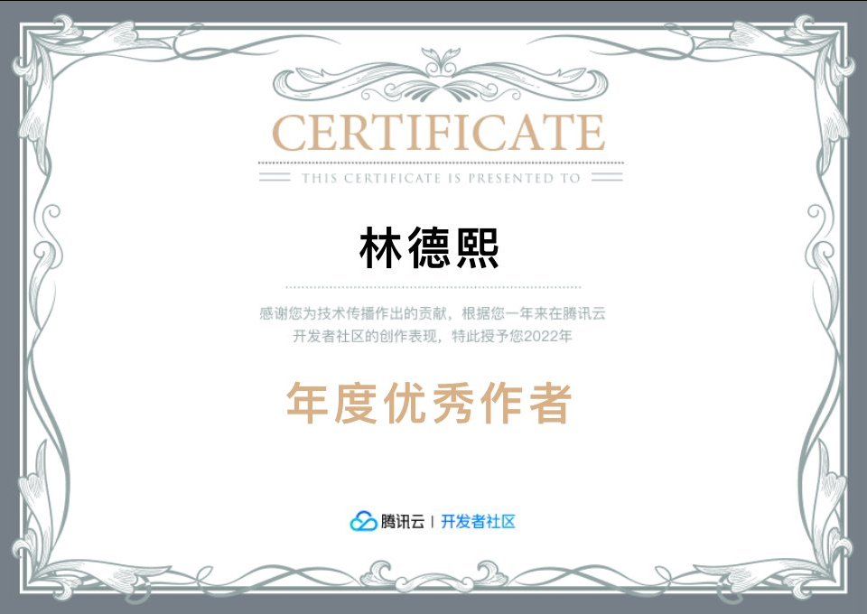

# 2022 德熙 腾讯云 年度优秀作者

<!--more-->

<!-- CreateTime:2023/1/17 16:28:37 -->

<!--  -->

## 其他奖项

[2019 德熙 腾讯云 云社区年度最佳作者奖](https://blog.lindexi.com/post/2019-%E5%BE%B7%E7%86%99-%E8%85%BE%E8%AE%AF%E4%BA%91-%E4%BA%91%E7%A4%BE%E5%8C%BA%E5%B9%B4%E5%BA%A6%E6%9C%80%E4%BD%B3%E4%BD%9C%E8%80%85%E5%A5%96.html )

 本作品采用<a rel="license" href="http://creativecommons.org/licenses/by-nc-sa/4.0/">知识共享署名-非商业性使用-相同方式共享 4.0 国际许可协议</a>进行许可。欢迎转载、使用、重新发布，但务必保留文章署名[林德熙](http://blog.csdn.net/lindexi_gd)(包含链接:http://blog.csdn.net/lindexi_gd )，不得用于商业目的，基于本文修改后的作品务必以相同的许可发布。如有任何疑问，请与我[联系](mailto:lindexi_gd@163.com)。