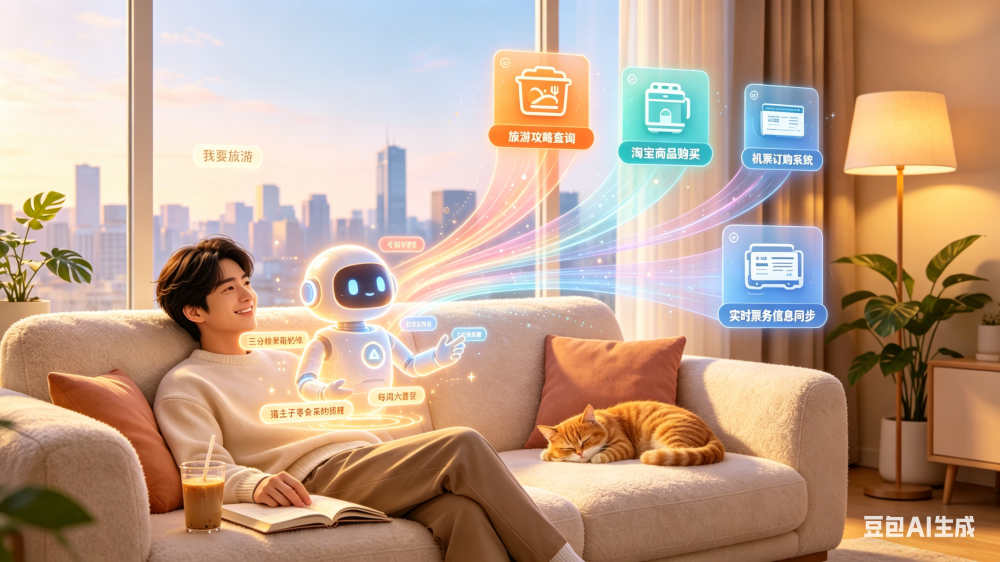

# AI 时代的设备所见即用

本文记录的是我的思考内容，本篇是我从 2023 年思考到现在的内容。我感觉我大概对整个方向清晰了，于是记录了本文，期望能给大家带来一些灵感

<!--more-->
<!-- 发布 -->
<!-- 博客 -->

我想做的事情很简单：让用户用自己的 AI App 就能操控任何设备。对着手机说话，设备就动。

先说一下 AI App 是什么。我说的 AI App，就是未来每个人手机里那个懂自己的 AI 助手。它知道你的习惯、喜好、说话方式，你每天跟它聊天，让它帮你做事。可能是某个大厂做的，也可能是某个创业团队做的，形态也许就是一个 App，也许是系统内置的，不重要。重要的是用户会越来越依赖它，跟它越来越默契。

但你熟悉的是这个 AI，不是每台设备。你走进一间教室、面对一台一体机、坐进一辆车——设备是陌生的。你不知道它的菜单在哪、不知道它有什么功能、不知道出问题该怎么办。最自然的想法就是：继续跟自己的 AI 说，让 AI 去搞定设备。

这就是我想做的：设备和 AI App 之间的那一层东西。让 AI App 能理解设备、操作设备。用户只跟自己的 AI 对话，不需要学设备。

<!--  -->

说几个情景。

科学课上，老师想把种子发芽的实物投到大屏上给全班看。点了展台图标，没反应。再点，还是没反应。学生开始交头接耳。课后才知道是摄像头驱动掉了。如果当时他对着自己的 AI App 说一句"展台打不开了，帮我看看"，AI 自己判断原因，释放占用，打开展台。课堂不会断。

另一个老师每天早上到教室：开一体机，等启动，打开课件，登录，调音量，切输入源。每天三分钟，一学期五六个小时。对着手机说一句"上课"，全部自动跑完。

还有个语文老师，公开课前打开 PPT，排版全乱，字体飞了。版本兼容问题，调不过来。说一句"课件排版乱了，帮我调回正常"，AI 识别字体问题，批量替换，两分钟搞定。

美术课上，老师想用大屏展示梵高的《向日葵》，让学生感受色彩的层次。但屏幕颜色怎么看怎么怪，整幅画泛黄，像蒙了一层旧报纸。翻设置、找显示、点来点去，学生在下面哄堂大笑。老师越着急越是找不到在哪调好。如果她说一句"把屏幕颜色调正常"，AI 自己判断是护眼模式开着，自己找到开关位置，关掉。颜色瞬间对了。

这些场景里设备功能都在。展台能开，字体能调，护眼模式能关。问题从来不是设备没能力，而是入口藏太深、步骤太多、出了事不知道原因。

再往下说我要做的具体是什么。

每台设备上跑一个程序，我们写的。设备出厂带上或者后续装上都行。我把它叫做设备连接器，它做几件事。

第一是连接。让 AI App 靠近设备时能发现它。可能是扫码，可能是 NFC 碰一下，可能是蓝牙广播，也可能是超声波。方式不重要，重要的是用户不需要输入 IP、不需要手动配对、不需要注册账号。靠近就能连，交互方式便捷轻量。

第二是理解。设备要能告诉 AI App "我是谁、我能做什么"。一份写给 AI 读的设备说明书，里面有设备身份、能力清单、每种操作怎么调用、已知问题怎么处理。没有人比厂商更懂设备，所以厂商来写基础版。但它不是固定的，这个后面再说。

第三是执行。AI App 想做什么操作，把指令发过来，设备连接器负责真正去执行。调系统接口也好，改配置文件也好，走 IPC 也好，操作文件也好。这个执行器可以很轻——只做执行，不推理。

这里有一个分叉，有两个方向。刚才说的是方向一：AI App 把所有事情想清楚，发结构化指令过来，设备端只执行。还有方向二：设备这边自己也带一些智能，AI App 把用户意图用自然语言描述发过来，设备侧的 Agent 自己理解意图、自己决定怎么做。两个方向不是非此即彼，可能并存。比如设备侧可以内置一些预制解决方案，遇到匹配的场景直接走预制方案，没有预制的再让 AI App 去推理。这个还没定。

回到说明书。它不是静态的。AI 在实际使用中会遇到厂商没写进去的情况：某个隐藏更深的功能入口、某种异常状态的恢复手段、某个报错的真实原因。某次 OTA 应用更新后的行为变更。这些经验可以补充进说明书。一台设备被操作得越多，积累的经验越多，后来的 AI 连接这台设备时直接继承。设备越用越聪明。

技术方面简单说一下。设备端用 C# .NET，跨平台，Windows 和 Linux 的设备都能跑。AI App 端试错阶段我自己做一个简单的来验证链路，调 DeepSeek 或者别的现成大模型，薄壳应用。甚至于用现成的 IM 工具，如 QQ 等这些。等跑通了，AI App 这边是各大厂的事情，我丝毫不想也不敢上这个赛道，我只做设备连接器这一层，以及我自己的可控设备的这一层。

路径上，不是先写一份标准等人来接入。纯协议没人理的。得先自己对接具体的设备和场景，做出实际效果给人看。场景一个一个啃下来，连接器这一层在这个过程中自然长出来。积累够了，才有可能变成厂商愿意预装的东西。

<!-- 目前聚焦教育场景：一体机、大屏、平板。还有很多没想好的，比如第一个突破口选哪个场景、设备侧要不要内置预制方案、软件架构怎么划。但大方向清楚：让用户的 AI App 能操控任何设备，用户只跟自己的 AI 说话，不需要学设备。 -->

还有很多没想好的，比如第一个突破口选哪个场景、设备侧要不要内置预制方案、软件架构怎么划。但大方向清楚：让用户的 AI App 能操控任何设备，用户只跟自己的 AI 说话，不需要学设备。

---

现在这个世界上是有很多“屏”的，也有很多设备的。哪怕是像我一样的 IT 深度用户，也会遇到令我无助的设备，面向“屏”干瞪着。人类的与机器的交互形态都会在变化。从一开始的飞机驾驶舱的超级多按钮，到面向电脑的交互，到面向手机、触摸屏的交互。后面的车机上的语音交互，智能家居的语音交互。我不是在想有更新的人类与设备的通讯交互方式，而是想着是否有改变人类与哪台设备的通讯交互方式。是否在陌生设备与人类之间，放入一个人类熟悉的设备

虽然我认为我自己是想明白了的，但是却很难将这个想法实施起来。我就想将这个想法公开发出来，也许能激发一些伙伴的灵感

---

我请了 AI 帮我润色了一下，以下内容看起来应该比较正式一些

产品痛点：用户面对物理设备时的困境：功能存在但入口隐蔽、操作路径长、异常状态无法自行诊断。典型场景如教学一体机的护眼模式关闭、展台摄像头切换、侧边栏工具配置——这些操作需要用户具备超出日常经验的技术知识。延伸扩展为一切可操作的设备，甚至未来包括其他嵌入式一体机，或 IOT 设备

用户侧效应：用户与自己的 AI App 对话，AI App 操作设备。用户不需要学习设备。

核心卖点： 生态位+护城河建立

## 技术细节

### 角色

- AI App：用户侧 AI 端点。理解用户意图，持有设备能力描述，做推理决策。
- 设备连接器（Device Connector）：设备侧运行时。负责设备被发现、暴露能力描述、接收并执行指令、返回结果。
- 设备：物理硬件与其操作系统。

### 组件

设备连接器包含以下模块：

- 发现层（Discovery）：使 AI App 在物理邻近范围内感知到设备。途径包括二维码、NFC、BLE 广播、超声波编码等。不限定具体技术，输出统一为设备地址与获取能力描述的入口。
- 能力描述（Agent.md）：一份结构化的、面向 AI 消费的设备能力描述文件。内容包括设备身份、可调用能力列表及其接口定义、已知限制与异常处理方式。由设备厂商编写初始版本；运行时支持由 AI App 回写增量经验，实现设备使用经验的累积与跨用户继承。
- 执行器（Executor）：接收结构化操作指令，映射为系统调用、文件操作、协议指令（如 UDI）、进程管理等。执行器不做推理，仅做执行与状态返回。尺寸目标为极轻量，可嵌入资源受限设备。
- 可选智能层（Device Agent）：在模式 A（AI App 侧推理）之外提供模式 B——设备侧内置推理能力。AI App 将用户意图以自然语言转发，设备侧 Agent 自行理解并调度。两种模式可共存：预制解决方案优先匹配，未命中时回退至 AI App 推理。

### 数据流

模式 A（远端推理）：
用户语音 → AI App 转录与意图识别 → AI App 匹配设备能力描述 → 生成结构化操作指令 → 设备连接器执行 → 返回结果 → AI App 判断是否完成。

模式 B（设备侧推理）：
用户语音 → AI App 转发自然语言意图 → 设备连接器接收 → 设备侧 Agent 匹配预制方案或自行推理 → 执行 → 返回结果。

## 技术选型

- 设备连接器运行时：C# .NET，采用 Native AOT 编译。跨 Windows/Linux 平台。无运行时依赖。客户端与服务端、连接端与执行端均可统一使用相同的语言和框架，可在确保质量下限的前提下借助 AI 辅助编程。
- 通信协议：待定。初期考虑轻量 HTTP/WebSocket，后续可能针对局域网场景优化。
- AI App 端：验证阶段为薄壳移动端应用，甚至依托于三方 IM 应用，接入第三方 LLM API（DeepSeek 、豆包 等）。非核心交付物。