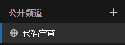
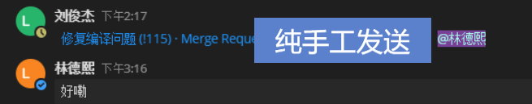
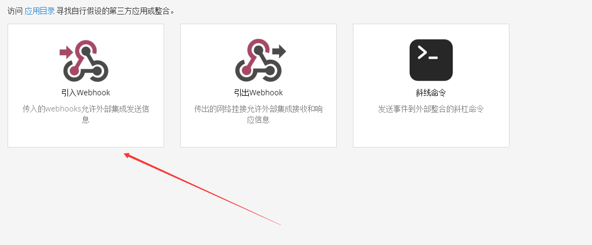
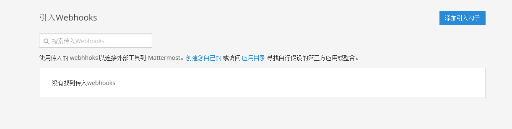
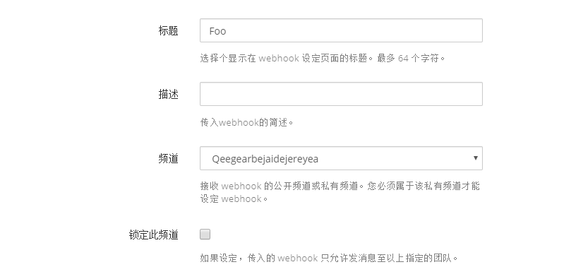
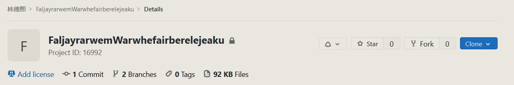
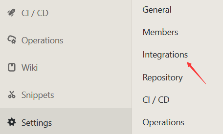
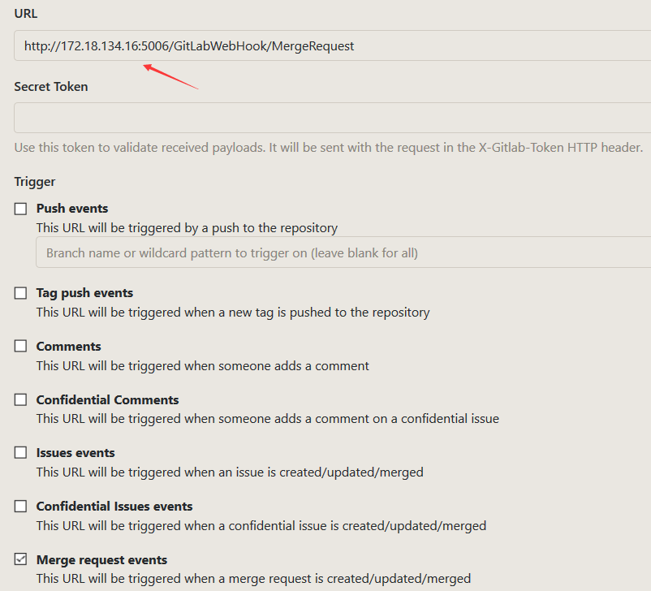
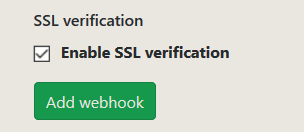
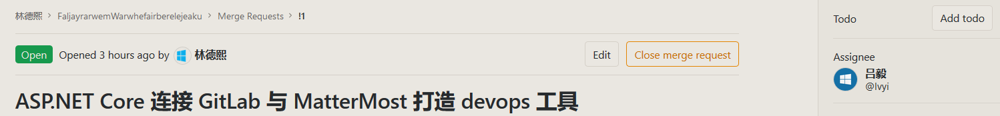

# ASP.NET Core 连接 GitLab 与 MatterMost 打造 devops 工具

在现代化开发工具链里面就包含了自动化的通讯工具，而日志写代码我是推到 Gitlab 平台上，我今天听了郭锐大佬的分享之后，感觉我现在的团队的自动化做的远远不够。我在他的课程上学到的最重要一句话就是做工具不是从零到一最难，有很多非常厉害好用的工具最后都没用上的原因是没有加入到开发链条上。所以我用最简单的工具做实践，在 Gitlab 上的代码审查每次都需要自己手动将代码审查链接发给对应的审查者，这样的效率很低，于是我就打通了通讯工具和代码平台之间的联系，开始一步步打造适合自己团队的工具

<!--more-->

这只是一个简单的工具，下面让我告诉大家做出来的效果

让 Gitlab 的 MergeRequest 每次有变更的时候，就在 MatterMost 发送信息给审查者催他进行代码审查

我现在团队使用的通讯工具主要是 MatterMost 工具，因为这个工具首先是开源的，第二是支持很多的定制和很多的插件。推荐小伙伴了解一下 MatterMost 这个工具

## 效果

我在 MatterMost 创建了代码审查频道，这个频道里面将会被机器人发送很多代码审查链接

<!--  -->


之前都是纯手工发送链接，同时需要手工催审查者审查

<!--  -->


而用上了工具的效果如下

<!--  -->


核心用的技术就是 Gitlab 的 WebHook 和 [dotnet core 集成到 Mattermost 聊天工具](https://blog.lindexi.com/post/dotnet-core-%E9%9B%86%E6%88%90%E5%88%B0-Mattermost-%E8%81%8A%E5%A4%A9%E5%B7%A5%E5%85%B7.html ) 两个技术

## 使用方法

下面让我告诉大家如何使用我这个工具关联你自己的 GitLab 和 Mattermost 工具

首先在 [github](https://github.com/dotnet-campus/DotNetGitLabWebHook) 将这个仓库的代码通过 git clone 下载，然后使用 VisualStudio 2019 打开哦

```csharp
git clone git@github.com:dotnet-campus/DotNetGitLabWebHook.git
```

开发要求如下

- VisualStudio 2019 打开预览版
- dotnet core 3.0 预览版

打开 `appsettings.json` 文件，此时将可以看到 MatterMostCodeReviewUrl 内容，请将他替换为你自己的 MatterMost 链接，获取链接方式如下

在 [dotnet core 集成到 Mattermost 聊天工具](https://blog.lindexi.com/post/dotnet-core-%E9%9B%86%E6%88%90%E5%88%B0-Mattermost-%E8%81%8A%E5%A4%A9%E5%B7%A5%E5%85%B7.html ) 这篇博客有告诉大家如何拿到链接，本文这里就简单说一下

点击主菜单，打开集成页面


<!--  -->

点击添加钩子


<!--  -->

输入一个标题和选择频道，我这里选择的是之前创建的代码审查频道


<!--  -->

现在就可以看到一个链接了


<!--  -->

我的链接是 [http://127.0.0.1:8065/hooks/xjkyn7ks1pn7xeho1f5ifxqhxh](http://127.0.0.1:8065/hooks/xjkyn7ks1pn7xeho1f5ifxqhxh) 请将本文下面代码用到的这个链接替换为你自己的

在 `appsettings.json` 文件替换一下链接，文件如下

```csharp
{
  "Logging": {
    "LogLevel": {
      "Default": "Information",
      "Microsoft": "Warning",
      "Microsoft.Hosting.Lifetime": "Information"
    }
  },
  "AllowedHosts": "*",
  "MatterMostCodeReviewUrl": "http://127.0.0.1:8065/hooks/xjkyn7ks1pn7xeho1f5ifxqhxh" 
}
```

然后在 VisualStudio 将代码运行，我在 Program.cs 设置了监听默认的端口是 5006 暂时还没做到配置里面

下一步就是在 Gitlab 的项目上添加 WebHook 了

通过 cmd 命令输入 `ipconfig` 就可以知道自己的设备的 ip 地址了，理论上如果是内网的 Gitlab 是可以访问到你的地址的，如果不可以就需要找 IT 小伙伴聊聊，弄个服务器玩

先在 GitLab 创建一个个人项目用于测试

<!--  -->


点击 Integrations Settings 进行设置

<!--  -->


在 URL 填写自己的 IP 拼接的链接

```csharp
http://你的ip:5006/GitLabWebHook/MergeRequest
```

<!--  -->


勾选 Merge request events 然后取消打开 SSL 和去掉 Push events 然后点击添加

<!--  -->


此时尝试新建一个 MergeRequest 测试一下

<!--  -->


如果上面步骤没有错，应该可以在 MatterMost 上看到链接


嗯，代码现在还在进行优化，关键是将这个工具用起来，十分欢迎大家加入开发

[在 Gitlab 开启 MatterMost 机器人](https://blog.lindexi.com/post/%E5%9C%A8-Gitlab-%E5%BC%80%E5%90%AF-MatterMost-%E6%9C%BA%E5%99%A8%E4%BA%BA.html )

<a rel="license" href="http://creativecommons.org/licenses/by-nc-sa/4.0/"></a><br />本作品采用<a rel="license" href="http://creativecommons.org/licenses/by-nc-sa/4.0/">知识共享署名-非商业性使用-相同方式共享 4.0 国际许可协议</a>进行许可。欢迎转载、使用、重新发布，但务必保留文章署名[林德熙](http://blog.csdn.net/lindexi_gd)(包含链接:http://blog.csdn.net/lindexi_gd )，不得用于商业目的，基于本文修改后的作品务必以相同的许可发布。如有任何疑问，请与我[联系](mailto:lindexi_gd@163.com)。
