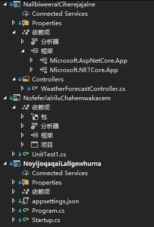

# ASP.NET Core 引用其他程序集项目里面的 Controller 控制器

我将控制器 Controller 按照不同的业务，分为多个不同的项目，我需要在路由里面调度到多个不同项目的控制器

<!--more-->


<!-- CreateTime:2021/4/23 8:38:57 -->

<!-- 发布 -->

只需要在 Startup 的 ConfigureServices 方法，调用 AddControllers 添加控制器，再加上额外的程序集即可，如下面代码，下面代码的 WeatherForecastController 是定义在另一个程序集的类

```csharp
        public void ConfigureServices(IServiceCollection services)
        {
            services.AddControllers().AddApplicationPart(typeof(WeatherForecastController).Assembly);
        }
```

在 AddApplicationPart 方法里面加上你需要加上控制器的项目程序集即可，我推荐使用 typeof 的方法获取程序集里面某个控制器，然后通过 Type 获取程序集的方式传入程序集。传入的程序集里面定义的控制器将会被加入到路由调度

<!--  -->


如上图的项目创建方式，创建一个 ASP.NET Core 项目，在里面放一个控制器，将其他的文件都删除。接着再创建一个 ASP.NET Core 项目，删除掉所有的控制器，接着引用刚才第一个创建的项目。此时在第二个项目的 Startup 放入上面代码即可，此时第一个的项目的控制器可以被第二个项目使用到

为了方便调试，我就再创建一个单元测试项目，详细请看 [asp dotnet core 基于 TestServer 做集成测试](https://blog.lindexi.com/post/asp-dotnet-core-%E5%9F%BA%E4%BA%8E-TestServer-%E5%81%9A%E9%9B%86%E6%88%90%E6%B5%8B%E8%AF%95.html )

在这个单元测试项目里面尝试跑起来第二个项目，然后尝试访问第一个项目的控制器

```csharp
    [TestClass]
    public class UnitTest1
    {
        [TestMethod]
        public void TestMethod1()
        {
            var hostBuilder = CreateHostBuilder();
            var host = hostBuilder.Start();
            var testClient = host.GetTestClient();
            var result = testClient.GetStringAsync("WeatherForecast").Result;
        }

        public static IHostBuilder CreateHostBuilder() =>
            Host.CreateDefaultBuilder()
                .ConfigureWebHostDefaults(webBuilder =>
                {
                    webBuilder.UseStartup<Startup>();
                    webBuilder.UseTestServer(); //关键是多了这一行建立TestServer
                });
    }
```

本文代码放在 [github](https://github.com/lindexi/lindexi_gd/tree/f0b05e03/NoyijoqaqaiLallgewhurna ) 和 [gitee](https://gitee.com/lindexi/lindexi_gd/tree/f0b05e03/NoyijoqaqaiLallgewhurna) 欢迎下载执行

第二个方法就是在具体的有控制器的项目里面，添加一个 CommonStartup 类，在这里面调用 AddControllers 方法，如下面代码

```csharp
    public class CommonStartup
    {
        public void ConfigureServices(IServiceCollection services)
        {
            services.AddControllers();
        }
    }
```

在入口项目里面调用到 CommonStartup 的 ConfigureServices 方法

```csharp
        public void ConfigureServices(IServiceCollection services)
        {
            services.AddControllers();
            var commonStartup = new CommonStartup();
            commonStartup.ConfigureServices(services);
        }
```

以上代码放在 [github](https://github.com/lindexi/lindexi_gd/tree/06498b5f/NoyijoqaqaiLallgewhurna ) 和 [gitee](https://gitee.com/lindexi/lindexi_gd/tree/06498b5f/NoyijoqaqaiLallgewhurna) 欢迎下载执行


<a rel="license" href="http://creativecommons.org/licenses/by-nc-sa/4.0/"></a><br />本作品采用<a rel="license" href="http://creativecommons.org/licenses/by-nc-sa/4.0/">知识共享署名-非商业性使用-相同方式共享 4.0 国际许可协议</a>进行许可。欢迎转载、使用、重新发布，但务必保留文章署名[林德熙](http://blog.csdn.net/lindexi_gd)(包含链接:http://blog.csdn.net/lindexi_gd )，不得用于商业目的，基于本文修改后的作品务必以相同的许可发布。如有任何疑问，请与我[联系](mailto:lindexi_gd@163.com)。