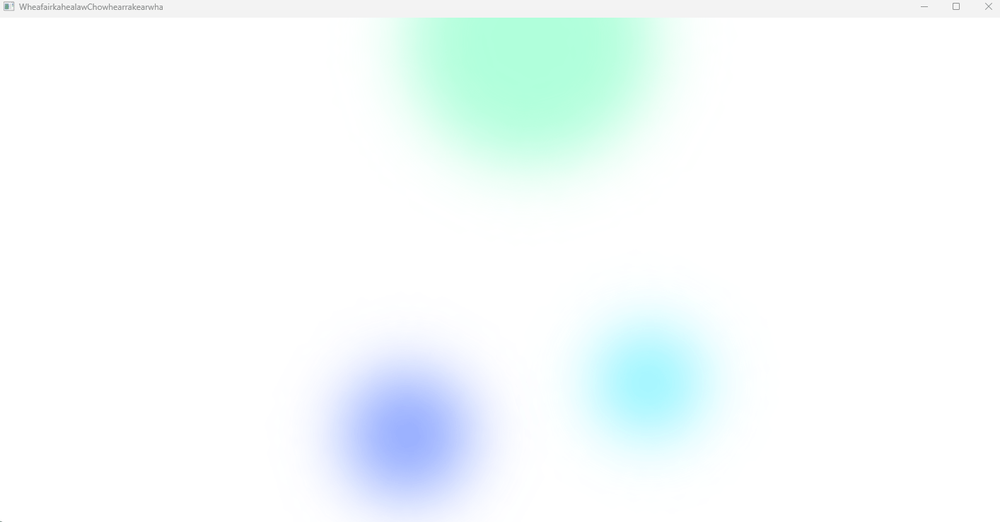
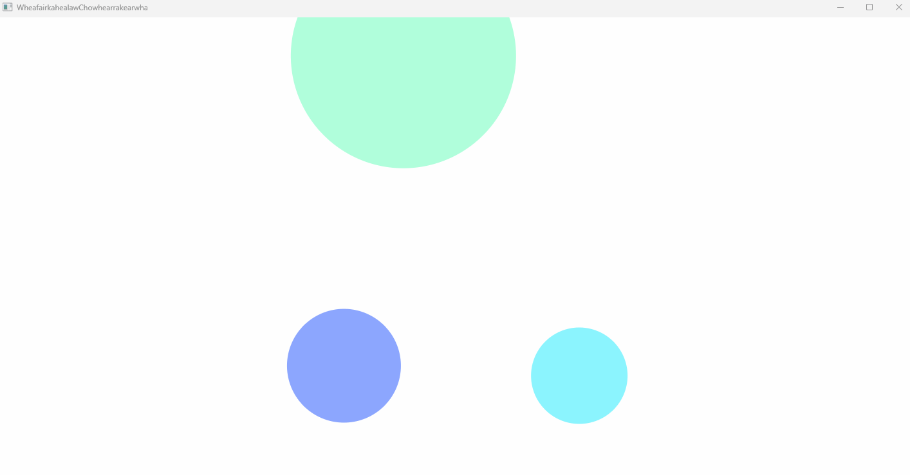

# Avalonia 界面效果 三个圆实现模糊界面动效背景

本文将和大家介绍一个 Avalonia 动效界面效果，由三个圆带模糊效果实现的模糊界面动效背景，适合用在各种 AIGC 主题的应用里面

<!--more-->
<!-- CreateTime:2025/04/01 07:15:14 -->

<!-- 发布 -->
<!-- 博客 -->

本文代码基于 Avalonia 11.2.x 版本实现，预期在其他 Avalonia 版本也能正常使用

本文效果由 [晓嗔戈](https://github.com/Firito) 提供，我只是记录此实现方法的工具人

界面效果如下图所示，录制的gif中颜色存在一些偏差，动画有些卡顿，实际效果要好一些

<!--  -->


实现原理非常简单，就是构建出三个圆形，三个圆形的大小不相同，然后让其做绕圈动画。最后叠加上模糊效果即可

<!--  -->


具体实现代码如下

本文内容里面只给出关键代码片段，如需要全部的项目文件，可到下文找到所有代码的下载方法

```xml
        <Grid Width="500" Height="500" HorizontalAlignment="Center" VerticalAlignment="Center">
            <Grid.Styles>
                <Style Selector="Ellipse.Animation">
                    <Setter Property="Opacity" Value="0.6" />
                    <Style.Animations>
                        <Animation Duration="0:0:2"
                                   FillMode="Forward" IterationCount="INFINITE">
                            <KeyFrame Cue="0%">
                                <Setter Property="RotateTransform.Angle" Value="0.0" />
                            </KeyFrame>
                            <KeyFrame Cue="50%">
                                <Setter Property="TranslateTransform.X" Value="40" />
                            </KeyFrame>
                            <KeyFrame Cue="100%">
                                <Setter Property="RotateTransform.Angle" Value="360.0" />
                                <Setter Property="TranslateTransform.X" Value="0" />
                            </KeyFrame>
                        </Animation>
                    </Style.Animations>
                    <Setter Property="Effect">
                        <BlurEffect Radius="150" />
                    </Setter>
                </Style>
            </Grid.Styles>

            <Ellipse Width="350" Height="350" Classes="Animation" Fill="#7BFFC3" RenderTransformOrigin="60% 40%"
                     HorizontalAlignment="Left" VerticalAlignment="Top" Margin="0 -200 0 0"/>
            <Ellipse Width="177" Height="177" Classes="Animation" Fill="#406AFF" RenderTransformOrigin="60% 60%"
                     HorizontalAlignment="Left" VerticalAlignment="Bottom" Margin="-30"/>
            <Ellipse Width="150" Height="150" Classes="Animation" Fill="#3EECFF" RenderTransformOrigin="40% 40%"
                     HorizontalAlignment="Right" VerticalAlignment="Bottom" Margin="-20"/>
        </Grid>
```

本文代码放在 [github](https://github.com/lindexi/lindexi_gd/tree/da21241511b1b7b7834bb5bd2844ece9e9e96ee3/AvaloniaIDemo/WheafairkahealawChowhearrakearwha) 和 [gitee](https://gitee.com/lindexi/lindexi_gd/blob/da21241511b1b7b7834bb5bd2844ece9e9e96ee3/AvaloniaIDemo/WheafairkahealawChowhearrakearwha) 上，可以使用如下命令行拉取代码。我整个代码仓库比较庞大，使用以下命令行可以进行部分拉取，拉取速度比较快

先创建一个空文件夹，接着使用命令行 cd 命令进入此空文件夹，在命令行里面输入以下代码，即可获取到本文的代码

```
git init
git remote add origin https://gitee.com/lindexi/lindexi_gd.git
git pull origin da21241511b1b7b7834bb5bd2844ece9e9e96ee3
```

以上使用的是国内的 gitee 的源，如果 gitee 不能访问，请替换为 github 的源。请在命令行继续输入以下代码，将 gitee 源换成 github 源进行拉取代码。如果依然拉取不到代码，可以发邮件向我要代码

```
git remote remove origin
git remote add origin https://github.com/lindexi/lindexi_gd.git
git pull origin da21241511b1b7b7834bb5bd2844ece9e9e96ee3
```

获取代码之后，进入 AvaloniaIDemo/WheafairkahealawChowhearrakearwha 文件夹，即可获取到源代码

更多 Avalonia 界面效果博客，请参阅 [博客导航](https://blog.lindexi.com/post/%E5%8D%9A%E5%AE%A2%E5%AF%BC%E8%88%AA.html )

这样的效果在 WPF 实现起来也很简单，以下是一个简单的 WPF 的演示，为了方便演示我这里没有用样式，也只用了一个圆形，代码如下

```xml
                <Ellipse x:Name="BackgroundBlueEllipse" Width="350" Height="350" Fill="#7BFFC3"
                 HorizontalAlignment="Left" VerticalAlignment="Top" Margin="0 -200 0 0" RenderTransformOrigin="0.6,0.4">
                    <Ellipse.RenderTransform>
                        <TransformGroup>
                            <TranslateTransform x:Name="BackgroundBlueEllipseTranslateTransform"></TranslateTransform>
                            <RotateTransform x:Name="BackgroundBlueEllipseRotateTransform"></RotateTransform>
                        </TransformGroup>
                    </Ellipse.RenderTransform>
                    <Ellipse.Triggers>
                        <EventTrigger RoutedEvent="Loaded">
                            <BeginStoryboard>
                                <Storyboard Duration="0:0:2" RepeatBehavior="Forever">
                                    <DoubleAnimation Storyboard.TargetName="BackgroundBlueEllipseTranslateTransform" Storyboard.TargetProperty="X" From="0" To="100" AutoReverse="True" Duration="0:0:1"></DoubleAnimation>
                                    <DoubleAnimation Storyboard.TargetName="BackgroundBlueEllipseRotateTransform" Storyboard.TargetProperty="Angle" From="0" To="360"></DoubleAnimation>
                                </Storyboard>
                            </BeginStoryboard>
                        </EventTrigger>
                    </Ellipse.Triggers>
                    <Ellipse.Effect>
                        <BlurEffect Radius="150" />
                    </Ellipse.Effect>
                </Ellipse>
```

以上代码放在 [github](https://github.com/lindexi/lindexi_gd/tree/358c342b5c92600c96b1d974420a2212453254b6/WPFDemo/HinaybaryayneejearNeqayhellal) 和 [gitee](https://gitee.com/lindexi/lindexi_gd/blob/358c342b5c92600c96b1d974420a2212453254b6/WPFDemo/HinaybaryayneejearNeqayhellal) 上