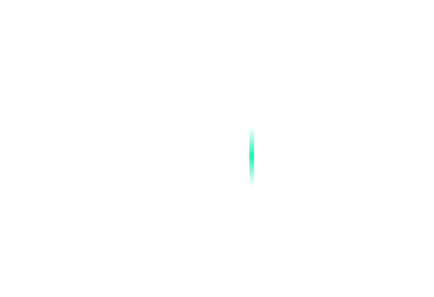

# Avalonia 界面效果 滚动的渐变矩形边框

本文将和大家介绍一个 Avalonia 界面效果，制作一个滚动的渐变矩形边框

<!--more-->


<!-- CreateTime:2025/04/01 07:15:14 -->

<!-- 发布 -->
<!-- 博客 -->

本文代码基于 Avalonia 11.2.x 版本实现，预期在其他 Avalonia 版本也能正常使用

本文效果由 [晓嗔戈](https://github.com/Firito) 提供，我只是记录此实现方法的工具人

界面效果如下图所示，录制的gif中颜色存在一些偏差，动画有些卡顿，实际效果要好一些

<!--  -->


实现原理：

实现上不需要做平移或旋转，完全依靠对 Border 的 BorderBrush 边框做颜色动画即可实现。核心方法是通过 KeyFrame 关键帧动画设置几个关键点，对 Border 的 BorderBrush 边框添加渐变色动画，上图中不可见部分是设置了填充了透明色。渐变动画选用的是 ConicGradientBrush 类型的渐变色

即当 ConicGradientBrush 渐变动画对整个 Border 矩形背景填充时的效果如下

<!--  -->


只将填充从背景换成 Border 的 BorderBrush 即可只对边框进行填充，相当于将中间的部分裁剪掉只保留边框的部分，从而实现本文一开始给出的效果

具体实现代码如下

本文内容里面只给出关键代码片段，如需要全部的项目文件，可到本文末尾找到本文所有代码的下载方法

先添加一个 Border 元素，设置 BorderThickness 的值，用于让其有边框厚度，可以被用来填充线条动画效果

```xml
<Border BorderThickness="5">
</Border>
```

设置 Border 的样式，添加动画效果，代码如下

```xml
            <Border BorderThickness="5">
                <Border.Styles>
                    <Style Selector="Border">
                        <Style.Animations>
                            <Animation Duration="0:0:2"
                                       FillMode="Forward" IterationCount="INFINITE">
                                <KeyFrame Cue="0%">
                                    <Setter Property="BorderBrush">
                                        <Setter.Value>
                                            <ConicGradientBrush>
                                                <GradientStops>
                                                    <GradientStop Color="#0000FFAA" Offset="0" />
                                                    <GradientStop Color="#0000FFAA" Offset="0.65" />
                                                    <GradientStop Color="#00FFAA" Offset="0.75" />
                                                    <GradientStop Color="#0000FFAA" Offset="0.85" />
                                                </GradientStops>
                                            </ConicGradientBrush>
                                        </Setter.Value>
                                    </Setter>
                                </KeyFrame>
                                <KeyFrame Cue="25%">
                                    <Setter Property="BorderBrush">
                                        <Setter.Value>
                                            <ConicGradientBrush Angle="90">
                                                <GradientStops>
                                                    <GradientStop Color="#0000EAFF" Offset="0" />
                                                    <GradientStop Color="#0000EAFF" Offset="0.65" />
                                                    <GradientStop Color="#00EAFF" Offset="0.75" />
                                                    <GradientStop Color="#0000EAFF" Offset="0.85" />
                                                </GradientStops>
                                            </ConicGradientBrush>
                                        </Setter.Value>
                                    </Setter>
                                </KeyFrame>
                                <KeyFrame Cue="50%">
                                    <Setter Property="BorderBrush">
                                        <Setter.Value>
                                            <ConicGradientBrush Angle="180">
                                                <GradientStops>
                                                    <GradientStop Color="#0000FFAA" Offset="0" />
                                                    <GradientStop Color="#0000FFAA" Offset="0.65" />
                                                    <GradientStop Color="#00FFAA" Offset="0.75" />
                                                    <GradientStop Color="#0000FFAA" Offset="0.85" />
                                                </GradientStops>
                                            </ConicGradientBrush>
                                        </Setter.Value>
                                    </Setter>
                                </KeyFrame>
                                <KeyFrame Cue="75%">
                                    <Setter Property="BorderBrush">
                                        <Setter.Value>
                                            <ConicGradientBrush Angle="270">
                                                <GradientStops>
                                                    <GradientStop Color="#0000EAFF" Offset="0" />
                                                    <GradientStop Color="#0000EAFF" Offset="0.65" />
                                                    <GradientStop Color="#00EAFF" Offset="0.75" />
                                                    <GradientStop Color="#0000EAFF" Offset="0.85" />
                                                </GradientStops>
                                            </ConicGradientBrush>
                                        </Setter.Value>
                                    </Setter>
                                </KeyFrame>
                                <KeyFrame Cue="100%">
                                    <Setter Property="BorderBrush">
                                        <Setter.Value>
                                            <ConicGradientBrush Angle="360">
                                                <GradientStops>
                                                    <GradientStop Color="#0000FFAA" Offset="0" />
                                                    <GradientStop Color="#0000FFAA" Offset="0.65" />
                                                    <GradientStop Color="#00FFAA" Offset="0.75" />
                                                    <GradientStop Color="#0000FFAA" Offset="0.85" />
                                                </GradientStops>
                                            </ConicGradientBrush>
                                        </Setter.Value>
                                    </Setter>
                                </KeyFrame>
                            </Animation>
                        </Style.Animations>
                    </Style>
                </Border.Styles>
            </Border>

```

如上简单的代码即可实现滚动的线条边框效果

本文代码放在 [github](https://github.com/lindexi/lindexi_gd/tree/9437d15885006ca966046d66ad5ad239a7a22cba/AvaloniaIDemo/LowhawleluhaLelradealere) 和 [gitee](https://gitee.com/lindexi/lindexi_gd/blob/9437d15885006ca966046d66ad5ad239a7a22cba/AvaloniaIDemo/LowhawleluhaLelradealere) 上，可以使用如下命令行拉取代码。我整个代码仓库比较庞大，使用以下命令行可以进行部分拉取，拉取速度比较快

先创建一个空文件夹，接着使用命令行 cd 命令进入此空文件夹，在命令行里面输入以下代码，即可获取到本文的代码

```
git init
git remote add origin https://gitee.com/lindexi/lindexi_gd.git
git pull origin 9437d15885006ca966046d66ad5ad239a7a22cba
```

以上使用的是国内的 gitee 的源，如果 gitee 不能访问，请替换为 github 的源。请在命令行继续输入以下代码，将 gitee 源换成 github 源进行拉取代码。如果依然拉取不到代码，可以发邮件向我要代码

```
git remote remove origin
git remote add origin https://github.com/lindexi/lindexi_gd.git
git pull origin 9437d15885006ca966046d66ad5ad239a7a22cba
```

获取代码之后，进入 AvaloniaIDemo/LowhawleluhaLelradealere 文件夹，即可获取到源代码

更多技术博客，请参阅 [博客导航](https://blog.lindexi.com/post/%E5%8D%9A%E5%AE%A2%E5%AF%BC%E8%88%AA.html )

相关的 WPF 的线条动画，请参阅 [WPF使用Shape实现复杂线条动画 - czwy - 博客园](https://www.cnblogs.com/czwy/p/18192720 )


<a rel="license" href="http://creativecommons.org/licenses/by-nc-sa/4.0/"></a><br />本作品采用<a rel="license" href="http://creativecommons.org/licenses/by-nc-sa/4.0/">知识共享署名-非商业性使用-相同方式共享 4.0 国际许可协议</a>进行许可。欢迎转载、使用、重新发布，但务必保留文章署名[林德熙](http://blog.csdn.net/lindexi_gd)(包含链接:http://blog.csdn.net/lindexi_gd )，不得用于商业目的，基于本文修改后的作品务必以相同的许可发布。如有任何疑问，请与我[联系](mailto:lindexi_gd@163.com)。