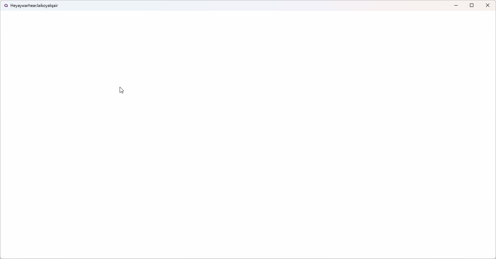

# Avalonia 简单实现输入法光标跟随效果

本文将告诉大家如何在 Avalonia 里面实现输入法光标跟随效果

<!--more-->


<!-- CreateTime:2025/01/14 08:56:29 -->

<!-- 发布 -->
<!-- 博客 -->

本文是在 11.1.0 的 Avalonia 版本里面实现效果

本文内容里面只给出关键代码片段，如需要全部的项目文件，可到本文末尾找到本文所有代码的下载方法

核心是编写一个类型，让这个类型继承 TextInputMethodClient 类。然后在输入法光标变化的时候，设置 CursorRectangle 属性和调用 RaiseCursorRectangleChanged 方法通知变更

实现的效果如下图所示，通过如下图可以看到鼠标点击的地方就修改了光标，输入法就从光标开始输入

<!--  -->


以下是具体实现方法

编写一个 IMESupporter 类型，让这个类型继承 TextInputMethodClient 类

```csharp
internal class IMESupporter : TextInputMethodClient
{
    public IMESupporter(Visual textViewVisual)
    {
        TextViewVisual = textViewVisual;
    }

    public void SetCursorRectangle(Rect cursorRectangle)
    {
        _cursorRectangle = cursorRectangle;
        RaiseCursorRectangleChanged();
    }

    public override Visual TextViewVisual { get; }
    public override bool SupportsPreedit => false;
    public override bool SupportsSurroundingText => false;
    public override string SurroundingText => string.Empty;
    public override Rect CursorRectangle => _cursorRectangle;
    private Rect _cursorRectangle;
    public override TextSelection Selection { get; set; }
}
```

为了方便演示，我在 MainView.axaml 放了一个 Grid 控件，以及在 Grid 里面放了一个 Border 假装是光标，界面代码如下

```xml
  <Grid x:Name="RootGrid" Background="Transparent" PointerPressed="RootGrid_OnPointerPressed">
      <Border x:Name="DebugBorder" Width="2" Height="20" Background="Black" HorizontalAlignment="Left" VerticalAlignment="Top">
          <Border.RenderTransform>
              <TranslateTransform/>
          </Border.RenderTransform>
      </Border>
  </Grid>
```

设置 RootGrid 的 Background 为透明，仅仅只是为了拿到命中测试而已

在 `RootGrid_OnPointerPressed` 事件里面获取鼠标点击的坐标，然后设置 DebugBorder 的坐标，以及设置输入法光标，代码如下

```csharp
    private readonly IMESupporter _imeSupporter;

    private void RootGrid_OnPointerPressed(object? sender, PointerPressedEventArgs e)
    {
        var (x, y) = e.GetPosition(RootGrid);
        var translateTransform = (TranslateTransform) DebugBorder.RenderTransform!;
        translateTransform.X = x;
        translateTransform.Y = y;

        RootGrid.Focus(NavigationMethod.Pointer);

        _imeSupporter.SetCursorRectangle(new Rect(x, y, 1, 1));
    }
```

在 MainView 的构造函数进行 `_imeSupporter` 字段的设置，代码如下

```csharp
    public MainView()
    {
        InitializeComponent();

        var imeSupporter = new IMESupporter(RootGrid);
        _imeSupporter = imeSupporter;
        RootGrid.TextInputMethodClientRequested += (sender, args) =>
        {
            args.Client = imeSupporter;
        };
        RootGrid.Focusable = true;
    }
```

如此即可完成一个非常简单的输入法光标跟随功能

如此可见在 Avalonia 里面添加了很多内置的支持，比 WPF 的定义简单一些。关于在 WPF 里面定制输入法光标，请看 [WPF 自定义文本框输入法 IME 跟随光标](https://blog.lindexi.com/post/WPF-%E8%87%AA%E5%AE%9A%E4%B9%89%E6%96%87%E6%9C%AC%E6%A1%86%E8%BE%93%E5%85%A5%E6%B3%95-IME-%E8%B7%9F%E9%9A%8F%E5%85%89%E6%A0%87.html )

本文代码放在 [github](https://github.com/lindexi/lindexi_gd/tree/a66a404a8e49c97cd662c46a0d2d55735b3676f2/AvaloniaIDemo/HeyaywarhearJaikoyalqair) 和 [gitee](https://gitee.com/lindexi/lindexi_gd/tree/a66a404a8e49c97cd662c46a0d2d55735b3676f2/AvaloniaIDemo/HeyaywarhearJaikoyalqair) 上，可以使用如下命令行拉取代码。我整个代码仓库比较庞大，使用以下命令行可以进行部分拉取，拉取速度比较快

先创建一个空文件夹，接着使用命令行 cd 命令进入此空文件夹，在命令行里面输入以下代码，即可获取到本文的代码

```
git init
git remote add origin https://gitee.com/lindexi/lindexi_gd.git
git pull origin a66a404a8e49c97cd662c46a0d2d55735b3676f2
```

以上使用的是国内的 gitee 的源，如果 gitee 不能访问，请替换为 github 的源。请在命令行继续输入以下代码，将 gitee 源换成 github 源进行拉取代码。如果依然拉取不到代码，可以发邮件向我要代码

```
git remote remove origin
git remote add origin https://github.com/lindexi/lindexi_gd.git
git pull origin a66a404a8e49c97cd662c46a0d2d55735b3676f2
```

获取代码之后，进入 AvaloniaIDemo/HeyaywarhearJaikoyalqair 文件夹，即可获取到源代码

更多 Avalonia 技术博客，请参阅 [博客导航](https://blog.lindexi.com/post/%E5%8D%9A%E5%AE%A2%E5%AF%BC%E8%88%AA.html )


<a rel="license" href="http://creativecommons.org/licenses/by-nc-sa/4.0/"></a><br />本作品采用<a rel="license" href="http://creativecommons.org/licenses/by-nc-sa/4.0/">知识共享署名-非商业性使用-相同方式共享 4.0 国际许可协议</a>进行许可。欢迎转载、使用、重新发布，但务必保留文章署名[林德熙](http://blog.csdn.net/lindexi_gd)(包含链接:http://blog.csdn.net/lindexi_gd )，不得用于商业目的，基于本文修改后的作品务必以相同的许可发布。如有任何疑问，请与我[联系](mailto:lindexi_gd@163.com)。