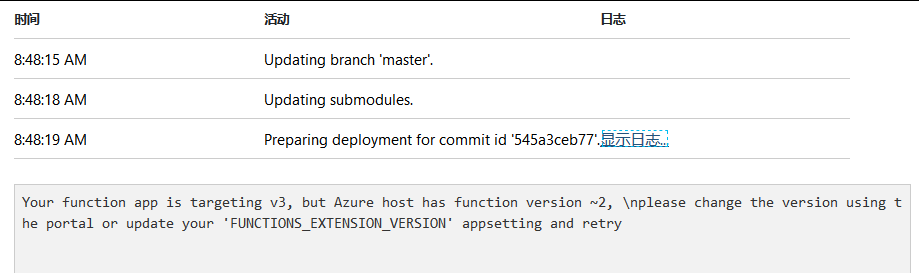
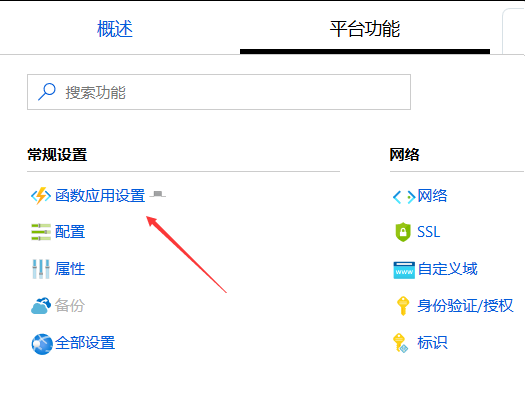
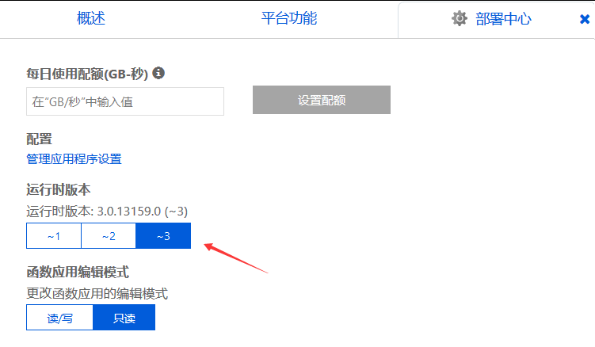

# Azure 函数服务部署失败 因为函数应用设置 v3 但主机是 v2 版本

在使用 Azure Function 函数服务的时候，将代码推送到函数服务器的时候提示 Your function app is targeting v3, but Azure host has function version 2 此时是因为在 Azure 的主机设置的版本落后函数的代码版本

<!--more-->
<!-- 发布 -->

在日志例如可以看到下面代码

```csharp
Your function app is targeting v3, but Azure host has function version ~2, \nplease change the version using the portal or update your 'FUNCTIONS_EXTENSION_VERSION' appsetting and retry
```

<!--  -->


在使用 git 推送可以看到下面代码

```csharp
remote: Your function app is targeting v3, but Azure host has function version ~2,
remote: please change the version using the portal or update your 'FUNCTIONS_EXTENSION_VERSION' appsetting and retry
remote: Error - Changes committed to remote repository but deployment to website failed.

```

此时可以通过在 Azure 函数服务管理界面里面设置主机版本，通过点击函数应用设置

<!--  -->


在部署中心里面将运行时版本修改为 `~3` 然后回到函数服务点击重新部署，或者新推送空白内容都可以

<!--  -->


<a rel="license" href="http://creativecommons.org/licenses/by-nc-sa/4.0/"></a><br />本作品采用<a rel="license" href="http://creativecommons.org/licenses/by-nc-sa/4.0/">知识共享署名-非商业性使用-相同方式共享 4.0 国际许可协议</a>进行许可。欢迎转载、使用、重新发布，但务必保留文章署名[林德熙](http://blog.csdn.net/lindexi_gd)(包含链接:http://blog.csdn.net/lindexi_gd )，不得用于商业目的，基于本文修改后的作品务必以相同的许可发布。如有任何疑问，请与我[联系](mailto:lindexi_gd@163.com)。
