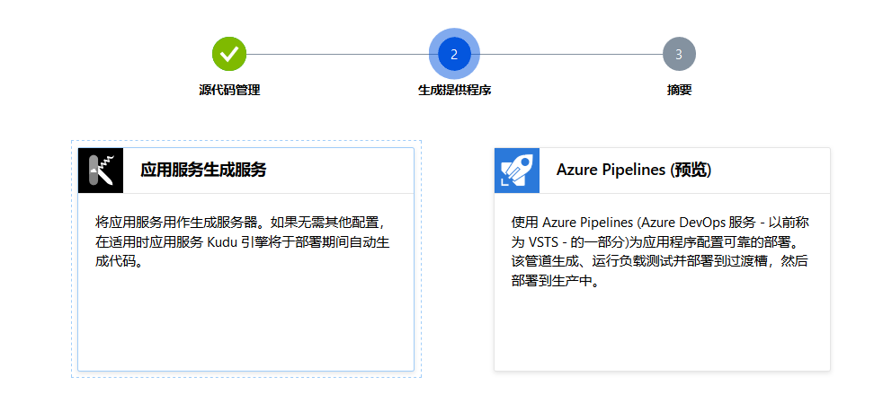
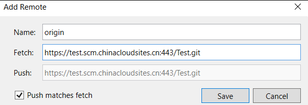

# Azure 无服务器 Function 函数计算服务 dotnet core 3.1 创建和部署入门

本文用的是 世纪互联 的 Azure.cn 版本，这个版本因为是在国内，所以网速会快超级超级多。使用 世纪互联 的版本需要一块钱哦，用一块钱就能进入一个月的免费试用。本文主要告诉小伙伴如何使用 Azure 无服务器 Function 函数计算服务

<!--more-->
<!-- CreateTime:5/13/2020 9:18:11 AM -->

本文会偏向于操作，而且仅仅是一条龙下来没有其他分支。如果想要了解边边角角其他的分支功能，请看微软学习平台的 [使用 Visual Studio 开发、测试和部署 Azure Functions - Learn](https://docs.microsoft.com/zh-cn/learn/modules/develop-test-deploy-azure-functions-with-visual-studio/ )

现在是 2020.5.13 因为微软喜欢不断更改界面，如果你阅读本文距离此时间比较远，那么有些界面变化让你看到的和本文不相同，还请小伙伴不要喷我

先登录 Azure.cn 进入仪表板，点击创建资源

<!--  -->

如下图选择进入函数应用

<!--  -->

点击创建的时候，可以注意到订阅里面用的是 1 元试用，也就是 1 元就能用上一堆有趣的功能。如果小伙伴实在不想付钱，但是想要试试 Azure 的功能，欢迎私聊给我二维码，我免费帮你付一块钱（我就知道有哪些厚颜无耻的人）

<!--  -->

点击创建之后需要等待一会，此时可以选择如何将代码上传到 Azure 服务进行部署。咱现在用的是中国的世纪互联也就是在 VS 上无法直接关联，需要通过快速入门里面选择使用部署中心部署

<!--  -->

先选择 VisualStudio 然后再选择使用部署中心，选择部署中心将会拿到一个 git 推送链接，通过在 VS 里面配置将代码推送到这个仓库就可以触发自动部署

<!--  -->

此时点击完成，转到部署中心

<!--  -->

我比较喜欢使用 CI CD 的方式，也就是推送代码就自动部署，其他方式还请看 [使用 Visual Studio 开发、测试和部署 Azure Functions（一）开发 - Grant_Allen - 博客园](https://www.cnblogs.com/AllenMaster/p/12633088.html )

选择应用生成服务，现在 Azure 的 Piplelines 还是预览版，配置起来复杂

<!--  -->

一路点击完成，此时可以看到推送的链接

<!--  -->

此时在本地创建一个 Azure Function 的项目，推荐使用 VistualStudio 2019 创建

<!--  -->

创建项目之后加入源代码管理，可以在设置里面的设置本地存储库设置推送的链接

<!--  -->

点击添加仓库，输入刚才创建的推送链接

<!--  -->

点击团队管理回到主页，点击同步，推送代码

<!--  -->

此时 Azure 将会进入自动构建，自动构建完成将会自动发布，点击一下函数的展开，可以看到 Function1 创建完成

可以点击获取函数 url 拿到访问的链接

<!--  -->

点击复制访问链接

<!--  -->

试试在浏览器输入复制的链接，默认将会输出 `Please pass a name on the query string or in the request body` 这是因为对应到代码里面的没有拿到 name 参数

<!--  -->

那么如何传入 name 参数？从代码上可以看到会从 Post 内容和从 url 里面获取，最简单的方法是添加到 url 里面，在 url 最后添加下面代码试试 `&name=lindexi` 运行的时候将会显示 `你好， lindexi` 这样就完成了简单的部署

<!--  -->

一些细节如下

刚才看到的 Function1 函数对应的是代码写的 `[FunctionName("Function1")]` 特性，可以通过将 `Function1` 替换为自己的名字然后推送代码，但是此时需要注意在 Azure 部署完成之后，点击刷新

<!--  -->

我十分推荐在微软学习平台里面学习如何使用，什么是微软学习平台请看 [[工具]微软的学习平台Microsoft Learn很好用，推荐一下 - dino.c - 博客园](https://www.cnblogs.com/dino623/p/get_started_using_Microsoft_Learn.html )

现在很多大厂都是提供了函数计算服务，如 阿里的服务，请看 [dotnet C# 使用阿里函数计算服务](https://blog.lindexi.com/post/dotnet-C-%E4%BD%BF%E7%94%A8%E9%98%BF%E9%87%8C%E5%87%BD%E6%95%B0%E8%AE%A1%E7%AE%97%E6%9C%8D%E5%8A%A1.html )

那么这个函数技术能做什么？这里有一个实际的开源的例子 URL 缩短器，请看 [https://github.com/FBoucher/AzUrlShortener](https://github.com/FBoucher/AzUrlShortener )

更多博客

[使用 Visual Studio 开发、测试和部署 Azure Functions（一）开发 - Grant_Allen - 博客园](https://www.cnblogs.com/AllenMaster/p/12633088.html )

[[工具]微软的学习平台Microsoft Learn很好用，推荐一下 - dino.c - 博客园](https://www.cnblogs.com/dino623/p/get_started_using_Microsoft_Learn.html )

[dotnet C# 使用阿里函数计算服务](https://blog.lindexi.com/post/dotnet-C-%E4%BD%BF%E7%94%A8%E9%98%BF%E9%87%8C%E5%87%BD%E6%95%B0%E8%AE%A1%E7%AE%97%E6%9C%8D%E5%8A%A1.html )

 本作品采用<a rel="license" href="http://creativecommons.org/licenses/by-nc-sa/4.0/">知识共享署名-非商业性使用-相同方式共享 4.0 国际许可协议</a>进行许可。欢迎转载、使用、重新发布，但务必保留文章署名[林德熙](http://blog.csdn.net/lindexi_gd)(包含链接:http://blog.csdn.net/lindexi_gd )，不得用于商业目的，基于本文修改后的作品务必以相同的许可发布。如有任何疑问，请与我[联系](mailto:lindexi_gd@163.com)。
