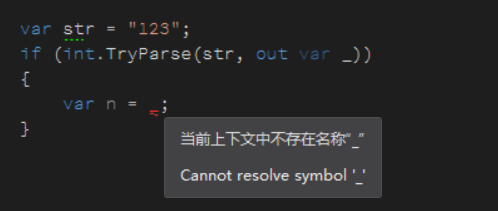
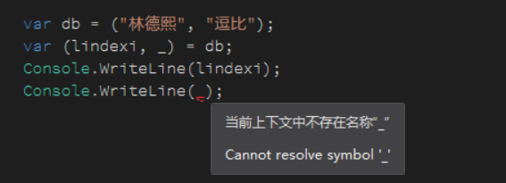

# C# 7.0 使用下划线忽略使用的变量

在 C# 7.0 支持使用下划线忽略不使用的变量

<!--more-->
<!-- CreateTime:2018/10/31 14:04:09 -->


这个方法用的比较多的是在 out 参数，如使用 int 的尝试转换函数

```csharp
           var str = "123";
            if (int.TryParse(str, out var _))
            {
                var n = _;
            }
```

<!--  -->


编译是不通过的，会出现 `error CS0103: The name '_' does not exist in the current context` 上面的代码还可以去掉 var 代码

```csharp
            var str = "123";
            if (int.TryParse(str, out _))
            {
                //var n = _; 
            }
```

在 ValueTuple 也是很多的使用

```csharp
            var db = ("林德熙", "逗比");
            var (lindexi, _) = db;
```

上面代码表示只拿出 lindexi 而 逗比是不拿出来的，虽然使用了下划线，但是如果在下面要使用下划线是无法编译通过

<!--  -->


从这个特性可以推出在辣么大的使用，请看代码

```csharp
            Action<int> f = _ =>
            {
                var n = 2;
            };
```

这样写表示不理会第一个参数，虽然这样写和下面代码是不等价的

```csharp
            Action<int> f = delegate
            {
                var n = 2;
            };
```

但是从约定上，使用下划线表示忽略的代码

<a rel="license" href="http://creativecommons.org/licenses/by-nc-sa/4.0/"></a><br />本作品采用<a rel="license" href="http://creativecommons.org/licenses/by-nc-sa/4.0/">知识共享署名-非商业性使用-相同方式共享 4.0 国际许可协议</a>进行许可。欢迎转载、使用、重新发布，但务必保留文章署名[林德熙](http://blog.csdn.net/lindexi_gd)(包含链接:http://blog.csdn.net/lindexi_gd )，不得用于商业目的，基于本文修改后的作品务必以相同的许可发布。如有任何疑问，请与我[联系](mailto:lindexi_gd@163.com)。
