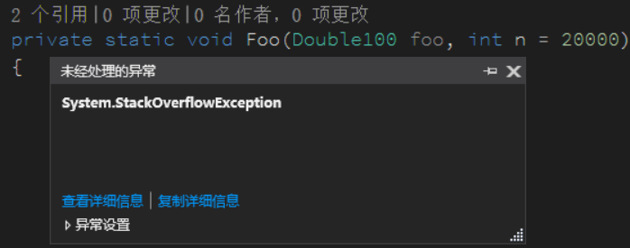
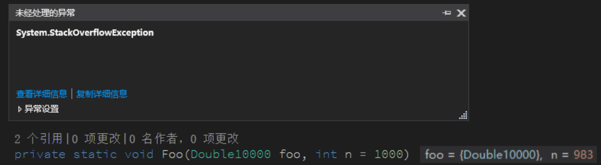

# C# 7.2 通过 in 和 readonly struct 减少方法值复制提高性能

在 C# 7.2 提供了一系列的方法用于方法参数传输的时候减少对结构体的复制从而可以高效使用内存同时提高性能

<!--more-->
<!-- CreateTime:2018/12/25 9:24:06 -->


在开始阅读之前，希望读者对 C# 的值类型、引用类型有比较深刻的认知。

在 C# 中，如果对内存有严格的要求，同时需要减少 GC 的情况，推荐此时使用结构体。但是结构体有一个缺点在于，结构体在每次调用方法作为参数传递的时候都会新建一个副本，这对于性能要求特别高的情况是不适合的。

定义一个值类型

```csharp
    struct Int256
    {
        public Int256(long bits0, long bits1, long bits2, long bits3)
        {
            Bits0 = bits0;
            Bits1 = bits1;
            Bits2 = bits2;
            Bits3 = bits3;
        }

        public long Bits0 { set; get; }
        public long Bits1 { get; }
        public long Bits2 { get; }
        public long Bits3 { get; }
    }
```

此时通过一个简单的赋值就可以获取复制

```csharp
Int256 f1 = new Int256(0, 1, 2, 1);
var f2 = f1;
f2.Bits0 = 2;
Console.WriteLine($"f1.bits0={f1.Bits0} f2.bits0={f2.Bits0}");
//f1.bits0=0 f2.bits0=2
```

在调用方法的时候也一样，传入参数就是复制一个新的值

```csharp
        static void Main(string[] args)
        {
            Int256 f1 = new Int256(0, 1, 2, 1);
            Foo(f1);
            Console.WriteLine($"{f1.Bits0}"); // 0
        }

        private static void Foo(Int256 foo)
        {
            foo.Bits0 = 2;
        }
```

对于很小的值类型，如果小于 IntPtr.Size 的传输，会比引用传递的复制速度快，但是对比比较大的值类型，如上面定义的，复制一次需要的时间会比较长

特别是存在很多次的值传递的时候，如下面的代码，会调用 1000 次的值传递。除了性能的问题，还存在堆栈的内存的问题

定义一个很大的值类型，里面包含 10000 个 double 看起来就很大

```csharp
    struct Double10000
    {
        public double Double0 { get; }
        public double Double1 { get; }
        public double Double2 { get; }
        ……
        public double Double9999 { get; }        
    }
```

用递归的方式进行调用，运行的时候很快就可以看到堆栈都被申请的值传递使用，同时 CPU 的使用很高

```csharp
        static void Main(string[] args)
        {
            Double10000 foo = new Double10000();
            Foo(foo);
        }

        private static void Foo(Double10000 foo, int n = 100)
        {
            if (n == foo.Double0)
            {
                return;
            }

            Foo(foo, n - 1);
        }
```

<!--  -->


如果可以让值类型和引用一样传递，是不是就可以减少值类型的复制同时减少堆栈的使用，请注意不要纠结值类型是分配在堆中还是栈中的问题，上面的代码更多的是方法的递归

对比内存的使用，更多的时候关心的是运行的速度。添加一些代码用来测试性能，同时减少调用

```csharp
            var st = new Stopwatch();
            st.Start();
            Foo(foo);
            st.Stop();
            Console.WriteLine(st.ElapsedTicks);
```

```csharp
        private static void Foo(Double10000 foo, int n = 10)
        {
            if (n == foo.Double0)
            {
                return;
            }

            Foo(foo, n - 1);
        }
```

这里输出的 ElapsedTicks 的单位是 100ns 需要知道 `1ms=1000000ns` 也就是 1w 的 tick 就是 1 毫秒，下面我运行 3 次代码，收集到的值

```csharp
10991
14950
16183
```

在 C# 7.2 可以使用 in 关键字告诉 VisualStudio 当前的方法不会对传进来的结构体进行修改，当前这样写只是语法层面。如果有一些厉害的黑客，可能还继续这样写入，于是为了防止真的进行修改，在底层还是复制了一份。

也就是只是在参数里面使用了 in 是不够的，具体请看[这个拖后腿的“in” - Bean.Hsiang - 博客园](http://www.cnblogs.com/BeanHsiang/p/8687780.html )

如果想要更好的使用内存同时提高性能，只有在可以被标记为只读的结构体的时候使用 in 才可以

先将 Double100 标记为 readonly 如果一个值类型标记为 readonly 也就无法对里面的字段或属性进行设置了

在 Foo 传入的方法参数标记 in 这样就完成了，因为 in 表示对参数不进行修改，而传入的是 readonly struct 本来就不能被修改，于是就传入 struct 的引用

```csharp
readonly struct Double10000

        private static void Foo(in Double10000 foo, int n = 10)
        {
            if (n == foo.Double0)
            {
                return;
            }

            Foo(foo, n - 1);
        }
```

同样运行 3 次，可以看到速度是原来的 10 倍

```csharp
2052
1837
1683
```

同时占用的堆栈更小，可以使用更多的递归，修改 Foo 函数调用次数为 1000 可以看到还能运行，但是如果去掉了参数 in 最多只能调用 20 次

没有加 in 的参数，运行了 17 次

<!--  -->


添加了 in 之后因为不需要复制值，减少内存的时候，此时运行了 1000 次递归都可以，在使用in之后速度和使用内存都比较好

在很多次方法调用使用参数的时候，如果传入的值是值类型，如果此时的 struct 里面的属性都是只读属性，推荐将 struct 标记为 readonly 同时在方法参数标记 in 这样可以让 struct 作为引用传递，也就是复制的只是指针，只要 struct 的长度比指针小就推荐这个方法

<a rel="license" href="http://creativecommons.org/licenses/by-nc-sa/4.0/"></a><br />本作品采用<a rel="license" href="http://creativecommons.org/licenses/by-nc-sa/4.0/">知识共享署名-非商业性使用-相同方式共享 4.0 国际许可协议</a>进行许可。欢迎转载、使用、重新发布，但务必保留文章署名[林德熙](http://blog.csdn.net/lindexi_gd)(包含链接:http://blog.csdn.net/lindexi_gd )，不得用于商业目的，基于本文修改后的作品务必以相同的许可发布。如有任何疑问，请与我[联系](mailto:lindexi_gd@163.com)。
