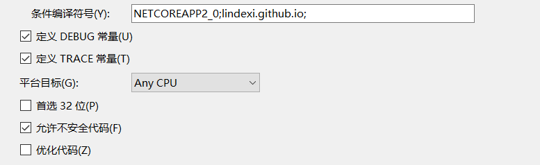

# C# Span 入门

本文简单告诉大家如何使用 Span 新的功能

需要知道 Span 是 7.2 才有的功能，如果在正式项目使用，建议安装 Nuget 的方式

<!--more-->
<!-- CreateTime:2018/12/2 11:32:46 -->


在对内存指定的一段的处理，原来的 C# 是比较弱的，因为没有了 C++ 的指针，特别是对于字符串的分割，需要创建多几个字符串。

垃圾微软为了提高 C# 的性能，于是提供了新的类型 Span，这个类可以拿出任意数组的一段，作为一个新的 Span 列表。这样的底层就是指针，而且指针是有判断是否超过范围比 C++ 安全。

首先安装 Nuget System.Memory 库，要求 dotnet framework 4.5 以上，在 UWP 16299 以上，在 dotnet core 2.0 以上

<!--  -->


先来写一个简单的程序，创建一个数组，然后使用 Span 指定数组的某一段

```csharp
            var array = new byte[10];
            Span<byte> bytes = array; 
            bytes = bytes.Slice(start: 2, length: 5);

            bytes[0] = 5;
            Console.WriteLine(array[2]);
            Console.WriteLine(bytes[0]);
```

可以看到对 bytes[0] 的修改就是对 array[2] 的修改，这样可以做到数组重新计算。

也就是对某个计算，需要加上数组的移动，如二维数组的图片计算，例如行是 w 列是 h ，那么计算第 n 行的元素，在以前的时候，就需要在每个的前面加上　`w*n`，现在可以使用　`spanList.Slice(start:w*n, Length:w)` 这样重新拿到的数组就是一行，不需要在每个计算都需要添加很多代码

```csharp
            var array = new byte[10];
            Span<byte> bytes = array; 
            bytes = bytes.Slice(start: 2, length: 5);

            bytes[0] = 5;
            Console.WriteLine(array[2]);
            Console.WriteLine(bytes[0]);

            try
            {
                bytes[5] = 2;
            }
            catch (IndexOutOfRangeException e)
            {
                Console.WriteLine(e);
            }
```

有了这个类就不需要担心写出超过范围代码

## stackalloc

如果要和 stackalloc 需要打开不安全代码

<!--  -->


然后点击生成高级，选择 C# 7.2 以上

现在可以写出这样的代码

```csharp
        private static unsafe void DroosorHotir()
        {
            Span<byte> bytes = stackalloc byte[2];
            bytes[0] = 2;
            bytes[1] = 3;

            Console.WriteLine(bytes[0]);
            Console.WriteLine(bytes[1]);
        }
```

调用这个函数可以输出 2 和 3 ，使用 stackalloc 可以比申请数组使用更少的资源。因为默认申请的数组都在堆中，不使用需要 gc 才可以回收。但是 stackalloc 可以在变量所在函数结束之后直接就回收，不需要移动内存。

但是 stackalloc 容易出现堆栈溢出，请执行下面的代码，堆栈溢出是 catch 也无法让他不让程序直接退出

```csharp
            Span<double> bytes = stackalloc double[200000];

```

即使使用 catch ，软件也会直接退出

```csharp
            try
            {
                Span<double> bytes = stackalloc double[200000];
            }
            catch (Exception)
            {
               // 接不住
            }
```

## AllocHGlobal

除了使用 stackalloc 之外，还可以使用 `Marshal.AllocHGlobal` 申请一段内存

```csharp
            IntPtr ptr = Marshal.AllocHGlobal(2);
            try
            {
                var bytes = new Span<byte>((byte*) ptr, 2) {[0] = 42};

                Console.WriteLine(bytes[0]);
                Console.WriteLine(Marshal.ReadByte(ptr));
            }
            finally
            {
                Marshal.FreeHGlobal(ptr);
            }
```

需要注意，申请的内存都需要自己释放

而且需要注意，不要使用比自己申请的内存大的数组

```csharp
            IntPtr ptr = Marshal.AllocHGlobal(2);
            var bytes = new Span<byte>((byte*) ptr, 1000) {[0] = 42};

```

上面代码申请了内存为 2 但是下一句使用了1000长度

```csharp

                for (int i = 0; i < 1000; i++)
                {
                    bytes[i] = 25;
                    Console.WriteLine(bytes[i]);
                }
```

这时虽然很多次都可以赋值成功，但是运行到某个时候，软件就直接退出。


参考：

[C# - All About Span: Exploring a New .NET Mainstay](https://msdn.microsoft.com/en-us/magazine/mt814808.aspx )

[通俗易懂，C#如何安全、高效地玩转任何种类的内存之Span(一)](https://www.cnblogs.com/justmine/p/10006621.html )

<a rel="license" href="http://creativecommons.org/licenses/by-nc-sa/4.0/"></a><br />本作品采用<a rel="license" href="http://creativecommons.org/licenses/by-nc-sa/4.0/">知识共享署名-非商业性使用-相同方式共享 4.0 国际许可协议</a>进行许可。欢迎转载、使用、重新发布，但务必保留文章署名[林德熙](http://blog.csdn.net/lindexi_gd)(包含链接:http://blog.csdn.net/lindexi_gd )，不得用于商业目的，基于本文修改后的作品务必以相同的许可发布。如有任何疑问，请与我[联系](mailto:lindexi_gd@163.com)。
