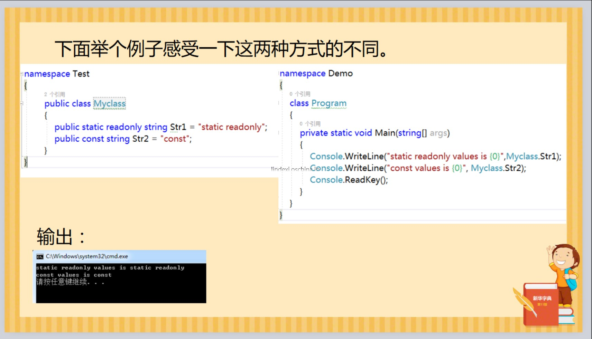
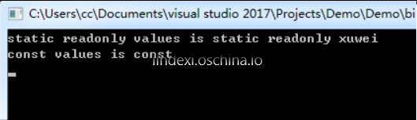

# C# const 和 readonly 有什么区别

在写常量的时候，是选择使用 const 还是 static readonly 是一个让人难以决定的问题，本文告诉大家这两个方法的区别。

<!--more-->
<!-- CreateTime:2018/9/3 16:52:07 -->

<div id="toc"></div>

如果一个类有静态字段，会如何初始化

可以使用的方法有两个，第一个方法就是直接在属性定义时写创建，第二个方法就是在构造创建，请看下面代码

```csharp
    private static Test _test = new Test();


```

```csharp
    private static Test _test;
    static Demo()
    {
        _test = new Test();
    }
```

再来思考下面的问题

请看下面两个代码有什么区别

```csharp
    const string str = "xxxxx";
```


```csharp
    static readonly string str = "xxxxx";
```

 - const			编译时常量

 - static readonly	运行时常量

<!--  -->


修改两常量的值，生成新的Test.dll，然后运行Demo.exe（不编译）。

<!--  -->


在不重新编译运行的时候，从上面的输出可以看到，使用const的值是不会修改，具体原因是因为 const 会被内联到代码

如写了下面的代码

```csharp
        public void DeawelTurkisHotarwoWefudaybem()
        {
            var str = "德熙" + Foo;
        }

        private const string Foo = "逗";
```

这时使用 Resharper 的 ILViewer ，在 Resharper 的 Resharper->Windows->ILViewer 打开，重新编译一下项目，把光标放在`var str = "德熙" + Foo`就可以看到类似下面代码的 IL 显示的是拼接了`"德熙" + Foo`的字符串

```IL
  .method public hidebysig instance void 
    DeawelTurkisHotarwoWefudaybem() cil managed 
  {
    .maxstack 1
    .locals init (
      [0] string str
    )

    // [8 9 - 8 10]
    IL_0000: nop          

    // [9 13 - 9 34]
    IL_0001: ldstr        "德熙逗"
    IL_0006: stloc.0      // str

    // [10 9 - 10 10]
    IL_0007: ret          

  }
```

如果是方法内的常量也是会被内联代码，请看下面代码

```csharp
        public void DeawelTurkisHotarwoWefudaybem()
        {
            const int n = 100;
            var foo = n;
        }
```

这时从 IL 可以创建的是下面的代码，定义的 `n` 是不存在的

```csharp
  .method public hidebysig instance void 
    DeawelTurkisHotarwoWefudaybem() cil managed 
  {
    .maxstack 1
    .locals init (
      [0] int32 foo
    )

    // [9 9 - 9 10]
    IL_0000: nop          

    // [11 13 - 11 25]
    IL_0001: ldc.i4.s     100 // 0x64
    IL_0003: stloc.0      // foo

    // [12 9 - 12 10]
    IL_0004: ret          

  }
```

上面代码的`IL_0001`就是把一个int压入栈，压入的值是 100 ，也就是原来的定义的 `n` 就被去掉了，直接使用n的值

如果dll被其他100个工程引用的话，
每次修改 Test 的 const 变量后一定要重新 build 这100个工程，
不然的话这些工程里的const值就不会更新。

1.编译时常量更改时，引用该常量的程序集必须重新编译，
才能获取已更新的值。

2.运行时常量更改时，引用该常量的程序集不必重新编译，直接运行便可获得已更新的值。

对于隐式转换，如果是 const 支持隐式转换，如果是static readonly，不支持


（1）const常量在编译时解析；而static readonly常量在运行时解析。

（2）const常量必须在定义时初始化；而static readonly常量可以在定义时初始化，也可以在构造函数中初始化；

（3）非常确定不会改变的常量值可以用const，必须写在函数体内的常量需要用const，需要被attributes用到的常量应该用const。

（4）常量需要被客户端引用，且可能会改变，应该用static readonly。

<a rel="license" href="http://creativecommons.org/licenses/by-nc-sa/4.0/"></a><br />本作品采用<a rel="license" href="http://creativecommons.org/licenses/by-nc-sa/4.0/">知识共享署名-非商业性使用-相同方式共享 4.0 国际许可协议</a>进行许可。欢迎转载、使用、重新发布，但务必保留文章署名[林德熙](http://blog.csdn.net/lindexi_gd)(包含链接:http://blog.csdn.net/lindexi_gd )，不得用于商业目的，基于本文修改后的作品务必以相同的许可发布。如有任何疑问，请与我[联系](mailto:lindexi_gd@163.com)。  
