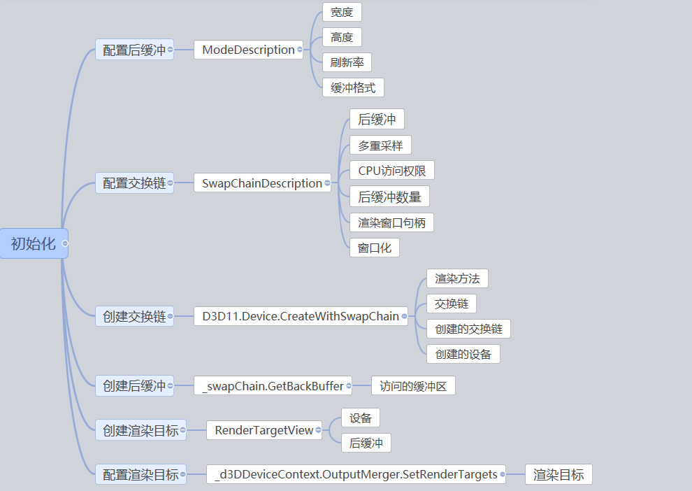
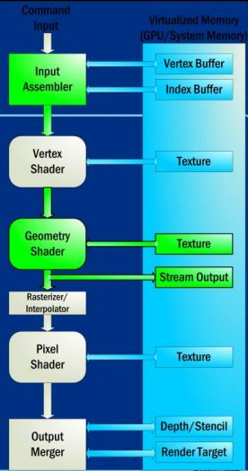

# C# 从零开始写 SharpDx 应用 初始化dx修改颜色

本文来告诉大家如何在上一篇博客创建的窗口里面使用 Sharpdx 初始化，然后设置窗口颜色。

<!--more-->
<!-- CreateTime:2020/1/2 19:20:07 -->

<!-- 标签：C#,D2D,DirectX,SharpDX,Direct2D, -->
<div id="toc"></div>

本文是 SharpDX 系列博客，更多博客请点击[SharpDX 系列](https://lindexi.github.io/lindexi/post/sharpdx.html )

在[C# 控制台创建 Sharpdx 窗口](https://blog.lindexi.com/post/C-%E4%BB%8E%E9%9B%B6%E5%BC%80%E5%A7%8B%E5%86%99-SharpDx-%E5%BA%94%E7%94%A8-%E6%8E%A7%E5%88%B6%E5%8F%B0%E5%88%9B%E5%BB%BA-Sharpdx-%E7%AA%97%E5%8F%A3.html )已经创建了一个窗口，现在需要在这个窗口初始化。因为是从零开始写，所以需要非常多细节，我觉得一篇文章是很难全部告诉大家，所以分为了系列的文章。从零开始写有利于大家了解一个渲染框架是如何做出来，并且从底层优化渲染，当然这个方法就是学习的时间会比较长。我会在文章去掉很多细节放在后面的博客讲，让大家先知道总体是如何做的。

## 创建资源

第一步是需要添加一个方法 `InitializeDeviceResources` 用来初始化资源，这里初始化的就是设备的资源。在 dx 的渲染是需要紧密绑定设备。

这个方法就是写在`KikuSimairme`类里，关于这个类的代码在[C# 控制台创建 Sharpdx 窗口](https://blog.lindexi.com/post/C-%E4%BB%8E%E9%9B%B6%E5%BC%80%E5%A7%8B%E5%86%99-SharpDx-%E5%BA%94%E7%94%A8-%E6%8E%A7%E5%88%B6%E5%8F%B0%E5%88%9B%E5%BB%BA-Sharpdx-%E7%AA%97%E5%8F%A3.html )

```csharp

        // 其他被忽略的代码
        private void InitializeDeviceResources()
        {
        }
```

创建一个可以画出来的类需要先创建显示模式描述，通过显示描述创建交换链描述，交换链描述创建设备和交换链，通过交换链和设备可以创建可以画出来的类，在这个类就可以画出无聊的图形，按照创建的顺序，我将文章分为多个部分，下面先来窗口模式描述

### 模式描述

首先需要创建一个描述显示模式，模式描述使用的是 `ModeDescription` 类，可以使用 new 的方式创建。在 dx 里很多的类都只能通过工厂创建，可以通过 new 创建的类一般都是描述的类。为什么需要描述的类？因为如果直接创建一个类需要传入大量的参数，那么这个写法将会很难，而且存在很多属性，只可以在构造的时候进行设置，不能在构造之后设置。为了方便开发，所以就将多个参数分为不同的类，这些类就是描述类。下面创建的是模式显示描述

```csharp
using SharpDX.Direct3D;
using SharpDX.DXGI;

// 其他忽略的代码
    class KikuSimairme : IDisposable
// 其他忽略的代码
        private void InitializeDeviceResources()
        {
            ModeDescription backBufferDesc =
                new ModeDescription(Width, Height, new Rational(60, 1), Format.R8G8B8A8_UNorm);

        }
```

通过 ModeDescription 就可以描述创建的模式是什么，前两个参数是表示缓存的大小，在很多的情况，这个值都和显示的大小相同。

第三个参数就是表示刷新率，这里使用的就是 `1/60` 也就是 60hz 

最后一个参数设置的是像素格式，这里使用 8 位的 RGBA 格式，使用一个无符号的 32 位整数表示，在设置格式是很重要，请仔细看自己的设置，因为我就告诉了一位小伙伴看着他将模式的格式写错了。如果有安装 Resharper 就可以按下 RGBA 快速找到这个属性

更多关于 ModeDescription 请看 [DXGI_MODE_DESC](https://msdn.microsoft.com/en-us/library/windows/desktop/bb173064(v=vs.85).aspx )

这里的 backBufferDesc 是在描述后台缓冲区，后台缓冲区的作用是防止动画中出现闪烁，可以这样看，在用户看到一个白纸的时候，一边有个人在这个白纸上画东西，这时用户就会看到画东西的闪烁。如果有两张纸，给用户看一张纸，在另一张纸上画，画完就把这张纸给用户，把刚才的纸拿来画下一个动画。通过这个方式就可以减少用户看到闪烁。这个不给用户看到的纸就是后台缓冲区（back buffer）。

### 交换链描述

下面可以来创建交换链的描述，交换链就是用来交换后台缓冲和显示的类，创建这个类需要先创建描述类，创建的方法是使用 new 的方式创建`SwapChainDescription`类，同样是为了减少创建交换链的输入参数，所以将很多参数放在这个类，创建描述类的时候就需要将上面创建的模式描述类传进来，请使用这个代码

```csharp

// 其他忽略的代码
    class KikuSimairme : IDisposable
// 其他忽略的代码

        private void InitializeDeviceResources()
// 其他忽略的代码
            SwapChainDescription swapChainDesc = new SwapChainDescription()
            {
                ModeDescription = backBufferDesc,
                SampleDescription = new SampleDescription(1, 0),
                Usage = Usage.RenderTargetOutput,
                BufferCount = 1,
                OutputHandle = _renderForm.Handle,
                IsWindowed = true
            };
```

先来解释一下参数。

交换链的 ModeDescription 就是上面定义的 backBufferDesc 

多重采用 SampleDescription 用来优化图片，是一种用于采样和平衡渲染像素的创建亮丽色彩变化之间的平滑过渡的一种技术，这里设置等级 1 也就是1重采样，需要传入两个参数一个是Count 指定每个像素的采样数量，一个是Quality指定希望得到的质量级别，参见[DXGI_SAMPLE_DESC structure](https://msdn.microsoft.com/en-us/library/windows/desktop/bb173072(v=vs.85).aspx )，在这里质量级别越高，占用的系统资源就越多。

Usage 设置 CPU 访问缓冲的权限，这里设置可以访问 RenderTarget 输出，请看 [DXGI_USAGE](https://msdn.microsoft.com/en-us/library/windows/desktop/bb173078(v=vs.85).aspx )

后缓冲数量 BufferCount 建议设置一个，设置一个就是双缓冲。两个缓冲区已经足够用了。

OutputHandle 获取渲染窗口句柄

IsWindowed 这个值设置是否希望是全屏，如果是 true 就是窗口。现在软件还没写好，如果这时全屏可能就无法退出，建议先设置这个值为 true 不然难以直接退出。但是我还是设置了全屏，原因是本金鱼有两个屏幕，所以可以让软件退出

现在已经创建交换链，但是我里面很多设置没有告诉大家还有哪些可以设置

这里有很多都需要在微软官方才可以看到，因为本文是简单的博客，不会在本文介绍。

为什么需要设置交换链？为了显示平滑的界面，需要至少两个缓冲区，一个用户前台显示，一个后缓冲区用于下一帧的绘制，在绘制完一帧后通过交换前、后缓冲区对应的指针来显示新一帧，交换就需要用到交换链来做。


### 私有变量

刚才是在 `InitializeDeviceResources` 方法里创建描述，但是创建了描述之后是需要创建出一些具体的类，这些类不能只放在 `InitializeDeviceResources` 方法，需要将这些类放在私有变量，这样在这个类的其他地方才可以拿到，请看代码

```csharp
using D3D11 = SharpDX.Direct3D11;

// 其他忽略的代码

    class KikuSimairme : IDisposable
// 其他忽略的代码

        private D3D11.DeviceContext _d3DDeviceContext;
        private SwapChain _swapChain;
        private D3D11.RenderTargetView _renderTargetView;
```

这里使用了 using 定义了 D3D11 ，这样可以区分一些类，如果有看到我之前的博客，会看到我在很多博客里都使用这个方式

渲染上下文 d3DDeviceContext 是一种描述设备如何绘制的渲染设备上下文。

创建的 RenderTargetView 是 渲染目标视图，在CPU把如何渲染写入到渲染目标视图中，它是一个2D纹理，写入 RenderTargetView 不会立刻渲染到屏幕，而是到管线的输出混合阶段，最后才到屏幕。

### 创建交换链

准备的代码已经写好，可以创建设备，创建了设备才可以画出

```csharp
using SharpDX.Direct3D;

// 其他忽略的代码
    class KikuSimairme : IDisposable
// 其他忽略的代码

        private void InitializeDeviceResources()
// 其他忽略的代码

            D3D11.Device.CreateWithSwapChain(DriverType.Hardware, D3D11.DeviceCreationFlags.None, swapChainDesc,
                out _d3DDevice, out _swapChain);
            _d3DDeviceContext = _d3DDevice.ImmediateContext;
```

第一个参数 DriverType.Hardware 表示希望使用 GPU 渲染，设置 驱动设备类型 可以设置硬件设备（hardware device）、参考设备（reference device）、软件驱动设备（software driver device）

 - 硬件设备（hardware device）是一个运行在显卡上的D3D设备，在所有设备中运行速度是最快的

 - 软件驱动设备（software driverdevice）是开发人员自己编写的用于Direct3D的渲染驱动软件

 - 参考设备（reference device）是用于没有可用的硬件支持时在CPU上进行渲染的设备

 - WARP设备（WARPdevice）是一种高效的CPU渲染设备，可以模拟现阶段所有的Direct3D特性

具体请看[Direct3D 11入门级知识介绍](https://blog.csdn.net/pizi0475/article/details/7786348 )

第二个参数选不使用特殊的方法，参见 [D3D11_CREATE_DEVICE_FLAG enumeration](https://msdn.microsoft.com/en-us/library/windows/desktop/ff476107(v=vs.85).aspx )

第三个参数是输入上面的交换链描述

最后的参数是输出设备和交换链，关于输出设备请看[Direct3D设备](https://blog.csdn.net/nightelve/article/details/6460477 )。

交换链在Direct3D中为一个设备渲染目标的集合。每一个设备都有至少一个交换链，而多个交换链能够被多个设备所创建。

有了交换链和设备可以在缓冲区画出图形，画图形需要使用`RenderTargetView` 渲染目标视图，为了在其他函数可以使用，这里需要把这个类写在私有变量

```csharp
        private D3D11.RenderTargetView _renderTargetView;

```

然后在 InitializeDeviceResources 使用下面代码，创建缓冲和使用缓冲和设置创建渲染目标视图。因为渲染目标视图可以认为是一张纸，这就是纹理，纹理是比较复杂的，将纹理理解为一副图像就行了。

```csharp
// 其他忽略的代码
    class KikuSimairme : IDisposable
// 其他忽略的代码

        private void InitializeDeviceResources()
// 其他忽略的代码

            using (D3D11.Texture2D backBuffer = _swapChain.GetBackBuffer<D3D11.Texture2D>(0))
            {
                _renderTargetView = new D3D11.RenderTargetView(_d3DDevice, backBuffer);
            }
```

总的创建过程很多，所以我使用了思维导图让大家知道每个步骤需要创建的

<!--  -->


## 修改颜色

如果已经看过了之前的博客，那么知道已经有可以画的类，就可以开始画出。

本文没有告诉大家如何画出线和画出圆形，只是告诉大家初始资源，所以到这里本文就结束了。

但是大家可以看到这时的界面和之前一样，会说我的程序是不是写错了。所以我就简单修改一下界面，创建一个函数 Draw 在这个函数写代码

```csharp
// 其他忽略的代码
    class KikuSimairme : IDisposable
// 其他忽略的代码

        private void Draw()
        {
            _d3DDeviceContext.OutputMerger.SetRenderTargets(_renderTargetView);
            _d3DDeviceContext.ClearRenderTargetView(_renderTargetView, ColorToRaw4(Color.Coral));

            _swapChain.Present(1, PresentFlags.None);

            RawColor4 ColorToRaw4(Color color)
            {
                const float n = 255f;
                return new RawColor4(color.R / n, color.G / n, color.B / n, color.A / n);
            }
        }
```

这里为了画出颜色，使用 ColorToRaw4 的类，因为 RawColor4 是传入颜色是 [0,1]，但是很多代码使用的是[0,255]，为了让颜色比较容易写，我就写了这个类。

在`_d3DDeviceContext.OutputMerger.SetRenderTargets(_renderTargetView);` 设置了刚才创建的`_renderTargetView`激活，在每次我们想渲染一个特定的渲染目标的时候，必须在所有的绘制的函数调用之前对它进行设置。

关于 OutputMerger 需要偷一张图来说明管道，通过 SetRenderTargets 也就是相当于调用了 `immediate_context_->OMSetRenderTargets` 绑定渲染目标，这样就将渲染目标绑定到渲染管线

<!--  -->


更多关于渲染管线请看 [渲染管线 - 冠位仓鼠 - CSDN博客](https://blog.csdn.net/u010333737/article/details/78556583?utm_source=blogxgwz1 )

第二句代码` _d3DDeviceContext.ClearRenderTargetView(_renderTargetView, ColorToRaw4(Color.Coral));`清理`_renderTargetView`设置颜色，把他放在第一个缓冲。在 dx 有两个缓冲，一个是看不见的，一个是显示的。第一个缓冲就是显示的，第二个就是在第一个显示的时候画出来，于是不停交换，让用户看到一个画好的缓冲。通过这个方法用户可以看到动画

调用交换链的Present函数在屏幕上显示渲染缓冲区的内容 `_swapChain.Present(1, PresentFlags.None);` 是等待垂直同步，在刷新完成在完成这个方法，第一个参数是同步间隔，第二个参数是演示的标志。

创建资源和颜色设置代码已经写好，现在需要调用方法

```csharp
// 其他忽略的代码
    class KikuSimairme : IDisposable
    {
        public KikuSimairme()
        {
            _renderForm = new RenderForm();
            _renderForm.ClientSize = new Size(Width, Height);

            InitializeDeviceResources();
        }
// 其他忽略的代码
    }
```

如果有看过之前的博客，会发现有一个方法是空的，现在可以在`RenderCallback`添加代码

```csharp
// 其他忽略的代码
    class KikuSimairme : IDisposable
    {
        private void RenderCallback()
        {
            Draw();
        }
// 其他忽略的代码
    }
```

在完成了上面的代码之后，还需要做清理，在 dx 使用的资源都需要手动释放。需要注意释放的顺序，本文在这里不告诉大家释放的顺序是如何确定，所以希望先复制下面代码进行释放。

```csharp
public void Dispose()
{
    renderTargetView.Dispose();
    swapChain.Dispose();
    d3dDevice.Dispose();
    d3dDeviceContext.Dispose();
    renderForm.Dispose();
}
```

现在按一下 F5 就可以运行，看到一个绿色的窗口。本文也就告诉了大家如何初始化窗口，在初始化窗口之后离在窗口画东西还需要一步，那就是创建 ViewPort 视口，详细请点击[C# 从零开始写 SharpDx 应用 画三角](https://lindexi.github.io/lindexi/post/C-%E4%BB%8E%E9%9B%B6%E5%BC%80%E5%A7%8B%E5%86%99-SharpDx-%E5%BA%94%E7%94%A8-%E7%94%BB%E4%B8%89%E8%A7%92.html ) 

所有代码

```csharp
using System;
using System.Collections.Generic;
using System.Diagnostics;
using System.Drawing;
using System.Linq;
using System.Text;
using System.Threading.Tasks;
using SharpDX.Direct3D;
using SharpDX.DXGI;
using SharpDX.Mathematics.Interop;
using SharpDX.Windows;
using D3D11 = SharpDX.Direct3D11;

namespace NawbemcemXadre
{
    class KikuSimairme : IDisposable
    {
        /// <inheritdoc />
        public KikuSimairme()
        {
            _renderForm = new RenderForm();
            _renderForm.ClientSize = new Size(Width, Height);

            InitializeDeviceResources();
        }

        private const int Width = 1280;

        private const int Height = 720;

        public void Run()
        {
            RenderLoop.Run(_renderForm, RenderCallback);
        }

        private RenderForm _renderForm;

        private D3D11.Device _d3DDevice;
        private D3D11.DeviceContext _d3DDeviceContext;
        private SwapChain _swapChain;
        private D3D11.RenderTargetView _renderTargetView;

        private void RenderCallback()
        {
            Draw();
        }

        private void InitializeDeviceResources()
        {
            ModeDescription backBufferDesc =
                new ModeDescription(Width, Height, new Rational(60, 1), Format.R8G8B8A8_UNorm);
            
            SwapChainDescription swapChainDesc = new SwapChainDescription()
            {
                ModeDescription = backBufferDesc,
                SampleDescription = new SampleDescription(1, 0),
                Usage = Usage.RenderTargetOutput,
                BufferCount = 1,
                OutputHandle = _renderForm.Handle,
                IsWindowed = true
            };

            D3D11.Device.CreateWithSwapChain(DriverType.Hardware, D3D11.DeviceCreationFlags.None, swapChainDesc,
                out _d3DDevice, out _swapChain);
            _d3DDeviceContext = _d3DDevice.ImmediateContext;

            using (D3D11.Texture2D backBuffer = _swapChain.GetBackBuffer<D3D11.Texture2D>(0))
            {
                _renderTargetView = new D3D11.RenderTargetView(_d3DDevice, backBuffer);
            }
        }

        private void Draw()
        {
            _d3DDeviceContext.OutputMerger.SetRenderTargets(_renderTargetView);
            _d3DDeviceContext.ClearRenderTargetView(_renderTargetView, ColorToRaw4(Color.Coral));

            _swapChain.Present(1, PresentFlags.None);

            RawColor4 ColorToRaw4(Color color)
            {
                const float n = 255f;
                return new RawColor4(color.R / n, color.G / n, color.B / n, color.A / n);
            }
        }

        /// <inheritdoc />
        public void Dispose()
        {
            _renderTargetView.Dispose();
            _swapChain.Dispose();
            _d3DDevice.Dispose();
            _d3DDeviceContext.Dispose();
            _renderForm?.Dispose();
        }
    }
}
```

参见：[SharpDX Beginners Tutorial Part 3: Initializing DirectX - Johan Falk](http://www.johanfalk.eu/blog/sharpdx-beginners-tutorial-part-3-initializing-directx )

[SharpDX 系列](https://lindexi.github.io/lindexi/post/sharpdx.html )

[WPF 底层渲染](https://blog.csdn.net/column/details/24324.html )

[Directx11入门之D3D程序初始化 - 九野的博客 - CSDN博客](https://blog.csdn.net/acmmmm/article/details/79369294 )

[Directx11入门之第五章 渲染管线 - 九野的博客 - CSDN博客](https://blog.csdn.net/acmmmm/article/details/79394416 )

[Direct3D 11入门级知识介绍](https://blog.csdn.net/pizi0475/article/details/7786348 )

[Direct3D设备](https://blog.csdn.net/nightelve/article/details/6460477 )

[D3D11_CREATE_DEVICE_FLAG enumeration](https://msdn.microsoft.com/en-us/library/windows/desktop/ff476107(v=vs.85).aspx )

上一篇 [C# 从零开始写 SharpDx 应用 控制台创建 Sharpdx 窗口](https://lindexi.oschina.io/lindexi/post/C-%E4%BB%8E%E9%9B%B6%E5%BC%80%E5%A7%8B%E5%86%99-SharpDx-%E5%BA%94%E7%94%A8-%E6%8E%A7%E5%88%B6%E5%8F%B0%E5%88%9B%E5%BB%BA-Sharpdx-%E7%AA%97%E5%8F%A3.html )

下一篇 [C# 从零开始写 SharpDx 应用 画三角](https://lindexi.github.io/lindexi/post/C-%E4%BB%8E%E9%9B%B6%E5%BC%80%E5%A7%8B%E5%86%99-SharpDx-%E5%BA%94%E7%94%A8-%E7%94%BB%E4%B8%89%E8%A7%92.html ) 将会告诉大家如何创建 视口 ViewPort，视口定义了我们渲染到屏幕上的面积。

<a rel="license" href="http://creativecommons.org/licenses/by-nc-sa/4.0/"></a><br />本作品采用<a rel="license" href="http://creativecommons.org/licenses/by-nc-sa/4.0/">知识共享署名-非商业性使用-相同方式共享 4.0 国际许可协议</a>进行许可。欢迎转载、使用、重新发布，但务必保留文章署名[林德熙](http://blog.csdn.net/lindexi_gd)(包含链接:http://blog.csdn.net/lindexi_gd )，不得用于商业目的，基于本文修改后的作品务必以相同的许可发布。如有任何疑问，请与我[联系](mailto:lindexi_gd@163.com)。
