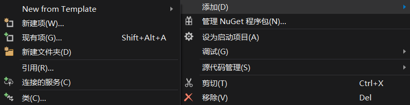
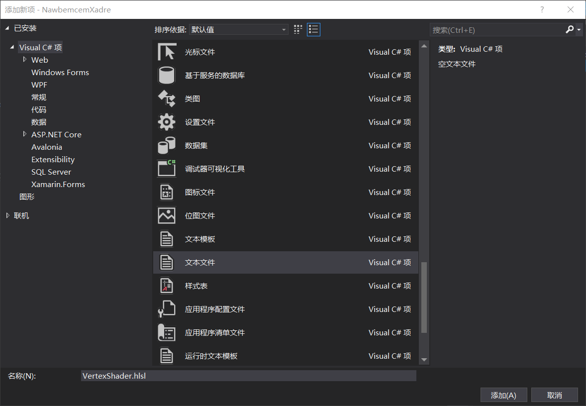
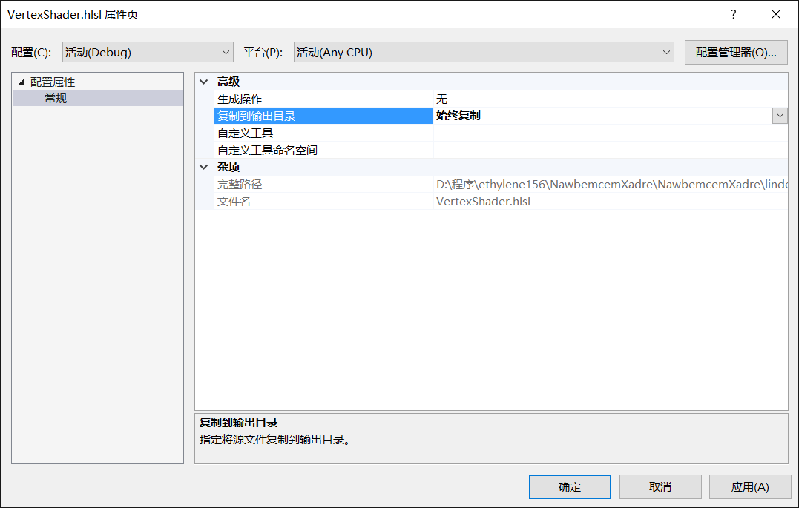

# C# 从零开始写 SharpDx 应用 画三角

在当前的画面都是使用三角形，在开始就告诉大家如何画三角，本文告诉大家如何用像素著色器画

<!--more-->
<!-- CreateTime:2018/9/30 18:30:14 -->

<!-- 标签：C#,D2D,DirectX,SharpDX,Direct2D,渲染 -->
<div id="toc"></div>

<!-- math -->

本文是 SharpDX 系列博客，更多博客请点击[SharpDX 系列](https://lindexi.github.io/lindexi/post/sharpdx.html )

在 [C# 从零开始写 SharpDx 应用 初始化dx修改颜色](https://blog.csdn.net/lindexi_gd/article/details/82114907 ) 创建了资源，在这个博客的代码继续写

## 顶点

为了创建三角形，需要使用顶点。顶点就是在 3D 空间的点。通过顶点可以添加数据，很多使用的顶点都使用三个值，就是 xyz 来表示点在三维空间。大家都知道三角形有三个顶点，所以下面来创建三个顶点。

这里的顶点的范围是 0-1，所以可以使用下面代码创建出顶点

```csharp
        private Vector3[] _vertices = new Vector3[]
            {new Vector3(-0.5f, 0.5f, 0.0f), new Vector3(0.5f, 0.5f, 0.0f), new Vector3(0.0f, -0.5f, 0.0f)};
```

这时会发现 Vector3 没有定义，因为没有安装`SharpDX.Mathematics`，如果使用的是 VisualStudio 2017 格式，那么复制下面代码放在项目

```csharp
    <PackageReference Include="SharpDX.Mathematics" Version="3.1.1" />

```

如果不是就打开 Nuget 安装 SharpDX.Mathematics ，安装之后引用`using SharpDX`就可以使用这个类

## 顶点缓存

现在的顶点信息放在了内存，因为使用了上面代码创建。但是渲染的对象是在显卡，需要把内存的顶点信息复制到显卡。为了做这个需要使用缓存。在 DX ，可以使用缓存，dx 会自动复制信息到显卡。

下面使用缓存来存放顶点信息，这样就会在使用信息自动复制到显卡。先写一个私有变量，通过这个变量把信息放在缓存，请看下面

```csharp
        private D3D11.Buffer _triangleVertexBuffer;

```

写一个函数用来把 `_vertices` 转换 `_triangleVertexBuffer` ，代码很简单

```csharp
        private void InitializeTriangle()
        {
            _triangleVertexBuffer = D3D11.Buffer.Create<Vector3>(_d3DDevice, D3D11.BindFlags.VertexBuffer, _vertices);
        }
```

这个函数需要在构造使用

```csharp
   
        // 其他被忽略的代码

        public KikuSimairme()
        {
            _renderForm = new RenderForm();
            _renderForm.ClientSize = new Size(Width, Height);

            InitializeDeviceResources();

            InitializeTriangle();
        }

```

现在使用`D3D.Buffer.Create`创建新的缓存，这里的`Vector3`实际可以不需要传。第一个参数 Direct3D 设备就是创建资源的设备，表示缓存会在哪个设备使用。第二个参数就是希望创建的类型，这里写的是顶点缓存，这里用的是 VertexBuffer ，除了这个还有 Constant buffer 和 IndexBuffer 。constant表明了constant buffer中的数据，在一次draw call的执行过程中都是不变的，用来从 CPU 传数据到 GPU。而IndexBuffer是保存索引编号的缓冲区。关于 Constant Buffer 请看[Constant Buffer的高效使用，让你码出质量](https://zhuanlan.zhihu.com/p/35830868 )

注意缓存是需要去掉

```csharp
        // 其他被忽略的代码
 
        public void Dispose()
        {
            _renderTargetView.Dispose();
            _swapChain.Dispose();
            _d3DDevice.Dispose();
            _d3DDeviceContext.Dispose();
            _renderForm?.Dispose();

            _triangleVertexBuffer.Dispose();
        }
```

## 像素着色器

为了画出三角形，需要使用顶点着色器和像素着色器。

使用这两个着色器因为顶点着色器负责加工顶点集合，可以用来做变换，如移动旋转顶点。而像素着色器负责每个像素，如何画出每个像素和纹理。

定义两个私有变量，表示两个着色器

```csharp
        private D3D11.VertexShader _vertexShader;
        private D3D11.PixelShader _pixelShader;
```

创建的着色器需要使用 D3DCompiler 编译着色器文件，编译文件的速度很快

```csharp
  using SharpDX.D3DCompiler;
        // 其他被忽略的代码

      private void InitializeShaders()
        {
            using (var vertexShaderByteCode = ShaderBytecode.CompileFromFile("VertexShader.hlsl", "main", "vs_4_0", ShaderFlags.Debug))
            {
                _vertexShader = new D3D11.VertexShader(_d3DDevice, vertexShaderByteCode);
            }
            using (var pixelShaderByteCode = ShaderBytecode.CompileFromFile("PixelShader.hlsl", "main", "ps_4_0", ShaderFlags.Debug))
            {
                _pixelShader = new D3D11.PixelShader(_d3DDevice, pixelShaderByteCode);
            }
        }
```

可以从代码发现使用了两个文件，所以接下来就需要创建两个文件，这两个文件使用的是 hlsl 来写，关于 hlsl 不属于本文的内容，所以没有详细告诉大家，建议复制一下代码。这里创建了着色器需要使用下面代码进行设置

```csharp
        // 其他被忽略的代码
            _d3DDeviceContext.VertexShader.Set(_vertexShader);
            _d3DDeviceContext.PixelShader.Set(_pixelShader);

            _d3DDeviceContext.InputAssembler.PrimitiveTopology = PrimitiveTopology.TriangleList;
```

现在的 InitializeShaders 方法看起来就是如下

```csharp
        private void InitializeShaders()
        {
            using (var vertexShaderByteCode = ShaderBytecode.CompileFromFile("VertexShader.hlsl", "main", "vs_4_0", ShaderFlags.Debug))
            {
                _vertexShader = new D3D11.VertexShader(_d3DDevice, vertexShaderByteCode);
            }
            using (var pixelShaderByteCode = ShaderBytecode.CompileFromFile("PixelShader.hlsl", "main", "ps_4_0", ShaderFlags.Debug))
            {
                _pixelShader = new D3D11.PixelShader(_d3DDevice, pixelShaderByteCode);
            }

            _d3DDeviceContext.VertexShader.Set(_vertexShader);
            _d3DDeviceContext.PixelShader.Set(_pixelShader);

            _d3DDeviceContext.InputAssembler.PrimitiveTopology = PrimitiveTopology.TriangleList;
        }
```

这里还使用 `PrimitiveTopology` 设置如何画出来，更多请看[Primitive Topologies](https://msdn.microsoft.com/en-us/library/windows/desktop/bb205124(v=vs.85).aspx )

因为用到了两个特殊的文件，现在右击项目添加两个文本。

<!--  -->


然后创建一个文本文件，注意文本的名字，一个是  PixelShader.hlsl 另一个是 VertexShader.hlsl ，需要点击新建项才可以创建文本。为什么需要使用文本，因为这样编译选项就不需要自己选

<!--  -->


现在就创建了两个文件，请看自己的工程是否存在下面两个文件


<!--  -->


现在需要右击两个文件 `PixelShader.hlsl` 和 `VertexShader.hlsl ` 属性，选择输出

<!--  -->


打开 `VertexShader.hlsl` 并且写入下面代码

```csharp
 float4 main(float4 position : POSITION) : SV_POSITION
{
	return position;
}
```

上面代码就是创建一个 main 函数，写法和 C 差不多，具体的意思在这里不会告诉大家，因为关于这个的写法是很复杂，这里复制就好

打开  `PixelShader.hlsl` 输入下面代码

```csharp
float4 main(float4 position : SV_POSITION) : SV_TARGET
{
	return float4(1.0, 0.0, 0.0, 1.0);
}
```

这里也不解释代码的意思

打开 KikuSimairme 类，在构造函数添加 InitializeShaders 初始化

```csharp
        // 其他被忽略的代码
        public KikuSimairme()
        {
            _renderForm = new RenderForm();
            _renderForm.ClientSize = new Size(Width, Height);

            InitializeDeviceResources();

            InitializeTriangle();

            InitializeShaders();
        }
```

而且在清理的时候需要关闭 `_vertexShader` ，请看代码

```csharp
        public void Dispose()
        {
           // 其他被忽略的代码

            _vertexShader.Dispose();
            _pixelShader.Dispose();
        }
```

如果在`var pixelShaderByteCode = ShaderBytecode.CompileFromFile("PixelShader.hlsl", "main", "ps_4_0", ShaderFlags.Debug)`出现 `System.IO.FileNotFoundException` ，那么就是 `PixelShader.hlsl` 右击属性没有输出到和 exe 相同的文件夹

## 输入层

现在已经有了顶点缓存和顶点数据。但是 DirectX 同样需要知道数据的结构和每个顶点类型，所以需要使用输入层。创建输入层需要两步，首先需要描述每个顶点，然后从顶点创建输入层。

因为这里就使用一个顶点集合，所以只需要创建一个输入元素集合

```csharp
private D3D11.InputElement[] _inputElements = new D3D11.InputElement[] 
{
    new D3D11.InputElement("POSITION", 0, Format.R32G32B32_Float, 0)
};
```

这里的 `POSITION` 可以在 shader 的代码被识别，这个字符串就是语义，用于匹配输入的材质的签名。第二个参数 0 就是语义槽的使用，表示使用哪个，在有多个`POSITION `语义的例子才使用。第三个参数就是数据的类型，使用的元素是包括三个浮点数，所以使用 `Float` ，还记得为什么是三个浮点数？原因在三维的空间使用三个浮点数可以表示一个点。

在刚才的初始化函数获取签名，通过编译的代码

```csharp
           // 其他被忽略的代码
        private void InitializeShaders()
        {
            ShaderSignature inputSignature;
            using (var vertexShaderByteCode = ShaderBytecode.CompileFromFile("VertexShader.hlsl", "main", "vs_4_0", ShaderFlags.Debug))
            {
                inputSignature = ShaderSignature.GetInputSignature(vertexShaderByteCode);
               // 其他被忽略的代码
            }

           // 其他被忽略的代码

        }
```

创建输入层的私有变量，创建输入层需要输入签名和输入元素

```csharp
     private D3D11.InputLayout _inputLayout;
        private ShaderSignature _inputSignature;

        private void InitializeShaders()
        {
            using (var vertexShaderByteCode =
                ShaderBytecode.CompileFromFile("VertexShader.hlsl", "main", "vs_4_0", ShaderFlags.Debug))
            {
                _inputSignature = ShaderSignature.GetInputSignature(vertexShaderByteCode);
                _vertexShader = new D3D11.VertexShader(_d3DDevice, vertexShaderByteCode);
            }

            _inputLayout = new D3D11.InputLayout(_d3DDevice, _inputSignature, _inputElements);
            _d3DDeviceContext.InputAssembler.InputLayout = _inputLayout;

           // 其他被忽略的代码
            
        }
```

创建的代码第一个参数就是刚才使用的 D3D 设备，第二个就是刚才的输入签名，最后一个就是输入元素。

这里创建了一个私有变量，最后还是需要去掉他

```csharp
        public void Dispose()
        {
           // 其他被忽略的代码

            _inputLayout.Dispose();
            _inputSignature.Dispose();
        }
```

## 设置 ViewPort 

在开始画之前需要先设置 ViewPort ，在 DirectX 使用的坐标是 Normalized Device Coordinates 左上角是 $-1,-1$，右下角是 $1,1$ ，创建私有变量用来放 ViewPort 代码

```csharp
      private Viewport _viewport;

        private void InitializeDeviceResources()
        {
           // 其他被忽略的代码

            _viewport = new Viewport(0, 0, Width, Height);
            _d3DDeviceContext.Rasterizer.SetViewport(_viewport);
        }
```

## 画出顶点

在 Draw 画出顶点

```csharp
        private void Draw()
        {
            _d3DDeviceContext.OutputMerger.SetRenderTargets(_renderTargetView);
            _d3DDeviceContext.ClearRenderTargetView(_renderTargetView, ColorToRaw4(Color.Coral));

            _d3DDeviceContext.InputAssembler.SetVertexBuffers(0,
                new D3D11.VertexBufferBinding(_triangleVertexBuffer, Utilities.SizeOf<Vector3>(), 0));
            _d3DDeviceContext.Draw(_vertices.Length, 0);

            _swapChain.Present(1, PresentFlags.None);

            RawColor4 ColorToRaw4(Color color)
            {
                const float n = 255f;
                return new RawColor4(color.R / n, color.G / n, color.B / n, color.A / n);
            }
        }
```

上面代码 SetVertexBuffers 是告诉 `_d3DDeviceContext` 使用顶点缓存，第二个参数就是告诉每个顶点的长度

使用 `_d3DDeviceContext.Draw` 可以从顶点缓存画出，第二个参数就是指定画出的偏移，从那个顶点开始画，第一个参数是画多少个。如输入 `3,2` 就是从第2个开始画三个

运行代码

参见：[SharpDX Beginners Tutorial Part 4: Drawing a triangle - Johan Falk](http://www.johanfalk.eu/blog/sharpdx-beginners-tutorial-part-4-drawing-a-triangle )

更多博客请看 [SharpDX 系列](https://lindexi.github.io/lindexi/post/sharpdx.html )


感谢[三千](https://www.pixiv.net/member_illust.php?mode=medium&illust_id=62951506)提供图片

<a rel="license" href="http://creativecommons.org/licenses/by-nc-sa/4.0/"></a><br />本作品采用<a rel="license" href="http://creativecommons.org/licenses/by-nc-sa/4.0/">知识共享署名-非商业性使用-相同方式共享 4.0 国际许可协议</a>进行许可。欢迎转载、使用、重新发布，但务必保留文章署名[林德熙](http://blog.csdn.net/lindexi_gd)(包含链接:http://blog.csdn.net/lindexi_gd )，不得用于商业目的，基于本文修改后的作品务必以相同的许可发布。如有任何疑问，请与我[联系](mailto:lindexi_gd@163.com)。
