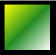
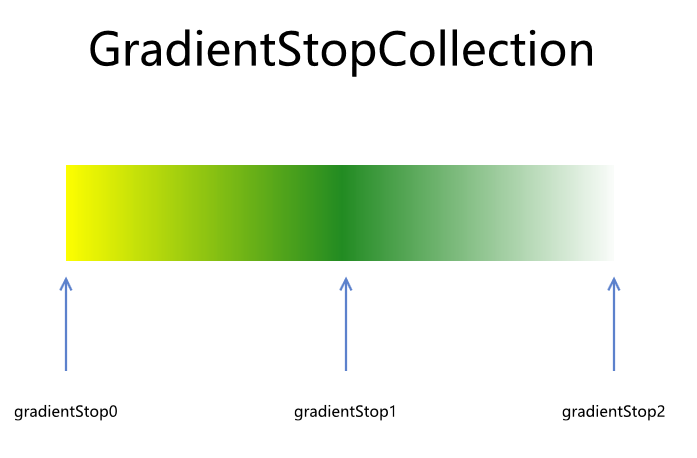
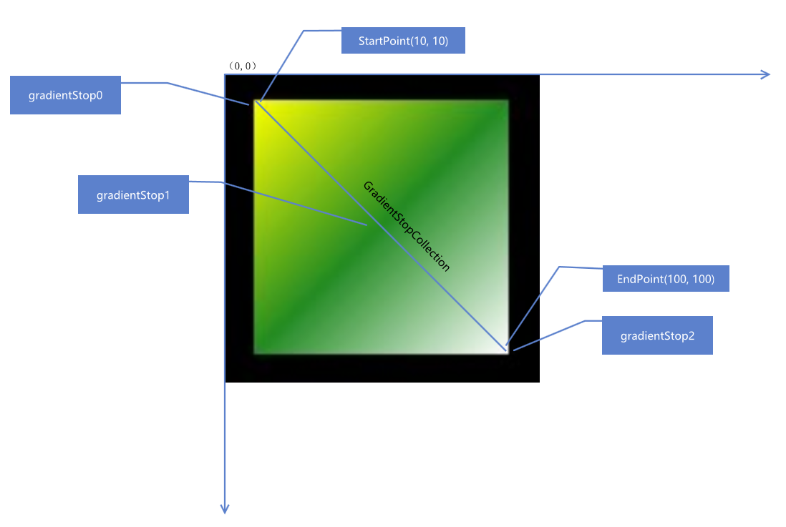
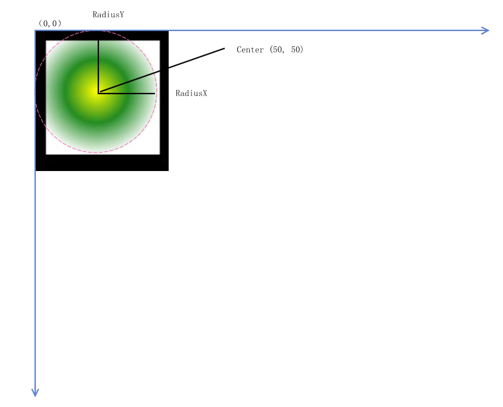
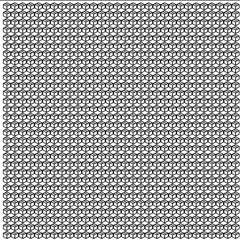

# C# 从零开始写 SharpDx 应用 笔刷

本文告诉大家如何在 SharpDx 里面使用笔刷，包括纯色笔刷、渐变笔刷和图片笔刷

<!--more-->
<!-- CreateTime:2019/8/30 8:50:00 -->


本文属于 [SharpDx 系列](https://blog.lindexi.com/post/WPF-%E4%BD%BF%E7%94%A8-SharpDx-%E6%B8%B2%E6%9F%93%E5%8D%9A%E5%AE%A2%E5%AF%BC%E8%88%AA.html) 博客，建议从头开始读

## 初始化

本文将会在 [C# 从零开始写 SharpDx 应用 初始化dx修改颜色](https://blog.csdn.net/lindexi_gd/article/details/82114907 )的代码基础进行修改

用到的初始化代码也不多，请看下面代码，这些代码都可以在上一篇博客找到

```csharp
        private void InitializeDeviceResources()
        {
            var backBufferDesc =
                new ModeDescription(Width, Height, new Rational(60, 1), Format.R8G8B8A8_UNorm);
            var swapChainDesc = new SwapChainDescription
            {
                ModeDescription = backBufferDesc,
                SampleDescription = new SampleDescription(1, 0),
                SwapEffect = SwapEffect.Discard,
                Usage = Usage.RenderTargetOutput,
                BufferCount = 1,
                OutputHandle = _renderForm.Handle,
                IsWindowed = true
            };

            Device.CreateWithSwapChain(DriverType.Hardware, DeviceCreationFlags.BgraSupport, swapChainDesc,
                out _d3DDevice, out _swapChain);

            _d3DDeviceContext = _d3DDevice.ImmediateContext;

            using (var backBuffer = _swapChain.GetBackBuffer<Texture2D>(0))
            {
                _renderTargetView = new RenderTargetView(_d3DDevice, backBuffer);

                _viewport = new Viewport(0, 0, Width, Height);
                _d3DDeviceContext.Rasterizer.SetViewport(_viewport);
            }

            CreateD2DRender();
        }
```

在 CreateD2DRender 方法里面创建 D2D 的资源，本文这里直接写上代码，如果想要了解代码含义请看 [C# 从零开始写 SharpDx 应用 绘制基础图形](https://blog.lindexi.com/post/C-%E4%BB%8E%E9%9B%B6%E5%BC%80%E5%A7%8B%E5%86%99-SharpDx-%E5%BA%94%E7%94%A8-%E7%BB%98%E5%88%B6%E5%9F%BA%E7%A1%80%E5%9B%BE%E5%BD%A2.html)

```csharp
        private void CreateD2DRender()
        {
            var d2dFactory = new SharpDX.Direct2D1.Factory();
            Texture2D backBuffer = D3D11.Resource.FromSwapChain<Texture2D>(_swapChain, 0);
            Surface surface = backBuffer.QueryInterface<Surface>();
            var d2dRenderTarget = new RenderTarget(d2dFactory, surface,
                new RenderTargetProperties(new PixelFormat(Format.Unknown, AlphaMode.Premultiplied)));

            var defaultDevice = _d3DDevice.QueryInterface<SharpDX.Direct3D11.Device1>();
            var dxgiDevice2 = defaultDevice.QueryInterface<SharpDX.DXGI.Device2>();
            var d2dDevice = new SharpDX.Direct2D1.Device(dxgiDevice2);

            _d2dFactory = d2dFactory;
            _d2dRenderTarget = d2dRenderTarget;
            _d2dContext = new DeviceContext(surface);
            _d2dDevice = d2dDevice;
        }

        private Factory _d2dFactory;
        private RenderTarget _d2dRenderTarget;
        private DeviceContext _d2dContext;
        private SharpDX.Direct2D1.Device _d2dDevice;
```

## 纯色笔刷

最基础使用的是纯色笔刷，在 SharpDx 里面传入的颜色是 RawColor4 颜色，颜色的值范围是 0-1 我写了一个方法将 Color 转换

```csharp
        RawColor4 ColorToRaw4(Color color)
        {
            const float n = 255f;
            return new RawColor4(color.R / n, color.G / n, color.B / n, color.A / n);
        }
```

创建纯色笔刷需要传入两个值，其中一个是 RenderTarget 另一个是颜色

在上面初始化代码创建了 `_d2dRenderTarget` 和 `_d2dContext` 这两个都是 RenderTarget 都可以传入，但是需要知道的传入的值和使用的对象需要是相同的

例如传入的是  `_d2dRenderTarget` 那么下面尝试用纯色笔刷画一个矩形

```csharp
            _d2dRenderTarget.BeginDraw();

            _d2dRenderTarget.Clear(ColorToRaw4(Color.White));

            var brush = new SolidColorBrush(_d2dRenderTarget, ColorToRaw4(Color.Bisque));
            using (brush)
            {
                var rect = new RawRectangleF(left: 10, top: 10, right: 500, bottom: 500);
                _d2dRenderTarget.FillRectangle(rect, brush);
            }

            _d2dRenderTarget.EndDraw();

            _swapChain.Present(1, PresentFlags.None);
```

上面代码写在 [C# 从零开始写 SharpDx 应用 初始化dx修改颜色](https://blog.csdn.net/lindexi_gd/article/details/82114907 ) 创建的 Draw 方法

在开始绘制的时候调用 BeginDraw 方法，在绘制完成调用 EndDraw 方法，然后调用交换链将缓存交换

这里创建 SolidColorBrush 使用的是 `_d2dRenderTarget` 字段，如果使用 `_d2dContext` 那么请将上面代码替换

需要注意在 SharpDx 创建的资源都需要手动释放，创建的纯色笔刷需要手动释放

## 渐变笔刷

在 SharpDx 使用 LinearGradientBrush 做渐变笔刷，渐变笔刷需要用 LinearGradientBrushProperties 和 GradientStopCollection 两个值进行初始化

在 LinearGradientBrushProperties 可以指定起点和终点，通过起点和终点连线做渐变，这里的起点和终点使用的是画布坐标系而不是绘制的图形的坐标系

例如我绘制的矩形在 `(10,10)` 作为左上角，但是指定的笔刷是在 `(0,0)` 那么将会在矩形之外就开始算笔刷

```csharp
            var linearGradientBrushProperties = new LinearGradientBrushProperties()
            {
                StartPoint = new RawVector2(10f, 10f),
                EndPoint = new RawVector2(100f, 100f)
            };
``` 

在 GradientStopCollection 可以指定笔刷的渐变点集合，使用的是 GradientStop 数组表示

在 GradientStop 数组，在每个对象里面需要指定颜色和渐变点的距离，范围是从 0 到 1 越靠近 0 的就是越靠近 LinearGradientBrushProperties 起点的颜色

例如我创建了 3 个颜色

```csharp
            var gradientStop0 = new GradientStop()
            {
                Color = ColorToRaw4(Color.Yellow),
                Position = 0f
            };
            var gradientStop1 = new GradientStop()
            {
                Color = ColorToRaw4(Color.ForestGreen),
                Position = 0.5f
            };
            var gradientStop2 = new GradientStop()
            {
                Color = ColorToRaw4(Color.White),
                Position = 1f
            };
            var gradientStops = new GradientStop[]
            {
                gradientStop0,
                gradientStop1,
                gradientStop2,
            };
```

使用上面创建的对象绘制在矩形渐变

```csharp
            _d2dRenderTarget.BeginDraw();

            _d2dRenderTarget.Clear(null);

            var gradientStopCollection = new GradientStopCollection(_d2dRenderTarget, gradientStops);
            var brush = new LinearGradientBrush(_d2dRenderTarget,
                                                linearGradientBrushProperties,
                                                gradientStopCollection);
            using (gradientStopCollection)
            using (brush)
            {
                var rect = new RawRectangleF(left: 10, top: 10, right: 100, bottom: 100);
                _d2dRenderTarget.FillRectangle(rect, brush);
            }

            _d2dRenderTarget.EndDraw();

            _swapChain.Present(1, PresentFlags.None);
```

运行代码可以看到下图

<!--  -->


在 `_d2dRenderTarget.Clear` 传入 null 将会使用透明的默认黑色清空画布

在上面代码的 GradientStopCollection 就是画出一条渐变线，在数学的线是没有宽度的，但是让大家能看到每个颜色我就画了一条矩形

<!--  -->


这就是对应的三个点，有了一条线，那么将这条线应用到线段上就做出了渐变笔刷

<!--  -->


画出的渐变线需要配合渐变的起点和终点才能画出渐变效果，在使用的坐标是画布的坐标，可以让起点的坐标比终点的大

在 LinearGradientBrush 也有起点和终点的属性，在这里的设置会覆盖 LinearGradientBrushProperties 的设置

```csharp
            var brush = new LinearGradientBrush(_d2dRenderTarget,
                                                linearGradientBrushProperties,
                                                gradientStopCollection)
            {
                StartPoint = new RawVector2(50, 50),
                EndPoint = new RawVector2(100, 100)
            };
```

如上面的代码就会让 LinearGradientBrushProperties 设置的从 10,10 开始修改为从 50 开始画渐变

## 圆形渐变

上面使用的是最简单的线性渐变笔刷，下面来告诉大家使用圆形渐变的效果

在 SharpDx 使用 RadialGradientBrush 做圆形渐变效果

在 RadialGradientBrush 的创建需要传入 RadialGradientBrushProperties 和 GradientStopCollection 对象

在线性渐变笔刷已经告诉过大家 GradientStopCollection 是做什么用的，在 GradientStopCollection 可以画出一条渐变线，这条线没有指定起点和终点，但是指定了颜色在对应的线的比例

在圆形渐变笔刷中 RadialGradientBrushProperties 将会传入圆心的坐标，圆的 x 方向和 y 的大小，也就是可以画出椭圆，另外还支持设置实际的渐变线的起点

```csharp
            var radialGradientBrushProperties = new RadialGradientBrushProperties()
            {
                Center = new RawVector2(50, 50),
                GradientOriginOffset = new RawVector2(0, 0),
                RadiusX = 50f,
                RadiusY = 50f
            };
```

这里的 Center 就是圆形渐变的圆的圆心的坐标，坐标使用的是画布坐标，而 RadiusX 和 RadiusY 分别是长度

在上面代码比较复杂的是 GradientOriginOffset 这个变量，在 GradientOriginOffset 指定渐变线的起点距离圆心的距离，也就是这里的坐标使用的相对圆心的坐标

```csharp
            var gradientStop0 = new GradientStop()
            {
                Color = ColorToRaw4(Color.Yellow),
                Position = 0f
            };
            var gradientStop1 = new GradientStop()
            {
                Color = ColorToRaw4(Color.ForestGreen),
                Position = 0.5f
            };
            var gradientStop2 = new GradientStop()
            {
                Color = ColorToRaw4(Color.White),
                Position = 1f
            };
            var gradientStops = new GradientStop[]
            {
                gradientStop0,
                gradientStop1,
                gradientStop2,
            };

            var gradientStopCollection = new GradientStopCollection(_d2dRenderTarget, gradientStops);
            var radialGradientBrushProperties = new RadialGradientBrushProperties()
            {
                Center = new RawVector2(50, 50),
                GradientOriginOffset = new RawVector2(0, 0),
                RadiusX = 50f,
                RadiusY = 50f
            };
            var brush = new RadialGradientBrush(_d2dRenderTarget, ref radialGradientBrushProperties, gradientStopCollection);

            using (gradientStopCollection)
            using (brush)
            {
                var rect = new RawRectangleF(left: 10, top: 10, right: 100, bottom: 100);
                _d2dRenderTarget.FillRectangle(rect, brush);
            }
```

运行代码可以看到下图

<!--  -->


在上面图片的各个坐标如下

<!--  -->


下图是设置 `GradientOriginOffset = new RawVector2(-10,-10)` 的效果，通过这个属性可以做出灯光的效果

<!--  -->


## 图片笔刷

在 SharpDx 创建图片需要比较多的代码，下面我创建一个函数用来加载图片

在 SharpDx 使用 WIC 解析图片，先创建图片工厂

```csharp
            ImagingFactory imagingFactory = new ImagingFactory();
```

然后将传入的文件作为 NativeFileStream 加载

```csharp
            NativeFileStream fileStream = new NativeFileStream(filePath,
                NativeFileMode.Open, NativeFileAccess.Read);
```

这里的 filePath 就是绝对路径的图片

创建图片解码器

```csharp
            BitmapDecoder bitmapDecoder = new BitmapDecoder(imagingFactory, fileStream, DecodeOptions.CacheOnDemand);
```

在图片解码器可以拿到图片的 Frame 一般的图片只有一个，一般 gif 图片可能有多个图层序号和数组相同

```csharp
                BitmapFrameDecode frame = bitmapDecoder.GetFrame(0);
```

创建转换器

```csharp
                    FormatConverter converter = new FormatConverter(imagingFactory);

```

使用 Bitmap.FromWicBitmap 创建图片

```csharp
                        converter.Initialize(frame, SharpDX.WIC.PixelFormat.Format32bppPRGBA);

                        // Create the new Bitmap directly from the FormatConverter.
                        var bitmap = SharpDX.Direct2D1.Bitmap.FromWicBitmap(_d2dRenderTarget, converter);
```

因为使用的对象需要手动释放，所以就需要在代码添加很多 using 代码，函数的代码请看下面

```csharp
        private Bitmap LoadBitmapFromContentFile(string filePath)
        {
            ImagingFactory imagingFactory = new ImagingFactory();
            NativeFileStream fileStream = new NativeFileStream(filePath,
                NativeFileMode.Open, NativeFileAccess.Read);

            BitmapDecoder bitmapDecoder = new BitmapDecoder(imagingFactory, fileStream, DecodeOptions.CacheOnDemand);

            using (imagingFactory)
            using (fileStream)
            using (bitmapDecoder)
            {
                BitmapFrameDecode frame = bitmapDecoder.GetFrame(0);

                using (frame)
                {
                    FormatConverter converter = new FormatConverter(imagingFactory);
                    using (converter)
                    {
                        converter.Initialize(frame, SharpDX.WIC.PixelFormat.Format32bppPRGBA);

                        var bitmap = SharpDX.Direct2D1.Bitmap.FromWicBitmap(_d2dRenderTarget, converter);

                        return bitmap;
                    }
                }
            }
        }

```

通过上面方法就可以在 SharpDx 加载图片文件

在 SharpDx 也有 Utilities.Dispose 方法可以协助清理某个对象，这个方法的用法和 using 差不多

不过在 C# 8.0 提供了 `using var` 的写法，可以在方法结束的时候释放对象，通过这个方法会比上面使用 `using` 的代码好

在创建图片笔刷需要拿到 图片 然后创建 BitmapBrushProperties 说明如何使用图片

在 BitmapBrushProperties 有 ExtendModeX 和 ExtendModeY 两个属性，说明在图片的大小比填充的范围小的时候，如何进行填充，如进行水平方向的复制还是镜像

```csharp
            Bitmap bitmap = LoadBitmapFromContentFile(@"D:\lindexi\1.png");
            var bitmapBrushProperties = new BitmapBrushProperties()
            {
                ExtendModeX = ExtendMode.Wrap,
                ExtendModeY = ExtendMode.Wrap,
            };
            var brushProperties = new BrushProperties()
            {
                Opacity = 1f,
                Transform = new RawMatrix3x2()
                {
                    M11 = 1f,
                    M22 = 1f
                }
            };
            var brush = new BitmapBrush(_d2dRenderTarget, bitmap, bitmapBrushProperties, brushProperties);
            using (bitmap)
            using (brush)
            {
                var rect = new RawRectangleF(left: 10, top: 10, right: 500, bottom: 500);
                _d2dRenderTarget.FillRectangle(rect, brush);
            }
```

在填充图片笔刷的时候，图片是从画布的 0,0 开始填充，也就是如果图片太小了，那么在填充的范围是看不到填充的，例如我的图片的宽度只有 5 那么在上面的矩形的左上角坐标是 10 就会看不到图片

这时就需要用到 BrushProperties 这个属性，其实在上面的笔刷也是可以添加这个属性，在这个属性提供了笔刷的透明度和变换的方法

使用变换方法可以移动或旋转图片笔刷，特别是在刚好图片的大小就是填充的大小的时候，将图片移动到填充的坐标就是使用变换的方法

运行上面代码可以看到下图

<!--  -->


另一个图片笔刷是 ImageBrush 用法和上面代码差不多

这里的 ImageBrush 不是 WPF 的 ImageBrush 而是 SharpDX.Direct2D1.ImageBrush 类

因为 ImageBrush 使用的是 `_d2dContext` 所以需要修改 LoadBitmapFromContentFile 里面的方法

```csharp
 var bitmap = SharpDX.Direct2D1.Bitmap.FromWicBitmap(_d2dContext, converter);
```

在 SharpDx 使用的资源和创建的资源需要相同

创建 ImageBrush 需要 ImageBrushProperties 属性 Image 属性，这里的 Image 可以将 SharpDX.Direct2D1.Bitmap 传入

在 SharpDx 的 Image 是基类，可以使用 Bitmap1 ImageSourceFromWic CommandList 等

在 ImageBrushProperties 也提供了在画刷小于填充范围时，对画刷内容的图片做复制还是做镜像的方法

但是这个类需要 SourceRectangle 说明画刷里的图片的范围，也就是支持对传入的图片只显示里面的部分，对图片裁剪的方法

默认传入的就是图片的大小

```csharp
            Bitmap bitmap = LoadBitmapFromContentFile(@"D:\lindexi\1.png");

            var imageBrushProperties = new ImageBrushProperties()
            {
                ExtendModeX = ExtendMode.Wrap,
                ExtendModeY = ExtendMode.Wrap,
                SourceRectangle = new RectangleF(0, 0, bitmap.Size.Width, bitmap.Size.Height),
            };
```

上面代码创建了 ImageBrushProperties 设置了当填充的范围大于图片的大小的时候，使用镜像的方法。另外设置图片的填充大小为原图大小，也就是坐标点是 0 点大小就是图片大小

创建图片笔刷然后添加矩形请看下面代码

```csharp
            var brush = new ImageBrush(_d2dContext, bitmap, imageBrushProperties);

            _d2dContext.BeginDraw();
            _d2dContext.Clear(ColorToRaw4(Color.White));
            using (bitmap)
            using (brush)
            {
                var rect = new RawRectangleF(left: 10, top: 10, right: 500, bottom: 500);
                _d2dContext.FillRectangle(rect, brush);
            }
            _d2dContext.EndDraw();
```

运行代码可以看到填充图片

图片在使用之后需要释放

在实际的代码很少会在 Draw 方法不断创建资源同时进行释放，一般都是在创建资源方法进行创建

另外 SharpDx 提供的是很底层的封装，通过底层的封装是可以自己写出一套 UI 界面的，不过逐步 SharpDx 将会过时，在 Windows 下的底层渲染是 Win2d 才比较好用

本文在加载图片参考了下面的博客

[SharpDX之Direct2D教程II——加载位图文件和保存位图文件 - 万仓一黍 - 博客园](https://www.cnblogs.com/grenet/p/3330440.html )

[Loading and drawing bitmaps with Direct2D using SharpDX – int main](http://english.r2d2rigo.es/2014/08/12/loading-and-drawing-bitmaps-with-direct2d-using-sharpdx/ )

[Applying Direct2D built-in effects to bitmaps with SharpDX – int main](http://english.r2d2rigo.es/2014/08/19/applying-direct2d-built-in-effects-to-bitmaps-with-sharpdx/ )

[Brushes Overview - Windows applications](https://docs.microsoft.com/en-us/windows/desktop/Direct2D/direct2d-brushes-overview?wt.mc_id=MVP )

<a rel="license" href="http://creativecommons.org/licenses/by-nc-sa/4.0/"></a><br />本作品采用<a rel="license" href="http://creativecommons.org/licenses/by-nc-sa/4.0/">知识共享署名-非商业性使用-相同方式共享 4.0 国际许可协议</a>进行许可。欢迎转载、使用、重新发布，但务必保留文章署名[林德熙](http://blog.csdn.net/lindexi_gd)(包含链接:http://blog.csdn.net/lindexi_gd )，不得用于商业目的，基于本文修改后的作品务必以相同的许可发布。如有任何疑问，请与我[联系](mailto:lindexi_gd@163.com)。
