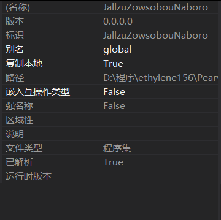
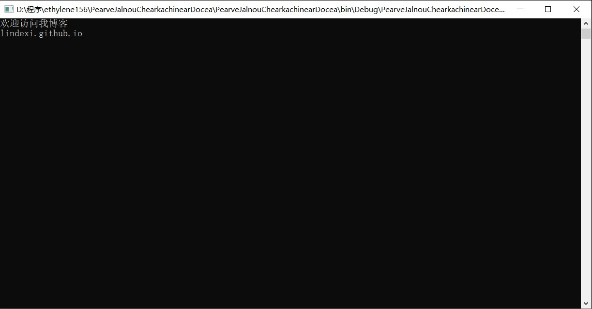

# C# 使用外部别名

本文告诉大家如果遇到两个不同的库有相同的命名空间，相同的类如何使用这两个库。

<!--more-->
<!-- CreateTime:2018/9/30 18:37:23 -->

<div id="toc"></div>

在看过 [C# 很少人知道的科技](https://blog.csdn.net/lindexi_gd/article/details/79617425 )的小伙伴就知道，我告诉了大家一些关键字，都是很少人发现。

在上一篇文章说到 extern 关键字，只是很简单告诉大家用来做区分两个不同 dll 有相同的命名空间和类，可以使用这个关键字。

在遇到了存在两个 dll 都有相同的命名空间，而且有相同的类的时候，如何同时使用这两个 dll 的类。

这里有两个库 JallzuZowsobouNaboro 和 BemzarGasfourouraCunimor 这两个库有相同的类 Foo 只是里面的函数不相同。那么如何才可以使用自己需要的 dll 的函数

```csharp

//BemzarGasfourouraCunimor 库

namespace lindexi
{
    public class Foo
    {
        public void MestatoRoureefirkiKoobere()
        {
            Console.WriteLine("欢迎访问我博客");
        }
    }
}
```

```csharp
// JallzuZowsobouNaboro 库

namespace lindexi
{
    public class Foo
    {
        public void TarlaGeremegar()
        {
            Console.WriteLine("lindexi.github.io");
        }
    }
}
```

这时创建 PearveJalnouChearkachinearDocea 项目引用 BemzarGasfourouraCunimor 和 JallzuZowsobouNaboro 需要调用这两个库的方法

就需要使用 extern 来做

首先右击引用的两个库的属性，可以看到引用的库的别名是 global 这也就是使用 `global::` 可以指定对应的类的原因

<!--  -->


现在需要修改别名为新的，而且不同的字符，这里我把 JallzuZowsobouNaboro 修改为 A ，把 BemzarGasfourouraCunimor 修改为 B ，现在打开 PearveJalnouChearkachinearDocea 的源代码，在调用 JallzuZowsobouNaboro 的库可以使用`extern alias A`来引用

```csharp
extern alias A;
extern alias B;

namespace PearveJalnouChearkachinearDocea
{
    class Program
    {
        static void Main(string[] args)
        {
            new B::lindexi.Foo().MestatoRoureefirkiKoobere();
            new A::lindexi.Foo().TarlaGeremegar();
        }
    }
}
```

现在运行可以输出 

<!--  -->


使用 外部别名 的关键是右击引用的属性，修改别名，把他修改为一个新的字符。

在使用的时候在所有的代码的最前，也就是 `using`的前面使用 `extern alias 别名;`

然后使用对应的类就可以使用 `别名::命名空间.类` ，当然可以使用 `using` 简化，在安装了 Resharper 就会告诉你如何使用`using`，这里我就不告诉大家。

在网上也有告诉大家如何使用命令行的方法设置别名

```csharp
/r:别名1=A.dll
/r:别名2=B.dll
```

请看 [外部别名（C# 参考）](https://docs.microsoft.com/zh-cn/dotnet/csharp/language-reference/keywords/extern-alias )

<a rel="license" href="http://creativecommons.org/licenses/by-nc-sa/4.0/"></a><br />本作品采用<a rel="license" href="http://creativecommons.org/licenses/by-nc-sa/4.0/">知识共享署名-非商业性使用-相同方式共享 4.0 国际许可协议</a>进行许可。欢迎转载、使用、重新发布，但务必保留文章署名[林德熙](http://blog.csdn.net/lindexi_gd)(包含链接:http://blog.csdn.net/lindexi_gd )，不得用于商业目的，基于本文修改后的作品务必以相同的许可发布。如有任何疑问，请与我[联系](mailto:lindexi_gd@163.com)。
