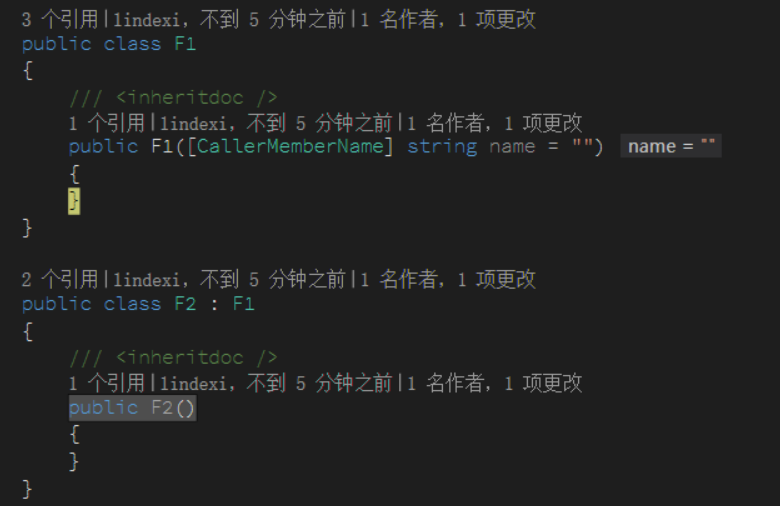

# C# 在 构造函数添加 CallerMemberName 会怎样

在 C# 中有一个特性 CallerMemberName 可以给方法知道调用这个方法的方法名，在 UWP 中用这个特性很多，特别是在使用 MVVM 绑定

<!--more-->
<!-- CreateTime:2019/5/21 11:28:32 -->


如果在构造函数使用这个特性会发生什么？

构造函数可能是方法调用，可能是反射调用，可能是基类使用，这些使用的值是什么？

先定义一个类

```csharp
    public class F1
    {
        /// <inheritdoc />
        public F1([CallerMemberName] string name = "")
        {
            Debug.WriteLine(name);
        }
    }
```

小伙伴都知道，下面的代码会输出 Foo 因为在这个方法调用

```csharp
        public MainWindow()
        {
            InitializeComponent();

            Foo();
        }

        private void Foo()
        {
            new F1();
        }
```

在方法调用的时候，小伙伴都知道 CallerMemberName 能拿到调用的方法，在 .NET 4.5 之后提供的这个特性实在好用，通过这个特性就可以在参数传入调用的方法，同时因为这个特性是在编译时添加的，所以比反射快很多。

但是如果再添加一个类 F2 继承 F1 会出现什么？

```csharp

        public MainWindow()
        {
            InitializeComponent();

            new F2();
        }

    public class F2 : F1
    {
        /// <inheritdoc />
        public F2()
        {
        }
    }
```

现在运行代码，发现这个值居然是空

<!--  -->


但是如果此时修改 F2 函数，这时输出的就是 `.ctor` 因为 CallerMemberName 是编译做的

```csharp
    public class F2 : F1
    {
        /// <inheritdoc />
        public F2() : base()
        {
        }
    }
```

<!--  -->


分析一下两个的 IL 代码就知道，在 `public F2() : base()` 的 IL 代码

```IL
  .method public hidebysig specialname rtspecialname instance void
    .ctor() cil managed
  {
    .maxstack 8

    // [50 23 - 50 29]
    IL_0000: ldarg.0      // this 
    IL_0001: ldstr        ".ctor" // 压入字符串 .ctor 然后调用 F1 的构造函数
    IL_0006: call         instance void lindexi.F1::.ctor(string) 
    // 在这个构造函数传入刚才压的字符串，也就是 F1(".ctor") 在 F1 的 name 就是这里传入的字符串

    IL_000b: nop

    // [51 9 - 51 10]
    IL_000c: nop

    // [52 9 - 52 10]
    IL_000d: ret

  } 
```

在 `public F2()` 的 IL 代码其实几乎没有多少修改

```csharp
  .method public hidebysig specialname rtspecialname instance void
    .ctor() cil managed
  {
    .maxstack 8

    // [50 9 - 50 20]
    IL_0000: ldarg.0      // this
    IL_0001: ldstr        "" // 只有这句和上面不同，传入的是空所以在 F1 收到的值就是这里传入
    IL_0006: call         instance void lindexi.F1::.ctor(string)
    IL_000b: nop

    // [51 9 - 51 10]
    IL_000c: nop

    // [52 9 - 52 10]
    IL_000d: ret

  } 
```

可以看到虽然调用的方法看起来是相同的，但是运行的结果是不相同的，因为 CallerMemberName 是在编译时做的

从上面的 IL 也可以看到 CallerMemberName 是在编译的时候传入的值，性能会比反射快，如果需要获得调用这个方法的方法的方法，也就是 A 调 B 然后 B 调 C 需要在 C 里面知道 A 是哪个，就需要使用 [WPF 判断调用方法堆栈](https://blog.lindexi.com/post/WPF-%E5%88%A4%E6%96%AD%E8%B0%83%E7%94%A8%E6%96%B9%E6%B3%95%E5%A0%86%E6%A0%88.html)

<a rel="license" href="http://creativecommons.org/licenses/by-nc-sa/4.0/"></a><br />本作品采用<a rel="license" href="http://creativecommons.org/licenses/by-nc-sa/4.0/">知识共享署名-非商业性使用-相同方式共享 4.0 国际许可协议</a>进行许可。欢迎转载、使用、重新发布，但务必保留文章署名[林德熙](http://blog.csdn.net/lindexi_gd)(包含链接:http://blog.csdn.net/lindexi_gd )，不得用于商业目的，基于本文修改后的作品务必以相同的许可发布。如有任何疑问，请与我[联系](mailto:lindexi_gd@163.com)。  
