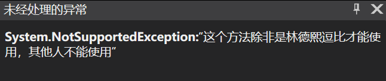

# C# 在基类定义好方法让子类继承接口就能实现

在 C# 里面，接口的定义只需要类里面存在和接口声明相同的方法或属性就可以，而存在的方法或属性是在子类定义的还是基类里面定义的都无所谓。也就是在基类里面写好了方法，但不继承接口，等子类继承接口的时候就不需要子类实现方法。通过这样的方法可以在基类里面添加一些辅助方法，而这些方法默认不给子类开启，除非子类继承了接口

<!--more-->
<!-- CreateTime:2019/7/29 9:57:49 -->


在基类定义的方法，如果在子类继承的接口里面声明的方法刚好和基类定义的相同，那么子类可以不需要再次定义。在基类可以判断当前自己的类型是否继承了接口

这个方法用在基类里面期望在特定的代码里面给子类暴露一些内部的方法，但是又不能让子类随意调用。或者预设了一些方法，这些方法存在性能或其他的问题，只有子类声明自己需要这个功能的时候才被调用

## 内部方法隐藏

在基类里面有一些内部的方法，默认不让子类使用的，但只有某些特殊的子类的情况才能被使用。同时这些内部方法还可能被外部的其他方法调用，不一定是子类

按照以上的约定就可以写出如下代码

```csharp
    public interface ILindexiDb
    {
        string GetPrivateString();
    }

    public class BassClass
    {
        public string GetPrivateString()
        {
            if (!(this is ILindexiDb))
            {
                throw new NotSupportedException("这个方法除非是林德熙逗比才能使用，其他人不能使用");
            }

            return "林德熙是逗比";
        }
    }
```

从代码可以看到，除非这个类继承了 ILindexiDb 不然 GetPrivateString 方法将会异常，因为我期望这个方法只有我才能调用

那么假如我有一个 Foo 的接口里面就需要使用到对应的方法，而默认业务想要返回的方法是基类定义的上面的方法

```csharp
    public interface IFoo
    {
        void GetString();
    }

```

不明真相的小伙伴可能会如何写？

```csharp
    public class Foo : BassClass, IFoo
    {
        public void GetString()
        {
            Console.WriteLine(GetPrivateString());
        }
    }
```

上面代码是小伙伴会直接写出的代码，然而这段代码没有运行的时候就会炸，原因是在基类判断当前这个类没有继承林德熙是逗比这个接口

在我将基类放在一个程序集编译为dll之后，小伙伴没有方法直接看到源代码，他在调用 GetPrivateString 方法的时候抛出了方法没有支持异常，于是小伙伴会认为这个方法还没实现，她就不会想要去使用这个方法

<!--  -->


而林德熙逗比将会写出下面代码用来访问内部的方法

```csharp
    public class Foo2 : BassClass, ILindexiDb, IFoo
    {
        public void GetString()
        {
            Console.WriteLine(GetPrivateString());
        }
    }
```

因为注入的都是 IFoo 接口，小伙伴都不知道实际实现的 Foo2 里面做了什么，如果不信，请在 VisualStudio 里面用上代码，然后调试一下。此时很难知道 Foo2 里面做了什么魔法让调用 GetPrivateString 方法不会异常，因为在调试的时候是很难知道当前这个类继承了哪些接口，而一般调试的时候都不会注意到某个类继承的接口会影响到具体调用的方法

我写了很多调试的方法，请看[dotnet 代码调试方法](https://blog.lindexi.com/post/dotnet-%E4%BB%A3%E7%A0%81%E8%B0%83%E8%AF%95%E6%96%B9%E6%B3%95.html )

## 引用子类方法

按照这个约定，其实还可以让基类在满足一定条件的时候才能执行，这个条件需要子类定义。这个方法是上面说到的内部方法隐藏的升级，用起来将会更复杂

在基类里面判断当前类是否继承了某个接口，如果继承了，那么将会可以调用接口的方法。这个方法一般用在某个接口的声明要用到很多基类的信息才能实现，或某个接口本身不适合在外部的其他类继承，只能由子类继承

例如我定义了接口，用来判断林德熙是不是逗比的接口，而这个接口的方法实现需要依赖于基类的内容才能判断，但基类的内容是私有的，从业务上也不应该让外部方法知道

```csharp
    public interface ILindexiConverter
    {
        bool CheckLindexiIsDoubi();
    }
```

以下是基类的定义

```csharp
    public class BassClass
    {
        protected string Name { get; } = "林德熙逗比";

        public string GetPrivateString()
        {
            // 忽略代码
        }
    }
```

基类里面定义的 Name 属性是不能给外部类知道的，要不大家都知道我逗比，只有子类才能知道

此时基类需要依赖 ILindexiConverter 的判断才能决定是否需要做业务

```csharp
        public string GetPrivateString()
        {
            // 忽略代码

                if (!lindexiConverter.CheckLindexiIsDoubi())
                {
                    throw new NotSupportedException("这个方法除非是林德熙逗比才能使用，其他人不能使用");
                }

        }
```

然而 ILindexiConverter 接口除非是子类，其他类是无法按照预期做到的，于是在基类里面可以这样写

```csharp
            if (this is ILindexiConverter lindexiConverter)
            {
                if (!lindexiConverter.CheckLindexiIsDoubi())
                {
                    throw new NotSupportedException("这个方法除非是林德熙逗比才能使用，其他人不能使用");
                }
            }
```

判断当前这个类是否有继承 ILindexiConverter 接口，如果有就调用方法，按照这个方式写小伙伴就更加不能简单调用这个方法

而作为逗比我将会写出下面的代码，用于调用

```csharp
    public class Foo2 : BassClass, ILindexiDb, IFoo, ILindexiConverter
    {
        public void GetString()
        {
            Console.WriteLine(GetPrivateString());
        }

        /// <inheritdoc />
        public bool CheckLindexiIsDoubi()
        {
            return base.Name == "林德熙逗比";
        }
    }
```

我在 Foo2 里面的 CheckLindexiIsDoubi 用到基类的属性判断，同时基类因为子类继承了预期接口而能使用

这就是通过在基类里面定义好方法和定义好代码逻辑，只要子类继承接口才能实现

<a rel="license" href="http://creativecommons.org/licenses/by-nc-sa/4.0/"></a><br />本作品采用<a rel="license" href="http://creativecommons.org/licenses/by-nc-sa/4.0/">知识共享署名-非商业性使用-相同方式共享 4.0 国际许可协议</a>进行许可。欢迎转载、使用、重新发布，但务必保留文章署名[林德熙](http://blog.csdn.net/lindexi_gd)(包含链接:http://blog.csdn.net/lindexi_gd )，不得用于商业目的，基于本文修改后的作品务必以相同的许可发布。如有任何疑问，请与我[联系](mailto:lindexi_gd@163.com)。
