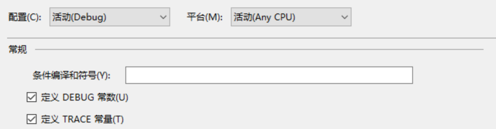

# C# 如何写 DEBUG 输出

本文来告诉大家一个规范，如何去写 DEBUG 的输出。

<!--more-->
<!-- CreateTime:2019/11/29 8:28:35 -->


经常在代码中，需要使用 DEBUG 来输出一些奇怪的东西来进行测试。但是输出的窗口只有一个，如果有一个逗比在不停输出，那么就会让输出窗口看不到自己的内容。

```csharp
                Task.Run(() =>
                {
                    while (true)
                    {
                        Console.WriteLine("我是逗比");
                    }
                });

                Console.WriteLine("有用的信息");
```

于是逗比喜欢自己的测试代码，因为他需要不停看到输出窗口在说自己，但是正常的程序员是只看有用的东西，所以他就会拿出刀子准备杀掉逗比。那么逗比如何防止自己被杀，他这时就告诉程序员，注释掉代码

```csharp
                Task.Run(() =>
                {
                    while (true)
                    {
                        //Console.WriteLine("我是逗比");
                    }
                });

                Console.WriteLine("有用的信息");
```

但是程序员注释了，也没有什么作用，因为逗比在很多个地方写了这样的代码

```csharp
                Task.Run(() =>
                {
                    while (true)
                    {
                        //Console.WriteLine("我是逗比");
                    }
                });

                Console.WriteLine("有用的信息");

                Task.Run(() =>
                {
                    while (true)
                    {
                        Console.WriteLine("我是逗比 1");
                    }
                });
```

终于程序员注释所有的代码，可以运行了，但是逗比拿到程序员的代码，发现没有输出了，这时他又不高兴了，于是逗比去掉了所有的注释，准备在上传代码的时候再把代码注释。但是不小心，有一个地方没有注释了，所以还是被程序员打了。

那么逗比需要如何防止被程序员打？下面我就来告诉一个方法，使用 `#if`

一般在代码会看到这样的写法

```csharp
                Task.Run(() =>
                {
                    while (true)
                    {
#if DEBUG
                        Console.WriteLine("我是逗比");
#endif
                    }
                });
```

但是这样的写法是不对的，因为 DEBUG 只有在所有开发者在测试都需要使用的代码才使用他。如果是自己使用的，一般都自己定义。那么如何定义？需要在文件的开始写下面的代码

```csharp
#define DEBUG_取消注释显示林德熙调试
using System;
using System.Collections.Generic;
using System.Diagnostics;
using System.IO;
using System.Linq;
using System.Runtime.InteropServices;
using System.Text;
using System.Threading;
using System.Threading.Tasks;
using lindexi.framework.mvvm;
using lindexi.controls;
using lindexi.linq;
```

定义的格式是 `DEBUG_取消注释` 后面加上功能

现在的代码就可以修改为

```csharp
                Task.Run(() =>
                {
                    while (true)
                    {
#if DEBUG_取消注释显示林德熙调试
                        Console.WriteLine("我是逗比");
#endif
                    }
                });
```

于是所有的我自己使用的都使用这个方法，只需要注释掉我的定义就可以去掉所有我的代码。这样就不需要一个个去注释，而且一般这句代码在上传代码的时候就去掉。

但是这个方法有个缺点，在他的作用只能在一个文件，如果有多个文件都需要写自己的代码，那么还是需要在多个文件上添加这句话，如果在上传代码的时候不记得把所有的文件进行注释，那么还是会被打。

## 使用 Debug.WriteLine 输出

推荐使用 Debug.WriteLine 而不是使用 Console.WriteLine 输出，在发布的版本里面，使用 Console 输出将会作为控制台输出，这是确实的输出，只是你没有看到而已。

而使用 Debug.WriteLine 将会整个代码在发布的版本都不执行，控制台输出也是需要一定的资源占用，使用 Debug 的输出将不会因为调试信息降低在发布版本的性能

在使用 Debug.WriteLine 的时候记得在你的调试下开启 `DEBUG` 宏

<!--  -->


## 过滤输出

在 VisualStudio 里面，我的团队争夺最多的是输出窗口内容，我会发现我的输出窗口不断在输出我不关注的内容，于是我找到了 [VisualStudio 过滤输出窗口文本](https://blog.lindexi.com/post/VisualStudio-%E8%BF%87%E6%BB%A4%E8%BE%93%E5%87%BA%E7%AA%97%E5%8F%A3%E6%96%87%E6%9C%AC.html ) 这个插件，通过过滤关键字看到我需要关注的内容

我给小伙伴建议在自己的输出里面带上自己的名字

```csharp
Debug.WriteLine("[lindexi] 我是逗比");
```

在输出窗口通过过滤输出字符串包含 `[lindexi]` 才输出

现在在团队里面我会创建一些调试使用的静态类

```csharp
public static class LindexiDebug
{

}
```

在我使用上面这个类输出的时候，将会默认带上 `lindexi` 的前缀，可以使用 [VisualStudio 过滤输出窗口文本](https://blog.lindexi.com/post/VisualStudio-%E8%BF%87%E6%BB%A4%E8%BE%93%E5%87%BA%E7%AA%97%E5%8F%A3%E6%96%87%E6%9C%AC.html) 的方法过滤输出内容，这样就可以只看到自己需要看到的内容

如果大家有好的方法，请告诉我。

<a rel="license" href="http://creativecommons.org/licenses/by-nc-sa/4.0/"></a><br />本作品采用<a rel="license" href="http://creativecommons.org/licenses/by-nc-sa/4.0/">知识共享署名-非商业性使用-相同方式共享 4.0 国际许可协议</a>进行许可。欢迎转载、使用、重新发布，但务必保留文章署名[林德熙](http://blog.csdn.net/lindexi_gd)(包含链接:http://blog.csdn.net/lindexi_gd )，不得用于商业目的，基于本文修改后的作品务必以相同的许可发布。如有任何疑问，请与我[联系](mailto:lindexi_gd@163.com)。 
