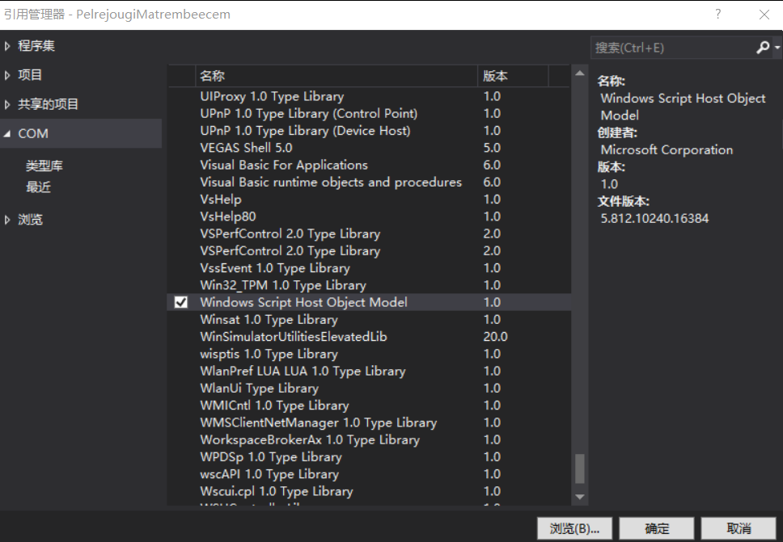

# C# 如何引用 WshShell 类

如果想要创建快捷方式等，很多使用都需要引用 WshShell 类，这个类需要通过 COM 的方法引用

<!--more-->
<!-- CreateTime:2019/8/31 16:55:58 -->

引用 WshShell 不是在一个程序集，而是 Windows Script Host Object Model 一个 COM 组件，通过下面步骤可以引用

创建一个控制台项目，右击引用，添加 COM 请看下图

<!--  -->

添加命名空间 `using IWshRuntimeLibrary;` 就可以使用了

参见 [使用 C# 代码创建快捷方式文件 - walterlv](https://blog.walterlv.com/post/create-shortcut-file-using-csharp.html )

[Windows Script Host: Scripting; Management Services](https://docs.microsoft.com/en-us/previous-versions/windows/it-pro/windows-server-2003/cc784547(v%3dws.10) )

 本作品采用<a rel="license" href="http://creativecommons.org/licenses/by-nc-sa/4.0/">知识共享署名-非商业性使用-相同方式共享 4.0 国际许可协议</a>进行许可。欢迎转载、使用、重新发布，但务必保留文章署名[林德熙](http://blog.csdn.net/lindexi_gd)(包含链接:http://blog.csdn.net/lindexi_gd )，不得用于商业目的，基于本文修改后的作品务必以相同的许可发布。如有任何疑问，请与我[联系](mailto:lindexi_gd@163.com)。
