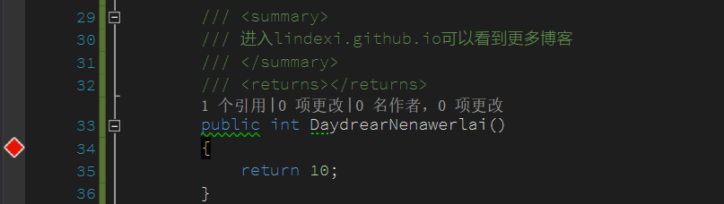

# C# 循环的判断会进来几次

最近有小伙伴告诉我，在循环的判断条件只会计算一次，本金鱼不相信，于是就做了测试，本文记录我做的测试。

<!--more-->
<!-- CreateTime:2019/8/31 16:55:58 -->


先来写一个简单的代码， 就一个循环，循环的判断是从一个函数获取值

```csharp
   class Program
    {
        static void Main(string[] args)
        {
            var meepeMorcear = new MeepeMorcear();
            meepeMorcear.BirmeruLerrayjairbay();
        }
    }

    class MeepeMorcear
    {
        public void BirmeruLerrayjairbay()
        {
            for (int i = 0; i < DaydrearNenawerlai(); i++)
            {
                Console.WriteLine("第" +i.ToString()+"个逗比");
            }
        }

        public int DaydrearNenawerlai()
        {
            Console.WriteLine("进入");
            return 10;
        }
    }
```

通过 Main 调用 BirmeruLerrayjairbay ，这个函数里面的 for 判断是 DaydrearNenawerlai 拿到一个值，我尝试在 release 运行，结果每个判断都需要进入 DaydrearNenawerlai 函数，请看输出

```csharp
进入
第0个逗比
进入
第1个逗比
进入
第2个逗比
进入
第3个逗比
进入
第4个逗比
进入
第5个逗比
进入
第6个逗比
进入
第7个逗比
进入
第8个逗比
进入
第9个逗比
```
也就是在 Debug 或 Release 下，for 里面的判断都是需要执行，所以在 for 里的判断如果写了很长的计算，那么就会在每次循环都需要重新计算。即使每次计算出来的值都是一样，也需要重新计算。

所以这样看起来性能不如这样写，使用一个临时的变量获取判断的值

```csharp
        public void BirmeruLerrayjairbay()
        {
            var mowraiTepalor = DaydrearNenawerlai();
            for (int i = 0; i < mowraiTepalor; i++)
            {
                Console.WriteLine("第" +i.ToString()+"个逗比");
            }
        }
```

但是很快，另一个小伙伴告诉我，你把输出去掉，然后使用断点，你再看看

<!--  -->


我添加了断点，在断点输出 123 然后运行

<!--  -->


这时我发现运行没有输出 123 也就是函数没有进来，我再次添加断点，跟着函数也没有访问


所以这时的 DaydrearNenawerlai 函数就被优化掉了

我和一个小伙伴说了这个问题，他说是被 IL 优化了，我一点不相信，所以我就去看 IL 代码

从下面的代码

```csharp
        public void BirmeruLerrayjairbay()
        {
            for (int i = 0; i < DaydrearNenawerlai(); i++)
            {
                Console.WriteLine("第" +i.ToString()+"个逗比");
            }
        }

        /// <summary>
        /// 进入lindexi.github.io可以看到更多博客
        /// </summary>
        /// <returns></returns>
        public static int DaydrearNenawerlai()
        {
            return 10;
        }
```

转 IL 可以看到下面代码，我会在 IL 添加很多注释，所以很容易看懂。

```IL
  .method public hidebysig instance void 
    BirmeruLerrayjairbay() cil managed 
  {
    .maxstack 3
    .locals init (
      [0] int32 i
    )
    
    // 第 23 行 18 个字符到 27 个字符
    // [23 18 - 23 27]
    IL_0000: ldc.i4.0  
    // 定义 i ，代码的 int i = 0;   
    IL_0001: stloc.0      // i

    IL_0002: br.s         IL_0023
    //  这里就是进入循环 for ，在 IL 不管 for 还是 while 都是差不多
    // start of loop, entry point: IL_0023

      // [25 17 - 25 60]
      // 下面这个代码就是 Console.WriteLine("第" +i.ToString()+"个逗比"); 从代码可以看到
      // 需要先申请"第"
      IL_0004: ldstr        "第"
      // 然后把 i 放入栈
      IL_0009: ldloca.s     i
      // 调用 int.ToString ，使用的是实例的方法
      IL_000b: call         instance string [mscorlib]System.Int32::ToString()
      // 把"个逗比"放入栈
      IL_0010: ldstr        "个逗比"
      // 调用字符串组合方法，组合三个字符串，返回一个字符串。
      // 把刚才入栈三个字符串出栈，返回的字符串入栈
      IL_0015: call         string [mscorlib]System.String::Concat(string, string, string)
      // 调用 Console.WriteLine ，从栈拿到一个字符串输出
      IL_001a: call         void [mscorlib]System.Console::WriteLine(string)

      // 下面是 i++ 代码
      // [23 55 - 23 58]
      // 将指定索引处的局部变量加载到计算堆栈上，这里的索引是 0 ，在代码的变量是 i 所以把 i 加载到计算堆栈
      IL_001f: ldloc.0      // i
      // 将整数值 1 作为 int32 推送到计算堆栈上
      IL_0020: ldc.i4.1     
      // 从堆栈出栈两个数值进行相加，返回的值放在栈
      IL_0021: add          
      // 从计算堆栈的顶部弹出当前值并将其存储到指定索引处的局部变量列表中，这里索引是 0 ，在代码的变量是 i ，所以 i = i + 1 的代码就是这样做
      IL_0022: stloc.0      // i
 
      // 从堆栈加载 i ，把 i 入栈
      // [23 29 - 23 53]
      IL_0023: ldloc.0      // i
      // 调用方法 DaydrearNenawerlai 拿到返回值
      IL_0024: call         int32 MuhoubearWhedoofi.MeepeMorcear::DaydrearNenawerlai()
      // 如果第一个值小于第二个值，则将控制转移到目标指令，这里的第一个值就是 i ，第二个值就是 DaydrearNenawerlai 的返回值。跳转到标签 IL_0004 ，如果没有小于，就继续代码。
      IL_0029: blt.s        IL_0004
    // end of loop

    // [27 9 - 27 10]
    IL_002b: ret          

  } // end of method MeepeMorcear::BirmeruLerrayjairbay

  .method public hidebysig static int32 
    DaydrearNenawerlai() cil managed 
  {
    .maxstack 8

    // 把一个值 放入堆栈，放入的是 10 ，然后从栈拿到值返回
    // [36 13 - 36 23]
    IL_0000: ldc.i4.s     10 // 0x0a
    IL_0002: ret          

  } // end of method MeepeMorcear::DaydrearNenawerlai
```

从上面代码可以发现，实际 DaydrearNenawerlai 没有被优化掉，还是有这个方法。

参见：[.net IL 指令速查 - 飞鸟123 - 博客园](https://www.cnblogs.com/flyingbirds123/archive/2011/01/29/1947626.html )


<a rel="license" href="http://creativecommons.org/licenses/by-nc-sa/4.0/"></a><br />本作品采用<a rel="license" href="http://creativecommons.org/licenses/by-nc-sa/4.0/">知识共享署名-非商业性使用-相同方式共享 4.0 国际许可协议</a>进行许可。欢迎转载、使用、重新发布，但务必保留文章署名[林德熙](http://blog.csdn.net/lindexi_gd)(包含链接:http://blog.csdn.net/lindexi_gd )，不得用于商业目的，基于本文修改后的作品务必以相同的许可发布。如有任何疑问，请与我[联系](mailto:lindexi_gd@163.com)。
