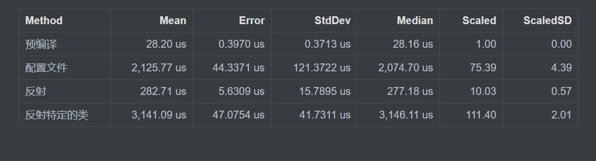
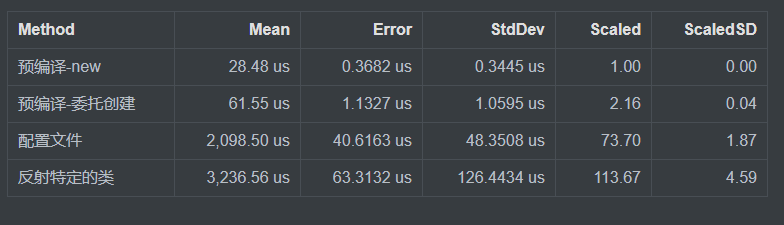

# C# 性能分析 反射 VS 配置文件 VS 预编译

本文分析在 C# 中使用反射和配置文件和预编译做注入的性能，本文的数据是为[预编译框架，开发高性能应用 - 课程 - 微软技术暨生态大会 2018 - walterlv](https://walterlv.com/post/dotnet-build-and-roslyn-course-in-tech-summit-2018.html )提供

<!--more-->
<!-- CreateTime:2019/11/29 10:13:17 -->

<!-- 标签：C#，性能测试 -->

本文通过代码生成工具，使用[C# 标准性能测试](https://blog.lindexi.com/post/C-%E6%A0%87%E5%87%86%E6%80%A7%E8%83%BD%E6%B5%8B%E8%AF%95.html )拿到三个不同的方法的性能

先来介绍一个程序的构成，这个程序里面有 1000 个类，这些类表示需要注入的类，每个类的代码大概都是这样

```csharp
namespace LecuryouWuruhempa
{
    [CelkaturjairQelofe]
    class 类名
    {
        public string Foo { get; set; }
    }
}
```

所有的类只有类名不相同，注入类的方法本文使用三个不同的方法，第一个就是预编译的方法。这里的预编译的方法就是在编译的时候，通过 Roslyn 拿到程序集里的所有类，和正常写代码一样，写出所有的类的创建和注入。

测试的类里通过一个 `List<object>` 作为注入的输入，也就是通过任意的方式将对应的类创建出来，放进这个列表就是注入完成。

使用预编译的方法就像直接在代码里写 `new Foo()` 一样

而通过配置文件的方法实际也是反射的方法，只是少了反射整个程序集找到对应的类的过程

通过读取配置文件拿到了程序集需要注入的所有类的类名，然后通过反射的方法拿到对应的 Type 再通过 Type 拿到构造函数，创建对象加入列表。本文为了防止因为读取配置文件让时间都在磁盘就直接写出了程序集的所有类

而反射的方法是反射程序集，通过判断类的 Attitude 也就是上面代码的 `CelkaturjairQelofe` 特性，如果一个类有这个特性，那么这个类就是需要注入的类，通过反射创建加入列表。

反射的代码都很简单，先看一下测试的数据

<!--  -->


| Method |        Mean |      Error |      StdDev |      Median | Scaled | ScaledSD |
|------- |------------:|-----------:|------------:|------------:|-------:|---------:|
|    预编译 |    28.20 us |  0.3970 us |   0.3713 us |    28.16 us |   1.00 |     0.00 |
|   配置文件 | 2,125.77 us | 44.3371 us | 121.3722 us | 2,074.70 us |  75.39 |     4.39 |
| 反射特定的类 | 3,141.09 us | 47.0754 us |  41.7311 us | 3,146.11 us | 111.40 |     2.01 |

预编译如果使用委托创建，测试数据会比直接 new 的慢很多

<!--  -->


| Method          |        Mean |      Error |      StdDev | Scaled | ScaledSD |
| --------------- | ----------: | ---------: | ----------: | -----: | -------: |
| 预编译-new      |    28.48 us |  0.3682 us |   0.3445 us |   1.00 |     0.00 |
| 预编译-委托创建 |    61.55 us |  1.1327 us |   1.0595 us |   2.16 |     0.04 |
| 配置文件        | 2,098.50 us | 40.6163 us |  48.3508 us |  73.70 |     1.87 |
| 反射特定的类    | 3,236.56 us | 63.3132 us | 126.4434 us | 113.67 |     4.59 |

我通过设置了基线是预编译，可以看到通过配置文件创建的方式比预编译慢 75 倍，而通过反射特定的类是慢 100 多倍

其他测试请看 [C# 直接创建多个类和使用反射创建类的性能](https://lindexi.oschina.io/lindexi/post/C-%E7%9B%B4%E6%8E%A5%E5%88%9B%E5%BB%BA%E5%A4%9A%E4%B8%AA%E7%B1%BB%E5%92%8C%E4%BD%BF%E7%94%A8%E5%8F%8D%E5%B0%84%E5%88%9B%E5%BB%BA%E7%B1%BB%E7%9A%84%E6%80%A7%E8%83%BD.html )

[C# 程序内的类数量对程序启动的影响](https://lindexi.oschina.io/lindexi/post/C-%E7%A8%8B%E5%BA%8F%E5%86%85%E7%9A%84%E7%B1%BB%E6%95%B0%E9%87%8F%E5%AF%B9%E7%A8%8B%E5%BA%8F%E5%90%AF%E5%8A%A8%E7%9A%84%E5%BD%B1%E5%93%8D.html )

整个测试的工程我打包放在下面，这个工程的创建代码很简单，我也直接放在下面

测试的工程 [C# 性能分析 反射 VS 配置文件 VS 预编译-CSDN下载](https://download.csdn.net/download/lindexi_gd/10722444 )

如果觉得我的数据很诡异，那么请自己运行一下

创建工程的代码不包括创建测试的工程的框架，测试项目的框架很简单，只需要创建一个空白的控制台项目，在这个控制台项目安装 BenchmarkDotNet 打开 Program 添加下面代码

```csharp
using BenchmarkDotNet.Running;

    public class Program
    {
        static void Main(string[] args)
        {
            BenchmarkRunner.Run<SawstoJouweaxo>();

        }
    }
```

通过运行 ReecelnaxeaDrasilouhalLaigeci 方法就可以在运行的文件夹找到创建的文件夹，将这个文件夹复制到测试的工程就可以



```csharp
        private static void ReecelnaxeaDrasilouhalLaigeci()
        {
            var terebawbemTitirear = new WhairchooHerdo();

            List<string> direhelXideNa = new List<string>();

            var jisqeCorenerairTurpalhee = new DirectoryInfo("MerelihikeLouseafoopu");

            jisqeCorenerairTurpalhee.Create();

            for (int i = 0; i < 1000; i++)
            {
                var pereviCirsir = terebawbemTitirear.LemgeDowbovou();

                direhelXideNa.Add(pereviCirsir);

                var nemhaSibemnoosa = $@"
using System;
using System.Collections.Generic;
using System.Text;

namespace LecuryouWuruhempa
{{
    [CelkaturjairQelofe]
    class {pereviCirsir}
    {{
        public string Foo {{ get; set; }}
    }}
}}";


                File.WriteAllText(Path.Combine(jisqeCorenerairTurpalhee.FullName, pereviCirsir + ".cs"), nemhaSibemnoosa);
            }

            var celkaturjairQelofeAttribute = @"using System;

namespace LecuryouWuruhempa
{
    class CelkaturjairQelofeAttribute : Attribute
    {

    }
}";
            File.WriteAllText(Path.Combine(jisqeCorenerairTurpalhee.FullName, "CelkaturjairQelofeAttribute.cs"), celkaturjairQelofeAttribute);


            var memtichooBowbosir = new StringBuilder();
            foreach (var temp in direhelXideNa)
            {
                memtichooBowbosir.Append($"            _jooyiSouse.Add(new {temp}());\r\n");
            }

            var sowastowVaiyoujall = $@"
        [Benchmark(Baseline = true, Description = ""预编译"")]
        public void WeejujeGaljouPemhu()
        {{
            _jooyiSouse.Clear();

{memtichooBowbosir.ToString()}
        }}
";

            memtichooBowbosir.Clear();
            memtichooBowbosir.Append($@"             List<string> jeesareMewheehowBistawHorbatall = new List<string>()
            {{
                ");
           

            foreach (var temp in direhelXideNa)
            {
                memtichooBowbosir.Append($"\"{temp}\", ");
                memtichooBowbosir.Append("\r\n");
            }

            memtichooBowbosir.Append("            };");
            

            var sifurDassalcha = $@"
        [Benchmark(Description = ""配置文件"")]
        public void KonejoDewee()
        {{
            Type cajeceKisorkeBairdi;

            ConstructorInfo wimoDasrugowfo;
            object relrorlelJosurpo;
            _jooyiSouse.Clear();

{memtichooBowbosir.ToString()}

            foreach (var temp in jeesareMewheehowBistawHorbatall)
            {{
                cajeceKisorkeBairdi = Type.GetType(""LecuryouWuruhempa."" + temp);
                wimoDasrugowfo = cajeceKisorkeBairdi.GetConstructor(Type.EmptyTypes);
                relrorlelJosurpo = wimoDasrugowfo.Invoke(null);
                _jooyiSouse.Add(relrorlelJosurpo);
 
            }}

        }}";

            var stoomairHem = @"
        [Benchmark(Description = ""反射"")]
        public void TirjeTuxemsowwherLaralJunoo()
        {
            _jooyiSouse.Clear();

            var bermartaPallnirhi = Assembly.GetExecutingAssembly();

            foreach (var temp in bermartaPallnirhi.GetTypes())
            {
                var wimoDasrugowfo = temp.GetConstructor(Type.EmptyTypes);
                var relrorlelJosurpo = wimoDasrugowfo.Invoke(null);
                _jooyiSouse.Add(relrorlelJosurpo);
            }
        }";

            stoomairHem = "";

            memtichooBowbosir.Clear();

            memtichooBowbosir.Append(@"            List<Func<object>> lairchurBirchalrotro = new List<Func<object>>()
            {
");

            foreach (var temp in direhelXideNa)
            {
                memtichooBowbosir.Append($"                () => new {temp}(),");
                memtichooBowbosir.Append("\r\n");
            }

            memtichooBowbosir.Append("            };");

            stoomairHem = $@"
         [Benchmark(Description = ""委托创建"")]
         public void LemjobesuDijisleci()
        {{

            _jooyiSouse.Clear();

{memtichooBowbosir.ToString()}

             foreach (var temp in lairchurBirchalrotro)
            {{
                _jooyiSouse.Add(temp());
            }}
        }}";


            var drairdreBibearnou = @"
        [Benchmark(Description = ""反射特定的类"")]
        public void SasesoJirkoukistiCowqu()
        {
            _jooyiSouse.Clear();

            var bermartaPallnirhi = Assembly.GetExecutingAssembly();

            foreach (var temp in bermartaPallnirhi.GetTypes().Where(temp=> temp.GetCustomAttribute<CelkaturjairQelofeAttribute>() != null))
            {
                var wimoDasrugowfo = temp.GetConstructor(Type.EmptyTypes);
                var relrorlelJosurpo = wimoDasrugowfo.Invoke(null);
                _jooyiSouse.Add(relrorlelJosurpo);
            }
        }";


            var whelvejawTinaw = $@"using System;
using System.Collections.Generic;
using System.Linq;
using System.Text;
using System.Runtime.CompilerServices;
using System.Reflection;
using System.Threading.Tasks;
using BenchmarkDotNet.Attributes;

namespace LecuryouWuruhempa
{{
    public class SawstoJouweaxo
    {{

{sowastowVaiyoujall}

{sifurDassalcha}

{stoomairHem}

{drairdreBibearnou}

        private List<object> _jooyiSouse = new List<object>();

    }}
}}";

            File.WriteAllText(Path.Combine(jisqeCorenerairTurpalhee.FullName, "SawstoJouweaxo.cs"), whelvejawTinaw);
        }

```



<a rel="license" href="http://creativecommons.org/licenses/by-nc-sa/4.0/"></a><br />本作品采用<a rel="license" href="http://creativecommons.org/licenses/by-nc-sa/4.0/">知识共享署名-非商业性使用-相同方式共享 4.0 国际许可协议</a>进行许可。欢迎转载、使用、重新发布，但务必保留文章署名[林德熙](http://blog.csdn.net/lindexi_gd)(包含链接:http://blog.csdn.net/lindexi_gd )，不得用于商业目的，基于本文修改后的作品务必以相同的许可发布。如有任何疑问，请与我[联系](mailto:lindexi_gd@163.com)。
