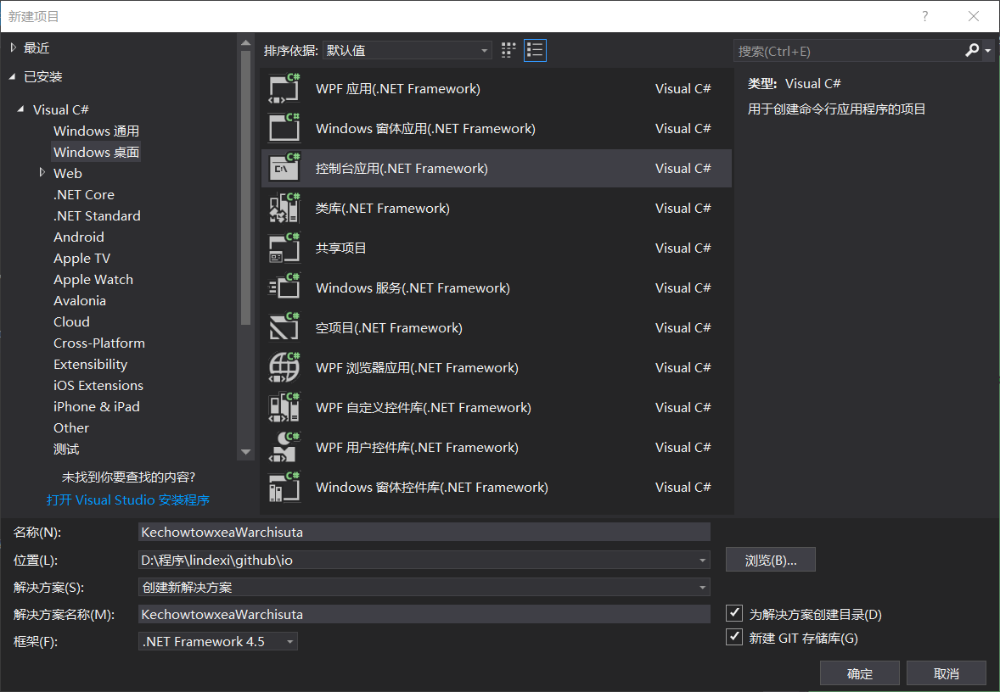

# C# 从零开始写 SharpDx 应用 控制台创建 Sharpdx 窗口

本文告诉大家如何在控制台使用 SharpDx 创建窗口，这是一个底层的博客，我会用很多博客告诉大家如何从控制台创建一个高性能渲染程序

<!--more-->
<!-- CreateTime:2018/8/17 9:03:36 -->

<div id="toc"></div>
<!-- 标签：C#,D2D,DirectX,SharpDX,Direct2D,渲染 -->

如果想看更多关于底层渲染的博客，请点击[渲染系列](https://lindexi.github.io/lindexi/post/D2D.html )

首先创建一个控制台程序，选择 dotnet framework 为 4.5 这样就可以保证下面安装的库可以使用

<!--  -->


## 下载

最好是使用 VisualStudio 2017项目格式，这样就可以直接复制下面代码放在自己的项目文件，就可以快速使用 Nuget 安装而不是需要等待 VisualStudio 的安装

```xml
<Project Sdk="Microsoft.NET.Sdk">
  <PropertyGroup>
    <OutputType>Exe</OutputType>
    <TargetFramework>net45</TargetFramework>
  </PropertyGroup>
  <ItemGroup>
    <PackageReference Include="SharpDX" Version="4.1.0" />
    <PackageReference Include="SharpDX.D3DCompiler" Version="4.1.0" />
    <PackageReference Include="SharpDX.Desktop" Version="3.1.1" />
    <PackageReference Include="SharpDX.Direct2D1" Version="4.1.0" />
    <PackageReference Include="SharpDX.Direct3D11" Version="4.1.0" />
    <PackageReference Include="SharpDX.DXGI" Version="4.1.0" />
  </ItemGroup>
  <ItemGroup>
    <Folder Include="Properties\" />
  </ItemGroup>
</Project>
```

如果使用的不是 VisualStudio 2017 的就通过 Nuget 安装下面几个库


- SharpDX
- SharpDX.D3DCompiler
- SharpDX.Desktop
- SharpDX.Direct2D1
- SharpDX.Direct3D11
- SharpDX.DXGI

## 创建窗口

首先创建一个简单的类，这个类主要使用 RenderForm 来创建窗口

```csharp
   class KikuSimairme 
    {
        private RenderForm _renderForm;

        private const int Width = 1280;
        private const int Height = 720;

       
    }
```

这个类的主要就是 RenderForm ，在使用的时候需要引用

```csharp
using SharpDX.Windows;

```

现在还没有创建好窗口，需要在构造函数使用这个代码

```csharp
        public KikuSimairme()
        {
            _renderForm = new RenderForm();
            _renderForm.ClientSize = new Size(Width, Height);
        }
```

如果是在 WPF 创建一个窗口，除了创建还需要显示，下面来告诉大家如何显示窗口

在`KikuSimairme`添加两个方法

```csharp
        public void Run()
        {
            RenderLoop.Run(_renderForm, RenderCallback);
        }

        private void RenderCallback()
        {

        }
```

这样就可以在调用 Run 显示窗口，因为创建窗口需要开启循环，使用 `RenderLoop.Run` 就可以

在不使用这个窗口时需要记得去掉

```csharp
    class KikuSimairme : IDisposable
    {
    	// 其他代码
    	public void Dispose()
        {
            _renderForm?.Dispose();
        }
    }
```

在 Main 函数创建类，然后显示窗口

```csharp
        static void Main(string[] args)
        {
            using (var temp = new KikuSimairme())
            {
                temp.Run();
            }
        }
```

现在按下运行就可以看到显示了一个窗口

虽然里面还没什么东西，但是已经可以显示窗口，在窗口里面也就可以进行画东西。以前很少在一个控制台创建窗口，现在使用 sharpDx 可以很简单在控制台创建窗口

这是`KikuSimairme`类的全部代码

```csharp
    class KikuSimairme : IDisposable
    {
        /// <inheritdoc />
        public KikuSimairme()
        {
            _renderForm = new RenderForm();
            _renderForm.ClientSize = new Size(Width, Height);
        }

        private const int Width = 1280;

        private const int Height = 720;

        public void Run()
        {
            RenderLoop.Run(_renderForm, RenderCallback);
        }

        private RenderForm _renderForm;

        private void RenderCallback()
        {
        }

        /// <inheritdoc />
        public void Dispose()
        {
            _renderForm?.Dispose();
        }
    }

```

虽然已经创建窗口，但是现在还没有内容，在下一篇[C# 从零开始写 SharpDx 应用 初始化dx修改颜色](https://lindexi.oschina.io/lindexi/post/C-%E4%BB%8E%E9%9B%B6%E5%BC%80%E5%A7%8B%E5%86%99-SharpDx-%E5%BA%94%E7%94%A8-%E5%88%9D%E5%A7%8B%E5%8C%96dx%E4%BF%AE%E6%94%B9%E9%A2%9C%E8%89%B2.html )，我将会告诉大家如何在这个窗口修改颜色。更多SharpDx博客请到[SharpDX 系列](https://lindexi.github.io/lindexi/post/sharpdx.html )

参见：[SharpDX Beginners Tutorial Part 1: Setting up a SharpDX project in Visual Studio 2013 - Johan Falk](http://www.johanfalk.eu/blog/sharpdx-tutorial-part-1-setting-up-a-sharpdx-project-in-visual-studio-2013 )

下一篇 [C# 从零开始写 SharpDx 应用 初始化dx修改颜色](https://lindexi.oschina.io/lindexi/post/C-%E4%BB%8E%E9%9B%B6%E5%BC%80%E5%A7%8B%E5%86%99-SharpDx-%E5%BA%94%E7%94%A8-%E5%88%9D%E5%A7%8B%E5%8C%96dx%E4%BF%AE%E6%94%B9%E9%A2%9C%E8%89%B2.html )

<a rel="license" href="http://creativecommons.org/licenses/by-nc-sa/4.0/"></a><br />本作品采用<a rel="license" href="http://creativecommons.org/licenses/by-nc-sa/4.0/">知识共享署名-非商业性使用-相同方式共享 4.0 国际许可协议</a>进行许可。欢迎转载、使用、重新发布，但务必保留文章署名[林德熙](http://blog.csdn.net/lindexi_gd)(包含链接:http://blog.csdn.net/lindexi_gd )，不得用于商业目的，基于本文修改后的作品务必以相同的许可发布。如有任何疑问，请与我[联系](mailto:lindexi_gd@163.com)。
