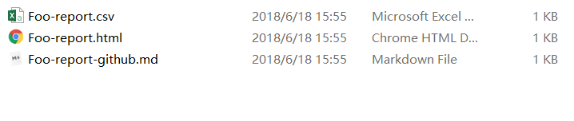
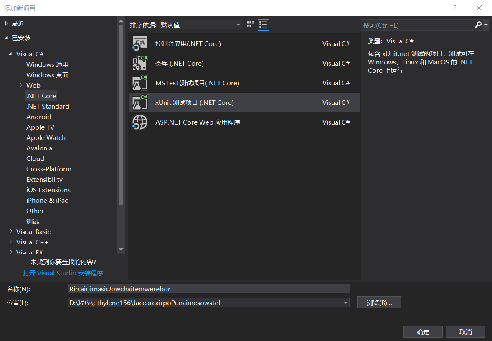
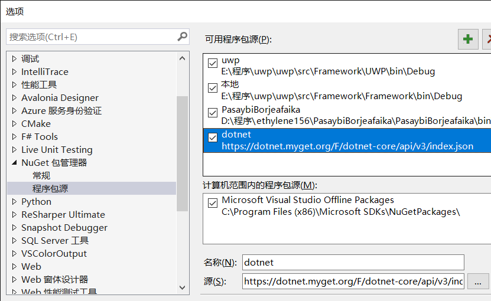
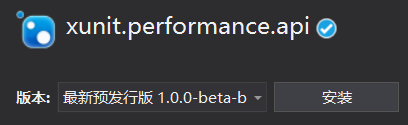

# C# 标准性能测试

经常我写一个类，作为一个工具类，小伙伴会问我这个类的性能，这时我就需要一个标准的工具进行测试。

本文告诉大家如何使用 benchmarkdotnet 做测试。

<!--more-->
<!-- CreateTime:2019/6/11 8:36:22 -->


现在在 github 提交代码，如果有小伙伴想要知道某个函数的性能，就会用 [BenchmarkDotNet](https://benchmarkdotnet.org/Guides/ChoosingRunStrategy.htm ) 进行测试。

例如我有一个函数 StooTer ，我定义这个函数的性能是非常高，我需要告诉大家在什么的设备运行，但是因为每个人的写法不一样，所以就比较难看。而且谁也不知道你是如何测试，也许使用 StopWatch 或 DateTime 来测试。

但是在 github 经常可以看到下面的测试

``` 

BenchmarkDotNet=v0.10.14, OS=Windows 10.0.17134
Intel Core i7-6700 CPU 3.40GHz (Skylake), 1 CPU, 8 logical and 4 physical cores
.NET Core SDK=2.1.201
  [Host]     : .NET Core 2.0.7 (CoreCLR 4.6.26328.01, CoreFX 4.6.26403.03), 64bit RyuJIT  [AttachedDebugger]
  DefaultJob : .NET Core 2.0.7 (CoreCLR 4.6.26328.01, CoreFX 4.6.26403.03), 64bit RyuJIT


```

|  Method |     Mean |    Error |   StdDev |
|-------- |---------:|---------:|---------:|
| StooTer | 384.6 ns | 7.687 ns | 9.721 ns |

这就是使用工具 [BenchmarkDotNet](https://benchmarkdotnet.org/Guides/ChoosingRunStrategy.htm ) 进行测试。

下面让我告诉大家如何入门 BenchmarkDotNet 进行测试。

首先通过 Nuget 安装 BenchmarkDotNet ，推荐使用命令行安装的方法，因为VisualStudio的速度太慢

```csharp
Install-Package BenchmarkDotNet
```

先来写一个被测试的函数

```csharp
    public class Foo
    {
        [Benchmark]
        public void StooTer()
        {
            var seenoserBojemchay = new Foo[1000];
            var sowrornarLeedeLeetall = new Span<Foo>(seenoserBojemchay, 10, 100);
            foreach (var temp in sowrornarLeedeLeetall)
            {
                
            }
        }
    }
```

在被测试的函数上面加上特性 `Benchmark` ，注意引用`using BenchmarkDotNet.Attributes`才可以这样写

函数用了 Span ，请看[C# Span 入门](https://lindexi.oschina.io/lindexi/post/C-Span-%E5%85%A5%E9%97%A8.html )

现在可以在 Main 函数使用下面代码进行测试

```csharp
            var boKar = BenchmarkRunner.Run<Foo>();
```

注意需要引用`using BenchmarkDotNet.Running`，并且在 Release 运行

运行的时候就可以看到显示很多测试，而且从输入的文件夹还可以找到这样的文件，这个文件放在 `$(bin)Release\$(TargetFramework)\BenchmarkDotNet.Artifacts\` 文件夹，直接打开就可以找到

<!--  -->


这时看到的就是标准的测试，可以把这个测试告诉小伙伴


那么这个 benchmark 输出表格是什么意思，例如测试了 Csdn 方法，这时的输出表格请看下面


|  Method |     Mean |    Error |   StdDev |
|-------- |---------:|---------:|---------:|
| Csdn | 384.6 ns | 7.687 ns | 9.721 ns |

在使用 benchmark dotnet 的时候，输出的表格的含义包括了

 - Mean 的意思是 Arithmetic mean of all measurements 所有测量的算术平均值

 - Error 的意思是 Half of 99.9% confidence interval 99.9% 一半的置信度区间

 - StdDev 是所有测量的标准偏差

在测试过程包括

Pilot： 决定运行几次。

IdleWarmup， IdleTarget：评估BenchmarkDotNet这个工具带来的额外开销。

MainWarmup：测试热身。

MainTarget：测试。

Result：测试结果减去BenchmarkDotNet带来的额外开销。

除了方法可以测试，静态方法也可以测试，使用方法和上面一样

```csharp
    public class Foo
    {
        [Benchmark]
        public static void StooTer()
        {
            var seenoserBojemchay = new Foo[1000];
            var sowrornarLeedeLeetall = new Span<Foo>(seenoserBojemchay, 10, 100);
            foreach (var temp in sowrornarLeedeLeetall)
            {
                
            }
        }
    }
```

## 无法运行原因

如果在运行出现下面输出，那么请检查是否在 Release 运行，右击项目属性看是否开启优化代码

```
Validating benchmarks:
Assembly MerRear which defines benchmarks is non-optimized
Benchmark was built without optimization enabled (most probably a DEBUG configuration). Please, build it in RELEASE
```

## 单元测试

我写了一个有趣的代码，我需要在单元测试知道这个方法的性能

```csharp

    public class RijutorserMikede
    {
        public void CuserXewafeze()
        {
            Console.WriteLine("德熙逗比");
        }
    }
```

这时我右击解决方案新建了一个项目，注意新建的是 XUnit 项目

<!--  -->


在控制台输入下面的命令安装 xunit.performance.api 

```csharp
Install-Package xunit.performance.api -Version 1.0.0-beta-build0019 -Source https://dotnet.myget.org/F/dotnet-core/api/v3/index.json
```

如果找不到nuget控制台，那么设置 Nuget 添加源 https://dotnet.myget.org/F/dotnet-core/api/v3/index.json

<!--  -->


搜索 xunit  performance 然后安装，如果搜索不到，点击程序包源，选择全部

<!--  -->


安装 Microsoft.Diagnostics.Tracing.TraceEvent 在 Nuget.org 就可以找到

创建一个默认的单元测试方法

```csharp
    public class JeltrooWezair
    {
        [Fact]
        public void RojallCalja()
        {

        }
    }
```

这时需要把 `Fact` 修改为 `Benchmark` ，然后在函数里写代码

```csharp

using JacearcairpoPunaimesowstel;
using Microsoft.Xunit.Performance;
using Xunit;

// 省略代码

        [Benchmark]
        public void RojallCalja()
        {
            foreach (var iteration in Benchmark.Iterations)
            {
                // Any per-iteration setup can go here.
                using (iteration.StartMeasurement())
                {
                    var nepudeSesair = new RijutorserMikede();

                    nepudeSesair.CuserXewafeze();
                }


                // ...per-iteration cleanup
            }
        }
```

现在就可以尝试使用 VisualStudio 运行，但是不要使用 Resharper 运行，因为没支持

更多请看[Microsoft/xunit-performance: Provides extensions over xUnit to author performance tests.](https://github.com/Microsoft/xunit-performance )

课件：[https://r302.cc/5W9GVK](https://r302.cc/5W9GVK)

参见：[.NET Core性能测试组件BenchmarkDotNet 支持.NET Framework Mono - LineZero - 博客园](https://www.cnblogs.com/linezero/p/BenchmarkDotNet.html )

[用BenchmarkDotNet给C#程序做性能测试](http://fresky.github.io/2016/03/06/use-benchmarkdotnet-for-csharp-benchmark/ )

[使用 BenchmarkDotnet 测试代码性能 - h82258652 - 博客园](https://www.cnblogs.com/h82258652/p/8748345.html )

[Benchmarking Your .NET Core Code With BenchmarkDotNet - .NET Core Tutorials](https://dotnetcoretutorials.com/2017/12/04/benchmarking-net-core-code-benchmarkdotnet/ )

[C# 标准性能测试高级用法](https://lindexi.gitee.io/post/C-%E6%A0%87%E5%87%86%E6%80%A7%E8%83%BD%E6%B5%8B%E8%AF%95%E9%AB%98%E7%BA%A7%E7%94%A8%E6%B3%95.html )

<a rel="license" href="http://creativecommons.org/licenses/by-nc-sa/4.0/"></a><br />本作品采用<a rel="license" href="http://creativecommons.org/licenses/by-nc-sa/4.0/">知识共享署名-非商业性使用-相同方式共享 4.0 国际许可协议</a>进行许可。欢迎转载、使用、重新发布，但务必保留文章署名[林德熙](http://blog.csdn.net/lindexi_gd)(包含链接:http://blog.csdn.net/lindexi_gd )，不得用于商业目的，基于本文修改后的作品务必以相同的许可发布。如有任何疑问，请与我[联系](mailto:lindexi_gd@163.com)。

