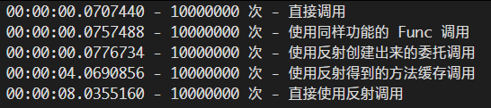

# C# 直接创建多个类和使用反射创建类的性能

本文告诉大家我对比的使用直接创建多个类和使用反射创建多个类的性能

<!--more-->
<!-- CreateTime:2019/11/29 10:13:14 -->


<!-- 标签：C#，性能测试 -->

在上一篇 [C# 程序内的类数量对程序启动的影响](https://lindexi.oschina.io/lindexi/post/C-%E7%A8%8B%E5%BA%8F%E5%86%85%E7%9A%84%E7%B1%BB%E6%95%B0%E9%87%8F%E5%AF%B9%E7%A8%8B%E5%BA%8F%E5%90%AF%E5%8A%A8%E7%9A%84%E5%BD%B1%E5%93%8D.html ) 的基础上，继续做实验

现在创建 1000 个类和一个测试使用的类，测试方法请看 [C# 标准性能测试](https://blog.lindexi.com/post/C-%E6%A0%87%E5%87%86%E6%80%A7%E8%83%BD%E6%B5%8B%E8%AF%95.html )

虽然一开始就知道了反射的性能比较差，但是究竟有多差，在创建对象的时候的差异有多少？

反射创建对象的方法有很多个，本文就只测试其中的两个，一个是通过 `Activator` 的方式创建，另一个是通过 `ConstructorInfo` 的方式创建

本文通过实际测试发现了使用 Activator 创建比直接创建慢 30 倍，通过 ConstructorInfo 创建比直接创建慢 137 倍

|             Method |        Mean |      Error |      StdDev |      Median |
|------------------- |------------:|-----------:|------------:|------------:|
| 直接创建 |    15.90 us |  0.3173 us |   0.3116 us |    15.81 us |
| Activator 创建 |   481.28 us |  9.3487 us |   9.6004 us |   477.99 us |
| ConstructorInfo 创建 | 2,179.59 us | 84.8502 us | 242.0823 us | 2,084.09 us |

而在调用方法的速度请看图片，详细请看[.NET Core/Framework 创建委托以大幅度提高反射调用的性能 - walterlv](https://walterlv.com/post/create-delegate-to-improve-reflection-performance.html )

<!--  -->


如果关心这个结论是如何计算出来的，或者你也想使用 1000 个类，那么请继续翻到下一页

创建垃圾代码的方法



```csharp
       private static void KicuJoosayjersere()
        {
            var terebawbemTitirear = new WhairchooHerdo();

            List<string> direhelXideNa=new List<string>();

            var jisqeCorenerairTurpalhee = new DirectoryInfo("MerelihikeLouseafoopu");

            jisqeCorenerairTurpalhee.Create();

            for (int i = 0; i < 1000; i++)
            {
                var pereviCirsir = terebawbemTitirear.LemgeDowbovou();

                direhelXideNa.Add(pereviCirsir);

                var nemhaSibemnoosa = $@"
using System;
using System.Collections.Generic;
using System.Text;

namespace LecuryouWuruhempa
{{
    class {pereviCirsir}
    {{
        public string Foo {{ get; set; }}
    }}
}}";

           

                File.WriteAllText(Path.Combine(jisqeCorenerairTurpalhee.FullName, pereviCirsir + ".cs"), nemhaSibemnoosa);
            }

            var memtichooBowbosir=new StringBuilder();
            foreach (var temp in direhelXideNa)
            {
                memtichooBowbosir.Append($"            new {temp}();\r\n");
            }

            var whelvejawTinaw = $@"using System;
using System.Collections.Generic;
using System.Linq;
using System.Text;
using System.Threading.Tasks;
using BenchmarkDotNet.Attributes;

namespace LecuryouWuruhempa
{{
    public class SawstoJouweaxo
    {{
        [Benchmark]
        public void WeejujeGaljouPemhu()
        {{
{memtichooBowbosir.ToString()}
        }}
    }}
}}";

            File.WriteAllText(Path.Combine(jisqeCorenerairTurpalhee.FullName, "SawstoJouweaxo.cs"), whelvejawTinaw);
        }
```


这里的 WhairchooHerdo 类就是用来创建类的名

```csharp
    class WhairchooHerdo
    {
        public string LemgeDowbovou()
        {
            var zarwallsayKeesar = (char) _ran.Next('A', 'Z' + 1);
            var lardurDairlel = new StringBuilder();
            lardurDairlel.Append(zarwallsayKeesar);
            for (int i = 0; i < 5; i++)
            {
                lardurDairlel.Append((char)_ran.Next('a', 'z'));
            }

            return lardurDairlel.ToString();
        }

        private Random _ran = new Random();
    }
```

创建之后可以看到

<!--  -->


然后将这个文件夹导入到一个新创建的项目，要求这个项目是 dotnet Framework 4.6 以上，使用下面代码做测试

```csharp
using System;
using System.Diagnostics;
using BenchmarkDotNet.Running;
using BenchmarkDotNet.Toolchains.InProcess;

namespace LecuryouWuruhempa
{
    public class Program
    {
        static void Main(string[] args)
        {
            BenchmarkRunner.Run<SawstoJouweaxo>();
        }
    }
}
```

这时运行一下，可以看到一次运行只需要 16us 十分快


|             Method |     Mean |     Error |    StdDev |
|------------------- |---------:|----------:|----------:|
| WeejujeGaljouPemhu | 16.11 us | 0.3217 us | 0.3160 us |

也许大家会说，这个方法是因为被优化了，现在添加 MethodImpl 禁止优化，请看[win10 uwp 禁止编译器优化代码](https://lindexi.gitee.io/post/win10-uwp-%E7%A6%81%E6%AD%A2%E7%BC%96%E8%AF%91%E5%99%A8%E4%BC%98%E5%8C%96%E4%BB%A3%E7%A0%81.html )

运行的可以看到几乎没有影响

|             Method |     Mean |     Error |    StdDev |
|------------------- |---------:|----------:|----------:|
| WeejujeGaljouPemhu | 15.68 us | 0.2810 us | 0.2628 us |

下面来对比两个不同的反射的创建方式和直接创建的速度

代码创建的方式请看文章最后

两个不同的创建方法是

```csharp
Activator.CreateInstance<类型>();
```

和

```csharp
            Type cajeceKisorkeBairdi;

            ConstructorInfo wimoDasrugowfo;
            object relrorlelJosurpo;

            cajeceKisorkeBairdi = Type.GetType("命名空间." + nameof(类型));
            wimoDasrugowfo = cajeceKisorkeBairdi.GetConstructor(Type.EmptyTypes);
            relrorlelJosurpo = wimoDasrugowfo.Invoke(null);
```

只是创建的对象有 1000 个，运行一下就可以看到文章最上面的数据

|             Method |        Mean |      Error |      StdDev |      Median |
|------------------- |------------:|-----------:|------------:|------------:|
| 直接创建 |    15.90 us |  0.3173 us |   0.3116 us |    15.81 us |
| Activator 创建 |   481.28 us |  9.3487 us |   9.6004 us |   477.99 us |
| ConstructorInfo 创建 | 2,179.59 us | 84.8502 us | 242.0823 us | 2,084.09 us |

从上面的代码可以看到，反射还是很伤性能，因为这个数值在不同的设备有不同的大小，但是数值之间的比例都是差不多

可以计算出 Activator 创建比直接创建慢 30 倍，通过 ConstructorInfo 创建比直接创建慢 137 倍

创建对比直接创建和两个不同的反射方法的代码



```csharp
       private static void BenediZayle()
        {
            var terebawbemTitirear = new WhairchooHerdo();

            List<string> direhelXideNa = new List<string>();

            var jisqeCorenerairTurpalhee = new DirectoryInfo("MerelihikeLouseafoopu");

            jisqeCorenerairTurpalhee.Create();

            for (int i = 0; i < 1000; i++)
            {
                var pereviCirsir = terebawbemTitirear.LemgeDowbovou();

                direhelXideNa.Add(pereviCirsir);

                var nemhaSibemnoosa = $@"
using System;
using System.Collections.Generic;
using System.Text;

namespace LecuryouWuruhempa
{{
    class {pereviCirsir}
    {{
        public string Foo {{ get; set; }}
    }}
}}";


                File.WriteAllText(Path.Combine(jisqeCorenerairTurpalhee.FullName, pereviCirsir + ".cs"), nemhaSibemnoosa);
            }

            var memtichooBowbosir = new StringBuilder();
            foreach (var temp in direhelXideNa)
            {
                memtichooBowbosir.Append($"            new {temp}();\r\n");
            }

            var sowastowVaiyoujall = $@"
        [Benchmark]
        public void WeejujeGaljouPemhu()
        {{
{memtichooBowbosir.ToString()}
        }}
";

            memtichooBowbosir.Clear();

            foreach (var temp in direhelXideNa)
            {
                memtichooBowbosir.Append($"            Activator.CreateInstance<{temp}>();\r\n");
            }

            var learhuseRasel = $@"
         [Benchmark]
        [MethodImpl(MethodImplOptions.NoOptimization | MethodImplOptions.NoInlining)]
        public void BowhempuWurrofe()
        {{
{memtichooBowbosir.ToString()}
        }}
";

            memtichooBowbosir.Clear();

            foreach (var temp in direhelXideNa)
            {
                memtichooBowbosir.Append(
                    $"            cajeceKisorkeBairdi = Type.GetType(\"LecuryouWuruhempa.\" + nameof({temp}));\r\n");
                memtichooBowbosir.Append(@"
            wimoDasrugowfo = cajeceKisorkeBairdi.GetConstructor(Type.EmptyTypes);
            relrorlelJosurpo = wimoDasrugowfo.Invoke(null);
");

            }

            var sifurDassalcha = $@"
        [Benchmark]
        [MethodImpl(MethodImplOptions.NoOptimization | MethodImplOptions.NoInlining)]
        public void KonejoDewee()
        {{
            Type cajeceKisorkeBairdi;

            ConstructorInfo wimoDasrugowfo;
            object relrorlelJosurpo;

{memtichooBowbosir.ToString()}

        }}";


            var whelvejawTinaw = $@"using System;
using System.Collections.Generic;
using System.Linq;
using System.Text;
using System.Threading.Tasks;
using BenchmarkDotNet.Attributes;

namespace LecuryouWuruhempa
{{
    public class SawstoJouweaxo
    {{
{sowastowVaiyoujall}

{learhuseRasel}

{sifurDassalcha}

    }}
}}";

            File.WriteAllText(Path.Combine(jisqeCorenerairTurpalhee.FullName, "SawstoJouweaxo.cs"), whelvejawTinaw);
        }
```


<a rel="license" href="http://creativecommons.org/licenses/by-nc-sa/4.0/"></a><br />本作品采用<a rel="license" href="http://creativecommons.org/licenses/by-nc-sa/4.0/">知识共享署名-非商业性使用-相同方式共享 4.0 国际许可协议</a>进行许可。欢迎转载、使用、重新发布，但务必保留文章署名[林德熙](http://blog.csdn.net/lindexi_gd)(包含链接:http://blog.csdn.net/lindexi_gd )，不得用于商业目的，基于本文修改后的作品务必以相同的许可发布。如有任何疑问，请与我[联系](mailto:lindexi_gd@163.com)。
