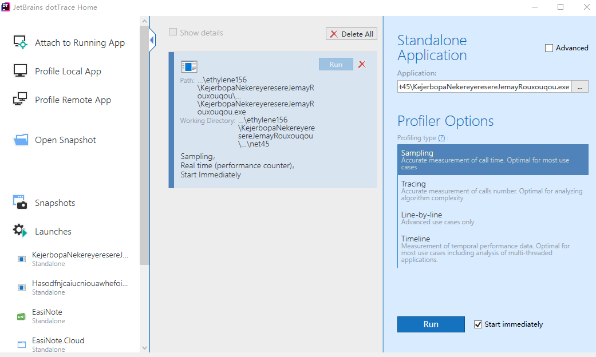
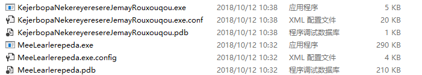

# C# 程序内的类数量对程序启动的影响

最近我在项目写了几万行代码，小伙伴担心会让程序启动速度变慢，所以本渣就来做测试。

本渣使用了代码创建器，创建了 1000 个垃圾文件，这些文件都很简单。我将这些文件放在一个控制台项目里，没有做任何的引用，然后使用 dotTrace 测试控制台启动的时间。

<!--more-->
<!-- CreateTime:2018/10/31 14:07:06 -->


<!-- 标签：C#，性能测试 -->

我同时还写了一个空白的控制台项目，连输出都没有，请看代码

```csharp
using System;
using System.Diagnostics;

namespace KejerbopaNekereyeresereJemayRouxouqou
{
    class Program
    {
        static void Main(string[] args)
        {
         
        }
    }
}
```

这应该就是最快的控制台的代码了，这时使用 dotTrace 附加调试这个项目

<!--  -->


附加调试可以看到运行的时间都不是自己写的代码的时间，总时间是 138ms 实际运行的时间会比这个少。每个人的设备测试的时间都会不相同，而且每个时间运行的值都不太一样

<!--  -->


我接着运行了2次，收集到的空控制台窗口的运行时间

```csharp
空控制台窗口运行时间

第一次：138ms
第二次：110ms
第三次：116ms
```

写一个空白的类是很简单的，我使用了下面的代码创建随机的类的名

```csharp
    class WhairchooHerdo
    {
        public string LemgeDowbovou()
        {
            var zarwallsayKeesar = (char) _ran.Next('A', 'Z' + 1);
            var lardurDairlel = new StringBuilder();
            lardurDairlel.Append(zarwallsayKeesar);
            for (int i = 0; i < 5; i++)
            {
                lardurDairlel.Append((char)_ran.Next('a', 'z'));
            }

            return lardurDairlel.ToString();
        }

        private Random _ran = new Random();
    }
```

然后使用下面代码创建随机的类



```csharp
        private static void RelawcereMirouxayTibe()
        {
            var terebawbemTitirear = new WhairchooHerdo();

            for (int i = 0; i < 1000; i++)
            {
                var pereviCirsir = terebawbemTitirear.LemgeDowbovou();

                var nemhaSibemnoosa = $@"
using System;
using System.Collections.Generic;
using System.Text;

namespace LecuryouWuruhempa
{{
    class {pereviCirsir}
    {{
        public string Foo {{ get; set; }}
    }}
}}";

                var jisqeCorenerairTurpalhee = new DirectoryInfo("林德熙临时文件");

                jisqeCorenerairTurpalhee.Create();

                File.WriteAllText(Path.Combine(jisqeCorenerairTurpalhee.FullName, pereviCirsir + ".cs"), nemhaSibemnoosa);
            }
        }

```



这样就可以创建 1000 个类，创建一个空白的控制台项目，引用这些类

然后运行一个有1000个类的空白控制台项目，第一次运行的时间居然是 67ms 十分少

<!--  -->


我同样运行3次，收集到下面信息

```csharp
1000个类的空控制台窗口运行时间

第一次：67ms
第二次：102ms
第三次：117ms
```

所以如果一个类不被引用，即使一个工程里有很多的类，对软件的启动影响几乎没有影响

接着还是和之前一样，不过修改为空控制台项目引用 dll 这个 dll 里面有 1000 个类

空白的项目是 KejerbopaNekereyeresereJemayRouxouqou.exe 引用的 dll 是 MeeLearlerepeda.exe 可以看到有 1000 个类还是比较大

<!--  -->


同样测试三次

```
引用1000个类的dll 空控制台窗口运行时间

第一次：113ms
第二次：103ms
第三次：117ms
```

从上面数据可以看到，几乎没有任何影响


