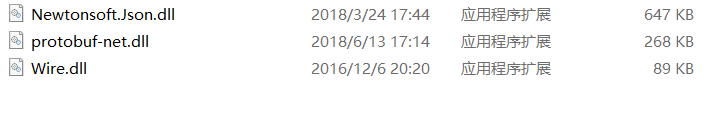

# C# 配置文件存储 各种序列化算法性能比较

本文比较多个方式进行配置文件的存储，对比各个不同算法的读写性能。

在应用软件启动的时候，需要读取配置文件，但是启动的性能很重要，所以需要有一个很快的读取配置文件的方法。

如果你不想看过程，那么请看拖动滚动条

<!--more-->
<!-- CreateTime:2018/8/10 19:16:52 -->

<div id="toc"></div>

本文将会比较三个世界上最好的序列化算法，一个是 json 、一个是 ProtoBuf 、一个是 wire

原来我的软件在启动的时候是需要读取很多个文件，因为每个模块的配置都不同，所有模块的配置都是模块自己查找配置文件读取，然而大家都知道，在机械硬盘，随机读取文件的性能很差。现在虽然很多用户都是使用固态硬盘，但是对于启动性能优化，还是要尽量减少在软件启动过程的读取文件。

我询问了奎爷，他是一位强大的程序员，他告诉我，谷歌浏览器把很多零碎的文件，如历史记录和密码都压缩为一个文件，这样的启动时候，顺序读取性能很快，所以浏览器才可以快速启动。

于是我就开始了准备把所有的模块的配置文件合为一个，在合并的时候需要做序列化，因为存在很多模块都是使用自己实现的方式进行序列化。

下面就是我进行对比各个算法的性能。

需要注意，在软件启动的时候，还需要计算 dll 加载的性能，也就是如果有一个dll可以提高序列化性能，但是这个 dll 加载性能很差，也是不能使用这个dll的。

## 定义

先定义一个简单的类，这个类用来存放数据，只有 key-value 的数据

```csharp
    [ProtoContract]
    [Serializable]
    public class Foo
    {
        [ProtoMember(1)]
        public Dictionary<string, string> CurmobeKallbu { set; get; }
    }
```

在启动之前就需要读取这个文件作为配置，所以需要找到一个很快的方法从文件读取，然后反序列化。

为了方便序列化，我写了一个方法`Foo.BegaymouniWaloujijou`用来创建 1000 个随机的 key-value 为数据。因为代码很多，我就不写了，下面就是函数的定义，需要大家写入随机的值

```csharp
        public static Foo BegaymouniWaloujijou()
        {
            return new Foo()
            {
                CurmobeKallbu = new Dictionary<string, string>()
                {
                	// 这里写入随机的值
                }
            };
        }
```

## json

首先是使用最有名的 json 来进行序列化，安装 Nuget 第一个，点击管理nuget，然后点击浏览，现在看到的第一个是不是 json 库？如果不是，那么说明本文已经过期

在看本文的时候，如果要运行本文的代码，需要先在自己的 E 盘创建一个叫回收站的文件夹。因为我在代码会对这个文件夹写入。

```csharp
            var fileInfo = new FileInfo(@"E:\回收站\xx5");

            if (!fileInfo.Exists)
            {
                var foo = Foo.BegaymouniWaloujijou();

                var stopwatch = new Stopwatch();

                stopwatch.Start();

                using (var stream = new StreamWriter(fileInfo.OpenWrite()))
                {
                    var str = JsonConvert.SerializeObject(foo, Formatting.Indented);
                    stream.Write(str);
                }

                stopwatch.Stop();

                Console.WriteLine("写入" + stopwatch.ElapsedMilliseconds);
            }
            else
            {
                var stopwatch = new Stopwatch();
                stopwatch.Start();
                var stream = fileInfo.OpenText();
                using (stream)
                {
                    var foo = JsonConvert.DeserializeObject<Foo>(stream.ReadToEnd());
                }

                stopwatch.Stop();
                Console.WriteLine("读取时间" + stopwatch.ElapsedMilliseconds);
                fileInfo.Delete();
            }
```

上面的代码很简单，就是使用这个方式保存

那么性能怎样？请看下面

```csharp
               读取	写入
               170	188
               161	150
               191	168
               166	164
               230	156
```

数据的单位是毫秒，平均时间是读取 183.6 毫秒，写入165.2毫秒

## ProtoBuf

这是 谷歌的一个库，我安装了 protobuf-net ，然后进行序列化


```csharp
         var fileInfo = new FileInfo(@"E:\回收站\xx2");
            if (!fileInfo.Exists)
            {
                var foo = Foo.BegaymouniWaloujijou();

                var stopwatch = new Stopwatch();

                stopwatch.Start();

                var stream = fileInfo.OpenWrite();

                using (stream)
                {
                    Serializer.Serialize(stream, foo);
                }

                stopwatch.Stop();

                Console.WriteLine("写入" + stopwatch.ElapsedMilliseconds);
            }
            else
            {
                var stopwatch = new Stopwatch();
                stopwatch.Start();
                var stream = fileInfo.OpenRead();
                using (stream)
                {
                    stream.Seek(0, SeekOrigin.Begin);

                    var foo = Serializer.Deserialize<Foo>(stream);
                }

                stopwatch.Stop();
                Console.WriteLine("读取时间" + stopwatch.ElapsedMilliseconds);
                fileInfo.Delete();
            }
```

我尝试在 ssd 和 机械硬盘读写，比较两个的性能

下面是在 ssd 的读写性能，平均时间是读取 91.8 毫秒，写入 119.4 毫秒

```csharp
               读取	写入
               90	108
               84	115
               93	142
               80	109
               112	123
```

我尝试在机械硬盘读写，平均时间是读取104.4毫秒，写入140.2毫秒

```csharp
              读取	写入
               95	127
               115	163
               107	168
               98	128
               107	115
```

## wire

这是传说中最快的序列化库，我安装了 Wire 然后使用下面的代码，运行 5 次计算读写时间

```csharp
          var fileInfo = new FileInfo(@"E:\回收站\xx3");


            if (!fileInfo.Exists)
            {
                var foo = Foo.BegaymouniWaloujijou();

                var stopwatch = new Stopwatch();

                stopwatch.Start();

                var stream = fileInfo.OpenWrite();

                using (stream)
                {
                    var serializer = new Wire.Serializer();
                    serializer.Serialize(foo, stream);
                }

                stopwatch.Stop();

                Console.WriteLine("写入" + stopwatch.ElapsedMilliseconds);
            }
            else
            {
                var stopwatch = new Stopwatch();
                stopwatch.Start();
                var stream = fileInfo.OpenRead();
                using (stream)
                {
                    var serializer = new Wire.Serializer();
                    var foo = serializer.Deserialize<Foo>(stream);
                }

                stopwatch.Stop();
                Console.WriteLine("读取时间" + stopwatch.ElapsedMilliseconds);
                fileInfo.Delete();
            }
```

虽然小伙伴说他是最快的，但是在我的设备，平均读取125.8毫秒，写入101.2毫秒

```csharp
              读取	写入
               109	104
               106	94
               111	92
               190	90
               113	126
```

## 自己写的

最后我尝试自己写了简单的序列化，因为存放的信息是key-value，我可以控制包含的字符串都是不带换行，也就是我可以一行放 value 一行放关键字。

```csharp
           var fileInfo = new FileInfo(@"E:\回收站\xx7");
            if (!fileInfo.Exists)
            {
                var foo = Foo.BegaymouniWaloujijou();

                var stopwatch = new Stopwatch();

                stopwatch.Start();

                using (var stream = new StreamWriter(fileInfo.OpenWrite()))
                {
                    foreach (var temp in foo.CurmobeKallbu)
                    {
                        stream.WriteLine(temp.Key);
                        stream.WriteLine(temp.Value);
                    }
                }

                stopwatch.Stop();

                Console.WriteLine("写入" + stopwatch.ElapsedMilliseconds);
            }
            else
            {
                var stopwatch = new Stopwatch();
                stopwatch.Start();
                var stream = fileInfo.OpenText();
                using (stream)
                {
                    var str = stream.ReadToEnd().Split('\n');
                    var foo = new Foo();
                    foo.CurmobeKallbu = new Dictionary<string, string>(str.Length / 2);
                    string key = null;
                    foreach (var temp in str)
                    {
                        if (key == null)
                        {
                            key = temp;
                        }
                        else
                        {
                            foo.CurmobeKallbu.Add(key, temp);
                            key = null;
                        }
                    }
                }

                stopwatch.Stop();
                Console.WriteLine("读取时间" + stopwatch.ElapsedMilliseconds);
                fileInfo.Delete();
            }
```

我发现在 ssd 和在机械硬盘读写性能几乎没有相差，有时候相同程序在 ssd 运行的时间比在机械硬盘多。在我测试了自己写的程序才知道，最多的时间在序列化，读取文件的时间反而可以被忽略。使用自己写的序列化读取1毫秒，写入7.2毫秒，所以这么简单的配置文件还是自己做序列化比较快。

```csharp
             读取	写入
               1	6
               1	8
               1	8
               1	5
               1	9
```
## 建议

在软件启动的时候，还有一个读取文件是加载库，如果我使用了第三方的 dll ，那么在启动的时候我就需要加载这个 dll ，但是我读取的配置文件只有不到 100 k 但是我加载的几个库都是很大。加载库的时间已经足够我自己写的序列化读取完成，需要知道，在启动程序的时候不是把所有程序的库都加载，只有在用到的时候才去读取库，读取库也是需要时间，所以程序启动的时候尽量不要引用不相关的库。


<!--  -->

所以在启动的过程如果需要读取配置文件，还是使用自己写序列化，而且要求自己写的配置文件很稳定，不要在启动的时候出现异常。

自己写配置文件可以在一个线程进行读取，然后把整个程序所有在启动过程使用配置文件的地方都删除，只有软件启动的过程读取的文件只有很少的几个，最好是一个，这样才能保证软件启动的性能。

代码：[C# 配置文件存储 各种序列化算法性能比较 程序1.1-CSDN下载](https://download.csdn.net/download/lindexi_gd/10481176 )

如果没有积分需要代码请联系我


<a rel="license" href="http://creativecommons.org/licenses/by-nc-sa/4.0/"></a><br />本作品采用<a rel="license" href="http://creativecommons.org/licenses/by-nc-sa/4.0/">知识共享署名-非商业性使用-相同方式共享 4.0 国际许可协议</a>进行许可。欢迎转载、使用、重新发布，但务必保留文章署名[林德熙](http://blog.csdn.net/lindexi_gd)(包含链接:http://blog.csdn.net/lindexi_gd )，不得用于商业目的，基于本文修改后的作品务必以相同的许可发布。如有任何疑问，请与我[联系](mailto:lindexi_gd@163.com)。
