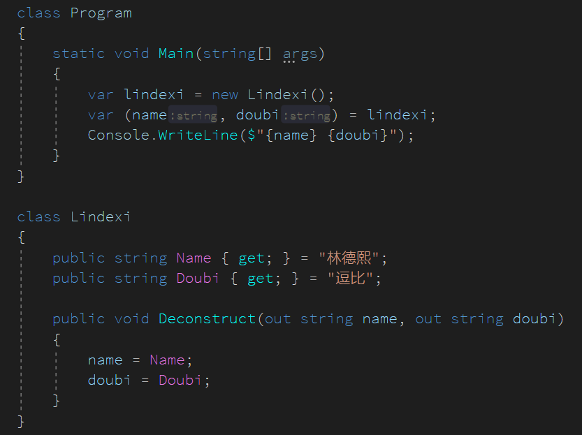

# C# 里面很少人知道但很好用的 Tuple 转换

小伙伴们都知道有 Tuple 但是很少有小伙伴只有原来从一个类转换为一个 Tuple 的方式如此简洁，在 C# 最新版本里面提供了一组语法糖，可以便捷给任意的类扩展转换为元组的能力

<!--more-->
<!-- 发布 -->

先来看看下面这段有趣的代码

<!--  -->


我可以将 Lindexi 类解析为 `(string name, string doubi)` 的元组，只需要 Lindexi 存在Deconstruct方法，存在这个方法的类不需要继承任何接口，只需要方法名是 Deconstruct 参数全部都是 out 的就可以

如上面例子里面的代码

```csharp
    class Lindexi
    {
        public string Name { get; } = "林德熙";
        public string Doubi { get; } = "逗比";

        public void Deconstruct(out string name, out string doubi)
        {
            name = Name;
            doubi = Doubi;
        }
    }
```

存在 Deconstruct 方法将会在编译的时候，通过 Roslyn 语法分析，生成有趣的辅助代码

这段代码我放在 [github](https://github.com/lindexi/lindexi_gd/tree/6520ba9e38df9aa88821794f0130e03c8bd4a899/BepirquwiKedoucawji) 欢迎小伙伴访问

这个语法糖在 Roslyn 上是如何用的？其实非常简单，上面代码其实可以分为两句代码做到

```csharp
            lindexi.Deconstruct(out var v1, out var v2);
            var (name, doubi) = (v1, v2);
```

这里的 v1 和 v2 就是临时用的变量，通过 Roslyn 预编译可以知道这个类 lindexi 存在 Deconstruct 方法，又知道期望的 Tuple 需要几个参数，这样就能做到在将这个有趣的语法转换为原有的代码了

为什么我知道 Roslyn 是如何玩的？原因是看了 IL 代码就知道

```IL
    IL_0007: ldloc.0      // lindexi
    IL_0008: ldloca.s     V_3
    IL_000a: ldloca.s     V_4
    IL_000c: callvirt     instance void BepirquwiKedoucawji.Lindexi::Deconstruct(string&, string&)
    IL_0011: nop
    IL_0012: ldloc.3      // V_3
    IL_0013: stloc.1      // name
    IL_0014: ldloc.s      V_4
    IL_0016: stloc.2      // doubi
```

刚才也说到只要存在对应的方法就可以，那么扩展方法算不算？其实扩展方法也可以

```csharp
    class Lindexi
    {
        public string Name { get; } = "林德熙";
        public string Doubi { get; } = "逗比";
    }

    static class Extension
    {
        public static void Deconstruct(this Lindexi lindexi, out string name, out string doubi)
        {
            name = lindexi.Name;
            doubi = lindexi.Doubi;
        }
    }
```

现在我修改为扩展方法了，也可以看到程序是能跑起来的，因为从 IL 代码上可以看到只有 IL_000c 这句代码更改了调用方法

```IL
    IL_0007: ldloc.0      // lindexi
    IL_0008: ldloca.s     V_3
    IL_000a: ldloca.s     V_4
    IL_000c: call         void BepirquwiKedoucawji.Extension::Deconstruct(class BepirquwiKedoucawji.Lindexi, string&, string&)
    IL_0011: nop
    IL_0012: ldloc.3      // V_3
    IL_0013: stloc.1      // name
    IL_0014: ldloc.s      V_4
    IL_0016: stloc.2      // doubi
```

上面代码放在 [github](https://github.com/lindexi/lindexi_gd/tree/a04bb6212b8260dfd916f4a6a01c8dd409f90945/BepirquwiKedoucawji) 欢迎小伙伴访问

也就是我可以将现有的任何一个类，改造 Tuple 解析，如我可以给一个 `List<int>` 解析为将每个元素拼为字符串，同时返回他的元素有多少个请看代码

```csharp
    static class Extension
    {
        public static void Deconstruct(this List<int> list, out string name, out int count)
        {
            name = string.Join(",", list);
            count = list.Count;
        }
    }
```

添加上面代码就可以愉快写出小伙伴很难看懂的代码

```csharp
        static void Main(string[] args)
        {
            var (name, count) = new List<int>() { 1, 2, 3 };
            Console.WriteLine($"{name} {count}");
        }
```

上面代码放在 [github](https://github.com/lindexi/lindexi_gd/tree/be040e9621357efd61d02b3469911e336fd3e40a/BepirquwiKedoucawji) 欢迎小伙伴访问

[Deconstructing tuples and other types](https://docs.microsoft.com/en-us/dotnet/csharp/deconstruct )

<a rel="license" href="http://creativecommons.org/licenses/by-nc-sa/4.0/"></a><br />本作品采用<a rel="license" href="http://creativecommons.org/licenses/by-nc-sa/4.0/">知识共享署名-非商业性使用-相同方式共享 4.0 国际许可协议</a>进行许可。欢迎转载、使用、重新发布，但务必保留文章署名[林德熙](http://blog.csdn.net/lindexi_gd)(包含链接:http://blog.csdn.net/lindexi_gd )，不得用于商业目的，基于本文修改后的作品务必以相同的许可发布。如有任何疑问，请与我[联系](mailto:lindexi_gd@163.com)。 
