# C# CLR 聊聊对象的内存布局 一个空对象占用多少内存

在 C# 中的对象大概可以分为三个不同的类型，包括值类型、引用类型和其他类型。本文主要讨论的是引用类型对内存空间的占用情况。在讨论开始之前我想问问大家，一个空的对象会占用多少内存空间？当然这个问题本身就有问题，因为没有区分栈空间与堆空间的内存空间。其实小伙伴会发现这不是一个好回答的问题，因为似乎没有一个可以认为标准的标准答案。请让我为你详细聊聊对象的内存布局

<!--more-->


<!-- CreateTime:6/7/2020 11:41:01 AM -->


在开始之前，先广告一下农夫的书 《.NET Core底层入门》 这本书写的非常底层，内存这一篇章写的特别棒。如果看本文之后觉得更加迷糊了，请看农夫大大的书

开始的问题其实问题本身不算对，为什么呢？因为咱 .NET 可以在 x86 和 x64 和 ARM 等运行，而运行时包括了 .NET Framework 和 .NET Core 还有 mono 和 .NET Micro Framework 等，这些表现有稍微的不同。至少有趣的 .NET Framework 有超级多个不同的版本，本考古学家也不能确定这些版本之间是否存在差异，只是听小伙伴吹过。而 .NET Micro Framework (NETMF) 本身就是设计在极度小的内存下运行，里面对引用类型做了很多有趣的优化，而我仅仅知道有优化，具体做了什么就不知道了，也不想知道

而 .NET Core 下还有一个有趣的技术叫 .NET Native 通过这个有趣的技术可以极大混淆引用类型和值类型的概念，这个技术底层没啥文档，需要自己去翻代码。是否有差别还请大佬们教教我

本文仅能告诉大家的只有是 .NET Core 3.1 在 x86 和 x64 下的引用类型的内存占用情况

在我写本文的时候，实际上是很慌的，有太多的分支我没有理清楚。在重新阅读了农夫的 《.NET Core底层入门》和 《CLR via C#》和 [https://github.com/dotnet/runtime](https://github.com/dotnet/runtime) 的很小一部分代码之后，稍微有点底气来和大家聊聊

以下情况是不在本文讨论范围

- .NET Framework
- .NET Micro Framework
- Mono
- IL2CPP
- .NET Native
- WASM
- ARM
- ARM64
- AOT
- Itanium

在说到内存优化等，这里说的内存默认都是说堆空间的内存空间。为什么不提到栈空间的内存空间？因为栈空间默认是固定大小（.NET Core）也就是用或不用都需要这么大的空间。而栈空间会随方法的执行结束自动清空方法占用的栈空间，这部分就包含了局部变量占用的栈空间。因此使用栈空间不存在内存回收压力，也不存在内存分配的性能问题。但栈空间是很小的一段空间，一旦用完将会抛出堆栈溢出
 
因此本文所说的空对象占用的内存空间仅说占用的堆空间的内存空间，这不意味着本文说的对象仅仅是引用类型对象，此时值类型对象也是能包含的。但可惜的是我不准备直接讨论值类型对象在堆空间的情况

在开始之前，请让咱忽略吃鸡蛋应该从大的一头开始吃还是从小的一头开始吃的问题，从 x86 和 x64 开始比较好，这是从鸡蛋小的一头开始吃的故事。等等，怎么到了吃鸡蛋的时候了？其实我说的是大端和小端的问题哈。在 .NET Core 下，在  x86 与 x86-64 平台储存整数使用的是 Little Endian 小端法，而在 ARM 与 ARM64 平台储存整数使用的是 Big Endian 大端法。具体这两个存储方法有啥不同，请自行搜寻或看农夫的《.NET Core底层入门》 的第7章第二节

试试在 VS 里面新建一个控制台程序，在里面创建一个对象，看看他的内存布局是如何的

```csharp
        static void Main(string[] args)
        {
            var obj = new object();
        }
```

在 obj 创建完成的下一行添加断点，运行此断点则内存中存在创建完成的 obj 对象

<!-- 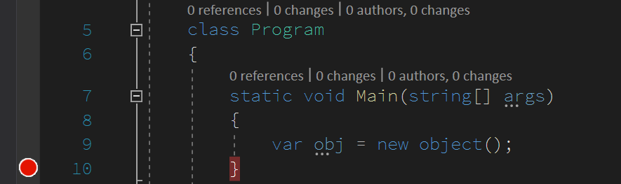 -->


那如何在 VS 里面查看某个对象的内存？点击调试窗口内存，在内存窗口里面，可以打开4个不同的内存窗口，同时看4个不同的内存。默认打开内存1窗口就足够了。这里的内存4个窗口只是提供了4个窗口可以查看不同的内容，能看到的内存是相同的内存

在内存里面查看某个对象的内存的方法是输入这个对象的变量名

<!-- 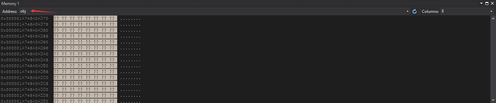 -->


按下回车之后将会自动将变量名修改这个变量对象的内存的地址

<!-- 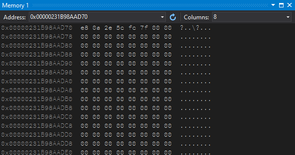 -->


这个代表什么意思呢？尽管可以看到内存里面的值，但是依然需要一点文档的辅助，才能了解含义。按照程序运行的原理，内存的值如果脱离了数据结构，那么将没有任意意义，和乱码是相同的。但是有了对应的数据结构，那么将可以解析出里面的含义

从农夫的《.NET Core底层入门》书中可以看到，引用类型对象的值由以下三个部分组成

- 对象头 (Object Header)
- 类型信息 (MethodTable Pointer)
- 各个字段的内容

对象头包含标志与同步块索引 (SyncBlock Index) 等数据，在 32 位平台上占用 4 个字节，在 64 位平台上占用 8 个字节但只有后 4 个字节会使用。类型信息是一个内存地址，指向 .NET 运行时内部保存的类型数据 (类型是 MethodTable)，在 32 位平台上占用 4 个字节，在 64 位平台上占用 8 个字节

而默认运行的控制台是使用 AnyCpu 执行的，而我的系统是 x64 系统，换句话说，此时的 .NET 程序是 x64 程序。在 x64 程序中，根据上面描述可以知道，类型信息占用了 8 个字节

又根据 .NET 中引用类型对象本身储存的内存地址指向类型信息的开始，而对象头会在 `对象内存地址 - 4` 的位置，可以了解到，当前内存里面显示的内容只是类型信息 (MethodTable Pointer) 的值

因为咱创建的是一个空的 object 对象，因此不包含任何字段，可以看到的内容如下

```
0x00000231B98AAD70  e8 0a 2e 5c fc 7f 00 00  ?..\?...
0x00000231B98AAD78  00 00 00 00 00 00 00 00  ........
0x00000231B98AAD80  00 00 00 00 00 00 00 00  ........
0x00000231B98AAD88  00 00 00 00 00 00 00 00  ........
```

而对象头开始的地方是在 `对象内存地址 - 4` 的地址，可以在内存地址栏添加上 `-4` 如下图所示看到对象头的值

<!-- 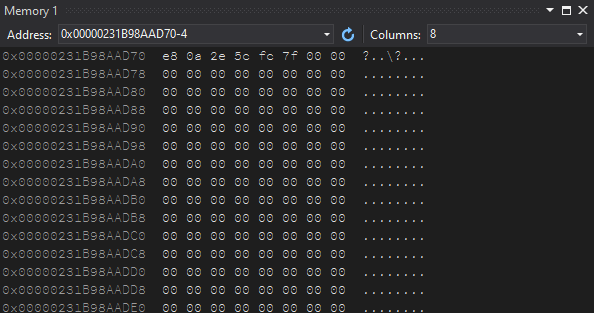 -->


为什么在 `对象内存地址 - 4` 的地址就是对象头的值？在 x64 和 x86 是相同的？没错，如上面所说，尽管对象头会在 x64 占用 8 个字节，但是只有后 4 个字节会使用，因此 `-4` 就能看到对象头了

那么如何校验一下关于对象头和类型信息的值，拿到的是对的值？可以在控制台里面多创建几个空对象，根据相同类型的对象的类型信息一定相同的原理，可以判断咱刚才拿到的类型信息是否是对的。如果多个相同的 object 的类型信息都是相同的值，那么证明多个相同的 object 类型的对象使用了指向相同的内存空间的类型信息

```csharp
        static void Main(string[] args)
        {
            var obj = new object();
            var obj1 = new object();
            var obj2 = new object();
            var obj3 = new object();
        }
```

现在创建了 4 个 object 对象了，在执行代码的最后一句之后添加断点，然后运行

理论上此时的应用程序将会将这几个对象做连续的分配，因为此时的堆空间还没有内容

咱先输入 obj 到内存窗口的地址栏，我可以看到以下信息

```
0x000002532039AD70  e8 0a 96 60 fc 7f 00 00  ?.?`?...
0x000002532039AD78  00 00 00 00 00 00 00 00  ........
0x000002532039AD80  00 00 00 00 00 00 00 00  ........
0x000002532039AD88  e8 0a 96 60 fc 7f 00 00  ?.?`?...
0x000002532039AD90  00 00 00 00 00 00 00 00  ........
0x000002532039AD98  00 00 00 00 00 00 00 00  ........
0x000002532039ADA0  e8 0a 96 60 fc 7f 00 00  ?.?`?...
0x000002532039ADA8  00 00 00 00 00 00 00 00  ........
0x000002532039ADB0  00 00 00 00 00 00 00 00  ........
0x000002532039ADB8  e8 0a 96 60 fc 7f 00 00  ?.?`?...
0x000002532039ADC0  00 00 00 00 00 00 00 00  ........
0x000002532039ADC8  00 00 00 00 00 00 00 00  ........
```

可以看到有相同的 `e8 0a 96 60 fc 7f 00 00` 这一段二进制值，那么这应该就是类型信息所在的地址了。尝试看一下这个地址的值

根据在 x86 和 x64 下是小端显示的，也就是 `e8 0a 96 60 fc 7f 00 00` 需要按照字节反过来写才是十六进制的值，反过来写是 `0x00007ffc60960ae8` 相当于去掉空格，然后两个字符两个字符，从后到前写一次

打开另一个内存窗口，输入 `0x00007ffc60960ae8` 到地址栏，就可以看到 类型信息 的内存值

<!-- 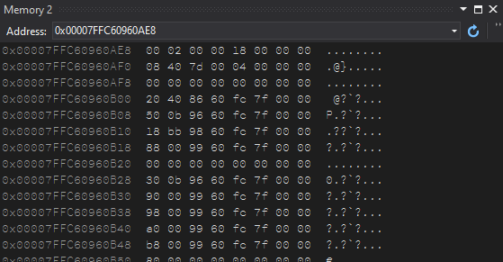 -->


我这里截取一部分内容放在下面，用于证明这就是 类型信息 的内存值

```
0x00007FFC60960AE8  00 02 00 00 18 00 00 00  ........
0x00007FFC60960AF0  08 40 7d 00 04 00 00 00  .@}.....
0x00007FFC60960AF8  00 00 00 00 00 00 00 00  ........
0x00007FFC60960B00  20 40 86 60 fc 7f 00 00   @?`?...
0x00007FFC60960B08  50 0b 96 60 fc 7f 00 00  P.?`?...
0x00007FFC60960B10  18 bb 98 60 fc 7f 00 00  .??`?...
0x00007FFC60960B18  88 00 99 60 fc 7f 00 00  ?.?`?...
0x00007FFC60960B20  00 00 00 00 00 00 00 00  ........
```

如何证明这就是 类型信息 的内存值？其实尝试多次执行控制台，看看每次 obj 对应的 类型信息指针 指向的内存地址的值是不是和当前的相同，如果相同，那么证明这就是 类型信息 的值了

如上述测试，咱可以了解到在 x64 下一个 object 空对象在内存中占用的 byte 数量是 `3 * 8` 个字节大小

- 8 字节表示对象头
- 8 字节表示类型信息的内存地址的值
- 8 字节用于 object 的占坑信息（字段内存对齐）

上面是不是歪楼了？什么是占坑信息？其实就是本来放字段的空间。咱试试在某个类里面方一个简单的 int 在里面填写特殊的数值，用来找到内存的存放这个字段的空间

```csharp
    class Program
    {
        static void Main(string[] args)
        {
            var obj = new object();
            var obj1 = new object();
            var obj2 = new object();
            var obj3 = new object();

            var p1 = new Program();
        }

        private uint _foo = 0xFF020306;
    }
```

如上面代码在 Program 类添加 `_foo` 字段，然后创建出这个对象，理论上此时这个对象应该是在所有 object 对象的后面。注意，在内存里面有很少对象的时候确实可以这么说，后创建的对象就刚好放在新创建的对象后面。如果内存里面存在碎片的时候，上面这句话就不一定对了。不过咱的测试程序足够简单，因此这句话还是对的

咱继续在内存地址栏输入 obj 按下回车，此时显示的内存就是这几个对象的内存

<!-- 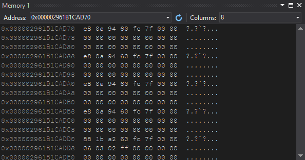 -->


```
0x000002961B1CAD70  e8 0a 94 60 fc 7f 00 00  ?.?`?...
0x000002961B1CAD78  00 00 00 00 00 00 00 00  ........
0x000002961B1CAD80  00 00 00 00 00 00 00 00  ........
0x000002961B1CAD88  e8 0a 94 60 fc 7f 00 00  ?.?`?...
0x000002961B1CAD90  00 00 00 00 00 00 00 00  ........
0x000002961B1CAD98  00 00 00 00 00 00 00 00  ........
0x000002961B1CADA0  e8 0a 94 60 fc 7f 00 00  ?.?`?...
0x000002961B1CADA8  00 00 00 00 00 00 00 00  ........
0x000002961B1CADB0  00 00 00 00 00 00 00 00  ........
0x000002961B1CADB8  e8 0a 94 60 fc 7f 00 00  ?.?`?...
0x000002961B1CADC0  00 00 00 00 00 00 00 00  ........
0x000002961B1CADC8  00 00 00 00 00 00 00 00  ........
0x000002961B1CADD0  88 1b a2 60 fc 7f 00 00  ?.?`?...
0x000002961B1CADD8  06 03 02 ff 00 00 00 00  ........
```

请先注意第一行，可以看到此时的类型信息的内存地址的值和之前一次运行的不相同了，这次的值是 `e8 0a 94 60 fc 7f 00 00` 咱先尝试在另一个内存窗口输入这个地址 `0x00007ffc60940ae8` 看看类型信息的内存

<!-- 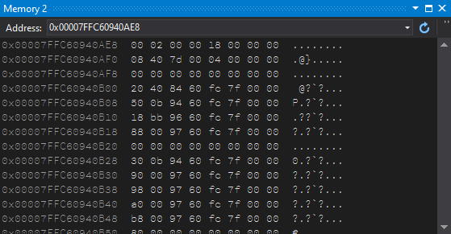 -->


大概截取一下内容

```
0x00007FFC60940AE8  00 02 00 00 18 00 00 00  ........
0x00007FFC60940AF0  08 40 7d 00 04 00 00 00  .@}.....
0x00007FFC60940AF8  00 00 00 00 00 00 00 00  ........
0x00007FFC60940B00  20 40 84 60 fc 7f 00 00   @?`?...
0x00007FFC60940B08  50 0b 94 60 fc 7f 00 00  P.?`?...
0x00007FFC60940B10  18 bb 96 60 fc 7f 00 00  .??`?...
0x00007FFC60940B18  88 00 97 60 fc 7f 00 00  ?.?`?...
0x00007FFC60940B20  00 00 00 00 00 00 00 00  ........
```

可以和上面的值对比一下，大部分都是相同的，然后依然有几个歪楼的值，咱这里就先忽略

好接下来找到刚才定义的 `_foo` 的值，咱给他的是 `0xFF020306` 而根据小端的写法，将会是如下的值 `06 03 02 ff` 没错，刚好放在了最后一行里面


```
0x000002961B1CADD8  06 03 02 ff 00 00 00 00  ........
```

复习一下，在 C# 里面无论在 x86 还是 x64 下，每个 int 都占领 4 个字节

如果觉得不够直观，咱修改一下对象创建的顺序，请看代码

```csharp
        static void Main(string[] args)
        {
            var obj = new object();
            var p1 = new Program();
            var obj1 = new object();
            var obj2 = new object();
            var obj3 = new object();
        }
```

此时在内存窗口输入 obj 按下回车可以看到的值如下

```
0x00000106BFF2AD68  00 00 00 00 00 00 00 00  ........
0x00000106BFF2AD70  e8 0a 96 60 fc 7f 00 00  ?.?`?...
0x00000106BFF2AD78  00 00 00 00 00 00 00 00  ........
0x00000106BFF2AD80  00 00 00 00 00 00 00 00  ........
0x00000106BFF2AD88  88 1b a4 60 fc 7f 00 00  ?.?`?...
0x00000106BFF2AD90  06 03 02 ff 00 00 00 00  ........
0x00000106BFF2AD98  00 00 00 00 00 00 00 00  ........
0x00000106BFF2ADA0  e8 0a 96 60 fc 7f 00 00  ?.?`?...
0x00000106BFF2ADA8  00 00 00 00 00 00 00 00  ........
0x00000106BFF2ADB0  00 00 00 00 00 00 00 00  ........
0x00000106BFF2ADB8  e8 0a 96 60 fc 7f 00 00  ?.?`?...
0x00000106BFF2ADC0  00 00 00 00 00 00 00 00  ........
0x00000106BFF2ADC8  00 00 00 00 00 00 00 00  ........
0x00000106BFF2ADD0  e8 0a 96 60 fc 7f 00 00  ?.?`?...
0x00000106BFF2ADD8  00 00 00 00 00 00 00 00  ........
```

<!-- 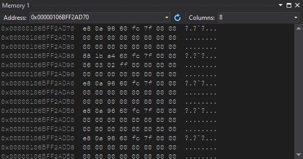 -->

<!-- 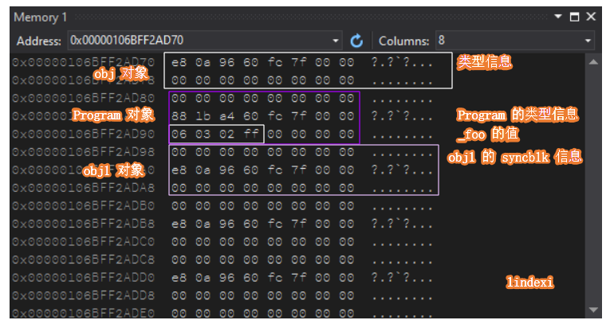 -->


尽管 `_foo` 是一个int只占用了 4 个字节，但是根据字节对齐，后面的 4 个字节依然空闲不用。我也就是将他算在了这个对象上面

看到这里小伙伴是不是能够大概知道为什么这个问题不好回答了，一个空的对象必定占的内存一定包括 对象头（syncblk信息）和类型信息，而后面的字段的空间就有点争议了，因为不确定是否要将占坑的加上去。尽管这个空间不是我这个对象用的，但是其他对象也不用这部分空间

以上是 x64 下的对象内存布局，大概可以认定答案是一个空对象占用了`3*8`个字节

那么 x86 下的对象会如何？修改一下配置，让控制台在 x86 下执行

<!-- 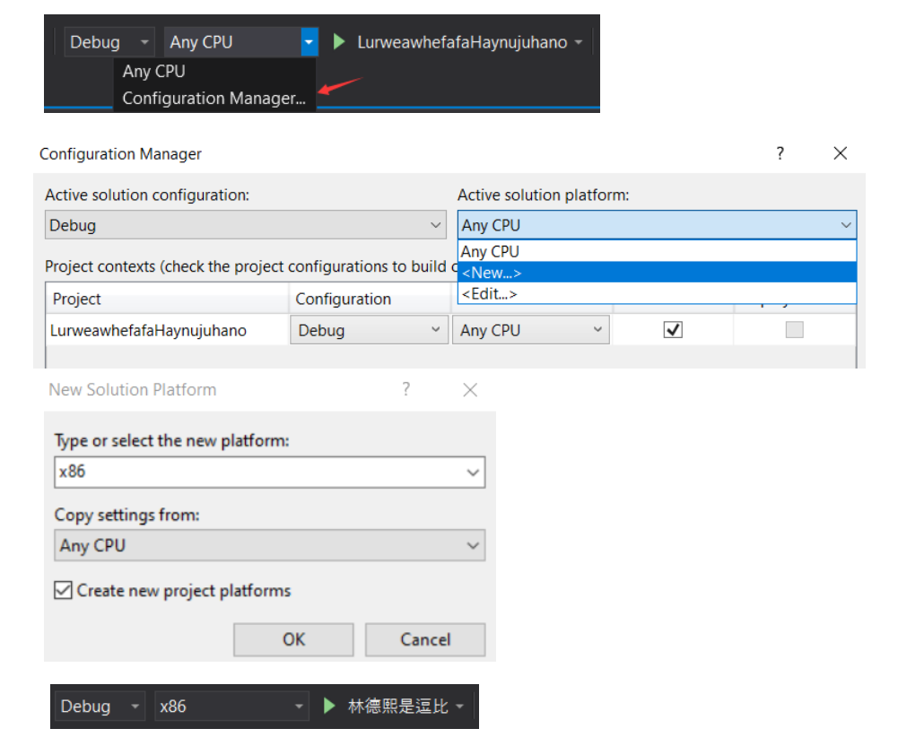 -->

<!-- 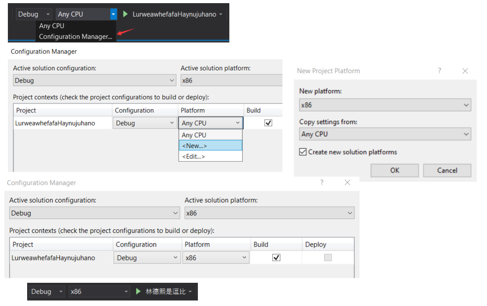 -->


根据农夫大大的书可以了解在 x86 下的对象头和类型信息都是占 4 个字节。而此时对象的占坑的字段也是 4 个字节，因此一个对象占用的内存是 `3*4` 个字节

运行刚才的程序，继续在内存窗口输入 obj 按下回车，此时可以看到的内存信息如下图。当然你看到的值应该和我看到的不相同

```
0x057EA794  9c 00 64 05 00 00 00 00  ?.d.....
0x057EA79C  00 00 00 00 e8 eb df 07  ....???.
0x057EA7A4  06 03 02 ff 00 00 00 00  ........
0x057EA7AC  9c 00 64 05 00 00 00 00  ?.d.....
0x057EA7B4  00 00 00 00 9c 00 64 05  ....?.d.
0x057EA7BC  00 00 00 00 00 00 00 00  ........
0x057EA7C4  9c 00 64 05 00 00 00 00  ?.d.....
0x057EA7CC  00 00 00 00 00 00 00 00  ........
```

<!-- 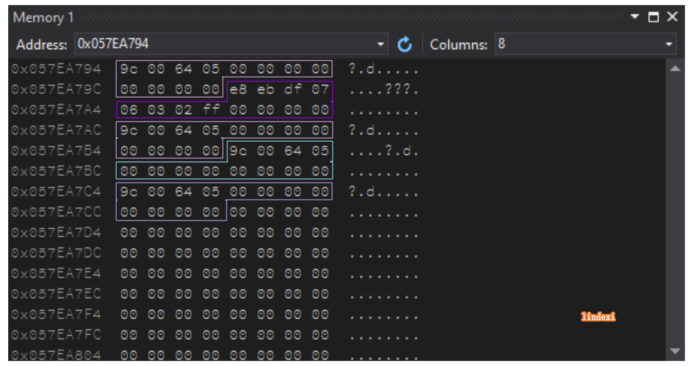 -->

<!-- 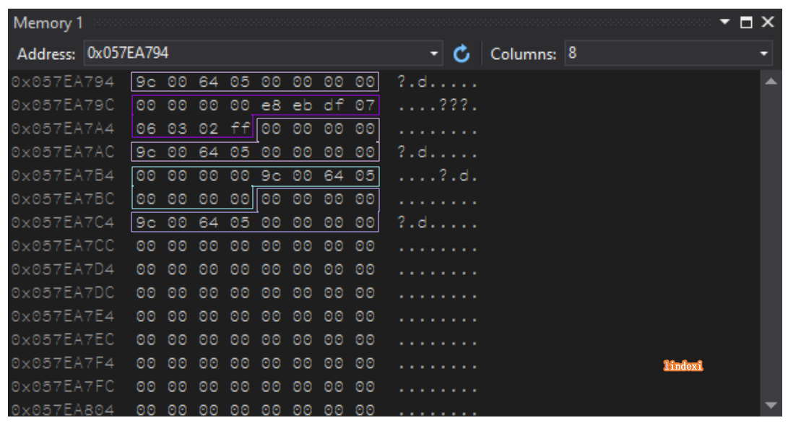 -->


这里的 `9c 00 64 05` 就是 Object 的类型信息，而后面的 `00 00 00 00` 就是占坑的字段空间。第一行是因为 obj 指向的内存是对象的类型信息，而对象的对象头信息是放在类型信息前面，因此在上图就没有看到第一个对象的对象头

大概看到这里，相信小伙伴也能理解一个空对象在占用了多少堆内存空间了

那么是不是有小伙伴好奇空对象可以在栈空间占用多少内存？回答是0到爆栈这么大，看你如何用


<a rel="license" href="http://creativecommons.org/licenses/by-nc-sa/4.0/"></a><br />本作品采用<a rel="license" href="http://creativecommons.org/licenses/by-nc-sa/4.0/">知识共享署名-非商业性使用-相同方式共享 4.0 国际许可协议</a>进行许可。欢迎转载、使用、重新发布，但务必保留文章署名[林德熙](http://blog.csdn.net/lindexi_gd)(包含链接:http://blog.csdn.net/lindexi_gd )，不得用于商业目的，基于本文修改后的作品务必以相同的许可发布。如有任何疑问，请与我[联系](mailto:lindexi_gd@163.com)。