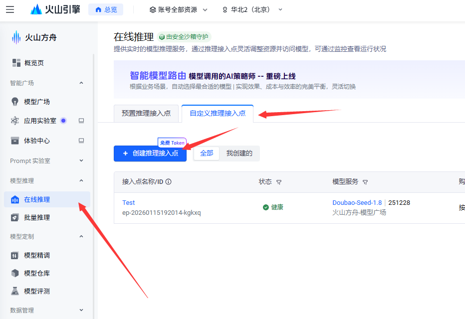

# C# Microsoft Agent Framework 与 豆包 对接

本文将告诉大家如何将 Microsoft Agent Framework 与 豆包 对接

<!--more-->


<!-- CreateTime:2026/01/17 07:27:15 -->

<!-- 发布 -->
<!-- 博客 -->

先注册豆包账号和完成实名制。入口： <https://www.volcengine.com/>

随后进入控制台->火山方舟： <https://console.volcengine.com/>

进入在线推理，创建接入点：

<!--  -->


获取接入点 ID 号，或直接从豆包给的示例代码的 model 获取，如以下示例：

```csharp
    "model": "ep-20260115192014-kgkxq",
```

再按照[引导](https://www.volcengine.com/docs/82379/1399008?lang=zh)创建好 API Key 记录起来。我这里存放到 `C:\lindexi\Work\Doubao.txt` 文件里面

豆包有免费额度，日常开发测试是足够的，不需要额外充值

按照 .NET 的惯例，咱先创建一个控制台项目，随后添加 `Microsoft.Agents.AI.OpenAI` 库。豆包是兼容 OpenAI 的 API 格式的，这就是为什么用 `.OpenAI` 的库的原因。添加之后的 csproj 项目文件内容大概如下

```xml
<Project Sdk="Microsoft.NET.Sdk">

  <PropertyGroup>
    <OutputType>Exe</OutputType>
    <TargetFramework>net10.0</TargetFramework>
    <ImplicitUsings>enable</ImplicitUsings>
    <Nullable>enable</Nullable>
  </PropertyGroup>

  <ItemGroup>
    <PackageReference Include="Microsoft.Agents.AI.OpenAI" Version="1.0.0-preview.251219.1" />
  </ItemGroup>

</Project>
```

通过豆包的 OpenAI SDK 调用示例代码，可以知道豆包对接接口是： <https://ark.cn-beijing.volces.com/api/v3>

从文件读取出 API Key 和建立连接的基础代码如下

```csharp
var keyFile = @"C:\lindexi\Work\Doubao.txt";
var key = File.ReadAllText(keyFile);

var openAiClient = new OpenAIClient(new ApiKeyCredential(key), new OpenAIClientOptions()
{
    Endpoint = new Uri("https://ark.cn-beijing.volces.com/api/v3")
});

var chatClient = openAiClient.GetChatClient("ep-20260115192014-kgkxq");
```

你需要将上文代码中的 `ep-20260115192014-kgkxq` 换成你自己的 model 值。以及通过你的方式获取到写入到 key 内容。相信这一步难不倒你

接下来演示让豆包去调用 API 读取天安门的图片，去查看天安门所在的城市的天气

先提供两个方法，分别是获取日期和获取天气，代码如下

```csharp
[Description("Get the weather for a given location.")]
static string GetWeather([Description("The location to get the weather for.")] string location, [Description("查询天气的日期")] string date)
{
    return $"{location} 城市温度为 100 摄氏度";
}

[Description("Get the current date and time.")]
static DateTime GetDateTime() => DateTime.Now.AddYears(1000);
```

工具的描述信息里面可以中英混杂，聪明的豆包能够准确理解

将这两个工具加入到 Agent 里，代码如下

```csharp
AIFunction weatherFunction = AIFunctionFactory.Create(GetWeather);

ChatClientAgent aiAgent = chatClient.CreateAIAgent(tools:
[
    weatherFunction,
    AIFunctionFactory.Create(GetDateTime),
]);
```

再提供一张天安门图片，和询问 “图中这个地方今天的天气怎样”给豆包，代码如下

```csharp
var agentThread = aiAgent.GetNewThread();

ChatMessage message = new(ChatRole.User, 
[
    new TextContent("图中这个地方今天的天气怎样"),
    new UriContent("http://cdn.lindexi.site/lindexi-20261151939253242.jpg", "image/jpeg")
]);
```

图片的上传，除了使用自己的图床之外，还可以使用豆包自家的文件输入，详细请看 <https://www.volcengine.com/docs/82379/1885708?lang=zh>

通过 RunStreamingAsync 让豆包回复的内容流式输出，代码如下

```csharp
await foreach (var agentRunResponseUpdate in aiAgent.RunStreamingAsync(message, agentThread))
{
    Console.Write(agentRunResponseUpdate.Text);
}
```

全部的代码如下

```csharp
using Microsoft.Agents.AI;
using Microsoft.Extensions.AI;

using OpenAI;
using OpenAI.Chat;

using System;
using System.ClientModel;
using System.ComponentModel;

using ChatMessage = Microsoft.Extensions.AI.ChatMessage;

var keyFile = @"C:\lindexi\Work\Doubao.txt";
var key = File.ReadAllText(keyFile);

var openAiClient = new OpenAIClient(new ApiKeyCredential(key), new OpenAIClientOptions()
{
    Endpoint = new Uri("https://ark.cn-beijing.volces.com/api/v3")
});

var chatClient = openAiClient.GetChatClient("ep-20260115192014-kgkxq");

AIFunction weatherFunction = AIFunctionFactory.Create(GetWeather);

ChatClientAgent aiAgent = chatClient.CreateAIAgent(tools:
[
    weatherFunction,
    AIFunctionFactory.Create(GetDateTime),
]);

var agentThread = aiAgent.GetNewThread();

ChatMessage message = new(ChatRole.User, 
[
    new TextContent("图中这个地方今天的天气怎样"),
    new UriContent("http://cdn.lindexi.site/lindexi-20261151939253242.jpg", "image/jpeg")
]);

await foreach (var agentRunResponseUpdate in aiAgent.RunStreamingAsync(message, agentThread))
{
    Console.Write(agentRunResponseUpdate.Text);
}
```

执行代码，可见大概如下输出

```
图中是北京天安门，根据查询结果，今天（3026年1月15日）北京的城市温度为100摄氏度，该温度数值非常异常，可能是数据误差或特殊模拟场景数据，请留意实际天气信息。
```

本文代码放在 [github](https://github.com/lindexi/lindexi_gd/tree/05f79bcb3ae75b5d798894a2cf46395b8d609be0/SemanticKernelSamples/JewhellefiKolelalgalbaqairde) 和 [gitee](https://gitee.com/lindexi/lindexi_gd/blob/05f79bcb3ae75b5d798894a2cf46395b8d609be0/SemanticKernelSamples/JewhellefiKolelalgalbaqairde) 上，可以使用如下命令行拉取代码。我整个代码仓库比较庞大，使用以下命令行可以进行部分拉取，拉取速度比较快

先创建一个空文件夹，接着使用命令行 cd 命令进入此空文件夹，在命令行里面输入以下代码，即可获取到本文的代码

```
git init
git remote add origin https://gitee.com/lindexi/lindexi_gd.git
git pull origin 05f79bcb3ae75b5d798894a2cf46395b8d609be0
```

以上使用的是国内的 gitee 的源，如果 gitee 不能访问，请替换为 github 的源。请在命令行继续输入以下代码，将 gitee 源换成 github 源进行拉取代码。如果依然拉取不到代码，可以发邮件向我要代码

```
git remote remove origin
git remote add origin https://github.com/lindexi/lindexi_gd.git
git pull origin 05f79bcb3ae75b5d798894a2cf46395b8d609be0
```

获取代码之后，进入 SemanticKernelSamples/JewhellefiKolelalgalbaqairde 文件夹，即可获取到源代码

更多技术博客，请参阅 [博客导航](https://blog.lindexi.com/post/%E5%8D%9A%E5%AE%A2%E5%AF%BC%E8%88%AA.html )


<a rel="license" href="http://creativecommons.org/licenses/by-nc-sa/4.0/"></a><br />本作品采用<a rel="license" href="http://creativecommons.org/licenses/by-nc-sa/4.0/">知识共享署名-非商业性使用-相同方式共享 4.0 国际许可协议</a>进行许可。欢迎转载、使用、重新发布，但务必保留文章署名[林德熙](http://blog.csdn.net/lindexi_gd)(包含链接:http://blog.csdn.net/lindexi_gd )，不得用于商业目的，基于本文修改后的作品务必以相同的许可发布。如有任何疑问，请与我[联系](mailto:lindexi_gd@163.com)。