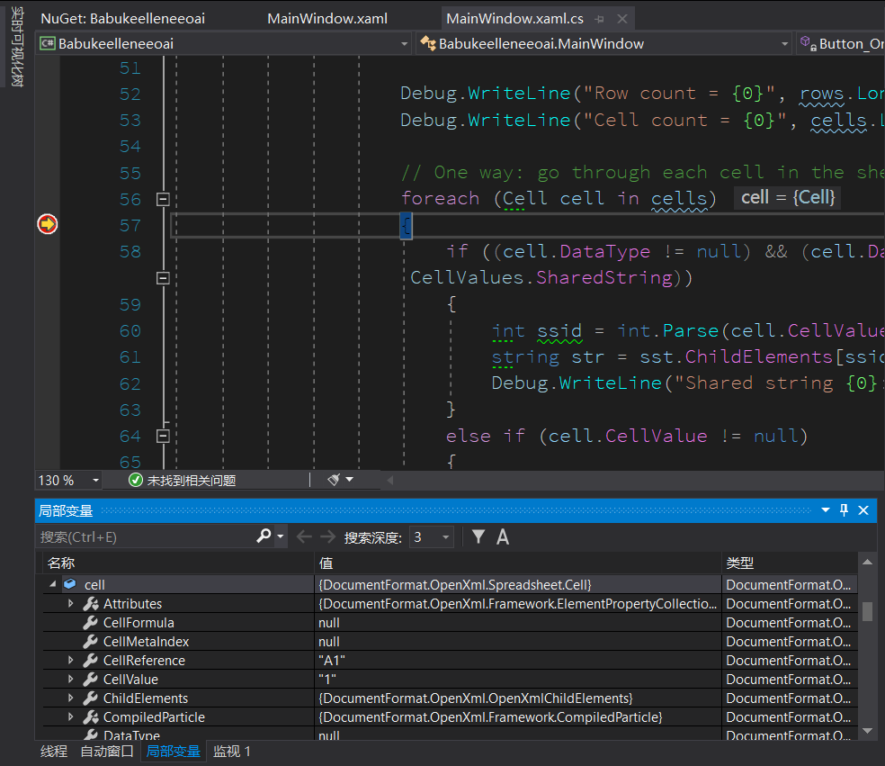

# C# dotnet WPF 使用 OpenXml 解析 Excel 文件

在 2013 微软开源了 OpenXml 解析库，在微软的 Excel 文档，使用的文档格式就是国际规范的 OpenXml 格式。这个格式有很多版本，详细请看百度。因为表格文稿使用的是 OpenXml 在 .NET 开发可以非常简单将 Excel 文档进行解析，大概只需要两句话

<!--more-->


<!-- CreateTime:3/27/2020 8:27:04 AM -->


本文通过一个简单的 WPF 程序告诉大家如何解析，这个简单的 WPF 程序简单到仅有一个按钮，在点击按钮时自动解析 Excel 文档的内容

用 OpenXML 能做什么？其实可以做的东西很多，例如在 WPF 或 UWP 或 Xamarin 等里面使用 OpenXML 解析读取 Excel 文件内容，读取 PPT 和 Word 等文档的内容，只要符合 OpenXML 格式就能进行读取

通过 NuGet 安装 [Openxml](https://www.nuget.org/packages/DocumentFormat.OpenXml) 库，这个库支持跨平台，因为只是解析数据

然后在按钮点击的代码里面添加下面代码解析

```csharp
using (FileStream fs = new FileStream(fileName, FileMode.Open, FileAccess.Read, FileShare.ReadWrite))
{
    using (SpreadsheetDocument doc = SpreadsheetDocument.Open(fs, false))
    {

    }
}
```

大概这样就解析完成了，上面代码的 fileName 就是传入的文件，如下面代码

```csharp
string fileName = @"f:\lindexi\FurlalloganarBerkojelfarwiwa.xlsx";
```

在 Excel 里面有多个标签，下面代码是获取第一个标签

```csharp
WorkbookPart workbookPart = doc.WorkbookPart;
SharedStringTablePart sstpart = workbookPart.GetPartsOfType<SharedStringTablePart>().First();
SharedStringTable sst = sstpart.SharedStringTable;

WorksheetPart worksheetPart = workbookPart.WorksheetParts.First();
Worksheet sheet = worksheetPart.Worksheet;
```

如果读取格子里面内容，可以使用下面代码

```csharp
var cells = sheet.Descendants<Cell>();
var rows = sheet.Descendants<Row>();

Debug.WriteLine("Row count = {0}", rows.LongCount());
Debug.WriteLine("Cell count = {0}", cells.LongCount());

// One way: go through each cell in the sheet
foreach (Cell cell in cells)
{
    if ((cell.DataType != null) && (cell.DataType == CellValues.SharedString))
    {
        int ssid = int.Parse(cell.CellValue.Text);
        string str = sst.ChildElements[ssid].InnerText;
        Debug.WriteLine("Shared string {0}: {1}", ssid, str);
    }
    else if (cell.CellValue != null)
    {
        Debug.WriteLine("Cell contents: {0}", cell.CellValue.Text);
    }
}

// Or... via each row
foreach (Row row in rows)
{
    foreach (Cell c in row.Elements<Cell>())
    {
        if ((c.DataType != null) && (c.DataType == CellValues.SharedString))
        {
            int ssid = int.Parse(c.CellValue.Text);
            string str = sst.ChildElements[ssid].InnerText;
            Debug.WriteLine("Shared string {0}: {1}", ssid, str);
        }
        else if (c.CellValue != null)
        {
            Debug.WriteLine("Cell contents: {0}", c.CellValue.Text);
        }
    }
}
```

如果想要了解解析的每个对象的内容，我推荐在对应的代码添加断点，如想要了解 row 的值等，可以如下图添加一个断点，然后通过局部变量窗口就可以看到每个变量的值

<!--  -->


代码放在 [github](https://github.com/lindexi/lindexi_gd/tree/21318ca39e614382a512ea354dfebf31b9fccf8e/Babukeelleneeoai) 欢迎小伙伴访问

如何添加断点请看 [VisualStudio 断点调试详解](https://blog.lindexi.com/post/VisualStudio-%E6%96%AD%E7%82%B9%E8%B0%83%E8%AF%95%E8%AF%A6%E8%A7%A3.html )

除了使用 OpenXML SDK 这个免费的库之外，还可以使用 [EPPlus](https://github.com/EPPlusSoftware/EPPlus ) 这个收费或 LGPL 的库

更多请看 [Office 使用 OpenXML SDK 解析文档博客目录](https://blog.lindexi.com/post/Office-%E4%BD%BF%E7%94%A8-OpenXML-SDK-%E8%A7%A3%E6%9E%90%E6%96%87%E6%A1%A3%E5%8D%9A%E5%AE%A2%E7%9B%AE%E5%BD%95.html )


<a rel="license" href="http://creativecommons.org/licenses/by-nc-sa/4.0/"></a><br />本作品采用<a rel="license" href="http://creativecommons.org/licenses/by-nc-sa/4.0/">知识共享署名-非商业性使用-相同方式共享 4.0 国际许可协议</a>进行许可。欢迎转载、使用、重新发布，但务必保留文章署名[林德熙](http://blog.csdn.net/lindexi_gd)(包含链接:http://blog.csdn.net/lindexi_gd )，不得用于商业目的，基于本文修改后的作品务必以相同的许可发布。如有任何疑问，请与我[联系](mailto:lindexi_gd@163.com)。