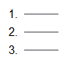
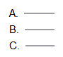
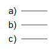
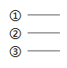
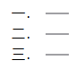
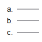

# C# dotnet 带编号项目符号在 OpenXML SDK 对应的枚举值

本文告诉大家在 OpenXML SDK 里面文本框的文本带自动编号的项目符号，不同的编号在 OpenXML SDK 上的枚举值

<!--more-->


<!-- CreateTime:2020/3/26 17:08:16 -->


在 OpenXML SDK 使用 [TextAutoNumberSchemeValues](https://docs.microsoft.com/zh-cn/dotnet/api/documentformat.openxml.drawing.textautonumberschemevalues) 枚举表示自动编号的项目符号使用的自动编号是哪个

本文告诉大家对应的值的枚举值

```
ArabicPeriod  1.2.3.
ArabicParenR  1)2)3)
RomanUpperCharacterPeriod  I. II. III.
RomanLowerCharacterPeriod  i. ii. iii.
AlphaUpperCharacterPeriod  A. B. C.
AlphaLowerCharacterParenR  a) b) c)
AlphaLowerCharacterPeriod  a. b. c.
CircleNumberDoubleBytePlain  ① ② ③
EastAsianJapaneseDoubleBytePeriod  一. 二.
```

## ArabicPeriod

<!--  -->


## RomanUpperCharacterPeriod

<!--  -->


## AlphaUpperCharacterPeriod

<!--  -->


## AlphaLowerCharacterParenR

<!--  -->


## CircleNumberDoubleBytePlain

<!--  -->


## EastAsianJapaneseDoubleBytePeriod

<!--  -->


## AlphaLowerCharacterPeriod

<!--  -->


这就是 PPT 页面上的常用的枚举值


<a rel="license" href="http://creativecommons.org/licenses/by-nc-sa/4.0/"></a><br />本作品采用<a rel="license" href="http://creativecommons.org/licenses/by-nc-sa/4.0/">知识共享署名-非商业性使用-相同方式共享 4.0 国际许可协议</a>进行许可。欢迎转载、使用、重新发布，但务必保留文章署名[林德熙](http://blog.csdn.net/lindexi_gd)(包含链接:http://blog.csdn.net/lindexi_gd )，不得用于商业目的，基于本文修改后的作品务必以相同的许可发布。如有任何疑问，请与我[联系](mailto:lindexi_gd@163.com)。