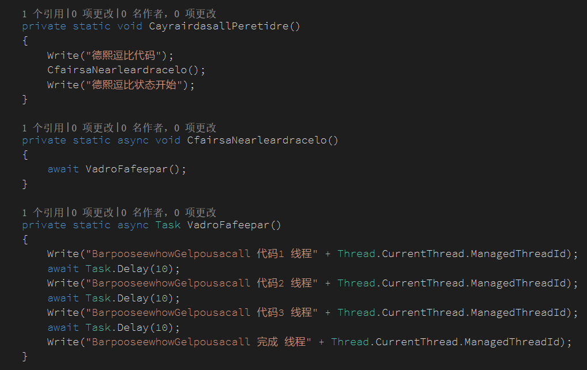

# C＃ await 高级用法

本文告诉大家 await 的高级用法，包括底层原理。

<!--more-->
<!-- CreateTime:2019/8/31 16:55:58 -->


<!-- 标签：C#，await，dotnet -->

昨天看到[太子](https://walterlv.github.io/)写了一段代码，我开始觉得他修改了编译器，要不然下面的代码怎么可以编译通过

```csharp
await "林德熙逗比";
```

需要知道，基本可以添加 await 都是可以等待的类型，如 Task 。如果一个类需要可以被等待，那么这个类必须满足以下条件

 - 类里有一个 GetAwaiter 函数

 - GetAwaiter 有返回值，返回值需要继承 INotifyCompletion 并且有 `bool IsCompleted { get; }`,`GetResult()`,`void OnCompleted(Action continuation)` 定义

参见：[如何实现一个可以用 await 异步等待的 Awaiter - walterlv](https://walterlv.github.io/post/write-custom-awaiter.html )

但是上面的代码使用的是一个字符串，什么时候可以修改继承字符串？

先让我来说下 await 原理，因为知道了原理，上面的代码实现很简单。看完了本文，你就会知道如何让几乎所有类型包括 int 、string 、自定义的类都支持 await 。

如果真的不想看原理，那么请直接调到文章的最后，看到最后很快就知道如何做。

## 原理

在 .net 4.5 之后，框架默认提供 async 和 await 的语法糖，这时千万不要认为进入 await 就会进入一个新的线程，实际上不一定会进入一个新的线程才会调用 await 。

那么 await 的语法糖写的是什么？实际上就是以前的 Begin xx 和 End xx 的语法糖。

古时候的写法：

```csharp
foo.Beginxx();

foo.Endxx(传入委托);
```

这样大家就无法在一个流程写完，需要分为两个东西，而在 Continus with 下，就需要传入委托。如果委托里又使用了异步，那么又需要传入委托

```csharp
       task.ContinueWith(_ =>
            {
                Task t1 = new Task(() => { });
                t1.ContinueWith((t2) =>
                {
                    //可以看到如果进入很多的委托
                });
            });
```

所以这时就使用了 await ，可以让大家按照顺序写。

```csharp
await task;
Task t1 = new Task(() => { });
await t1;
//可以看到这时不需要进入委托
```

实际上 await 是在编译时支持的，请看[进阶篇：以IL为剑，直指async/await - 布鲁克石 - 博客园](http://www.cnblogs.com/brookshi/p/5240510.html )

而且千万不要认为 await 一定会进入一个新的线程，实际上他只是把需要写在多处的代码，可以按照流写下载，和写同步代码一样。如果感兴趣 await 不一定会进入一个新的线程请看 [There Is No Thread](http://blog.stephencleary.com/2013/11/there-is-no-thread.html )

## 使用

因为 await 需要找到一个 GetAwaiter 函数，这个函数即使是扩展方法也可以，所以其实上面的代码是这样写的

```csharp

    public static class KvpbamjhKsvm
    {
        public static HeabdsdnbKevx GetAwaiter(this string str)
        {
            return new HeabdsdnbKevx();
        }
    }

    public class HeabdsdnbKevx : INotifyCompletion
    {
        public bool IsCompleted { get; }

        public void GetResult()
        {
        }

        /// <inheritdoc />
        public void OnCompleted(Action continuation)
        {
        }
    }
```

HeabdsdnbKevx 就是一个可以等待的类型

现在就可以写出下面的代码

```csharp
        private static void Main(string[] args)
        {
            DdngSiwchjux();
        }

        private static async void DdngSiwchjux()
        {
            await "林德熙逗比";
        }
```

当然，上面的这个代码可以运行，不过不会返回什么。下面让我加上一句代码。

```csharp
        private static void Main(string[] args)
        {
            DdngSiwchjux();
        }

        private static async void DdngSiwchjux()
        {
            await "林德熙逗比";
            Console.WriteLine("csdn");
        }
```

这时可以看到，`Console.WriteLine("csdn");`不会运行，因为这时如果在 `OnCompleted` 函数打断点就可以看到，执行`await "林德熙逗比"`之后就进入`OnCompleted` 函数。从上面的原理可以知道，这个函数传入的参数就是两个`await`或 `await`和函数结束之间的代码。如果需要让`Console.WriteLine("csdn");`运行，那么只需要在`OnCompleted`运行参数


```csharp
   public void OnCompleted(Action continuation)
        {
            continuation();
        }
```


但是作为一个挖坑专业的大神，怎么可以就扩展 string ，下面我把 int 进行扩展

```csharp
    public static class KvpbamjhKsvm
    {
        public static HeabdsdnbKevx GetAwaiter(this int dxpbnzSce)
        {
            return new HeabdsdnbKevx();
        }
    }
```

随意写一个值，然后进行等待


现在我准备在 object 加一个扩展方法，所有类型都可以等待，然后把这个扩展方法的 namespace 写为 System ，这样大家就不知道这个是我写的，过了一年我就告诉大家这是 C# 的特性，所有的类都可以等待。但是这个特性需要开光才可以使用，你们直接建的项目没有开光所以没法使用这个特性。

## 等待和不等待的区别

虽然很多时候从原理上看，等待和不等待只是调用时机的问题。但是依旧遇到一些小伙伴一直以为全部的异步方法都需要`await`，看到我写了没有直接`await`的代码觉得很诡异，所以我在这里做个实验给大家看。

下面的代码是最常见的代码，在 `async Task` 的方法使用 `await` ，这样就会等待这个方法完成，代码就和同步代码一样。

```csharp
 await GagarLerecel();
private static async Task GagarLerecel()
```

例如我这样写

```csharp
            await GagarLerecel();

        private static async Task GagarLerecel()
        {
            Write("GagarLerecel 开始");
            await Task.Delay(100);
            Write("GagarLerecel 完成");
        }
```

输出就是按照顺序输出

```csharp
GagarLerecel 开始
GagarLerecel 完成
```

如果我修改一下代码，创建一个新的函数 `CoujafuDarso` 里面的代码和上面函数相同

```csharp
        private static async Task CoujafuDarso()
        {
            Write("CoujafuDarso开始");
            await Task.Delay(100);
            Write("CoujafuDarso结束");
        }
```

但是不在调用 `CoujafuDarso` 使用 await ，而是使用一个变量

```csharp
            var aa = CoujafuDarso();
            Write("其他代码");
            await aa;
```

就是这样的代码，我的小伙伴说，这样写不清真，实际上这样写也是清真的代码。在调用 `CoujafuDarso` 会在代码到第一个 `await` 函数就返回，于是先执行了`CoujafuDarso开始`，然后函数返回，执行`Write("其他代码")`，在最后`await aa`才等待函数把所有代码执行完成。所以可以看到下面输出

```csharp
CoujafuDarso开始
其他代码
CoujafuDarso结束
```

但是不加 await 的呢？也就是函数一直都没有等待，我再写一个函数`BotujawWorpay`

```csharp
        private static async Task BotujawWorpay()
        {
            Write("BotujawWorpay开始");
            await Task.Delay(100);
            Write("BotujawWorpay结束");
        }
```

调用的时候没有等待

```csharp
            BotujawWorpay();
            Write("CesearJemmeme");
```

这时会在输出`CesearJemmeme`之后，某个时间继续执行函数

```csharp
BotujawWorpay开始
CesearJemmeme
BotujawWorpay结束
```

这样和使用 void 函数有什么区别？

在执行的函数遇到第一个 `await` 就会返回，这样就可以继续执行函数下面的代码


<!--  -->


输出下面代码

```csharp
德熙逗比代码
BarpooseewhowGelpousacall 代码1 线程1
德熙逗比状态开始
BarpooseewhowGelpousacall 代码2 线程5
BarpooseewhowGelpousacall 代码3 线程4
BarpooseewhowGelpousacall 完成 线程5
```

## 多线程

不是所有的 await 都会开多线程，如下面的代码

```csharp
       static void Main(string[] args)
        {
            Write("开始");
            Write("线程" + Thread.CurrentThread.ManagedThreadId);

            CeaXisci();
            Task.Run(async () =>
            {
                await Task.Delay(1000);
                MouvaypuNasjo();
            });
            while (true)
            {
                Console.Read();
            }
        }

        private static async Task BarpooseewhowGelpousacall()
        {
            Write("BarpooseewhowGelpousacall 代码1 线程" + Thread.CurrentThread.ManagedThreadId);
            await Task.Delay(10);
            Write("BarpooseewhowGelpousacall 代码2 线程" + Thread.CurrentThread.ManagedThreadId);
            await Task.Delay(10);
            Write("BarpooseewhowGelpousacall 完成 线程" + Thread.CurrentThread.ManagedThreadId);
        }
```

也就是在没有`Task.Delay`分开的代码，只要使用了 await 那么就可以在同个线程运行，请看输出。在最后的`BarpooseewhowGelpousacall 完成`和这个函数后面的代码都在同一个线程运行，而上面的代码，可能是在同个线程，也可能在不同的线程

```csharp
开始
线程1
CeaXisci 开始 线程1
BarpooseewhowGelpousacall 代码1 线程1
BarpooseewhowGelpousacall 代码2 线程5
BarpooseewhowGelpousacall 完成 线程4
CeaXisci 开始 完成4
```


## 相关博客

[使用 Task.Wait()？立刻死锁（deadlock） - walterlv](https://walterlv.github.io/post/deadlock-in-task-wait.html )

[如何实现一个可以用 await 异步等待的 Awaiter](https://walterlv.github.io/post/write-custom-awaiter.html)

<a rel="license" href="http://creativecommons.org/licenses/by-nc-sa/4.0/"></a><br />本作品采用<a rel="license" href="http://creativecommons.org/licenses/by-nc-sa/4.0/">知识共享署名-非商业性使用-相同方式共享 4.0 国际许可协议</a>进行许可。欢迎转载、使用、重新发布，但务必保留文章署名[林德熙](http://blog.csdn.net/lindexi_gd)(包含链接:http://blog.csdn.net/lindexi_gd )，不得用于商业目的，基于本文修改后的作品务必以相同的许可发布。如有任何疑问，请与我[联系](mailto:lindexi_gd@163.com)。
