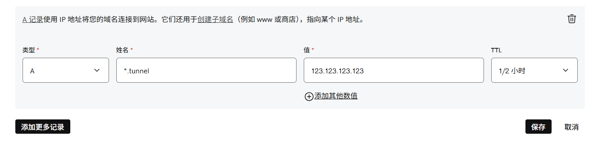

# FastTunnel 搭配 nginx 将本地内网电脑 HTTP 服务公开到子域名公网访问

本文记录我使用 FastTunnel 工具的笔记

<!--more-->
<!-- 发布 -->
<!-- 博客 -->

我使用 nginx 的目的是为了在网关这一层用 HTTPS 顶着。如果没有 HTTPS 需求的同学，大可不必按照本文提供的方式配置

准备工作：

- 一台有公网 IP 的服务器
- 一个域名和其对应的 DNS 配置
- 一个好心态

遇到问题不要慌，有问题进 935214348 群里交流

先随便找一个 nginx 配置工具来辅助在服务器上配置。在有公网 IP 的服务器上部署上 nginx 服务，配置 nginx 自动续证书。这一步都是很常用的，大家可以随便在网上搜

假定我现在准备配置 `*.tunnel.lindexi.com` 泛域名给到 FastTunnel 使用。如此我可以在客户端上面直接配置其子域名给到本地内网电脑的 HTTP 服务

先到域名提供商，添加一个 A 记录，将 `*.tunnel.lindexi.com` 配置指向服务器的 IP 地址

<!--  -->

注： 此时 A 记录的 Name 应该是 `*.tunnel` 而不是 `*.tunnel.lindexi.com` 哦

再进入到 nginx 里面，配置监听域名为 `*.tunnel.lindexi.com` 且开启 SSL 的方式，路径转发写为从 `/` 转发到 `http://127.0.0.1:1270` 上。这里的 `http://127.0.0.1:1270` 中的 1270 就是 FastTunnel 的默认端口。转发时带上 host 头信息。以下是我的 nginx 配置

```nginx
  server {
    server_name *.tunnel.lindexi.com;
    listen 443 ssl;
    http2 on;
    ssl_certificate /home/lindexi/Assets/.acme.sh/*.tunnel.lindexi.com/fullchain.cer;
    ssl_certificate_key /home/lindexi/Assets/.acme.sh/*.tunnel.lindexi.com/*.tunnel.lindexi.com.key;
    ssl_protocols TLSv1 TLSv1.1 TLSv1.2 TLSv1.3;
    location / {
      proxy_pass http://127.0.0.1:1270;
      proxy_set_header Host $host;
      proxy_set_header X-Real-IP $remote_addr;
      proxy_set_header X-Forwarded-For $proxy_add_x_forwarded_for;
      proxy_set_header X-Forwarded-Host $http_host;
      proxy_set_header X-Forwarded-Port $server_port;
      proxy_set_header X-Forwarded-Proto $scheme;
      proxy_http_version 1.1;
      proxy_set_header Upgrade $http_upgrade;
      proxy_set_header Connection "upgrade";
      add_header Access-Control-Allow-Origin *;
      add_header Access-Control-Allow-Methods *;
      add_header Access-Control-Allow-Headers *;
      add_header Access-Control-Allow-Credentials true;
      if ($request_method = 'OPTIONS') {
        return 204;
      }
    }
  }
```

我在 nginx 上只监听 443 端口，没有做 http 到 https 的跳转。这就意味着后续调试的时候，必须使用 https 访问，不能使用 http 访问

修改 FastTunnel 的配置，核心修改点只是 `FastTunnel.WebDomain` 和 `FastTunnel.Tokens` 而已，其配置文件代码如下

```json
{
  "Serilog": {
    "Using": [ "Serilog.Sinks.Console", "Serilog.Sinks.File" ],
    "MinimumLevel": {
      "Default": "Information",
      "Override": {
        "Microsoft": "Warning",
        "Yarp.ReverseProxy": "Warning",
        "Microsoft.Hosting.Lifetime": "Information"
      }
    },
    "WriteTo": [
      //{
      //  "Name": "File",
      //  "Args": {
      //    "path": "Logs/log-.log",
      //    "rollingInterval": 3
      //  }
      //}
    ]
  },
  "AllowedHosts": "*",
  // Http&客户端通讯端口
  "urls": "http://*:1270",
  // 是否启用文件日志输出
  "EnableFileLog": false,
  "FastTunnel": {
    // 可选，绑定的根域名，
    // 客户端需配置SubDomain，实现 ${SubDomain}.${WebDomain}访问内网的站点，注意：需要通过域名访问网站时必选。
    "WebDomain": "tunnel.lindexi.com",

    // 可选，访问白名单，为空时：所有人有权限访问，不为空时：不在白名单的ip拒绝。
     //"WebAllowAccessIps": [ "192.168.0.101" ],

    // 可选，是否开启端口转发代理，禁用后不处理Forward类型端口转发.默认false。
    "EnableForward": true,

    // 可选，当不为空时，客户端也必须携带Tokens中的任意一个token，否则拒绝登录。
    "Tokens": [ "lindexiisdoubi" ]
    //,

    /**
    * 访问api接口的JWT配置
    */
    //"Api": {
    //  "JWT": {
    //    "ClockSkew": 10,
    //    "ValidAudience": "https://suidao.io",
    //    "ValidIssuer": "FastTunnel",
    //    "IssuerSigningKey": "This is IssuerSigningKey",
    //    "Expires": 120
    //  },
    //  "Accounts": [
    //    {
    //      "Name": "admin",
    //      "Password": "admin123"
    //    }
    //  ]
    //}
  },
  "ServerSettings": {
    // 必选 默认值
    "BindAddr": "0.0.0.0",
    // 必选 默认值
    "BindPort": 1271,
    // 自定义域名web穿透必须
    "WebDomain": "tunnel.lindexi.com",
    // 服务监听的端口号, 访问自定义域名站点时url为 http://{SubDomain}.{Domain}:{ProxyPort_HTTP}/
    // web穿透必须
    "WebProxyPort": 1273, // 没用
    // 可选，ngixn反向代理后可省略域名后的端口号进行访问
    "WebHasNginxProxy": true, // 没用
    // // 可选，访问白名单，不在白名单的ip拒绝
    // "WebAllowAccessIps": [],
    // 可选，是否开启SSH，禁用后不处理SSH类型端口转发.默认false。
    "SSHEnabled": false // 没用
  }
}
```

我前面有 nginx 挡着，后续的访问是不需要带端口号的，在 nginx 上已经配置了转发规则了

我为了提升一点点安全性，也就配置了 Tokens 属性。其他属性就都保持默认

将 FastTunnel 连同其 `config\appsettings.json` 配置文件扔到服务器上跑起来。能够看到输出 `Now listening on: http://[::]:1270` 则代表运行成功

如此就完成服务端配置了，接下来打开客户端的 appsettings.json 配置文件，添加客户端的配置内容

我准备将我本地的 http://127.0.0.1:56622 服务开放出去，让其他人可以使用 `api.tunnel.lindexi.com` 方式访问到。我的配置内容如下

```json
{
  "Serilog": {
    "Using": [ "Serilog.Sinks.Console", "Serilog.Sinks.File" ],
    "MinimumLevel": {
      "Default": "Information",
      "Override": {
        "Microsoft": "Warning",
        "Microsoft.Hosting.Lifetime": "Information"
      }
    },
    "WriteTo": [
      //{
      //  "Name": "File",
      //  "Args": {
      //    "path": "Logs/log-.log",
      //    "rollingInterval": 3
      //  }
      //}
    ]
  },
  "FastTunnel": {
    "Server": {
      // [必选] 服务端ip/域名（来自服务端配置文件的urls参数）
      "ServerAddr": "123.123.123.123",
      // [必选] 服务端监听的通信端口（来自服务端配置文件的urls参数）
      "ServerPort": 1270
    },

    // [可选]，服务端Token，必须与服务端配置一致，否则拒绝登录。
    "Token": "lindexiisdoubi",
    /**
     * [可选] 内网web节点配置
     */
    "Webs": [
      {
        // [必选] 内网站点所在内网的ip
        "LocalIp": "127.0.0.1",
        // [必选] 内网站点监听的端口号
        "LocalPort": 56622,

        // [必选] 子域名, 访问本站点时的url为 http://${SubDomain}.${WebDomain}:${ServerPort}
        "SubDomain": "api"

        // [可选] 附加域名，需要解析CNAME或A记录至当前子域名
        // "WWW": [ "www.abc.com", "test111.test.cc" ]
      }
    ],

    /**
     * [可选] 端口转发 通过专用端口代理，不需要有自己的域名
     * 可穿透所有TCP上层协议
     * 远程linux示例：#ssh -oPort=12701 {root}@{ServerAddr} ServerAddr 填入服务端ip，root对应内网用户名
     * 通过服务端返回的访问方式进行访问即可
     */
    "Forwards": [
      {
        // [必选] 内网服务所在主机ip
        "LocalIp": "127.0.0.1",
        // [必选] 内网服务监听端口 windows远程桌面端口为3389
        "LocalPort": 123,
        // [必选] 服务端端口 访问 服务端ip:1274 即可实现远程window桌面
        "RemotePort": 1274,
        // [可选] 通讯协议，可选值TCP,UDP,默认值TCP
        "Protocol": "TCP"
      }
    ]
  }
}
```

以上核心配置内容是 `FastTunnel.Server` 的 ServerAddr 地址，将其换成你的服务器的 IP 地址。还要 Token 换成服务器端的配置字符串内容。最后的配置是本地的 `FastTunnel.Webs` 的 LocalIp 、LocalPort、SubDomain 信息

完成之后，启动客户端。如果能看到大概如下内容，则证明配置成功

```
[19:37:22 INF] ===== FastTunnel Client Start =====
[19:37:22 INF] 正在连接服务端 123.123.123.123:1270
[19:37:23 INF] 穿透协议 | 映射关系（公网=>内网）
[19:37:23 INF]   HTTP   | http://api.tunnel.lindexi.com:1270 => 127.0.0.1:56622
[19:37:23 INF]   TCP    | tunnel.lindexi.com:1274 => 127.0.0.1:123
```

此时就可以开始使用 `https://api.tunnel.lindexi.com` 来访问本地内网电脑的 `127.0.0.1:56622` 服务了

整个访问过程都是包裹在 https 里面，相对来说比较安全