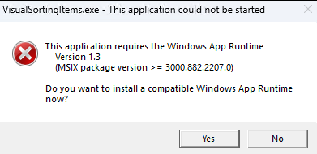

# Fixing "Missing Windows App Runtime Environment" Prompt for Unpackaged WinUI 3 Applications

This article will tell you how to fix the prompt for a missing Windows App Runtime environment when running non-packaged WinUI 3 applications on a customer's machine.

<!--more-->
<!-- 发布 -->
<!-- 博客 -->

The prompt for a missing Windows App Runtime environment on the user's machine looks something like this:

> This application requires the Windows App Runtime
>
> Version 1.3
>
> (MSIX package version >= 3000.882.2207.0)
>
> Do you want to install a compatible Windows App Runtime now?

<!--  -->


Clicking "Yes" will take you to the [https://learn.microsoft.com/en-us/windows/apps/windows-app-sdk/downloads](https://learn.microsoft.com/en-us/windows/apps/windows-app-sdk/downloads) download page.

To fix this issue, you can download and install the Windows App Runtime installation package, WindowsAppRuntimeInstall.exe.

However, if an application requires users to install additional files like WindowsAppRuntimeInstall.exe, it is not ideal. This article will tell you how to make WinUI 3 applications work like traditional Win32 applications, where you can simply copy and run them on a user's machine.

Step 1: Make sure the Microsoft.WindowsAppSDK NuGet package is version 1.2 or higher. The latest version as of 2023.6.15 is 1.3.230602002. According to the [official documentation](https://learn.microsoft.com/en-us/windows/apps/package-and-deploy/self-contained-deploy/deploy-self-contained-apps), the `WindowsAppSdkUndockedRegFreeWinRTInitialize` feature was added in version 1.2. To avoid the prompt mentioned above, it is best to have the `WindowsAppSdkUndockedRegFreeWinRTInitialize` feature.

Step 2: Configure the csproj project file by setting WindowsAppSDKSelfContained to true and WindowsPackageType to None. By default, when WindowsAppSDKSelfContained is set to true and WindowsPackageType is set to None, WindowsAppSdkUndockedRegFreeWinRTInitialize is automatically configured to true in the SDK.

The modified csproj project file looks something like this:

```xml
<Project Sdk="Microsoft.NET.Sdk">

  <PropertyGroup>
    <OutputType>WinExe</OutputType>
    <TargetFramework>net6.0-windows10.0.19041</TargetFramework>
    <Nullable>enable</Nullable>
    <UseWinUI>true</UseWinUI>
    <Platforms>x86;x64;x86</Platforms>
    <RuntimeIdentifiers>win10-x86;win10-x64</RuntimeIdentifiers>

    <!-- The following two lines of code are the core -->
    <WindowsAppSDKSelfContained>true</WindowsAppSDKSelfContained>
    <WindowsPackageType>None</WindowsPackageType>
  </PropertyGroup>
  <ItemGroup>
    <PackageReference Include="Microsoft.WindowsAppSDK" Version="1.3.230602002" />
    <PackageReference Include="Microsoft.Windows.SDK.BuildTools" Version="10.0.22621.756" />
  </ItemGroup>
</Project>
```

After making the above modifications, you can independently publish the application without requiring users to install the Windows App Runtime environment. Simply double-click to run the application.

As there is currently a lack of official documentation on WindowsAppSdkUndockedRegFreeWinRTInitialize and UndockedRegFreeWinRT, I am not familiar with the details of this knowledge. If you are interested, please explore it on your own.

中文博客：[WinUI 3 修复非打包应用运行提示缺少 Windows App Runtime 环境](https://blog.lindexi.com/post/WinUI-3-%E4%BF%AE%E5%A4%8D%E9%9D%9E%E6%89%93%E5%8C%85%E5%BA%94%E7%94%A8%E8%BF%90%E8%A1%8C%E6%8F%90%E7%A4%BA%E7%BC%BA%E5%B0%91-Windows-App-Runtime-%E7%8E%AF%E5%A2%83.html )