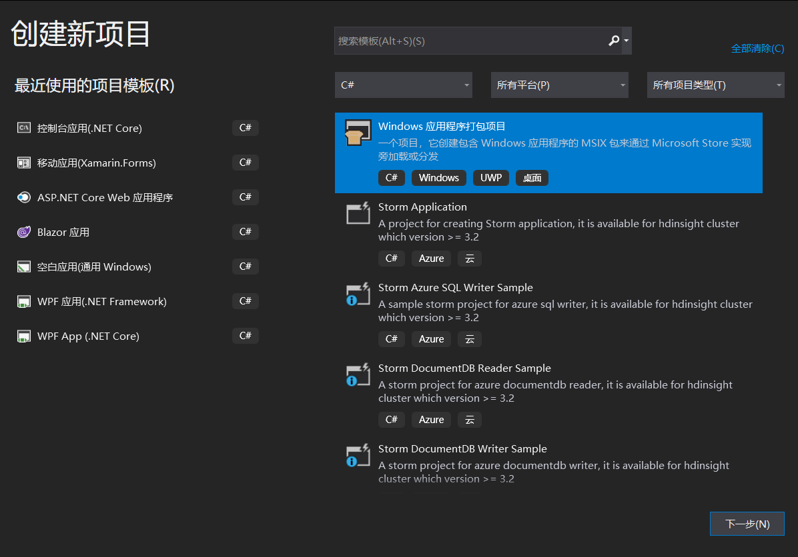
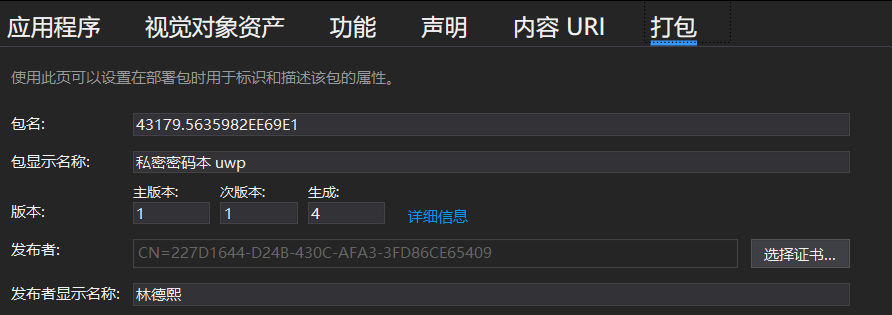
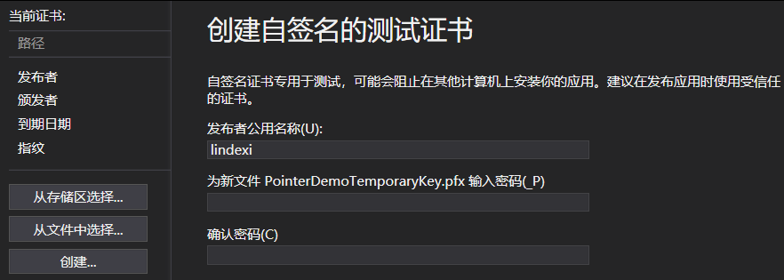
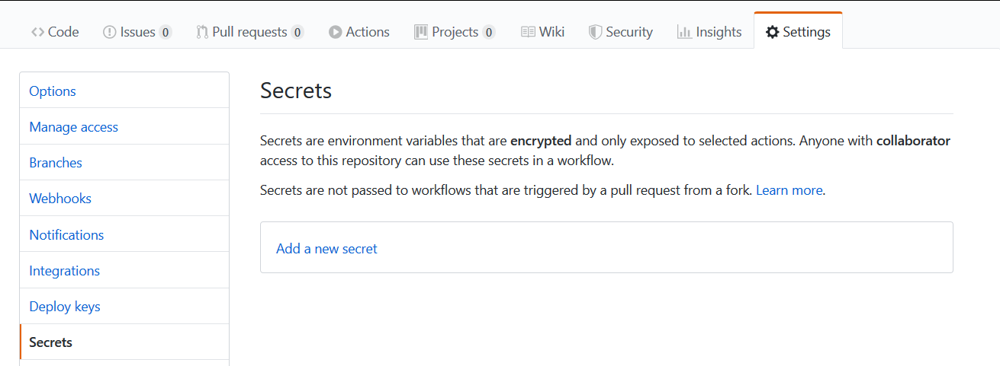
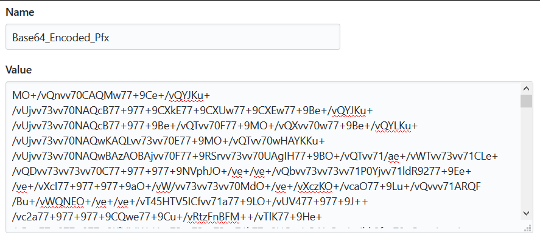
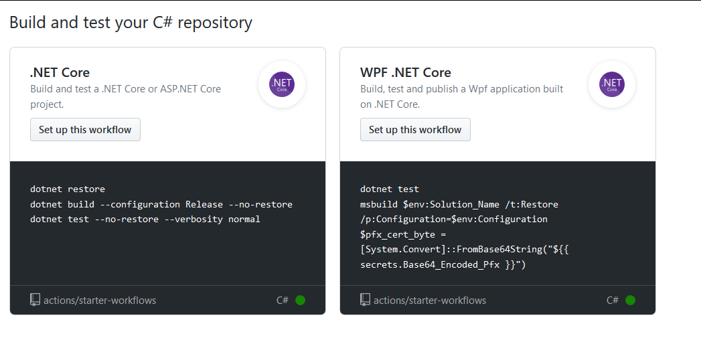

# GitHub Action 新上线 WPF .NET Core 自动构建模板

在很土豪的微软免费给大家提供 GitHub 的构建服务器受到了小伙伴们的一堆好评之后，微软最近推出了 WPF 的 .NET Core 版本的模板，可以快速上手 WPF 项目的自动构建，支持自动进行单元测试和打包，同时输出打包的文件

<!--more-->


<!-- 发布 -->

首先需要创建一个 WPF 项目，最简单的创建方法就是通过下面一句命令行

```csharp
dotnet new wpf -o Foo
```

此时就创建了一个叫 Foo 的 WPF 项目了，接下来通过 VisualStudio 打开这个项目，咱现在准备放在 GitHub 上进行自动构建，然后打包一个UWP包出来

可以通过 VisualStudio 新建一个打包项目，这个打包项目就可以将 win32 应用打包为 UWP 包

<!--  -->


暂时先使用测试的证书，创建测试证书的方法就是双击打包项目的 Package.appxmanifest 文件，点击打包，然后点击选择证书

<!--  -->


点击创建然后输入名字点击确定就可以，请看下图

<!--  -->


此时就创建了 `Foo_TemporaryKey.pfx` 证书文件，当然你的证书名应该和我不相同

在进行 GitHub 的 Action 构建的时候，需要将证书作为 base64 存放，存放在 GitHub 的凭据里面，这样能保持项目的安全

在使用 dotnet 的时候，有一个特别好用的功能叫 dotnet tool 通过这个功能，可以使用很多大佬写的工具，当然就包括了将文件转换为 base64 的工具啦

我上次告诉小伙伴，请他的 dotnet base64 项目添加文件的支持 https://github.com/Towmeykaw/dotnet-base64/issues/2 然后小伙伴很快就支持了这个功能，此时可以通过一句命令安装这个工具

```csharp
dotnet tool install -g dotnet-base64
```

接下来就可以通过 `base64` 这个命令将文件转换为 base64 了，尝试进入到打包项目里面，假设打包项目的测试证书文件是  `Foo_TemporaryKey.pfx` 文件，那么输入下面代码就可以看到将证书文件转换为 base64 字符串

```csharp
base64 -f Foo_TemporaryKey.pfx
```

当然，输出到控制台不是很好复制，使用下面代码可以让这个工具输出到文件里面

```csharp
base64 -f Foo_TemporaryKey.pfx -o base64.txt
```

此时就可以拿到了 base64 文件了

打开 GitHub 的项目的设置，进入到 Secrets 页面

<!--  -->


点击 Add a new secret 新建保密信息

此时输入 Base64_Encoded_Pfx 作为保密信息名，内容请填写刚才转换的 base64 的内容。此时填写的保密信息名将和创建的模板的内容相同，就不需要做更多的更改

<!--  -->


点击添加，然后进入 Action 页面

<!--  -->


此时可以看到新推出的 WPF 构建项目

点击 set up this workflow 按钮就可以进行创建，此时需要填写的内容如下

```csharp
    env:
      Solution_Name: your-solution-name                         # 替换为解决方案名 如 MyWpfApp.sln.
      Test_Project_Path: your-test-project-path                 # 替换为测试项目的路径 如 MyWpfApp.Tests\MyWpfApp.Tests.csproj.
      Wap_Project_Directory: your-wap-project-directory-name    # 替换为相对于解决方案的打包项目文件夹 如 MyWpfApp.Package.
      Wap_Project_Path: your-wap-project-path                   # 替换为打包项目文件路径 如 MyWpf.App.Package\MyWpfApp.Package.wapproj.
```

替换完成之后点击 Start commit 就完成啦

等待打包完成之后，会自动上传到 artifacts 可以下载，下载的内容就是 UWP 包


<a rel="license" href="http://creativecommons.org/licenses/by-nc-sa/4.0/"></a><br />本作品采用<a rel="license" href="http://creativecommons.org/licenses/by-nc-sa/4.0/">知识共享署名-非商业性使用-相同方式共享 4.0 国际许可协议</a>进行许可。欢迎转载、使用、重新发布，但务必保留文章署名[林德熙](http://blog.csdn.net/lindexi_gd)(包含链接:http://blog.csdn.net/lindexi_gd )，不得用于商业目的，基于本文修改后的作品务必以相同的许可发布。如有任何疑问，请与我[联系](mailto:lindexi_gd@163.com)。