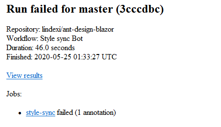
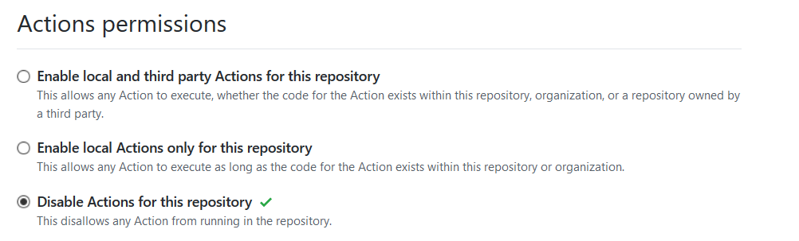

# GitHub 的 Action 如何禁用

我 Fork 了小伙伴的 ant-design-blazor 仓库，这个仓库设置了每天自动同步样式，这个 Action 用到了源仓库的密钥，在我 Fork 的仓库一定跑不通过，于是每天我就收到一次构建不通过的信息。本文告诉大家如何禁用自己 Fork 的某个仓库的 Action 的执行

<!--more-->


<!-- CreateTime:5/25/2020 9:36:22 AM -->

<!-- 发布 -->

这是我 Fork 的 [ant-design-blazor](https://github.com/lindexi/ant-design-blazor )仓库，每天都告诉我构建失败

<!--  -->


解决方法是禁用这个 Fork 仓库的 Action 构建，毕竟需要自动构建的都是将代码推送到源仓库，此时源仓库的 Action 都能触发，也就是我的仓库的 Action 其实没啥用

点击仓库的设置，进入 Actions 页面，点击禁用

<!--  -->


如果我表示不让所有 Fork 我的仓库的小伙伴都需要做这个设置，我想要让我的代码仅仅只是在我的仓库运行，可以如何做？简单的方法是添加一个判断

```
if: github.repository == 'lindexi/doubi'
```

别的小伙伴 Fork 仓库的时候，拿到 repository 的值就是 `小伙伴的名字/doubi` 也就是判断不等于我的仓库，代码就不执行

上面的 `lindexi/doubi` 的意思就是 `用户名或组织名/项目名` 这就会跟随用户的 Fork 仓库修改值

那么这个 if 判断可以写在哪里？可以放在具体的构建步骤里面，如下面代码

```
    - name: Build with dotnet
      run: dotnet build --configuration Release
      if: github.repository == 'lindexi/doubi'
```

上面代码设置了只有在 lindexi 的 doubi 仓库才进行构建

如果不是干掉某个步骤，而是需要让整个 job 都不执行，可以在 job 下面使用 if 判断

```yaml
jobs:
  build:
    runs-on: windows-latest
    if: github.repository == 'lindexi/doubi'
```

当然，判断仓库的拥有者也不错，请看代码

```
    if: github.repository_owner == 'lindexi'
```

更多请看 [GitHub 操作的工作流程语法 - GitHub 帮助](https://help.github.com/cn/actions/reference/workflow-syntax-for-github-actions )

[Context and expression syntax for GitHub Actions - GitHub Help](https://help.github.com/en/actions/reference/context-and-expression-syntax-for-github-actions )


<a rel="license" href="http://creativecommons.org/licenses/by-nc-sa/4.0/"></a><br />本作品采用<a rel="license" href="http://creativecommons.org/licenses/by-nc-sa/4.0/">知识共享署名-非商业性使用-相同方式共享 4.0 国际许可协议</a>进行许可。欢迎转载、使用、重新发布，但务必保留文章署名[林德熙](http://blog.csdn.net/lindexi_gd)(包含链接:http://blog.csdn.net/lindexi_gd )，不得用于商业目的，基于本文修改后的作品务必以相同的许可发布。如有任何疑问，请与我[联系](mailto:lindexi_gd@163.com)。