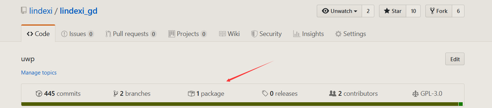
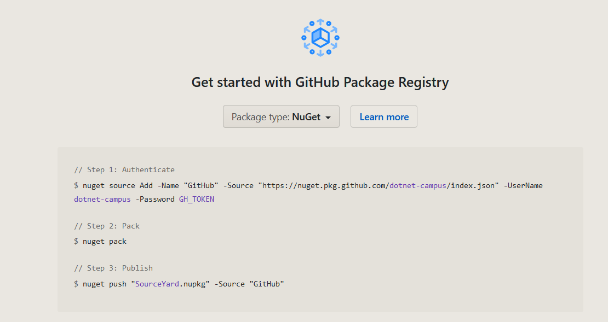
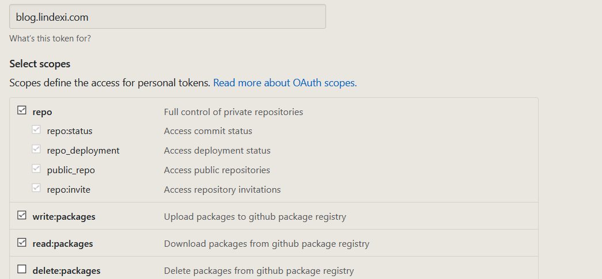
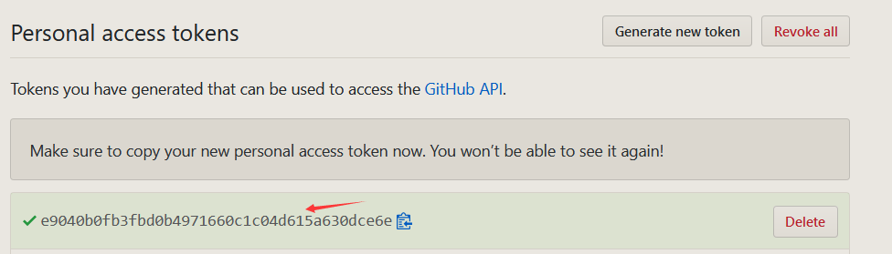
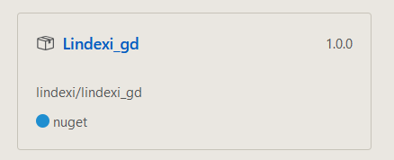

# Github 给仓库上传 NuGet 库

在 Github 可以发布自己的 NuGet 库，本文将告诉大家如何发布

<!--more-->
<!-- CreateTime:2020/1/6 21:20:46 -->

<!-- csdn -->

在 Github 的仓库的首页，可以看到 Package 功能

<!--  -->


点击打开一个项目的 Package 默认会邀请你加入，点击开启功能

<!--  -->


在 Github 会显示如何做 NuGet 的上传，上面的 `GH_TOKEN` 就是自己生成的代表自己密码，请看文档 [创建用于命令行的个人访问令牌 - GitHub 帮助](https://help.github.com/cn/articles/creating-a-personal-access-token-for-the-command-line )

大概的方法就是点击 Settings -> Developer settings -> Personal access tokens 如下图


单击 Generate new token（生成新令牌）


输入随意的名字，然后注意勾选 Package 权限，也就是 `write:packages` 和 `read:packages` 权限

<!--  -->


将页面拉到最下，点击 Generate token 按钮就可以创建密码

如图片的 `e9040b0fb3fbd0b4971660c1c04d615a630dce6e` 就是我创建的密码，这个密码请保存起来，因为刷新页面就看不到了

<!--  -->


然后在对应的仓库配置密码，在默认打开 package 页面的时候就可以看到

```csharp
 // Step 1: Authenticate
$ nuget source Add -Name "GitHub" -Source "https://nuget.pkg.github.com/lindexi/index.json" -UserName lindexi -Password GH_TOKEN

// Step 2: Pack
$ nuget pack

// Step 3: Publish
$ nuget push "lindexi_gd.nupkg" -Source "GitHub" 
```

小伙伴的第一步的 Source 的内容请替换为你自己的仓库的内容，还需要替换的是刚才 github 生成的 `GH_TOKEN` 密码

如我将 `GH_TOKEN` 替换为上面复制的密码，对每个组织和个人创建一个 Name 所以我就将上面的 `GitHub` 替换为 GitHubLindexi 这样就可以设置上传

```csharp
nuget source Add -Name "GitHubLindexi" -Source "https://nuget.pkg.github.com/lindexi/index.json" -UserName lindexi -Password e9040b0fb3fbd0b4971660c1c04d615a630dce6e
```

接下来创建一个测试的 NuGet 包

```csharp
dotnet new console -o Lindexi_gd
```

然后编译生成 NuGet 库

```csharp
cd Lindexi_gd
dotnet pack
cd bin\Debug
```

在 `bin\Debug` 文件夹可以看到 nupkg 文件，用下面命令上传

```csharp
nuget push Lindexi_gd.1.0.0.nupkg -Source GithubLindexi
```

刷新一下页面就可以看到上传的文件

<!--  -->


如果在上传的时候提示下面代码

```csharp
RepoAcceptsPackageUploads: Repository "lindexi/HehuhallqaLinearjeebar.Source" does not exist.
```

原因是要求 NuGet 库的 id 必须要在对应的 github 组织找到对应的仓库，如我上面上传 HehuhallqaLinearjeebar.Source.1.0.0.nupkg 文件，但是我没有 HehuhallqaLinearjeebar.Source 仓库，所以提示不能上传

此时可以通过在 `.nuspec` 文件添加 repository 属性，格式如下

```csharp
<repository type="git" url="https://github.com/lindexi/HehuhallqaLinearjeebar"/>
```

这样多个库可以使用相同仓库，上面代码需要写到 package 的 metadata 才能使用

```csharp
<package xmlns="http://schemas.microsoft.com/packaging/2010/07/nuspec.xsd">
    <metadata>
      <id>HehuhallqaLinearjeebar.Source</id>
      <version>1.0.3</version>
      <authors>lindexi</authors>
      <description>Sample exists only to show a sample .nuspec file.</description>
      <language>en-US</language>
      <repository type="git" url="https://github.com/lindexi/HehuhallqaLinearjeebar"/>
    </metadata>
</package>
```

如果是在 csporj 可以通过添加下面属性

```xml
    <RepositoryType>git</RepositoryType>
    <RepositoryUrl>https://github.com/lindexi/UWP</RepositoryUrl>
```

注意 RepositoryUrl 的格式是 用户名/仓库 如果自己的上传的文件是在仓库里面的文件夹，请写在 PackageProjectUrl 属性

<a rel="license" href="http://creativecommons.org/licenses/by-nc-sa/4.0/"></a><br />本作品采用<a rel="license" href="http://creativecommons.org/licenses/by-nc-sa/4.0/">知识共享署名-非商业性使用-相同方式共享 4.0 国际许可协议</a>进行许可。欢迎转载、使用、重新发布，但务必保留文章署名[林德熙](http://blog.csdn.net/lindexi_gd)(包含链接:http://blog.csdn.net/lindexi_gd )，不得用于商业目的，基于本文修改后的作品务必以相同的许可发布。如有任何疑问，请与我[联系](mailto:lindexi_gd@163.com)。 
