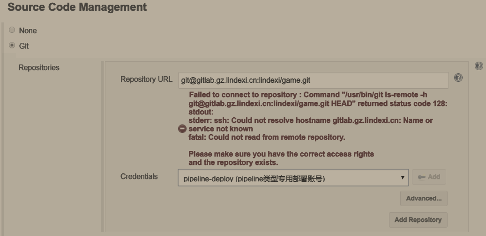
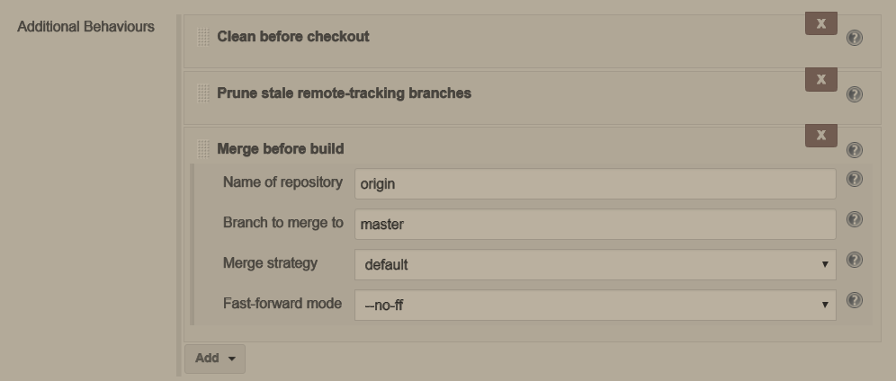
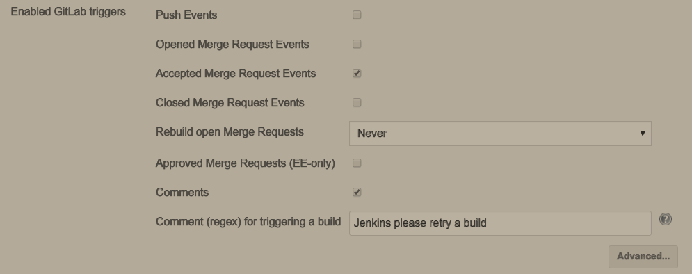
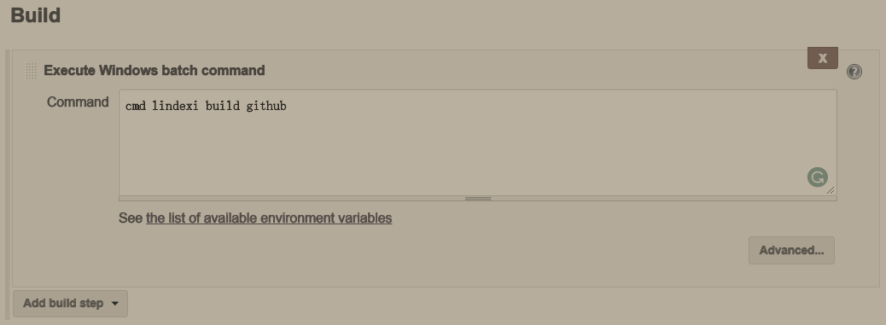
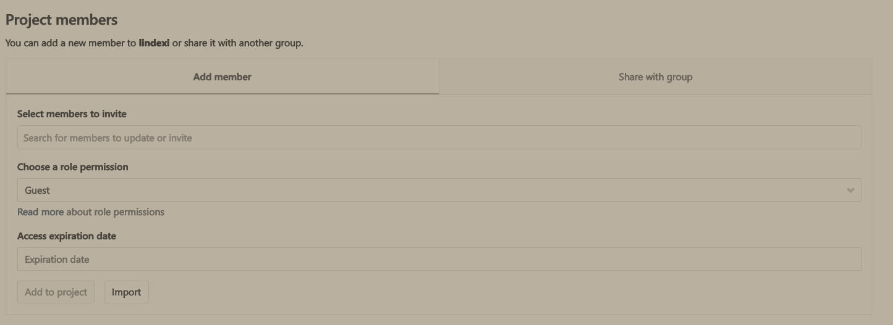
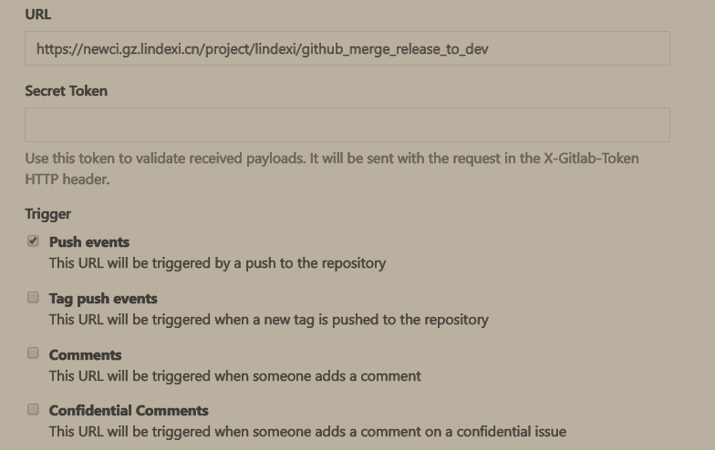
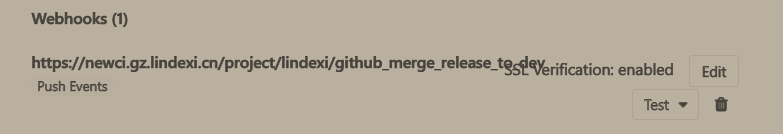
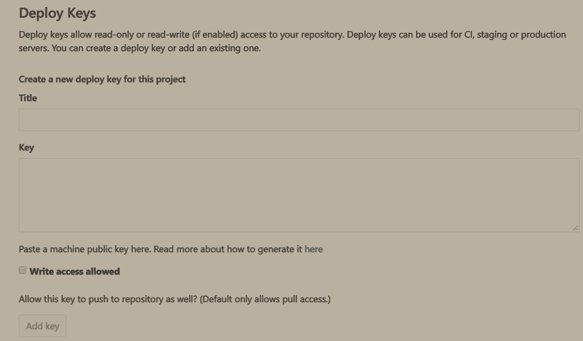

# Jenkins 配置自动合并 release 分支到 master 分支

本文告诉大家如何在 Jenkins 配置合并到 release 的内容自动合并到 gitlab 的 master 分支

<!--more-->
<!-- CreateTime:2019/8/30 8:54:58 -->

<!-- 标签：Jenkins -->

首先需要两个仓库，一个是 gitlab 的仓库，另一个是 Jenkins 的仓库

先在 Jenkins 仓库做配置，首先设置 Source Code Management 选择自己需要的仓库和设置好的账号

<!--  -->


然后在 Branches to build 添加分支，这里需要将 release 合 master 所以就填写 release 就可以

<!--  -->


在 Additional Behaviours 添加三个值，一个是 Clean before checkout 这样可以清空仓库，第二个是 Prune stale remote-tracking branches 让本地和远程同步。

注意，第二个 Prune stale remote-tracking branches 很重要，如果有小伙伴上传了这样两个分支

```csharp
t/lindexi
t/lindexi/github
```

那么即使小伙伴在上传第一个分支之后，删除了第一个分支再上传第二个分支，可能 Jenkins 也无法加载

第三个就是 Merge before build 请看图片，设置仓库是哪个，设置推送的分支

<!--  -->


为了在用户推送的时候合并，就需要在 Build Triggers 添加 Build when a change is pushed to GitLab. 这样就可以添加 web hook 在打钩之后可以看到下面有一个链接，如下面是我的链接，这个链接会在之后设置到 gitlab 所以暂时需要记下

https://newci.gz.lindexi.cn/project/lindexi/github_merge_release_to_dev

这里可以通过很多个设置，在 `Push Events` 执行这个仓库或者在 `Accepted Merge Request Events` 执行，可以全部打钩

<!--  -->


下面就是 Build 这里可以写编译的内容，我下面执行了一些代码

<!--  -->


只有在编译成功我才可以让 release 合并到 master 分支，如果编译不成功就不能合并

在 Post-build Actions 添加 Git Publisher 功能，第一个是 Push Only If Build Succeeds 也就是在上面的 Build 编译成功之后才会执行

点击 Add Branch 添加一个新的合并分支，需要从 release 合并到 master 就可以和我下面一样写，如果是从 release 合并到 dev 分支就自己在下面写 dev 就可以

<!--   -->


点击保存就设置完成，下面就是设置 gitlab 让 gitlab 可以支持 Jenkins 推送

点击设置成员，添加 Jenkins 成员

<!--  -->


点击 Integrations 添加 webhook 这里需要填写刚才 Jenkins 的链接，我的链接是 https://newci.gz.lindexi.cn/project/lindexi/github_merge_release_to_dev 大家可不要没事就来攻击我的服务器

填写之后需要勾选 Push events 这样有人上传就可以自动合并 release 到 master 而不需要自己手动合并

<!--  -->


在添加之后可以看到有 Test 按钮，点击可以模拟一个 push 的测试

<!--  -->


点击测试看 Jenkins 是否自动执行，如果有就是设置成功

可能因为合并的 master 分支没有推送，需要点击 repository 设置 Protected Branches 允许 maintainers 推送，设置 Jenkins 的账号是 maintainers 这样就可以推送

可能这时会发现没有 `GitLab: This deploy key does not have write access to this project` 可以在 repository 设置 Deploy Keys 请看下面

<!--  -->


具体设置请看 [Using GIT deploy key in Jenkins](https://blogs.perficient.com/2014/03/26/using-git-deploy-key-in-jenkins-written-by-tom-tang/ )

[使用jenkins+gitlab进行CI - haungtengxiao](https://huangtengxiao.gitee.io/post/%E4%BD%BF%E7%94%A8jenkins+gitlab%E8%BF%9B%E8%A1%8CCI.html )


<a rel="license" href="http://creativecommons.org/licenses/by-nc-sa/4.0/"></a><br />本作品采用<a rel="license" href="http://creativecommons.org/licenses/by-nc-sa/4.0/">知识共享署名-非商业性使用-相同方式共享 4.0 国际许可协议</a>进行许可。欢迎转载、使用、重新发布，但务必保留文章署名[林德熙](http://blog.csdn.net/lindexi_gd)(包含链接:http://blog.csdn.net/lindexi_gd )，不得用于商业目的，基于本文修改后的作品务必以相同的许可发布。如有任何疑问，请与我[联系](mailto:lindexi_gd@163.com)。  
