# Latex 论文elsevier，手把手如何用Latex写论文

这几天在开始写论文，准备发的是elsevier，这个网站的instruction有问题，下载的东西基本上好多的错误，所以我就写博客记录。

<!--more-->


<div id="toc"></div>
<!-- 标签：Latex -->

关于使用 Latex 的好处请看[使用LaTeX写论文 - CSDN博客](https://blog.csdn.net/jiafgn/article/details/73065589 )

在开始的时候需要先安装工具

## 下载

这里需要我们先安装 Latex ，我安装的是 Ctex 安装地址是 [CTEX](https://mirrors.tuna.tsinghua.edu.cn/ctex/legacy/2.9/ )

我这里下载的是 CTeX_2.9.2.164.exe 如果没法使用请和我说：[lindexi_gd@163.com](mailto:lindexi_gd@163.com) 

<!-- 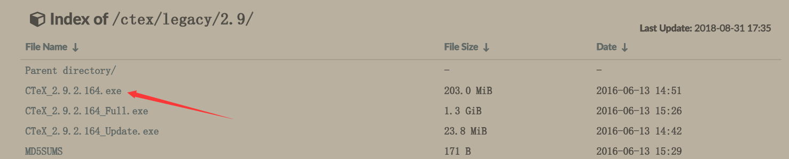 -->


本文还需要下载 `basic-miktex-2.9.6069-x64` 工具，可以到 [http://miktex.org/](http://miktex.org/) 下载，或者在本文最后点击我的网盘下载。如果不能下载请和我说。

我们首先安装Ctex，一路下一步，注意可以安装到D盘，不一定需要C盘。

## 安装

先安装 Ctex 双击打开安装包

### 安装 Ctex 详细步骤

如果你是比较熟悉安装软件的大神，请跳过本章

1. 选择语言

<!-- 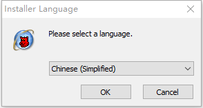 -->


1. 点击下一步，可以看到下面很多时候我都说下一步

<!-- 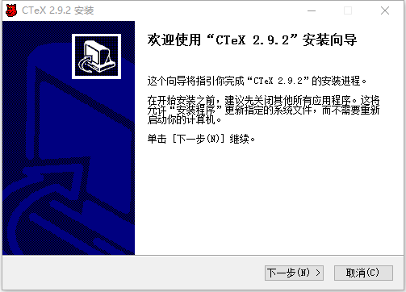 -->


1. 接受协议

<!-- 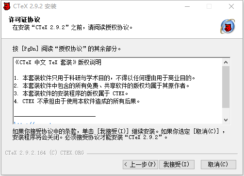 -->


1. 选择功能，点击下一步

<!-- 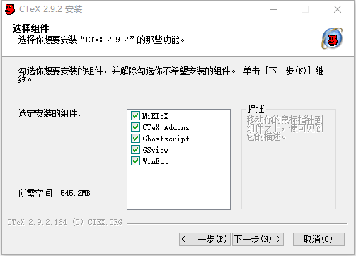 -->


1. 选择安装文件夹，这个文件夹可以不放在 C 盘，如果自己的 C 盘空间不大

<!-- 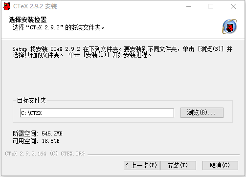 -->


1. 点击安装之后点击下一步

<!-- 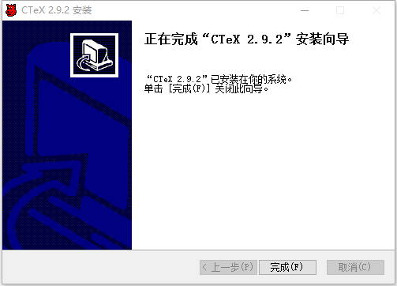 -->


### 安装 basic-miktex

双击 basic-miktex-2.9.6069-x64 打开

1. 同意协议点击下一步

<!--  -->


1. 选择给所有用户，点击下一步

<!-- 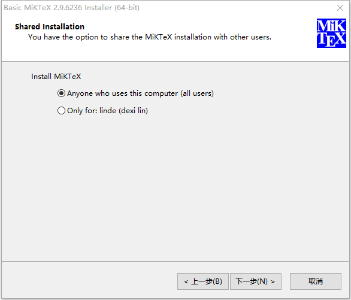 -->


1. 选择文件夹，这个文件很大，可以选择在其他文件夹，需要记住这个文件夹，因为在下面需要用到

<!-- 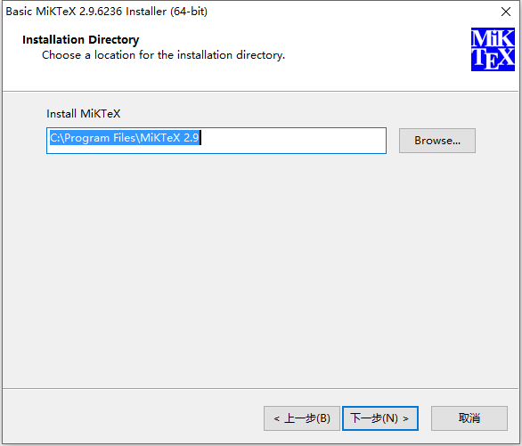 -->


1. 点击下一步

<!-- 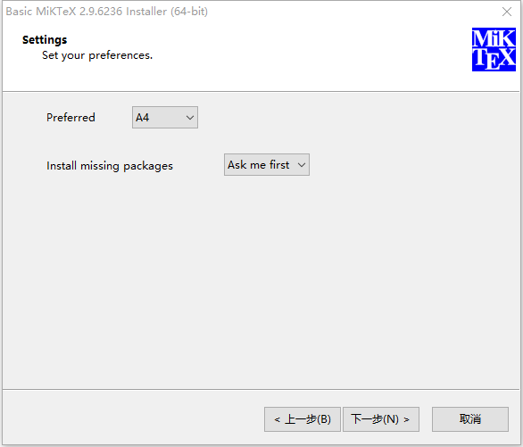 -->


1. 点击开始安装

<!-- 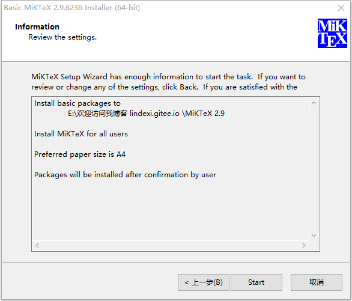 -->


1. 点击关闭

<!-- 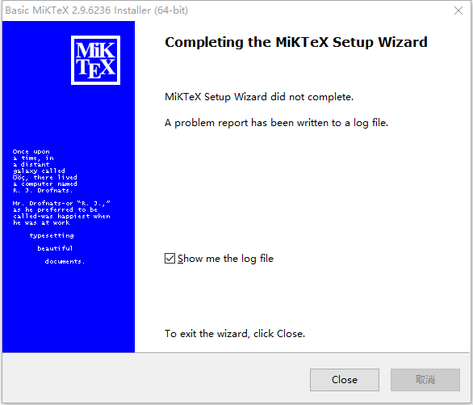 -->


现在就可以从开始菜单打开 WinEdt 和 TeXworks 但是我比较喜欢使用 TexStudio 这个软件安装比较简单。

如果在使用 WinEdt 编译的过程出现下面的问题，就请按照下面的步骤解决

> CTeX 系统找不到指定的文件

在 Options 的 Execution Modes 打开

<!-- 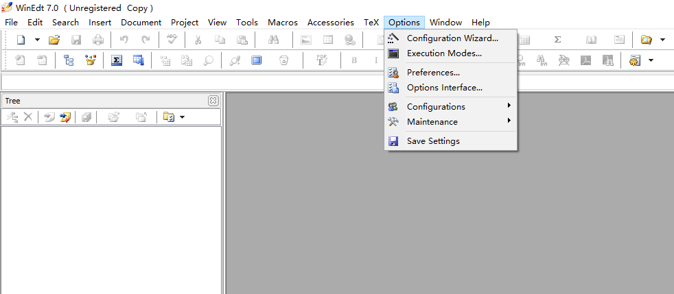 -->


点击 Tex System 可以看到 MiKTeX 的路径，需要看一下这些路径是否正确，确定的方法是通过搜索 `MiKTeX 2.9` 的安装文件夹的方式

也就是刚才的 basic-miktex-2.9.6069-x64 安装选择第3步的文件夹

<!-- 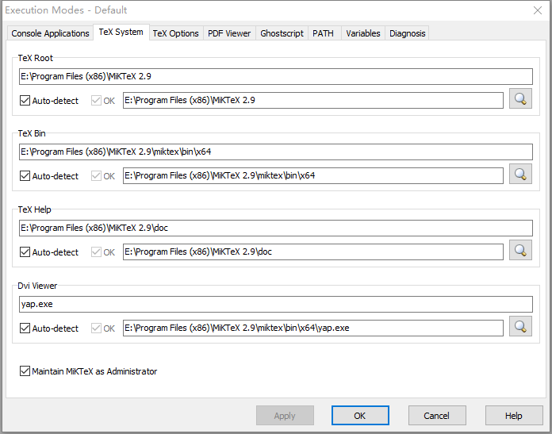 -->

 

<!--  -->

修改完成就点击确定这样就可以。

<!-- 

看到CTEX的MikTex不存在Bin，那么需要安装miktex，这个安装必须在C盘，默认位置，记住**C盘**

安装完，我们可以安装TeXStudio，这个软件做的很好，看下界面


是不是感觉比WinEdt好，如果感觉好的话，那么就去下载，可以到官网[www.texstudio.org](www.texstudio.org)如果上不了就在我这里下。 -->

## 打开模板

我们开始使用艾斯维尔官方的模板，官方下载位置 [elsarticle-template.zip](https://www.elsevier.com/__data/assets/file/0007/56842/elsarticle-template.zip) 

下载之后将解压到一个文件夹，然后双击 `ecrc-template.tex` 打开，打开之后进行编译

可以看到里面没有`ecrc.sty`在我们编译的时候就出错

```csharp
File `ecrc.sty' not found.
File `comment.sty' not found.
```

<!-- 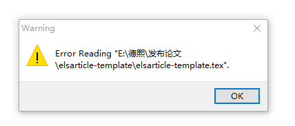 -->


<!-- 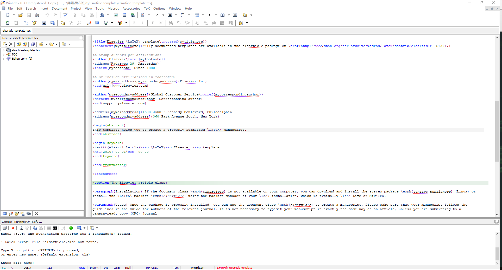 -->


好像还没告诉大家是如何编译的，在软件点击编译就是下面的图标

<!-- 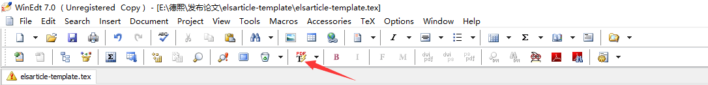 -->


<!--  -->

可以去下载我的`ecrc.sty`，下载放在最后，大家如果发现无法下载，就联系我

下载之后需要放在 elsarticle-template 所在文件夹

```csharp
    elsarticle-num.bst
    elsarticle-template.log
    elsarticle-template.tex
    model1-num-names.bst
    model1a-num-names.bst
    model2-names.bst
    model3-num-names.bst
    model4-names.bst
    model5-names.bst
    model6-num-names.bst
    mybibfile.bib
    numcompress.sty
    ecrc.sty
```

关闭软件再重新打开，进行编译，结果还是发现找不到

```csharp
elsarticle.cls
```

所以这里缺文件还是很多

```csharp
LaTeX Error: File `natbib.sty' not found.
```

```csharp
LaTeX Error: File `lineno.sty' not found

```

把这些放在一个文件夹，这样就好啦。

可以尝试使用我的压缩包，我里面包含了用到的文件，或者自己下载 lineno.zip 和 natbib.zip 这些。


如果安装了缺少的文件之后还发现缺少字体也就是会出现下面的异常

```csharp
FATAL miktex-maketfm - No creation rule for font psyr.
```

```csharp
 Font T1/cmr/
m/n/10=ecrm1000 at 10.0pt not loadable: Metric (TFM) file not found.
<to be read again> 
                   relax 
l.100 \fontencoding\encodingdefault\selectfont
```

```csharp

pifont.sty
64
Font U/psy/m/n/10=psyr at 10.0pt not loadable: Metric (TFM) file not found.
<to be read again> 
                   relax 
l.64 {\Pifont{psy}
                  }

```

用 Texwork 打开 tex 文件，点击编译，可以在下面看到 pifont.sty 里存在错误

可以在刚才安装 basic-miktex 的文件夹的 `tex\latex\psnfss\pifont.sty` 找到

如我的 basic-miktex 安装在 `E:\Program Files (x86)\MiKTeX 2.9` 那么我就可以通过 `E:\Program Files (x86)\MiKTeX 2.9\tex\latex\psnfss\pifont.sty` 找到文件

<!--  -->


通过点击 pifont.sty 就可以跳转到出现问题的代码

<!-- 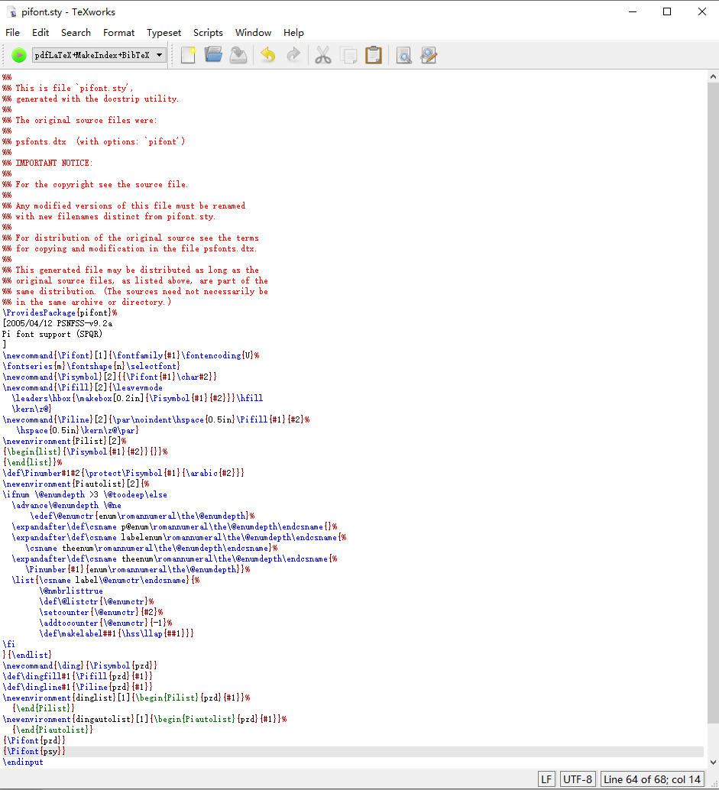 -->


尝试删除 `{\Pifont{psy}}` 代码或添加注释，添加之后注意保存。如果不知道如何修改这个文件，可以下载我修改好的文件替换自己的文件。

<!-- pifont.sty -->


然后打开 basic-miktex 的文件夹的`miktex\bin\x64\initexmf.exe` 例如我的 basic-miktex 文件夹安装在 `E:\Program Files\MiKTeX 2.9` 我就可以通过 `E:\Program Files\MiKTeX 2.9\miktex\bin\x64\initexmf.exe` 打开

另一个方式是通过 MiKTeX 的包管理器安装 symbol 就可以解决，如果无法联网请看[离线安装Miktex/CTEX的宏包Package-02015678](http://02015678.lofter.com/post/1cd5b3ca_6fa6e34 )

打开 `initexmf.exe` 的方式是通过命令行的方式打开，通过命令行进入 basic-miktex 的文件夹的`dvips\config`文件夹，然后输入下面代码。注意路径是我的安装路径，需要修改路径为你自己的路径。


```csharp
"E:\Program Files\MiKTeX 2.9\miktex\bin\x64\initexmf.exe" --mkmaps
```

<!-- 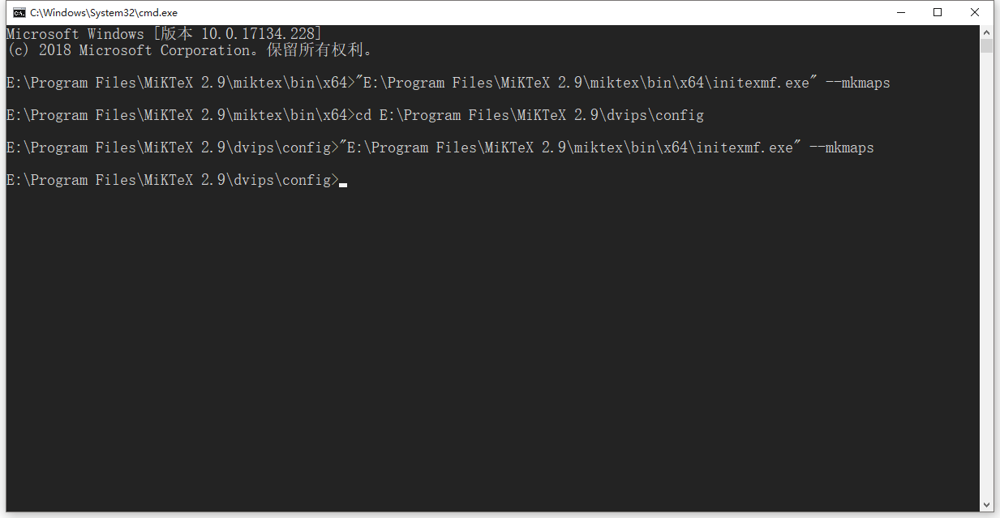 -->


现在编译就可以发现编译成功

<!-- 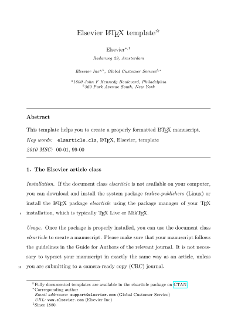 -->


<!-- 这个在于我们打开的模板是`ecrc-template.tex`，在官网有下载，[ecrc-template.tex](https://www.elsevier.com/__data/assets/text_file/0007/56878/ecrc-template.tex)

打开之后发现还需要Elsevier-logo-3p.pdf, SDlogo-3p.pdf, Elsevier-logo-5p.pdf and SDlogo-5p.pdf ，都可以在官网下载，下载后需要下载elsarticle.cls，同样官方，[elsarticle.cls](https://www.elsevier.com/__data/assets/text_file/0005/56903/elsarticle.cls) -->

<!--  -->


我在TeXStudio打开，发现没有错误。


下载：

[CTAN: Package texliveonfly](https://ctan.org/pkg/texliveonfly )

[CTAN: Package cm-super](https://ctan.org/pkg/cm-super )

参见：[使用lyx排版，编辑Elsevier提供的模板，生成pdf时，出现的关于字体的错误](https://www.zhihu.com/question/28668105 )

[errors - miktex-makepk: PK font Alegreya-Regular-lf-t1--base could not be created - TeX - LaTeX Stack Exchange](https://tex.stackexchange.com/questions/154998/miktex-makepk-pk-font-alegreya-regular-lf-t1-base-could-not-be-created )

[miktex - Problems with fonts - TeX - LaTeX Stack Exchange](https://tex.stackexchange.com/questions/152721/problems-with-fonts/152749 )

<!--  -->

顺便推荐一个软件：[Tickeys](http://www.yingdev.com/projects/tickeys)这个软将可以让我们打字有声音，晚上打字用这个软件感觉好。

实际很少有人在安装的过程会遇到这么多问题。

## 开始写论文

开始写的是 `\documentclass[3p,times]{elsarticle}` 

就是引用 elsarticle，`\documentclass[]{elsarticle}` 选项可以使用参见：[https://www.elsevier.com/__data/assets/pdf_file/0009/56844/elsdoc2.pdf](https://www.elsevier.com/__data/assets/pdf_file/0009/56844/elsdoc2.pdf )

<!--  -->

我们开始就是题目，我们的题目是乱写请看下面

首先题目`\title{A paper csdn and Mircrosoft is laji \tnoteref{t1,t2}}`，其中`\tnoteref`是引用脚注，一般写的就是t1,t2标识，这个随意。其中写了t1，在题目后面就有一个星，在写一个就出现一个逗号，后面加两个星，规则是第n个就有n个星。

<!-- 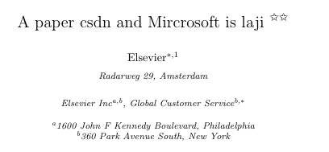 -->


如输入下面代码

```csharp
\title{A paper csdn and Mircrosoft is laji \tnoteref{t1,t2,t3}}
```
<!-- 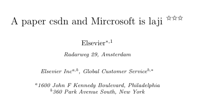 -->


<!--  -->

然后我们在外面写`\tnotetext[标识]{Content}`，也就是页面下的内容，这里我写的是垃圾微软，可以看到Content可以很长，而我们还有t3没写，没写的没显示

```csharp
\title{A paper csdn and Mircrosoft is laji \tnoteref{t1,t2}}
\tnotetext[t1]{This document is a collaborative effort.}
\tnotetext[t2]{The second title footnote which is a longer
	longer than the first one and with an intention to fill
	in up more than one line while formatting.But it's to small,I write Mircosoft is laji.}
```

现在运行就可以看到这个界面

<!--  -->


在页面下方可以看到这个界面

<!-- 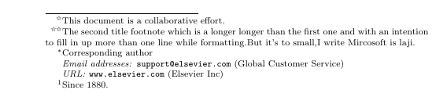 -->


现在可以看到星直接存在逗号了，而且需要知道，这里的符号不只是可以写 `t1` 等，可以写为任意的字符

如修改为下面代码

```csharp
\title{A paper csdn and Mircrosoft is laji \tnoteref{csdn,t2}}
\tnotetext[csdn]{csdn blog.csdn.net/lindexi\_gd.}
\tnotetext[t2]{lindexi.}
```


### 作者

接着我们开始写作者，假如我们两个作者，第一个是`lindexi_gd`第二个是`Microsoft`

我们需要知道在Latex的注释是`%%`

作者的格式是

```csharp
%% \author[label1,label2]{<author name>}
%% \address[label1]{<address>}
%% \address[label2]{<address>}
```

每个label就是标签，可以在地址写，可以在别的地方写作者的地址

Latex用`\\`换行，在我们的地址比较长，可以用这换行

<!--  -->

```csharp
\author[lindexiAddress]{lindexi\_gd \corref{cor1} \fnref{fn1} }
\ead{lindexi\_gd@163.com}

%%作者的\corref{lable}就是在脚注，用的是*，第n个有n*
%%\fnref{lable} 脚注，这个才是真的，但是没显示
%%\author[lindexiAddress]{lindexi\_gd \corref{cor1} \fnref{fn1} }
%%地址写在下面\address[lindexiAddress]{The lindexi's address }
%%地址是a,b,c  label不区分大小写

\author[Address1,Address2]{Mircrosoft \corref{cor2} \fnref{fn2}}
\ead{kaveh@river-valley.com}

\cortext[cor1]{Corresponding author}
\cortext[cor2]{Principal corresponding author}

\fntext[fn1]{This is the specimen author footnote.}
\fntext[fn2]{Another author footnote, but a little more longer.}
\fntext[fn3]{Yet another author footnote. Indeed, you can have
	any number of author footnotes.}

\address[lindexiAddress]{The lindexi's address }

\address[Address1]{River Valley Technologies, 9, Browns Court,
	Kennford, Exeter, United Kingdom}
\address[Address2]{Central Application Management,
	Elsevier, Radarweg 29, 1043 NX\\
	Amsterdam, Netherlands}
```

复制我这个放到代码就可看到下面界面

<!--  -->

<!-- 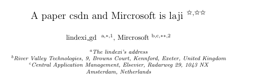 -->


页面下方还有文字，只是我就不截图了

### 摘要

然后就是我们的摘要

```csharp
\begin{abstract}
摘要写在这
\end{abstract}
```

当然在 Latex 不能写中文，所以我就换了代码截图

<!-- 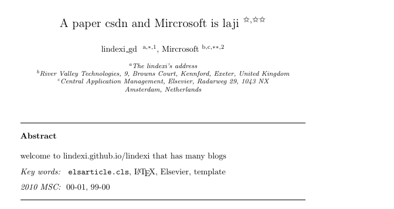 -->


### 关键字

可以从上面的图片看到，摘要下面就是关键字

关键字写在 `\begin{keyword}` 里面

```csharp

\begin{keyword}

\end{keyword}
```
不同的关键字使用`\sep`分开

```csharp
\begin{keyword}

CSDN \sep lindexi \sep windows.sc

\end{keyword}
```

<!--  -->

<!-- 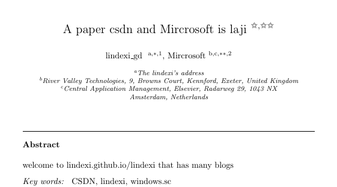 -->


下面就是正文了，写正文会遇到这些问题如何插入图片，插入算法，图片位置不对，下面让我一个个告诉大家如何做

### 行标记

设置了 `\linenumbers` 就可以看到每 5 行给一个数值，请看下面代码

```csharp
\begin{keyword}
CSDN \sep lindexi \sep windows.sc
\end{keyword}

\linenumbers

```

也就是 `\linenumbers` 只需要写进入在 `\linenumbers` 下面的文字就会在每 5 行添加数字，之前我为了找到文章左边的数字是哪里设置的找了很久，所以就在这个告诉大家。

<!-- 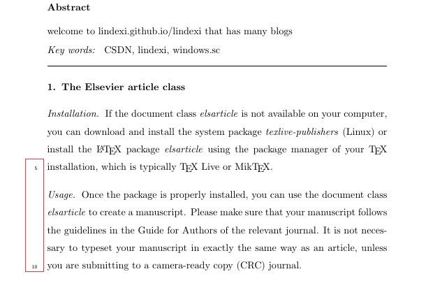 -->


尝试去掉 `\linenumbers` 就不会显示数字

### 标题

在文章的开始就是章节的标题，如第一章我写的是 `lindexi.gitee.io` 那么就需要使用这个代码

```csharp

\section{lindexi.gitee.io}

 welcome tolindexi.gitee.io that has many blogs 
```

<!-- 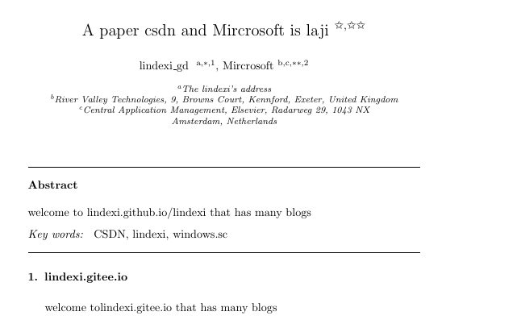 -->


然后添加二级标题 `blog.csdn.net/lindexi_gd` 请看代码

```csharp
\subsection{blog.csdn.net/lindexi\_gd}

 welcome blog.csdn.net/lindexi\_gd that has many blogs 

```

<!-- 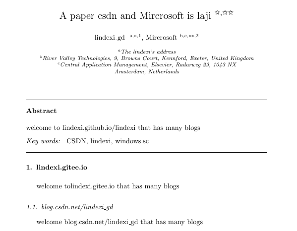 -->


从上面的代码可以知道，一级标题是`\section{标题名}`而二级标题是`\subsection{标题名}`

### 输入列表

```csharp
\begin{enumerate}[标号]

```

标号可以使用数字或字，其中可以加`[]`,`()`

我们可以在列表嵌套

```csharp
\begin{enumerate}[a)]
	\item This item has roman numeral counter.
	\item Another one before we close the third level.
	\begin{enumerate}[a)]
		\item This item has roman numeral counter.
		\item Another one before we close the third level.
	\end{enumerate}
\end{enumerate}
```

<!--  -->

### 双栏

需要双栏，在`\documentclass[3p,times]{elsarticle}`改5p

还有其他选项，这些我们现在不需要，直接改5p就好`\documentclass[5p,times]{elsarticle}`

这里是设置使用的模板，可以设置是否分栏、页边距、默认的字体类型及大小

可以选的这些

```csharp
\documentclass[preprint,review,12pt]{elsarticle}
\documentclass[final,1p,times]{elsarticle}
\documentclass[final,1p,times,twocolumn]{elsarticle}
\documentclass[final,3p,times]{elsarticle}
\documentclass[final,3p,times,twocolumn]{elsarticle}
\documentclass[final,5p,times]{elsarticle}
\documentclass[final,5p,times,twocolumn]{elsarticle}
```

### 引用

我们的论文会参见很多人的，那么添加一个人或删一个引用，可能需要修改文章，而且因为排序问题可能需要修改文章的很多代码。不过在 Latex 有自动的方式，自动修改引用的序号。使用这个方法十分简单。参考需要写在页面的最下，在 `\end{document}` 的上方。在写引用之前需要搜索删除 `\bibliography{<your-bib-database>}` 这个代码

下面来写一个参考

```csharp
\begin{thebibliography}{00}
	
	\bibitem[每次参考自动写的内容，作者，如果遇到括号不写]{label} 参见lindexi
	
\end{thebibliography}
```

在文章遇到我们需要参考就使用下面代码，注意将 label 替换为参考里面的 label

```csharp
\citet{label}
```

这样就好，如果我们没写作者看起来不好

如果没写作者，只要一个`[1]`就可以了，在正文可以使用另一个方式引用

```csharp
\citep{label}

另一方式

\cite{label} 
```

要写一个上标我们应该用`^`

假如我们的一个引用是这样写的

```csharp
\begin{thebibliography}{00}    
    
    \bibitem{lindexi 1} lindexi\_gd csdn.
    \bibitem{lindexi} blog.csdn.net/lindexi\_gd.
    \bibitem{csdn} lindexi.github.io
	
\end{thebibliography}
```

在引用的写 `$^{\cite{lindexi 1}}$` 就可以做出下面的效果

```
 Named Lin Dexi{\cite{lindexi 1}}, I am a developer who has been in contact with UWP technology^{\cite{lindexi}} since 2015. 
```

注意`$$`就是使用公式

<!-- 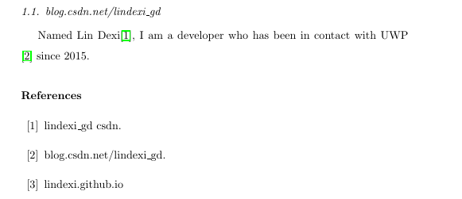 -->


关于参考文献请看[latex 自定义bst文件 - CSDN博客](https://blog.csdn.net/tinkle181129/article/details/49822171 )

将多个引用使用 `-` 连起来，如 `[1][2][3]` 转 `[1-3` 请看[latex中同一处引用多篇文献 - CSDN博客](https://blog.csdn.net/lqhbupt/article/details/49925911 )

### 斜体

```csharp
\emph{内容}
```

### 粗体

```csharp
\textbf{}
```

### 排列

左对齐

```csharp
  \begin{flushleft}
  	
  \end{flushleft}
```
居中

```csharp
 \begin{center}
 	
 \end{center}
```

右对齐

```csharp
  \begin{flushright}
	
  \end{flushright}
```

### 分数

```csharp
\frac{上}{下}
```

如`$ \frac{1}{2}  $`请看界面

<!-- 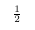 -->


### 无序列表

```csharp
\begin{itemize}
	\item 
	\item 
\end{itemize}
```


### 根号

```csharp
\sqrt{}

```


### 插入图片

插入图片的位置不对，我们可以使用`[!htb]`来取消latex的美学，latex的美学很烂。

我们需要先引用 float

```csharp
\usepackage{graphicx}


\usepackage{float}
```

在引用图片写上 `[!htb]` 添加到指定的代码

```csharp
\begin{figure}这里用取消美学[!htb]
	\includegraphics{fig1.png}
	\caption{Problem Description }
	\label{fig1}
\end{figure}
```

图片位置可以使用 `figure=` 指定本地的图片

如果是esp，需要 `\epsfig` 来指定，请看代码

```csharp
\begin{figure}[h]
  \centerline
  {
    \epsfig
     {
      figure=images/fig, 
      height=9cm, 
      angle=-90
     }
  }
  \caption{标题}
  \label{Fig1}
\end{figure}
```

参见：[http://blog.sciencenet.cn/blog-400681-886697.html](http://blog.sciencenet.cn/blog-400681-886697.html )

[http://blog.csdn.net/bingfengxiao/article/details/6650096](http://blog.csdn.net/bingfengxiao/article/details/6650096 )

多图并排

使用`\vfill`换行，`\hfill` 并排

```csharp
\begin{figure*} 
	 \centering 
	 
	 \begin{minipage}{0.48\linewidth} 0.48大小
	 	\centering 图在中间
	    \includegraphics[width=5cm,height=5cm]{f1} 图，如果使用eps需要转换
    	\caption{图1  }
        \label{fig:1}
     \end{minipage}
     \hfill 并排
     \begin{minipage}{0.5\linewidth}
     	\centering
     	\includegraphics[width=5cm,height=5cm]{f2}
        \caption{图2  }
     	\label{fig:2}
     \end{minipage}
\end{figure*}
```

每一张图有自己的`Figure`

如果需要用的是一张图包含小图，就需要使用 `subfigure` 的方法

``` 
\begin{figure}
	\centering 
	\subfigure[(a)]
	{
	
		\includegraphics[width=5cm,height=3cm]{1a}
	}
	\subfigure[(b)]
	{
	
		\includegraphics[width=5cm,height=3cm]{1b}
	}
	
	\caption{ fig }
	\label{f1}
\end{figure}

```


[http://blog.csdn.net/lsg32/article/details/8121417](http://blog.csdn.net/lsg32/article/details/8121417 )

[http://www.ctex.org/documents/latex/graphics/node109.html](http://www.ctex.org/documents/latex/graphics/node109.html )

### 使用eps

引用 epsfig

```csharp
\usepackage{graphicx}

\usepackage{epsfig} 
```

打开cmd，进入图片路径， 使用 epstopdf 命令转换 eps 为 PDF

```csharp
epstopdf 图.eps
```

运行上面代码输出 `图.pdf` 在相同的文件夹

引用的时候不需要写后缀名

```csharp
\includegraphics[width=7cm,height=7cm]{f1}
```

把生成的pdf也放进去，这样生成就好

重新为图片编号：[http://www.52yfjc.com/2014/show.asp?id=887](http://www.52yfjc.com/2014/show.asp?id=887 )

### Visio转eps

在线wmf转eps [https://cloudconvert.com/wmf-to-eps](https://cloudconvert.com/wmf-to-eps )

svg转eps [http://cn.office-converter.com/SVG-to-EPS](http://cn.office-converter.com/SVG-to-EPS )

一个简单方法是选择要转换的图，新建一个visio，然后在页面大小，设为适应，然后保存为pdf就好，一般不需要在转


### 公式

``` stylus
\begin{equation}
公式
\label{g1}
\end{equation}
```

[Latex 公式速查](https://lindexi.gitee.io/lindexi/post/Latex-%E5%85%AC%E5%BC%8F%E9%80%9F%E6%9F%A5.html )

插入公式：[https://www.kancloud.cn/thinkphp/latex/41806](https://www.kancloud.cn/thinkphp/latex/41806 )

[http://mohu.org/info/symbols/symbols.htm](http://mohu.org/info/symbols/symbols.htm )

[http://blog.csdn.net/garfielder007/article/details/51646604](http://blog.csdn.net/garfielder007/article/details/51646604 )

#### 公式空格

在公式添加空格有下面的方法

|latex|空格|
|--|--|
|a \qquad b| 两个quad空格|
|a \quad b | quad空格|
|a\ b | 大空格|
|a\;b | 中等空格|
|a\,b | 小空格|

[Latex 公式速查](https://lindexi.gitee.io/lindexi/post/Latex-%E5%85%AC%E5%BC%8F%E9%80%9F%E6%9F%A5.html )

### 表格

关于表格请看 [使用latex撰写elsevier论文，latex表格，插图以及调用的安装包 - CSDN博客](https://blog.csdn.net/robert_chen1988/article/details/51700219 )

### 插入算法

参见 [LaTeX算法排版例子 - CSDN博客](https://blog.csdn.net/lqhbupt/article/details/8723478 )

很多算法都是使用伪代码的方式，简单使用的方法是如下面的方式

```csharp
\begin{algorithm}
	\caption{} 
	\label{a}
	\begin{algorithmic}
	\STATE ) $ $
	\end{algorithmic}
\end{algorithm}  
```

### 页开始

如果需要设置期刊的名，可以使用下面的方法

```csharp
\journalname{期刊名}
```

## 设置本地包

因为 Latex 要安装一些库是需要联网的，但是很多时候网络都不是很好，所以这时需要使用 [国内的源](http://mirrors.ustc.edu.cn/CTAN/systems/win32/miktex/tm/packages/ )

具体使用方法请看：[离线安装Miktex/CTEX的宏包Package-02015678](http://02015678.lofter.com/post/1cd5b3ca_6fa6e34 )

## 下载

下面就是本文用到的各个文件的下载链接，如果发现无法下载，或没有 csdn 积分，请邮件[联系](mailto:lindexi_gd@163.com)我，我通过邮件发送给你


### basic-miktex-2.9.6069-x64

<!-- https://yunpan.cn/OcvKmfknLnEsnJ  访问密码 0943 -->
链接：http://pan.baidu.com/s/1slnnoPB 密码：wcaw

Btsync:B74YC6AIP6J2CNK2CNTCXGG3NVGGMTTXO

### CTeX
<!-- https://yunpan.cn/OcvKmJ8EINEN22  访问密码 7fa9 -->

[CTeX套装](https://pan.baidu.com/s/1jHQVq2U )

### TeXStudio
<!-- https://yunpan.cn/OcvKmVsRytDq7Z  访问密码 5ef5 -->
链接：http://pan.baidu.com/s/1pLCZL5h 密码：hb29

Btsync:BBXDB6T3LBPYJ6CVXTV7V6226FGXHXOFP

[https://sourceforge.net/projects/texstudio/?source=typ_redirect](https://sourceforge.net/projects/texstudio/?source=typ_redirect )

### ecrc.sty
<!-- https://yunpan.cn/OcvKHgsSHJMaFc  访问密码 2cef -->
[ecrc.sty-CSDN下载](https://download.csdn.net/download/lindexi_gd/9646187 )

### elsarticle-template

官方的艾斯维尔文件是编译不通过，下面是我添加了文件的版本

[elsarticle-template 包含文件-CSDN下载](https://download.csdn.net/download/lindexi_gd/10639564 )

### ecrc-template.tex
<!-- https://yunpan.cn/OcvKHKAiBNIZDi  访问密码 1100 -->
[http://pan.baidu.com/s/1mi3CzJq](http://pan.baidu.com/s/1mi3CzJq )

Btsync: BQ2XFET5YROHGWVN2NZNQ4X5VTKEKLO4C

[ecrc-template-CSDN下载](http://download.csdn.net/detail/lindexi_gd/9795700)

### lineno.sty

[下载 lineno.sty -CSDN下载](https://download.csdn.net/download/lindexi_gd/10639569 )

[官方 lineno.sty](https://www.ge.infn.it/~gemmec/SuppNote2012/lineno.sty )

### lineno.tex

[下载lineno.tex -CSDN下载](https://download.csdn.net/download/lindexi_gd/10639571 )

这是 lineno.tex 官方版本[点击下载](https://ctan.org/tex-archive/macros/latex/contrib/lineno?lang=en )

### lineno

[下载lineno.zip -CSDN下载](https://download.csdn.net/download/lindexi_gd/10639574 )

The LaTeX package lineno.sty provides line numbers on paragraphs

### natbib.sty

[下载natbib.sty -CSDN下载](https://download.csdn.net/download/lindexi_gd/10639753 )

[官方下载](http://web.hku.hk/~gdli/natbibsty.txt )

### pifont.sty

这个文件需要放在 miktex 安装文件夹的 tex\latex\psnfss\ 覆盖，用于解决

```csharp
Font U/psy/m/n/10=psyr at 10.0pt not loadable: Metric (TFM) file not found.
```

但是会让一些字体无法看到

[下载pifont.sty -CSDN下载](https://download.csdn.net/download/lindexi_gd/10639767 )

另一个解决方法是通过 miktex 安装 symbol 库就可以解决。

从开始菜单找到 Package Manager (Admin) 打开，可以看到下面界面

<!-- 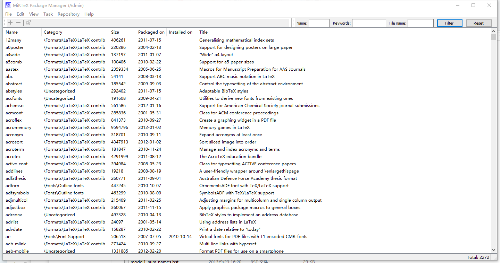 -->


在里面搜索 symbol 按下回车搜索，可以看到下面界面，点击第一个右击安装

<!-- 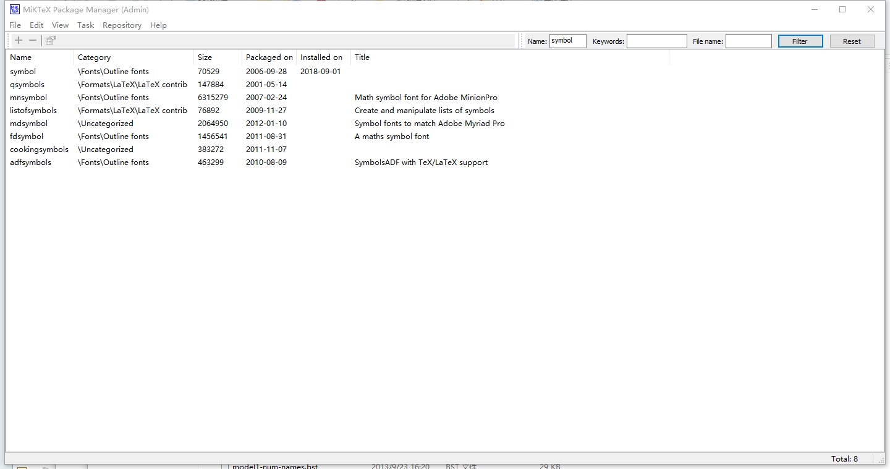 -->


<!-- 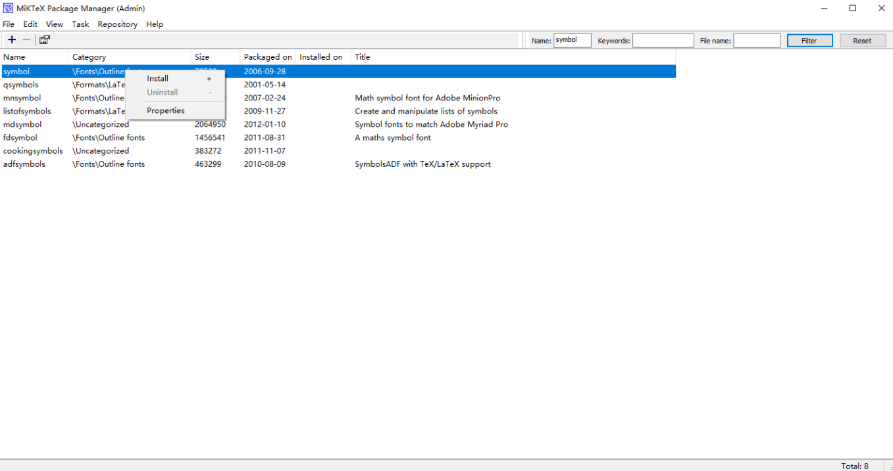 -->


安装完成可以看到下面界面，下面是我通过在本地的 `E:\package ` 做安装文件夹在本地安装，因为我无法联网安装

<!-- 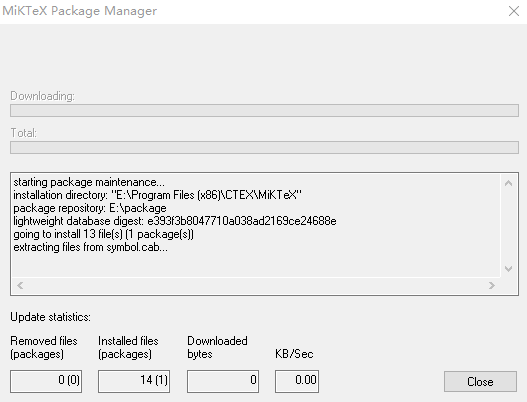 -->


参见：[https://www.elsevier.com/authors/author-schemas/preparing-crc-journal-articles-with-latex](https://www.elsevier.com/authors/author-schemas/preparing-crc-journal-articles-with-latex )

[http://hubl82.blog.163.com/blog/static/1267694852013459412617/](http://hubl82.blog.163.com/blog/static/1267694852013459412617/ )

[Latex](https://www.elsevier.com/authors/author-schemas/latex-instructions )

更多数学公式请看 [Latex 公式速查](https://lindexi.gitee.io/lindexi/post/Latex-%E5%85%AC%E5%BC%8F%E9%80%9F%E6%9F%A5.html )

[离线安装Miktex/CTEX的宏包Package-02015678](http://02015678.lofter.com/post/1cd5b3ca_6fa6e34 )

[Welcome to Chinese TeX:CTEX](http://www.ctex.org/HomePage )


<a rel="license" href="http://creativecommons.org/licenses/by-nc-sa/4.0/"></a><br />本作品采用<a rel="license" href="http://creativecommons.org/licenses/by-nc-sa/4.0/">知识共享署名-非商业性使用-相同方式共享 4.0 国际许可协议</a>进行许可。欢迎转载、使用、重新发布，但务必保留文章署名[林德熙](http://blog.csdn.net/lindexi_gd)(包含链接:http://blog.csdn.net/lindexi_gd )，不得用于商业目的，基于本文修改后的作品务必以相同的许可发布。如有任何疑问，请与我[联系](mailto:lindexi_gd@163.com)。