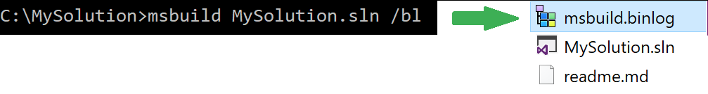
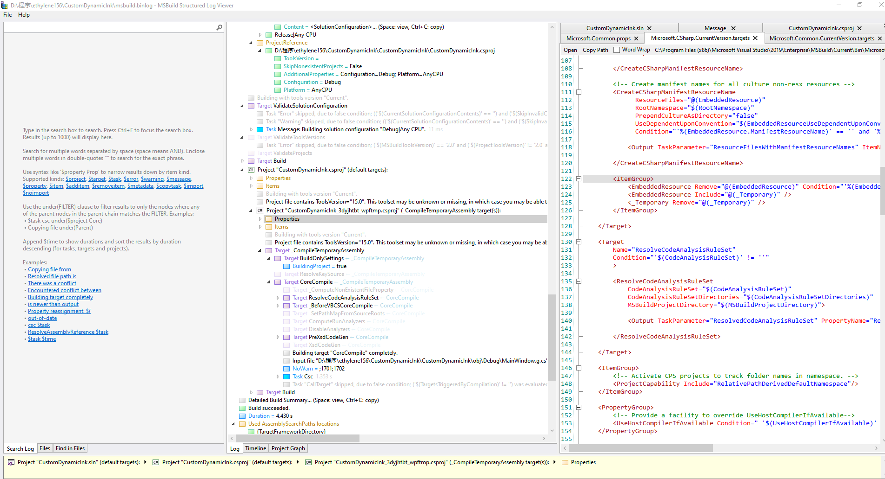

# MSBuild 输出日志可视化工具 MSBuild Structured Log Viewer 简介

感谢 Vatsan Madhavan 小伙伴推荐的 MSBuild 输出日志可视化工具，这个工具可以使用漂亮的 WPF 界面预览 MSBuild 复杂的输出内容

<!--more-->


<!-- CreateTime:5/21/2020 4:09:16 PM -->


这是一个完全开源的工具，请看 [KirillOsenkov/MSBuildStructuredLog: A logger for MSBuild that records a structured representation of executed targets, tasks, property and item values.](https://github.com/KirillOsenkov/MSBuildStructuredLog )

这个工具的使用方法很简单，首先是在项目里面使用 MSBuild 命令加上 `/bl` 生成 `msbuild.binlog` 文件，如使用下面代码

```csharp
msbuild /bl
```

<!--  -->


从官网 [MSBuild Log Viewer](https://msbuildlog.com/ ) 下载最新版本

打开软件，将 `msbuild.binlog` 文件拖进去就可以显示日志的信息


<!--  -->


另外这个工具还提供了 NuGet 库可以用来读取 binlog 文件

先安装 [MSBuild.StructuredLogger](https://www.nuget.org/packages/MSBuild.StructuredLogger) 库，然后使用下面代码

```csharp
using System;
using Microsoft.Build.Logging.StructuredLogger;

class BinaryLogReadBuild
{
    static void Main(string[] args)
    {
        string binLogFilePath = @"C:\temp\test.binlog";

        var buildRoot = BinaryLog.ReadBuild(binLogFilePath);
        buildRoot.VisitAllChildren<CscTask>(c => Console.WriteLine(c.CommandLineArguments));
    }
}
```

这个软件用到了特别漂亮的 TreeView 欢迎小伙伴抄样式


<a rel="license" href="http://creativecommons.org/licenses/by-nc-sa/4.0/"></a><br />本作品采用<a rel="license" href="http://creativecommons.org/licenses/by-nc-sa/4.0/">知识共享署名-非商业性使用-相同方式共享 4.0 国际许可协议</a>进行许可。欢迎转载、使用、重新发布，但务必保留文章署名[林德熙](http://blog.csdn.net/lindexi_gd)(包含链接:http://blog.csdn.net/lindexi_gd )，不得用于商业目的，基于本文修改后的作品务必以相同的许可发布。如有任何疑问，请与我[联系](mailto:lindexi_gd@163.com)。