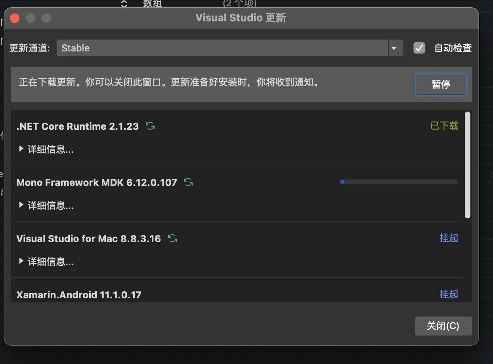

# Mac 升级到 dotnet 5 构建 Xamarin 应用失败 error MSB4186 静态方法调用语法无效

我昨天将 Mac 构建机器也升级到了 dontet 5 最新版。但是在升级之后，所有的 Xamarin 项目都在 Mac 版本的 VisualStudio 构建不通过，提示  error MSB4186: 静态方法调用语法无效。解决方法就是将 VisualStudio 更新到最新版本

<!--more-->
<!-- 发布 -->

在升级到 dotnet 5 之后，在 Mac 设备上使用 Mac 版本的 VisualStudio 构建 Xamarin 项目将提示如下代码

/usr/local/share/dotnet/sdk/5.0.100/Sdks/Microsoft.NET.Sdk/targets/Microsoft.NET.TargetFrameworkInference.targets(54,5): error MSB4186: 静态方法调用语法无效:“[MSBuild]::GetTargetFrameworkIdentifier('$(TargetFramework)')”。Method '[MSBuild]::GetTargetFrameworkIdentifier' not found. 静态方法调用应采用以下形式:$([FullTypeName]::Method())，例如 $([System.IO.Path]::Combine(`a`, `b`))。请检查确保所有参数均已定义、其类型正确无误，并且按正确的顺序指定

解决方法就是将 VisualStudio 更新到最新版本

<!--  -->

 本作品采用<a rel="license" href="http://creativecommons.org/licenses/by-nc-sa/4.0/">知识共享署名-非商业性使用-相同方式共享 4.0 国际许可协议</a>进行许可。欢迎转载、使用、重新发布，但务必保留文章署名[林德熙](http://blog.csdn.net/lindexi_gd)(包含链接:http://blog.csdn.net/lindexi_gd )，不得用于商业目的，基于本文修改后的作品务必以相同的许可发布。如有任何疑问，请与我[联系](mailto:lindexi_gd@163.com)。
