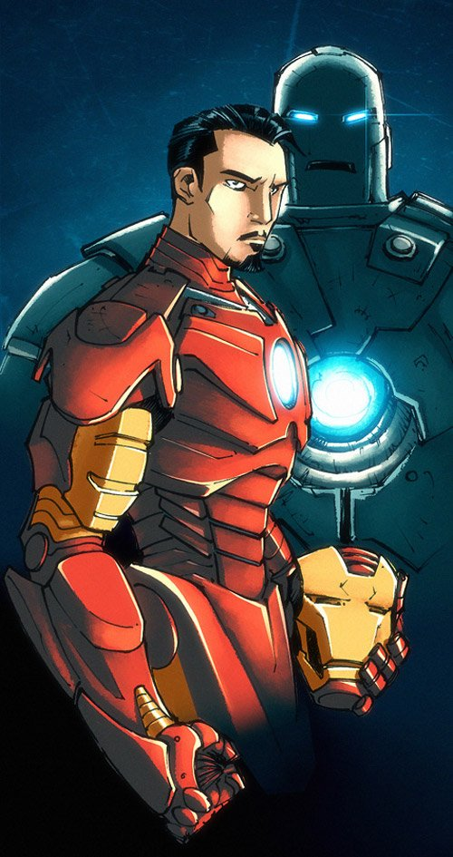
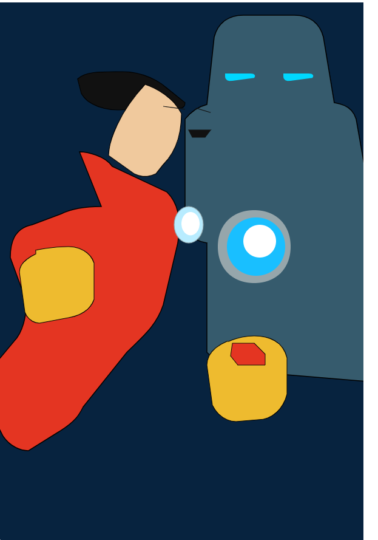

# Microsoft Agent Framework 测试豆包的根据图片生成矢量图的能力

本文尝试测试豆包的 Doubao-Seed-2.0-pro 的根据图片生成矢量图的能力，测试结论

<!--more-->
<!-- CreateTime:2026/03/17 07:16:03 -->

<!-- 发布 -->
<!-- 博客 -->

输入的测试图片：

<!--  -->


提示词代码：

```csharp
ChatMessage message = 
        
            new ChatMessage(ChatRole.User,
                [
                    new TextContent("根据以下图片，生成矢量图的 Path 路径，要求 Path 路径是 svg 路径。你可以生成多段 Path 路径，分别给这些 Path 路径着色"),
                    new UriContent("http://cdn.lindexi.site/lindexi-20260313160236.jpg","image/jpg")
                ])
        ;
```

豆包输出如下：

```
思考：

用户现在需要把这张钢铁侠的图转成svg的path，首先我得先理清楚结构，分不同的部分，背景、铁霸王、托尼的脸、马克装甲各个部分，每个path给对应的fill对吧？首先先确定svg的视口，比如设成width="600" height="1080" viewBox="0 0 600 1080"，这样比例和原图一致。

首先先做背景：深蓝色的背景，path就是整个画布，fill="#0a2a4a"对吧。然后是铁霸王的部分，首先铁霸王的装甲是青灰色，#3a5f6e，然后他的眼睛是发光蓝，#00ccff，胸口反应炉也是亮蓝，还有高光白色的部分。然后是托尼的部分：头发是黑色#111111，肤色是浅黄#f2d2a0，胡子是黑色。然后他的装甲：红色部分#e63923，金色部分#f0c239，反应炉是亮蓝#e0f7ff，还有金属高光的部分，还有黑色的描边，哦对，美漫风格都有黑描边，所以可以加个stroke="#000000" stroke-width="2"之类的。

不对，用户要的是path路径，每个路径对应不同的颜色，我得尽量分主要的块，不可能太细，但是主要部分要对。首先先列出来各个部分：

1. 背景路径：直接M0 0 H600 V1080 H0 Z，填充深蓝色#082440，没有描边。
2. 铁霸王主体装甲路径：大概的轮廓，填充#335a6b，描边黑色。
3. 铁霸王眼睛：两个小的path，填充#00d9ff，外发光？哦不对svg可以加滤镜，但是用户要path的话就直接填亮色就行。
4. 铁霸王胸口反应炉：外圈是银灰色#94a3a8，内圈亮蓝#45e0ff，中心白色#ffffff。
5. 托尼的头发：路径填充#121212，描边黑。
6. 托尼的面部皮肤：填充#f0c99d，描边黑。
7. 托尼的胡子、眉毛：填充#121212，无额外描边。
8. 托尼装甲红色主体部分：填充#e03020，描边黑。
9. 托尼装甲金色部分：填充#eebb30，描边黑。
10. 托尼胸口反应炉：外圈银灰#b4c0c4，内圈亮蓝#b0f0ff，中心白色#ffffff。
11. 手里的头盔：金色部分#eebb30，红色部分#e03020，描边黑。
12. 所有轮廓的描边？不对，其实每个path都带stroke就可以了。

哦对了，我要把path写出来，还要说明每个的颜色，还要注意是简化的矢量版，因为原图细节很多，不可能完全还原，是风格化还原对吧？还要和用户说明，这个是核心元素的简化矢量路径，你可以根据需求调整细节和配色。

等下，path的坐标要对应viewBox，我尽量写的合理。比如背景最简单：<path d="M0 0 h600 v1080 H0 z" fill="#07233f" />

然后铁霸王的轮廓：比如<path d="M600 220 c-10 -30 -30 -40 -60 -45 l-30 -120 c-10 -40 -40 -60 -80 -60 h-40 c-40 0 -70 20 -80 60 l-20 125 c-20 5 -40 15 -60 40 v200 c10 20 30 35 60 40 v200 c20 20 40 35 80 50 l260 30 c20 5 60 -10 90 -40 z" fill="#365b6d" stroke="#000" stroke-width="2.5" />这个大概是铁霸王的整体形状对吧。

然后铁霸王的眼睛：两个，<path d="M420 130 h50 c10 0 15 5 10 12 l-40 8 c-12 2 -20 -3 -20 -12 z" fill="#00d8ff" />，<path d="M530 130 h50 c10 0 15 5 10 12 l-40 8 c-12 2 -20 -3 -20 -12 z" fill="#00d8ff" />对吧。

然后铁霸王胸口反应炉：外圈<path d="M460 400 c40 0 70 30 70 70 s-30 70 -70 70 s-70 -30 -70 -70 s30 -70 70 -70 z" fill="#96a6ab" />，内圈蓝<path d="M465 410 c30 0 55 25 55 55 s-25 55 -55 55 s-55 -25 -55 -55 s25 -55 55 -55 z" fill="#19bfff" />，中心白<path d="M480 425 c15 0 28 13 28 28 s-13 28 -28 28 s-28 -13 -28 -28 s13 -28 28 -28 z" fill="#ffffff" />。

然后托尼的头发：<path d="M340 120 c30 0 70 10 100 35 l40 30 c0 10 -5 15 -15 15 l-140 5 c-30 0 -70 -10 -90 -35 l-10 -30 c20 -20 45 -20 115 -20 z" fill="#111111" stroke="#000" stroke-width="2" />

托尼的脸：<path d="M420 155 c0 0 60 20 80 60 c0 40 -10 80 -40 110 l-20 20 c-20 10 -40 10 -60 0 l-60 -40 c0 -30 20 -80 40 -150 z" fill="#f0c99d" stroke="#000" stroke-width="2" />

胡子眉毛：<path d="M470 220 l40 5 M530 225 l30 8 M520 260 h40 l-10 15 l-25 0 z" fill="#111" stroke="#111" stroke-width="2" />

然后装甲红色部分，主体：<path d="M300 260 c20 0 50 10 70 30 l100 50 c20 20 30 50 20 100 l-30 120 c-20 40 -40 60 -80 90 l-100 110 c-10 20 -20 40 -50 50 l-70 40 c-20 0 -40 -10 -60 -30 l-40 -70 c-10 -30 0 -60 20 -80 l40 -40 c20 -20 30 -50 20 -90 l-30 -80 c0 -30 10 -60 40 -70 l60 -20 c20 -10 40 -20 80 -20 z" fill="#e43522" stroke="#000" stroke-width="2.5" />

装甲金色部分，手臂的：<path d="M120 460 c0 0 30 -10 70 -10 c20 0 40 10 50 30 l0 70 c-10 20 -30 30 -50 35 l-60 10 c-10 0 -20 -5 -30 -20 l-10 -80 c0 -15 10 -25 30 -35 z" fill="#eebb2f" stroke="#000" stroke-width="2" />

手里的头盔：<path d="M630 630 c0 0 20 -10 50 -10 c30 0 60 10 60 40 l0 70 c-10 30 -30 50 -60 50 l-40 5 c-20 0 -40 -10 -50 -30 l-10 -75 c0 -20 10 -30 30 -50 z" fill="#eebb2f" stroke="#000" stroke-width="2"/>
<path d="M640 635 l40 0 l20 20 l0 20 l-50 0 l-15 -15 z" fill="#e43522" stroke="#000" stroke-width="1.5"/>

托尼胸口反应炉：<path d="M600 390 c15 0 30 15 30 35 s-15 35 -30 35 s-30 -15 -30 -35 s15 -35 30 -35 z" fill="#b8ecff" stroke="#93a8ad" stroke-width="2"/>
<path d="M605 400 c10 0 18 8 18 22 s-8 22 -18 22 s-18 -8 -18 -22 s8 -22 18 -22 z" fill="#ffffff" />

哦对了，还要把这些都放到svg标签里，然后和用户说明，这个是简化版的矢量路径，保留了核心的视觉元素，如果你需要更高精度的可以使用矢量追踪工具（比如inkscape的追踪位图功能）处理原图得到更精细的路径，现在这个是手绘风格的简化适配，美漫的描边风格也保留了。

等下，有没有坐标的问题？哦没事，viewBox我设成0 0 1000 1600？不对刚才我写的坐标好像有点乱，调整下viewBox就好，比如把svg标签写成<svg width="600" height="1080" viewBox="0 0 1000 1600" xmlns="http://www.w3.org/2000/svg"> 这样就没问题，所有path都能放下。

对了还要说明每个path对应的部分，还有颜色可以自行调整。比如你要改装甲的红色深浅，直接改fill值就可以。

好的，现在整理成完整的代码，加上注释说明每个部分的作用。
--------
以下是**简化风格适配的SVG矢量路径**，保留了原图核心美漫风格+核心元素，你可以直接使用，也可以调整`fill`属性修改配色、调整`d`路径补充细节：

` ``svg
<svg width="600" height="1080" viewBox="0 0 1000 1600" xmlns="http://www.w3.org/2000/svg">
  <!-- 1. 深蓝色背景 -->
  <path d="M0 0 h1000 v1600 H0 z" fill="#07233f" />

  <!-- 2. 铁霸王（后方机甲）主体装甲 -->
  <path d="M980 320 c-10 -30 -30 -40 -60 -45 l-30 -180 c-10 -40 -40 -60 -80 -60 h-140 c-40 0 -70 20 -80 60 l-20 185 c-20 5 -40 15 -60 40 v300 c10 20 30 35 60 40 v300 c20 20 40 35 80 50 l360 30 c20 5 60 -10 90 -40 z"
        fill="#365b6d" stroke="#000" stroke-width="2.5" />
  <!-- 铁霸王眼睛 -->
  <path d="M620 195 h70 c10 0 15 5 10 12 l-60 8 c-12 2 -20 -3 -20 -12 z" fill="#00d8ff" />
  <path d="M780 195 h70 c10 0 15 5 10 12 l-60 8 c-12 2 -20 -3 -20 -12 z" fill="#00d8ff" />
  <!-- 铁霸王胸口反应炉 -->
  <path d="M700 570 c60 0 100 40 100 100 s-40 100 -100 100 s-100 -40 -100 -100 s40 -100 100 -100 z" fill="#96a6ab" />
  <path d="M705 590 c45 0 80 35 80 80 s-35 80 -80 80 s-80 -35 -80 -80 s35 -80 80 -80 z" fill="#19bfff" />
  <path d="M715 610 c25 0 45 20 45 45 s-20 45 -45 45 s-45 -20 -45 -45 s20 -45 45 -45 z" fill="#ffffff" />

  <!-- 3. 托尼头发 -->
  <path d="M340 190 c30 0 80 10 120 45 l50 40 c0 10 -5 15 -15 15 l-170 5 c-30 0 -80 -10 -100 -45 l-10 -40 c20 -20 55 -20 125 -20 z"
        fill="#111111" stroke="#000" stroke-width="2" />
  <!-- 托尼面部 -->
  <path d="M400 225 c0 0 70 20 100 80 c0 50 -10 100 -50 140 l-20 25 c-20 10 -40 10 -60 0 l-70 -50 c0 -40 30 -120 100 -195 z"
        fill="#f0c99d" stroke="#000" stroke-width="2" />
  <!-- 托尼眉毛+胡子 -->
  <path d="M450 285 l60 8 M540 290 l40 12 M520 350 h60 l-15 20 l-35 0 z" fill="#111" stroke="#111" stroke-width="2" />

  <!-- 4. 钢铁侠装甲红色主体 -->
  <path d="M220 410 c20 0 70 10 90 40 l150 70 c30 30 40 70 30 140 l-40 170 c-20 60 -60 90 -100 130 l-120 150 c-10 20 -20 40 -70 70 l-80 50 c-20 0 -50 -10 -70 -40 l-50 -100 c-10 -30 0 -70 30 -100 l50 -60 c20 -20 40 -70 30 -120 l-40 -110 c0 -40 10 -80 60 -90 l80 -30 c20 -10 50 -20 110 -20 z"
        fill="#e43522" stroke="#000" stroke-width="2.5" />
  <!-- 装甲金色手臂 -->
  <path d="M100 680 c0 0 40 -10 90 -10 c30 0 60 15 70 45 l0 100 c-10 30 -40 45 -70 50 l-80 15 c-10 0 -30 -5 -40 -30 l-15 -110 c0 -20 15 -35 45 -50 z"
        fill="#eebb2f" stroke="#000" stroke-width="2" />
  <!-- 托尼胸口反应炉 -->
  <path d="M520 560 c20 0 40 20 40 50 s-20 50 -40 50 s-40 -20 -40 -50 s20 -50 40 -50 z" fill="#b8ecff" stroke="#93a8ad" stroke-width="2"/>
  <path d="M525 575 c12 0 25 12 25 32 s-13 32 -25 32 s-25 -12 -25 -32 s13 -32 25 -32 z" fill="#ffffff" />

  <!-- 5. 手里的钢铁侠头盔 -->
  <path d="M630 930 c0 0 30 -15 70 -15 c40 0 80 15 90 60 l0 100 c-10 40 -40 70 -80 70 l-60 5 c-25 0 -50 -15 -65 -45 l-15 -110 c0 -30 20 -50 55 -65 z"
        fill="#eebb2f" stroke="#000" stroke-width="2" />
  <path d="M640 935 l60 0 l30 30 l0 30 l-75 0 l-20 -25 z" fill="#e43522" stroke="#000" stroke-width="1.5"/>
</svg>
` ``
如果需要更高精度的路径，你可以使用Inkscape/Illustrator的「位图追踪」功能导入原图生成全细节矢量文件。
```

输出的矢量图 svg 代码如下：

```svg
<svg width="600" height="1080" viewBox="0 0 1000 1600" xmlns="http://www.w3.org/2000/svg">
  <!-- 1. 深蓝色背景 -->
  <path d="M0 0 h1000 v1600 H0 z" fill="#07233f" />

  <!-- 2. 铁霸王（后方机甲）主体装甲 -->
  <path d="M980 320 c-10 -30 -30 -40 -60 -45 l-30 -180 c-10 -40 -40 -60 -80 -60 h-140 c-40 0 -70 20 -80 60 l-20 185 c-20 5 -40 15 -60 40 v300 c10 20 30 35 60 40 v300 c20 20 40 35 80 50 l360 30 c20 5 60 -10 90 -40 z"
        fill="#365b6d" stroke="#000" stroke-width="2.5" />
  <!-- 铁霸王眼睛 -->
  <path d="M620 195 h70 c10 0 15 5 10 12 l-60 8 c-12 2 -20 -3 -20 -12 z" fill="#00d8ff" />
  <path d="M780 195 h70 c10 0 15 5 10 12 l-60 8 c-12 2 -20 -3 -20 -12 z" fill="#00d8ff" />
  <!-- 铁霸王胸口反应炉 -->
  <path d="M700 570 c60 0 100 40 100 100 s-40 100 -100 100 s-100 -40 -100 -100 s40 -100 100 -100 z" fill="#96a6ab" />
  <path d="M705 590 c45 0 80 35 80 80 s-35 80 -80 80 s-80 -35 -80 -80 s35 -80 80 -80 z" fill="#19bfff" />
  <path d="M715 610 c25 0 45 20 45 45 s-20 45 -45 45 s-45 -20 -45 -45 s20 -45 45 -45 z" fill="#ffffff" />

  <!-- 3. 托尼头发 -->
  <path d="M340 190 c30 0 80 10 120 45 l50 40 c0 10 -5 15 -15 15 l-170 5 c-30 0 -80 -10 -100 -45 l-10 -40 c20 -20 55 -20 125 -20 z"
        fill="#111111" stroke="#000" stroke-width="2" />
  <!-- 托尼面部 -->
  <path d="M400 225 c0 0 70 20 100 80 c0 50 -10 100 -50 140 l-20 25 c-20 10 -40 10 -60 0 l-70 -50 c0 -40 30 -120 100 -195 z"
        fill="#f0c99d" stroke="#000" stroke-width="2" />
  <!-- 托尼眉毛+胡子 -->
  <path d="M450 285 l60 8 M540 290 l40 12 M520 350 h60 l-15 20 l-35 0 z" fill="#111" stroke="#111" stroke-width="2" />

  <!-- 4. 钢铁侠装甲红色主体 -->
  <path d="M220 410 c20 0 70 10 90 40 l150 70 c30 30 40 70 30 140 l-40 170 c-20 60 -60 90 -100 130 l-120 150 c-10 20 -20 40 -70 70 l-80 50 c-20 0 -50 -10 -70 -40 l-50 -100 c-10 -30 0 -70 30 -100 l50 -60 c20 -20 40 -70 30 -120 l-40 -110 c0 -40 10 -80 60 -90 l80 -30 c20 -10 50 -20 110 -20 z"
        fill="#e43522" stroke="#000" stroke-width="2.5" />
  <!-- 装甲金色手臂 -->
  <path d="M100 680 c0 0 40 -10 90 -10 c30 0 60 15 70 45 l0 100 c-10 30 -40 45 -70 50 l-80 15 c-10 0 -30 -5 -40 -30 l-15 -110 c0 -20 15 -35 45 -50 z"
        fill="#eebb2f" stroke="#000" stroke-width="2" />
  <!-- 托尼胸口反应炉 -->
  <path d="M520 560 c20 0 40 20 40 50 s-20 50 -40 50 s-40 -20 -40 -50 s20 -50 40 -50 z" fill="#b8ecff" stroke="#93a8ad" stroke-width="2"/>
  <path d="M525 575 c12 0 25 12 25 32 s-13 32 -25 32 s-25 -12 -25 -32 s13 -32 25 -32 z" fill="#ffffff" />

  <!-- 5. 手里的钢铁侠头盔 -->
  <path d="M630 930 c0 0 30 -15 70 -15 c40 0 80 15 90 60 l0 100 c-10 40 -40 70 -80 70 l-60 5 c-25 0 -50 -15 -65 -45 l-15 -110 c0 -30 20 -50 55 -65 z"
        fill="#eebb2f" stroke="#000" stroke-width="2" />
  <path d="M640 935 l60 0 l30 30 l0 30 l-75 0 l-20 -25 z" fill="#e43522" stroke="#000" stroke-width="1.5"/>
</svg>
```

豆包生成的 svg 渲染图如下：

<!--  -->


可见当前的效果还是比较差的，不能直接用这个方法转换图片为矢量图。但豆包还是理解了图片里面的内容

本文的核心代码如下：

```csharp
using System;
using System.ClientModel;

using Microsoft.Agents.AI;
using Microsoft.Agents.AI.Reasoning;
using Microsoft.Extensions.AI;

using OpenAI;
using OpenAI.Chat;

using ChatMessage = Microsoft.Extensions.AI.ChatMessage;

var keyFile = @"C:\lindexi\Work\Doubao.txt"; // 换成你自己的密钥
var key = File.ReadAllText(keyFile);

var openAiClient = new OpenAIClient(new ApiKeyCredential(key), new OpenAIClientOptions()
{
    Endpoint = new Uri("https://ark.cn-beijing.volces.com/api/v3")
});

var chatClient = openAiClient.GetChatClient("ep-20260306101224-c8mtg"); // 换成你自己的模型

ChatClientAgent aiAgent = chatClient.AsAIAgent();

ChatMessage message = 
        
            new ChatMessage(ChatRole.User,
                [
                    new TextContent("根据以下图片，生成矢量图的 Path 路径，要求 Path 路径是 svg 路径。你可以生成多段 Path 路径，分别给这些 Path 路径着色"),
                    new UriContent("http://cdn.lindexi.site/lindexi-20260313160236.jpg","image/jpg")
                ])
        ;

await foreach (var agentRunResponseUpdate in aiAgent.RunReasoningStreamingAsync(message))
{
    if (agentRunResponseUpdate.IsFirstThinking)
    {
        Console.WriteLine("思考：");
    }

    if (agentRunResponseUpdate.Reasoning is not null)
    {
        Console.Write(agentRunResponseUpdate.Reasoning);
    }

    if (agentRunResponseUpdate.IsThinkingEnd)
    {
        Console.WriteLine();
        Console.WriteLine("--------");
    }

    var text = agentRunResponseUpdate.Text;
    if (!string.IsNullOrEmpty(text))
    {
        Console.Write(text);
    }
}

Console.WriteLine();

Console.Read();
```

如对与豆包对接部分感兴趣，请参阅 [C# Microsoft Agent Framework 与 豆包 对接](https://blog.lindexi.com/post/C-Microsoft-Agent-Framework-%E4%B8%8E-%E8%B1%86%E5%8C%85-%E5%AF%B9%E6%8E%A5.html )
<!-- [C# Microsoft Agent Framework 与 豆包 对接 - lindexi - 博客园](https://www.cnblogs.com/lindexi/p/19494917 ) -->

取出思考内容部分，请参阅 [Microsoft Agent Framework 取出 DeepSeek 思考内容](https://blog.lindexi.com/post/Microsoft-Agent-Framework-%E5%8F%96%E5%87%BA-DeepSeek-%E6%80%9D%E8%80%83%E5%86%85%E5%AE%B9.html )
<!-- [Microsoft Agent Framework 取出 DeepSeek 思考内容 - lindexi - 博客园](https://www.cnblogs.com/lindexi/p/19635618 ) -->

本文代码放在 [github](https://github.com/lindexi/lindexi_gd/tree/59f98ae713b16e90e7c1e6c7849599e2d203cdcc/SemanticKernelSamples/LachawakujehemjayKewhuwheawochearlafi) 和 [gitee](https://gitee.com/lindexi/lindexi_gd/tree/59f98ae713b16e90e7c1e6c7849599e2d203cdcc/SemanticKernelSamples/LachawakujehemjayKewhuwheawochearlafi) 上，可以使用如下命令行拉取代码。我整个代码仓库比较庞大，使用以下命令行可以进行部分拉取，拉取速度比较快

先创建一个空文件夹，接着使用命令行 cd 命令进入此空文件夹，在命令行里面输入以下代码，即可获取到本文的代码

```
git init
git remote add origin https://gitee.com/lindexi/lindexi_gd.git
git pull origin 59f98ae713b16e90e7c1e6c7849599e2d203cdcc
```

以上使用的是国内的 gitee 的源，如果 gitee 不能访问，请替换为 github 的源。请在命令行继续输入以下代码，将 gitee 源换成 github 源进行拉取代码。如果依然拉取不到代码，可以发邮件向我要代码

```
git remote remove origin
git remote add origin https://github.com/lindexi/lindexi_gd.git
git pull origin 59f98ae713b16e90e7c1e6c7849599e2d203cdcc
```

获取代码之后，进入 SemanticKernelSamples/LachawakujehemjayKewhuwheawochearlafi 文件夹，即可获取到源代码

更多技术博客，请参阅 [博客导航](https://blog.lindexi.com/post/%E5%8D%9A%E5%AE%A2%E5%AF%BC%E8%88%AA.html )