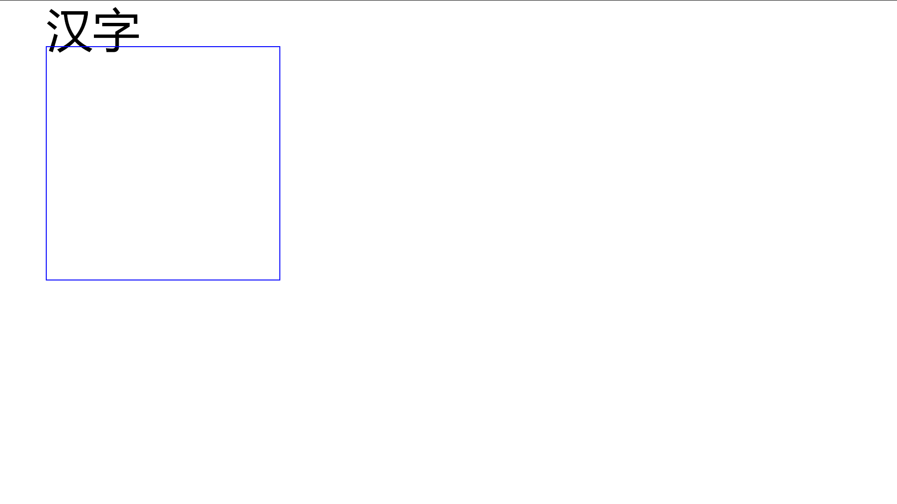
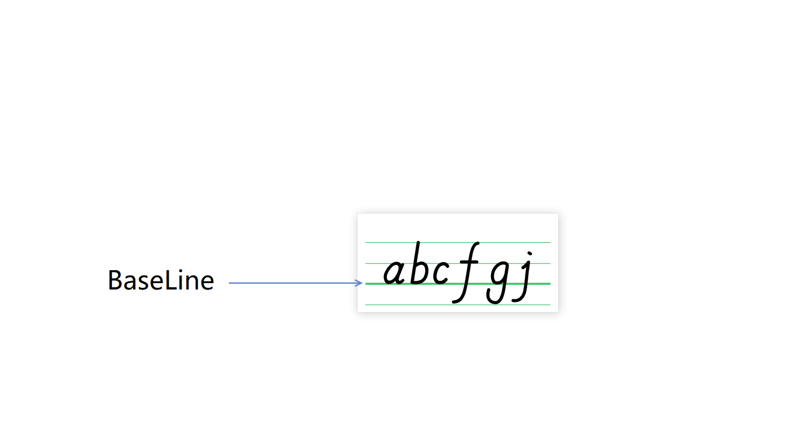
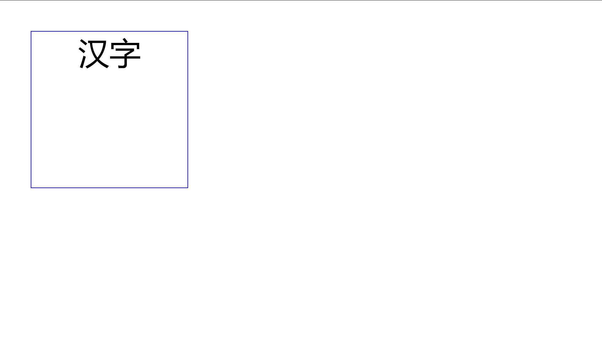
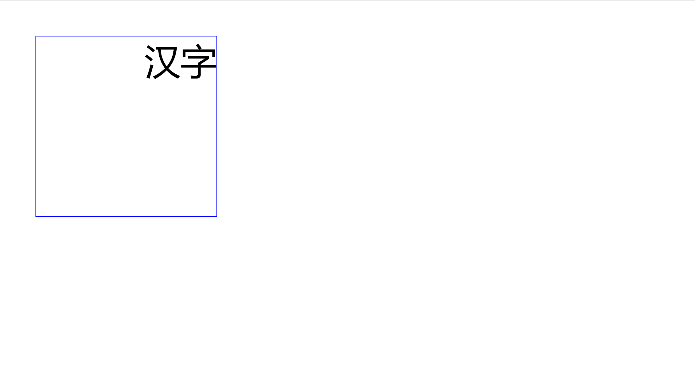
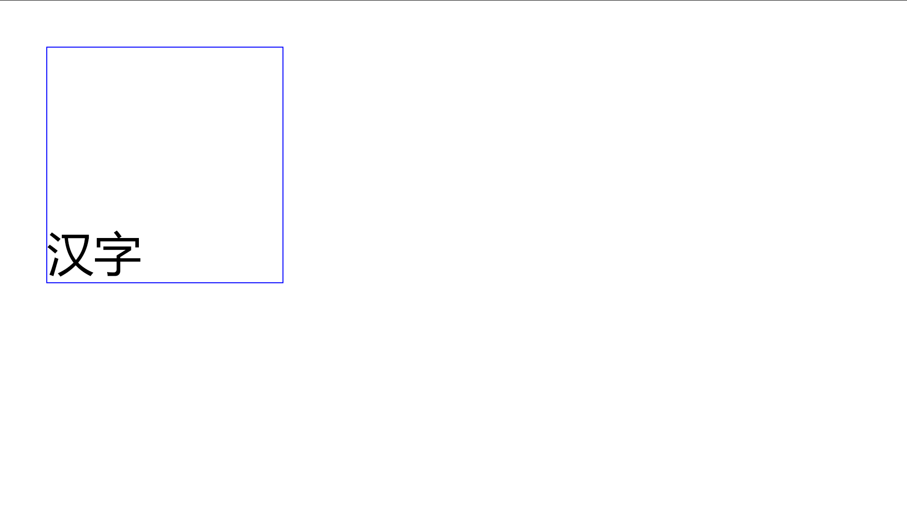

# Microsoft.Maui.Graphics.Skia 使用 DrawString 绘制文本的坐标问题

本文记录使用 Microsoft.Maui.Graphics.Skia 的 DrawString 进行绘制文本，不同的重载方法绘制的文本的坐标不同的问题

<!--more-->


<!-- CreateTime:2022/7/6 17:19:27 -->

<!-- 发布 -->
<!-- 博客 -->

<!-- 标签：MAUI,MauiGraphics,Skia,SkiaSharp,渲染 -->

本文开始之前，预期已经准备好了环境和基础项目，请参阅 [dotnet 控制台 使用 Microsoft.Maui.Graphics 配合 Skia 进行绘图入门](https://blog.lindexi.com/post/dotnet-%E6%8E%A7%E5%88%B6%E5%8F%B0-%E4%BD%BF%E7%94%A8-Microsoft.Maui.Graphics-%E9%85%8D%E5%90%88-Skia-%E8%BF%9B%E8%A1%8C%E7%BB%98%E5%9B%BE%E5%85%A5%E9%97%A8.html )

在采用 `void DrawString(string value, float x, float y, HorizontalAlignment horizontalAlignment)` 方法进行绘制时，文本将在 `x y` 坐标开始，作为文本的 BaseLine 开始绘制。为了方便大家看出来效果，我在坐标点绘制一个矩形和一个文本

核心代码如下

```csharp
            var skiaCanvas = new SkiaCanvas();
            skiaCanvas.Canvas = skCanvas;

            ICanvas canvas = skiaCanvas;
            canvas.Font = new Font("微软雅黑");

            canvas.FontSize = 100;
            canvas.DrawString("汉字", 100, 100, HorizontalAlignment.Left);
            canvas.StrokeColor = Colors.Blue;
            canvas.StrokeSize = 2;
            canvas.DrawRectangle(100, 100, 500, 500);
```

如上面代码，在 100,100 的坐标开始绘制文本，同时也在此坐标绘制矩形，输出如下

<!--  -->


可以看到文本是从 100,100 作为左上角的基线 BaseLine 开始绘制的。这里需要科普文本的 基线 BaseLine 是什么。其实大家学英语到知道四线三格吧，如下图，第三条线就是 BaseLine 基线

<!--  -->


我将汉字换成英文，更方便大家了解

```csharp
            canvas.FontSize = 100;
            canvas.DrawString("abcfgj", 100, 100, HorizontalAlignment.Left); // 换成英文
            canvas.StrokeColor = Colors.Blue;
            canvas.StrokeSize = 2;
            canvas.DrawRectangle(100, 100, 500, 500);
```

运行代码，可以看到输出如下

<!--  -->


但在采用的是 `void DrawString(string value, float x, float y, float width, float height, HorizontalAlignment horizontalAlignment, VerticalAlignment verticalAlignment, TextFlow textFlow = TextFlow.ClipBounds, float lineSpacingAdjustment = 0F)` 方法进行绘制文本，那将会让绘制的文本完全放在 `float x, float y, float width, float height` 这个矩形框里面，如以下代码

```csharp
            canvas.FontSize = 100;
            canvas.DrawString("汉字", 100, 100, 500, 500, HorizontalAlignment.Left, VerticalAlignment.Top);
            canvas.StrokeColor = Colors.Blue;
            canvas.StrokeSize = 2;
            canvas.DrawRectangle(100, 100, 500, 500);
```

运行代码，可以看到输出如下

<!--  -->


可以看到文本在矩形内

接下来分别设置文本的水平和垂直方向的布局：

- 文本的水平居中

```csharp
            canvas.DrawString("汉字", 100, 100, 500, 500, HorizontalAlignment.Center, VerticalAlignment.Top);
```

运行代码，可以看到输出如下

<!--  -->


- 文本的水平居右

```csharp
            canvas.DrawString("汉字", 100, 100, 500, 500, HorizontalAlignment.Right, VerticalAlignment.Top);
```

运行代码，可以看到输出如下

<!--  -->


- 文本的垂直居中

```csharp
            canvas.DrawString("汉字", 100, 100, 500, 500, HorizontalAlignment.Left, VerticalAlignment.Center);
```

运行代码，可以看到输出如下

<!--  -->


- 文本的垂直距下

```csharp
            canvas.DrawString("汉字", 100, 100, 500, 500, HorizontalAlignment.Left, VerticalAlignment.Bottom);
```

运行代码，可以看到输出如下

<!--  -->


如果文本的实际渲染大小超过给定的矩形范围，可以通过 TextFlow 参数决定是裁剪还是允许超过范围。横排文本布局的超过范围是在 Y 坐标上超过边界。默认参数是超过给定的范围就裁剪

更多的 MAUI 相关博客，还请参阅我的 [博客导航](https://blog.lindexi.com/post/%E5%8D%9A%E5%AE%A2%E5%AF%BC%E8%88%AA.html )

本文的例子放在[github](https://github.com/lindexi/lindexi_gd/tree/042fcb09fe9ce6c3d16ebab6d7432b6bc92c7c4e/SkiaSharp/RulawnaloyerKairjemhemwemlayca) 和 [gitee](https://gitee.com/lindexi/lindexi_gd/tree/042fcb09fe9ce6c3d16ebab6d7432b6bc92c7c4e/SkiaSharp/RulawnaloyerKairjemhemwemlayca) 欢迎访问

可以通过如下方式获取本文的源代码，先创建一个空文件夹，接着使用命令行 cd 命令进入此空文件夹，在命令行里面输入以下代码，即可获取到本文的代码

```
git init
git remote add origin https://gitee.com/lindexi/lindexi_gd.git
git pull origin 042fcb09fe9ce6c3d16ebab6d7432b6bc92c7c4e
```

以上使用的是 gitee 的源，如果 gitee 不能访问，请替换为 github 的源。请在命令行继续输入以下代码

```
git remote remove origin
git remote add origin https://github.com/lindexi/lindexi_gd.git
git pull origin 042fcb09fe9ce6c3d16ebab6d7432b6bc92c7c4e
```

获取代码之后，进入 `SkiaSharp\RulawnaloyerKairjemhemwemlayca` 文件夹

我建立了一个 SkiaSharp 的群： 788018852 欢迎大家加入讨论


<a rel="license" href="http://creativecommons.org/licenses/by-nc-sa/4.0/"></a><br />本作品采用<a rel="license" href="http://creativecommons.org/licenses/by-nc-sa/4.0/">知识共享署名-非商业性使用-相同方式共享 4.0 国际许可协议</a>进行许可。欢迎转载、使用、重新发布，但务必保留文章署名[林德熙](http://blog.csdn.net/lindexi_gd)(包含链接:http://blog.csdn.net/lindexi_gd )，不得用于商业目的，基于本文修改后的作品务必以相同的许可发布。如有任何疑问，请与我[联系](mailto:lindexi_gd@163.com)。