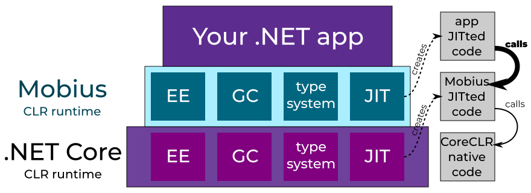

# Mobius 一个运行在 .NET Core 上的 .NET 运行时

一个 .NET 应用仅仅只是一块在 .NET 运行时上面运行的二进制代码。而 .NET 运行时只是一个能执行这项任务的程序。当前的 .NET Framework 和 .NET Core 运行时采用 C++ 编写，而 Mobius 是一个使用 C# 重写的 .NET 运行时，重写包括 JIT 编译和 GC 等，这些逻辑都将和 C++ 无关

<!--more-->
<!-- CreateTime:4/22/2020 8:24:36 PM -->

<!-- 发布 -->

原文：[Mobius – .NET runtime running on .NET Core – TooSlowException](https://tooslowexception.com/mobius-net-runtime-running-on-net-core/ )

```csharp
我看到这个有趣的项目的时候就想试试安利一下大家，这个项目特别适合用来了解 GC （Garbage Collector 垃圾收集）和 JIT （Just-In-Time Compiler 即时编译器）的算法
```

让 C# 编写一个 .NET 运行时和编写一个 .NET 应用是否有可能呢？换句话是不要 Native 的本机代码或 C++ 代码，所有的代码都是通过 C# 编写是否有可能？这看起来是一个无穷的递归，用 .NET 写 .NET 的运行时运行在 .NET 的运行时上。这是不是就是将一个 .NET 运行时运行在另一个 .NET 运行时上？

<!--  -->


作者[kkokosa](https://tooslowexception.com)决定开始试试水，这就是做 Mobius 运行时想法的原因。这个想法听起来很奇怪，连作者都不抱期望在一个世纪内将这个想法投入使用。不过作者的想法是想要了解如果写出整个 .NET 运行时需要多少的代码量。同时作者也发现了其实这个想法的作用其实很小，即使想象现在有一个 NuGet 包在安装完成之后就可以添加到咱的应用上，此时的这个包就包含了完整的运行时代码

## 原理

其实这个想法在其他的领域也有人尝试过，最著名的不过是 RVM —— 用 Java 编写的 JVM 虚拟机。虽然他需要使用 C 的引导启动，但是能做到自己托管自己，完全由 Java 运行的虚拟机同时不需要其他的虚拟机。这看起来非常和作者想象的 Mobius 非常接近

这个想法不知作者一个人在想，其实也有小伙伴在 Github 上发布了一个 [issus](https://github.com/dotnet/runtime/issues/10158) 说能否使用 C# 写 JIT 和 GC 的逻辑

基于这些考虑，可以看到开发 Mobius 的原因如下：

- 用于实验和研究的框架。使用 C# 和 .NET 编写的运行时，咱可以更简易和快速的了解整个原型，比如对 JIT 或 GC 模块的更改。咱可以使用熟悉的语言如 F# 等去编写整个 .NET 的底层
- 用于学习。在写这个框架或参与开发的时候，可以从里面学到很多运行时的做法。这也是可以用到很多现代化的 C# 特性的项目，使用更底层的 API 如 Span staclallock Unsafe 等
- 提升性能。这显然是很有争议的一点。在另一个托管的运行时上面运行另一个运行时看起来就和高性能没有关联。但是如果应用是热启动，那么意味着此时运行的代码生成质量可以依托对CPU的优化，可以达到比本机代码更好的性能。使用 C# 开发理论上可以使用更加稳健的优化。同样用 C# 写 GC 也能有相同的提升
- 用于玩闹。对于很多人来说，例如德熙看着这个项目一步步搭建起来是十分有趣的

如上面说的，其实都不是很强的理由，为什么要用 .NET 去写 .NET 运行时。大多数情况下，人们会认为使用 C++ 开发和使用 C# 开发不是对立的，两者的差别不是很大。作者非常同意这个观点，这就是为什么作者其实是将这个项目当成一个玩具和实验的项目

先抛开是否有必要做这样的事情，请让咱想想这个项目可以如何做

## 基本设计原理

首先，要理解的最重要的事情是Mobius仍然会将咱的应用程序编译为本地 Native 代码。以这种方式，最终应用程序将以(几乎)本机代码速度运行。不同之处在于托管的基础设施，如 GC 和类型系统、JIT编译器是作为托管代码运行的。这意味着这些代码也被 JIT 编译

<!--  -->


如上图，我们有两层JIT构建的代码和底层实际运行时的本地 Native 代码。从图片看起来中间的这一层 .NET Core 基础设施的 Mobius 层是多余的。如果这一层是使用无分配对象的方式写的，那么不需要任何的 GC 方法。在预热之后，对 JIT 的调用也将会很少。这就允许咱假设在一个正常运行的应用程序中，大部分在 Mobius 层的内容都是经过了 JIT 编译优化完成之后运行的，这包括了常用的对 .NET Core 代码的 JIT 构建的代码，这将十分接近 .NET Core 的原生调用

从上面的图看，其实 Mobius 的多余还是很明显。一个可以想的方法是在两个运行时之间共享基础设施

<!--  -->


重写整个类型系统并不是一件很有趣的事情。我们甚至可以考虑在 Mobius 中重用相同的 GC 垃圾回收，所以使用 Mobius 给 .NET 应用提供对象将看起来不错。虽然上面的方法请看起来不错，但依然存在两个问题：

- 这大大减少了 Mobius 框架需要研究的功能。因为没有重新研究一遍 GC 和 JIT 算法，我们将被迫考虑如何合并现有的技术
- 在 .NET 运行时里面 JIT 和 GC 和类型系统都有比较大的耦合。除了在 Mobius 实现相同的机制之外没有其他方法，将会受限于当前的方法

基于这个原因，作者认为 .NET Core 运行时应该只提供很少量的运行时服务给到 Mobius 框架，提供的服务主要只是调用 Jit 编译代码

<!--  -->


## 当前状态

当前作者还是试验可行性，正在做的是让最简单的 C# 应用能玩起来

```csharp
private static int Main(string[] args)
{
   int num = 1;
   int num2 = 2;
   return num + num2;
}
```

通过一些可行性的测试，作者看到了曙光，应该是能做出来的。目前所有需要的机制都已就绪，包括：即使编译的基础支持，通过托管调用 JIT 代码，通过 JIT 代码调用 Mobius 框架。但是因为测试可行性的项目代码写的糟，还需要一点时间对代码进行重构，完善并实现大量的元数据处理，去掉一些硬编码值

现在这个可行性项目只是能做到运行当前这个简单的应用而已，运行的时候通过完全的 CIL 指令和没有任何的异常处理，同时只有 GC 的存根

在下一篇系列文章中，作者将介绍Mobius实现最底层部分的更多细节和代码片段

逗比注：

如果本文看的不错，想要参与开发，我觉得在这之前需要先读一下农夫的书，请看 《.NET 底层入门》这本书

另外上面说的玩具什么的只是原作者谦虚的说法，其实这个玩法是可行的，在 Github 有小伙伴在讨论，请看 [Port JIT and GC to C#](https://github.com/dotnet/runtime/issues/10158 ) 这个链接

<a rel="license" href="http://creativecommons.org/licenses/by-nc-sa/4.0/"></a><br />本作品采用<a rel="license" href="http://creativecommons.org/licenses/by-nc-sa/4.0/">知识共享署名-非商业性使用-相同方式共享 4.0 国际许可协议</a>进行许可。欢迎转载、使用、重新发布，但务必保留文章署名[林德熙](http://blog.csdn.net/lindexi_gd)(包含链接:http://blog.csdn.net/lindexi_gd )，不得用于商业目的，基于本文修改后的作品务必以相同的许可发布。如有任何疑问，请与我[联系](mailto:lindexi_gd@163.com)。

