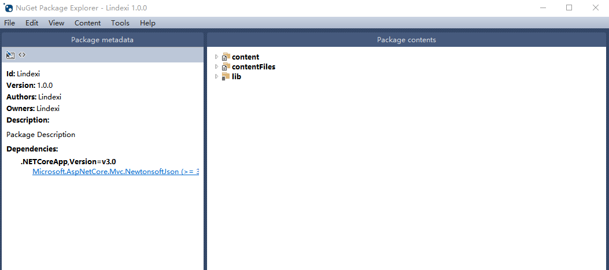
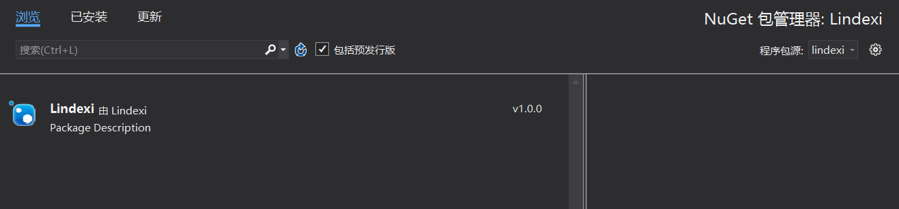
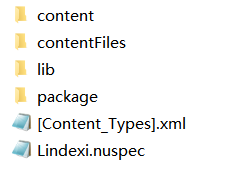
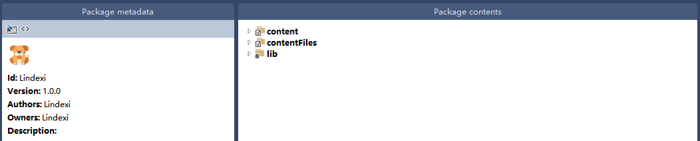

# NuGet 如何设置图标

在找 NuGet 的时候可以看到有趣的库都有有趣的图标，那么如何设置一个 NuGet 的图标？

<!--more-->
<!-- CreateTime:2019/8/31 16:55:58 -->


在开始之前，请在[nuget](https://www.nuget.org/downloads)官方网站下载 NuGet.exe 同时设置环境变量

环境变量设置的方法就是将 NuGet.exe 放在一个文件夹，如 `C:\lindexi` 然后右击计算机，属性高级环境变量，然后选择用户变量，双击 Path 添加 `c:\lindexi` 就可以了

如果之前已经设置了环境变量，请尝试更新一下 NuGet 请使用下面命令

```csharp
nuget update -self
```

在 NuGet 包显示图标的原理是在 nuspec 文件存在图标或图片链接

尝试使用 dotnet 打包的方法打包一个应用

在命令行输入下面代码创建一个 web 应用

```csharp
dotnet new webapi -o Lindexi
```

这样就创建出一个 webapi 的应用，因为 web 应用默认是不能打包，需要修改 Lindexi.csproj 文件，添加下面代码

```csharp
  <PropertyGroup>
    <IsPackable>true</IsPackable>
  </PropertyGroup>
```

通过下面代码可以打包

```csharp
dotnet pack
```

在 `bind\debug` 文件夹可以找到 `Lindexi.1.0.0.nupkg` 文件

通过应用商店找到[NuGet工具](https://www.microsoft.com/store/productId/9WZDNCRDMDM3)安装就可以打开 nupkg 文件

<!--  -->


通过 VisualStudio 的 Nuget 包管理设置本地的包为 `Lindexi.1.0.0.nupkg` 文件的文件夹，就可以找到这个文件

<!--  -->


在 VisualStudio 右击一个项目，选择刚才设置的源，就可以找到这个文件

<!--  -->


这时可以看到图标使用的是默认的图标，下面就是如何修改这个图标

通过压缩工具打开 `Lindexi.1.0.0.nupkg` 文件，因为 nupkg 文件是一个压缩文件，可以通过压缩工具解压，在解压之后可以看到下面的文件

<!--  -->


## 通过 URL 设置图标

打开 Lindexi.nuspec 文件，在之前的 NuGet 支持的是通过 URL 的方法设置图标

可以从[easyicon](https://www.easyicon.net/)找到一个好看的图标

然后通过[图床](https://www.microsoft.com/store/productId/9NBLGGH562R2)将图标上传到网上，在 Lindexi.nuspec 文件添加下面代码

```csharp
    <iconUrl>http://image.acmx.xyz/lindexi%2F2019427172218870</iconUrl>
```

这里的 [http://image.acmx.xyz/lindexi%2F2019427172218870](http://image.acmx.xyz/lindexi%2F2019427172218870) 就是我上传的图标，添加在 `metadata` 里面，大概看起来的 Lindexi.nuspec 文件就是下面代码

```csharp
<?xml version="1.0" encoding="utf-8"?>
<package xmlns="http://schemas.microsoft.com/packaging/2013/05/nuspec.xsd">
  <metadata>
    <id>Lindexi</id>
    <version>1.0.0</version>
    <authors>Lindexi</authors>
    <owners>Lindexi</owners>
    <iconUrl>http://image.acmx.xyz/lindexi%2F2019427172218870</iconUrl>
    <requireLicenseAcceptance>false</requireLicenseAcceptance>
    <description>Package Description</description>
    忽略一些代码
  </metadata>
</package>
```

将命令行跳到 Lindexi.nuspec 文件的文件夹，输入下面代码就可以重新打包

```csharp
nuget pack
```

通过[NuGet工具](https://www.microsoft.com/store/productId/9WZDNCRDMDM3)打开创建的 Lindexi.1.0.0.nupkg 的文件，可以看到图标

<!--  -->


做到这个效果的另一个简单方法是在[NuGet工具](https://www.microsoft.com/store/productId/9WZDNCRDMDM3)点击更改，在 Icon Url 修改链接

<!--  -->


## 通过文件

有小伙伴说他在清真的地方，无法下载到好看的图标，同时图标使用的是外面的链接，可能下载到的不是图片，所以微软建议将图标文件放在 NuGet 包里面

编辑 Lindexi.nuspec 文件，将 iconUrl 替换为 icon 同时添加相对路径的图标

这也是比较推荐的方法，能够解决 NU5048 警告

<!-- [Packaging Icon within the nupkg · NuGet/Home Wiki](https://github.com/NuGet/Home/wiki/Packaging-Icon-within-the-nupkg ) -->

<a rel="license" href="http://creativecommons.org/licenses/by-nc-sa/4.0/"></a><br />本作品采用<a rel="license" href="http://creativecommons.org/licenses/by-nc-sa/4.0/">知识共享署名-非商业性使用-相同方式共享 4.0 国际许可协议</a>进行许可。欢迎转载、使用、重新发布，但务必保留文章署名[林德熙](http://blog.csdn.net/lindexi_gd)(包含链接:http://blog.csdn.net/lindexi_gd )，不得用于商业目的，基于本文修改后的作品务必以相同的许可发布。如有任何疑问，请与我[联系](mailto:lindexi_gd@163.com)。
