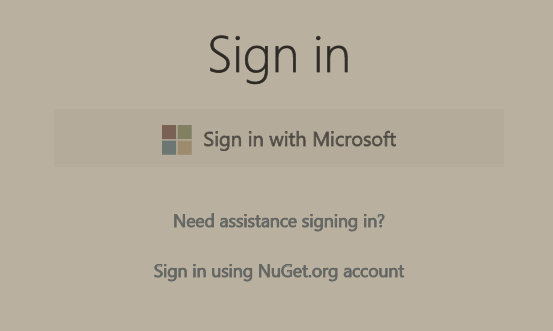
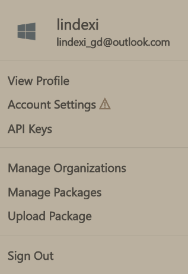
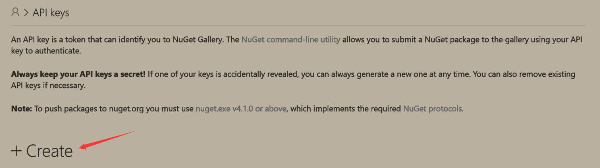
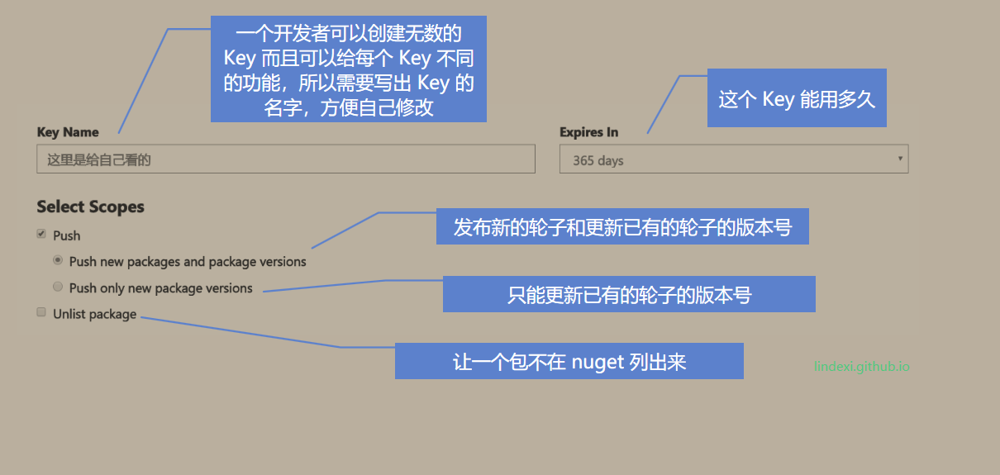
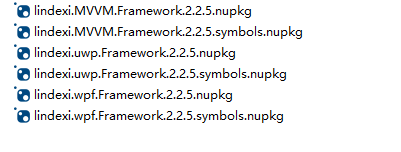
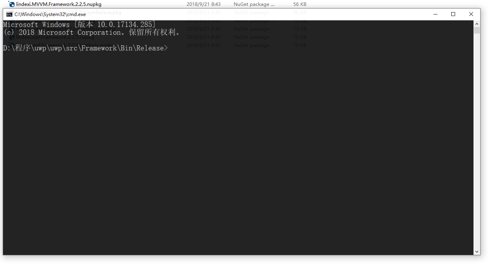

# Nuget 通过 dotnet 命令行发布

在开发完成一个好用的轮子就想将这个轮子发布到 nuget 让其他小伙伴可以来使用，但是 nuget.org 的登陆速度太慢，本文介绍一个命令行发布的方法，通过命令行发布的方法可以配合 Jenkins 自动打包

<!--more-->
<!-- CreateTime:2018/10/19 9:15:53 -->


<!-- 标签：nuget，dotnet,dotnetcore -->

本文不会告诉大家如何去制作一个 nuget 库，只是在大家已经打出来 nuget 之后如何将这个轮子发布到 nuget ，本文用 nuget.org 作为例子，如果是自己搭建的，那么我也不知道自己搭建的会做成什么

首先打开 nuget.org 进行登陆，就是因为登陆 nuget 实在太慢我才去学如何通过命令行的方法发布

<!--  -->


登陆之后，可以在右上角看到自己的账号，点击一下可以看到下面界面，这时点击一个 Api key 因为在使用命令行发布的时候需要一个秘钥，通过上面的界面就可以创建秘钥

<!--  -->


在 Api Key 界面可以看到 Create 这个按钮，没错，这是一个按钮

<!--  -->


点击一下就可以创建一个 key 了，创建一个 key 可以给 key 不同的功能，具体请看下图

<!--  -->


如果指定了可以修改版本的权限，可以设置有哪些轮子的版本号可以被这个 key 修改，请看下面

<!--  -->


设置完成就可以点击 Create 了

<!--  -->


创建之后需要复制这个 Key 的 序列，先将这个序列保存到文本，在之后会用到。注意，一个key只能在网页没关闭之前复制一次

本文使用的是设置了 MVVM 框架的三个轮子的更新权限，所以下面的例子就是更新一个轮子的版本

我通过 VisualStudio 编译出来不同的轮子的 nuget 请看图

<!--  -->


然后我可以在地址栏输入 cmd 启动命令行，为什么需要在地址栏输入？原因是这样输入打开 cmd 就可以自动设置工作路径，请看下图，通过 cmd 打开的就是我需要的工作路径

<!--  -->


这时可以通过下面的命令发布对应的 nuget 到 nuget.org 网站

```csharp
dotnet nuget push xx.nupkg -k 刚才复制的key -s https://api.nuget.org/v3/index.json
```

如我发布 lindexi.MVVM.Framework.2.2.5.symbols.nupkg 可以使用下面代码

```csharp
dotnet nuget push lindexi.MVVM.Framework.2.2.5.symbols.nupkg -k oy2fvszjpukd6lm2vaqav5gcx6xcfuaencyx5x2ppab42e -s https://api.nuget.org/v3/index.json
```

可以看到输出

```csharp
info : Pushing lindexi.MVVM.Framework.2.2.5.symbols.nupkg to 'https://www.nuget.org/api/v2/package'...
info :   PUT https://www.nuget.org/api/v2/package/
info :   Created https://www.nuget.org/api/v2/package/ 12720ms
info : Your package was pushed.
```

现在就成功发布了，那么用命令行除了减少在 nuget.org 登陆的时间之外，还可以用它做自动上传

可以通过这个方式在每次创建的时候只在文件夹保存一个 nuget 这样就可以通过命令行批处理的方式发布到 nuget 因为刚才的命令是可以支持任意的名字

上传某个文件夹内的 nuget 有一个要求就是这个文件夹内只有一个 nuget 不能有多个，而且上传的 nuget 的版本是不存在的，也就是不能多次上传相同版本号的 nuget 如果符合上面的条件就可以通过批处理的方式上传

在相同的文件夹创建一个 nuget.bat 文件，在这个文件输入下面代码

```csharp
dotnet nuget push *.nupkg -k 刚才复制的key -s https://api.nuget.org/v3/index.json
```

这样在编译之后调用这个批处理就可以将文件夹内的 nuget 上传，通过这个方式和 Jenkins 自动打包就可以自动发布 nuget 而且这个方式可以防止用户自己上传过程因为编译了不对的分支让其他用户以为自己写出坑

[How to Publish a NuGet Package ](https://docs.microsoft.com/en-us/nuget/create-packages/publish-a-package )

[dotnet nuget push command - .NET Core CLI ](https://docs.microsoft.com/en-us/dotnet/core/tools/dotnet-nuget-push?tabs=netcore21 )

点击查看课件

[](https://r302.cc/RmLrp4)

<a rel="license" href="http://creativecommons.org/licenses/by-nc-sa/4.0/"></a><br />本作品采用<a rel="license" href="http://creativecommons.org/licenses/by-nc-sa/4.0/">知识共享署名-非商业性使用-相同方式共享 4.0 国际许可协议</a>进行许可。欢迎转载、使用、重新发布，但务必保留文章署名[林德熙](http://blog.csdn.net/lindexi_gd)(包含链接:http://blog.csdn.net/lindexi_gd )，不得用于商业目的，基于本文修改后的作品务必以相同的许可发布。如有任何疑问，请与我[联系](mailto:lindexi_gd@163.com)。
