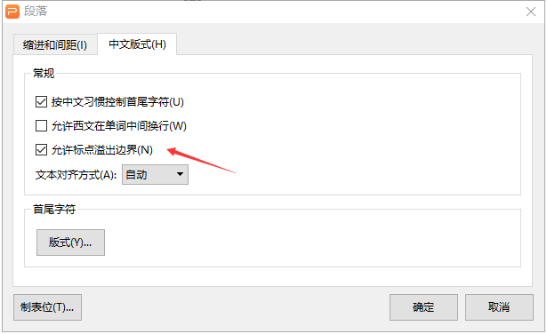

# Office OpenXml SDK 文本段落允许标点溢出边界属性

在进行 PPT 解析的时候，因为 PPT 是支持在文本框里面的文本段落设置允许标点溢出边界可以在符号超过了文本框的长度，不会换行，而是显示在文本框之外

<!--more-->
<!-- CreateTime:4/26/2020 10:53:43 AM -->


在 PPT 里面可以在段落设置允许标点溢出边界请看下面

<!--  -->


在段落属性里面，如下面代码

```csharp
<a:ppr fontalgn="auto" hangingpunct="0">
```

通过 hangingpunct 属性是 0 表示不允许标点溢出边界，使用 1 或不设置表示允许标点溢出边界，这个值的默认值是 1 也就是不填写这个属性就表示不将标点带到下一行

在 OpenXml 里面可以通过下面代码判断

```csharp
private void HeawearajakeheCawchalljorurko(TextParagraphPropertiesType textParagraphPropertiesType)
{
	var height = textParagraphPropertiesType?.Height?.Value ?? true;
}
```

没错，这个属性使用的是 Height 其实我没有猜出，不过好在微软的属性上面有注释，所以还是方便找到这个属性

这个属性和 WPF 的 Wrap 属性是不相同的，需要自己写布局

[TextParagraphPropertiesType.Height Property (DocumentFormat.OpenXml.Drawing)](https://docs.microsoft.com/en-us/dotnet/api/documentformat.openxml.drawing.textparagraphpropertiestype.height?view=openxml-2.8.1#DocumentFormat_OpenXml_Drawing_TextParagraphPropertiesType_Height )

[Office Open XML - DrawingML - Shapes - Text - Alignment, Tabs, Other](http://officeopenxml.com/drwSp-text-paraProps-align.php )

<a rel="license" href="http://creativecommons.org/licenses/by-nc-sa/4.0/"></a><br />本作品采用<a rel="license" href="http://creativecommons.org/licenses/by-nc-sa/4.0/">知识共享署名-非商业性使用-相同方式共享 4.0 国际许可协议</a>进行许可。欢迎转载、使用、重新发布，但务必保留文章署名[林德熙](http://blog.csdn.net/lindexi_gd)(包含链接:http://blog.csdn.net/lindexi_gd )，不得用于商业目的，基于本文修改后的作品务必以相同的许可发布。如有任何疑问，请与我[联系](mailto:lindexi_gd@163.com)。
