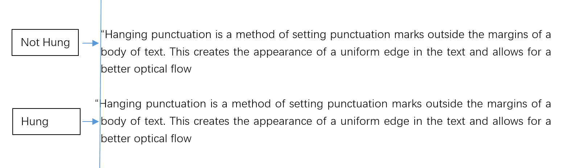
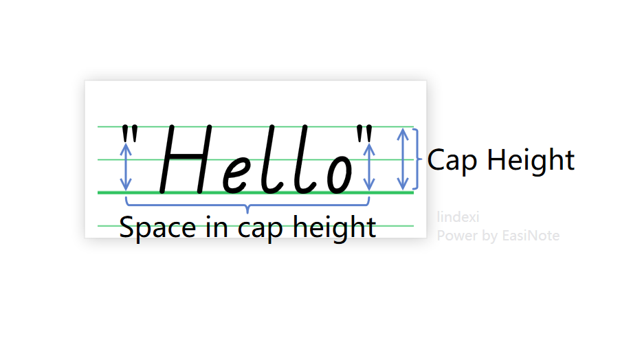

# Office OpenXml SDK 文本段落允许标点溢出边界属性

在进行 PPT 解析的时候，因为 PPT 是支持在文本框里面的文本段落设置允许标点溢出边界可以在符号超过了文本框的长度，不会换行，而是显示在文本框之外

<!--more-->
<!-- CreateTime:4/26/2020 10:53:43 AM -->

在 PPT 里面可以在段落设置允许标点溢出边界请看下面

<!--  -->


在段落属性里面，如下面代码

```csharp
<a:ppr fontalgn="auto" hangingpunct="0">
```

通过 hangingpunct 属性是 0 表示不允许标点溢出边界，使用 1 或不设置表示允许标点溢出边界，这个值的默认值是 1 也就是不填写这个属性就表示不将标点带到下一行

在 OpenXml 里面可以通过下面代码判断

```csharp
private void HeawearajakeheCawchalljorurko(TextParagraphPropertiesType textParagraphPropertiesType)
{
	var height = textParagraphPropertiesType?.Height?.Value ?? true;
}
```

没错，这个属性使用的是 Height 其实我没有猜出，不过好在微软的属性上面有注释，所以还是方便找到这个属性。我询问了大佬们，为什么如此命名，请看 [https://github.com/OfficeDev/Open-XML-SDK/discussions/1216](https://github.com/OfficeDev/Open-XML-SDK/discussions/1216)

这个属性和 WPF 的 Wrap 属性是不相同的，需要自己写布局

这个允许标点溢出边界的排版规则，可以追溯一下排版的历史。当古腾堡在 1400 年代创作他的圣经时，他开发了一种一直沿用至今的排版标点符号，称为“悬挂标点符号”（也称为光学对齐）

> When Gutenberg was creating his Bible in the 1400’s he developed a style of typesetting punctuation marks which has endured to this day, called “hanging punctuation” (also known as optical alignment).
> Hanging punctuation is a method of setting punctuation marks outside the margins of a body of text. This creates the appearance of a uniform edge in the text and allows for a better optical flow.

悬挂标点符号(对应 Office 的允许标点溢出边界)是一种在正文页边距之外设置标点符号的排版方法。 它可以排版出在文本中有好看的视觉效果的均匀边缘的外观。在西文排版里面，许多标点符号都是属于小于半字高度，排版效果上，如果占据行首对齐其正文页边距时，将会存在一片视觉空白

如下图的左悬挂的效果

<!--  -->


如上图，没有悬挂的情况下，由于标点符号 `"` 只占用了有限的字符高度，导致了存在了一段视觉空白。在某些排版需求下，设计师会觉得这样的排版不美观。那什么是字符高度？请看下图

<!--  -->


可以看到引号占用的字符的高度是非常小的

在 Office 里面，勾选允许标点溢出边界只是支持行末悬挂，也就是从左到右的文本排版里的右悬挂。在 Office 里面，默认没有支持上文的左悬挂效果

文本排版的悬挂是一个比较玄学的逻辑，十分推荐大家阅读一下 [The Type — 中文排版的最大迷思：标点悬挂](https://www.thetype.com/2017/11/13290/ ) 这篇文章

参考文档：

[TextParagraphPropertiesType.Height Property (DocumentFormat.OpenXml.Drawing)](https://docs.microsoft.com/en-us/dotnet/api/documentformat.openxml.drawing.textparagraphpropertiestype.height?view=openxml-2.8.1#DocumentFormat_OpenXml_Drawing_TextParagraphPropertiesType_Height )

[Office Open XML - DrawingML - Shapes - Text - Alignment, Tabs, Other](http://officeopenxml.com/drwSp-text-paraProps-align.php )

[中文排版的最大迷思——标点悬挂](https://www.sohu.com/a/205635196_204906 )

<a rel="license" href="http://creativecommons.org/licenses/by-nc-sa/4.0/"></a><br />本作品采用<a rel="license" href="http://creativecommons.org/licenses/by-nc-sa/4.0/">知识共享署名-非商业性使用-相同方式共享 4.0 国际许可协议</a>进行许可。欢迎转载、使用、重新发布，但务必保留文章署名[林德熙](http://blog.csdn.net/lindexi_gd)(包含链接:http://blog.csdn.net/lindexi_gd )，不得用于商业目的，基于本文修改后的作品务必以相同的许可发布。如有任何疑问，请与我[联系](mailto:lindexi_gd@163.com)。
